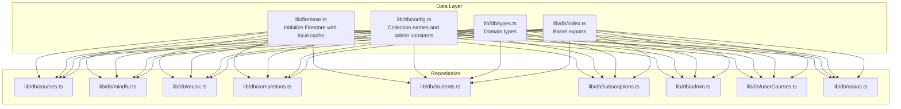
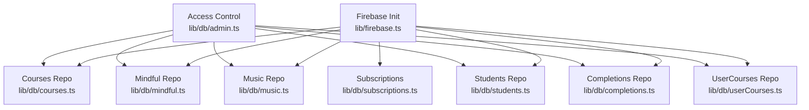
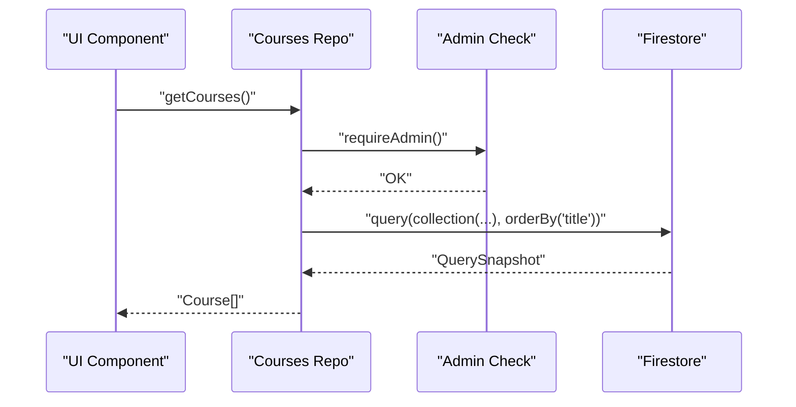
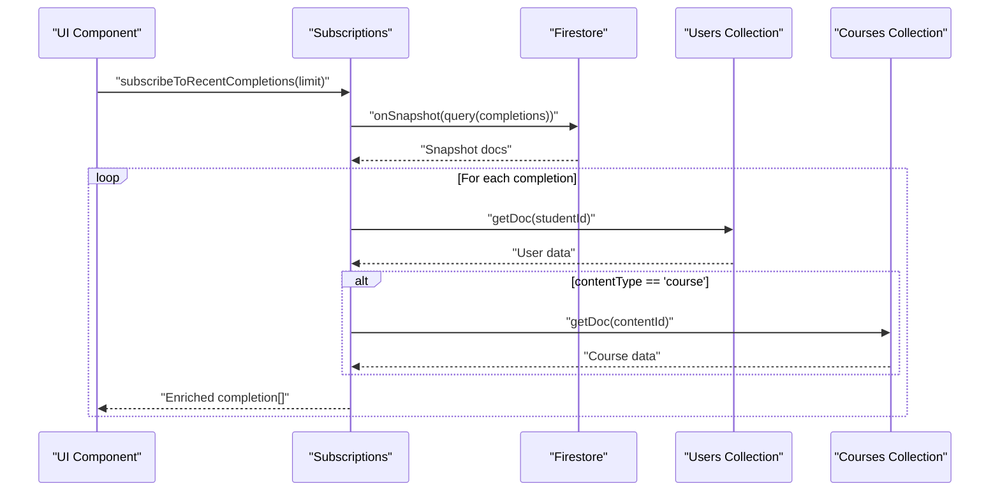
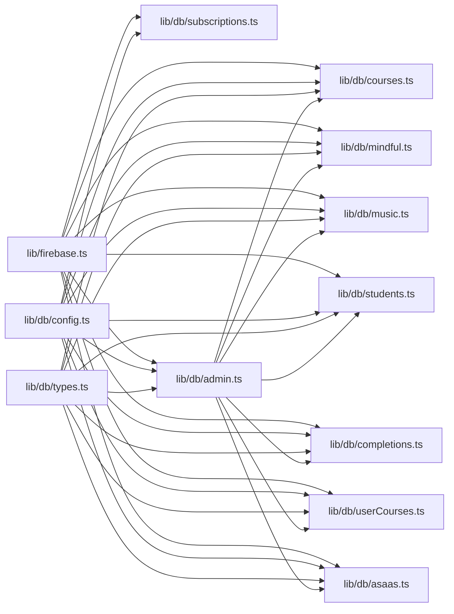
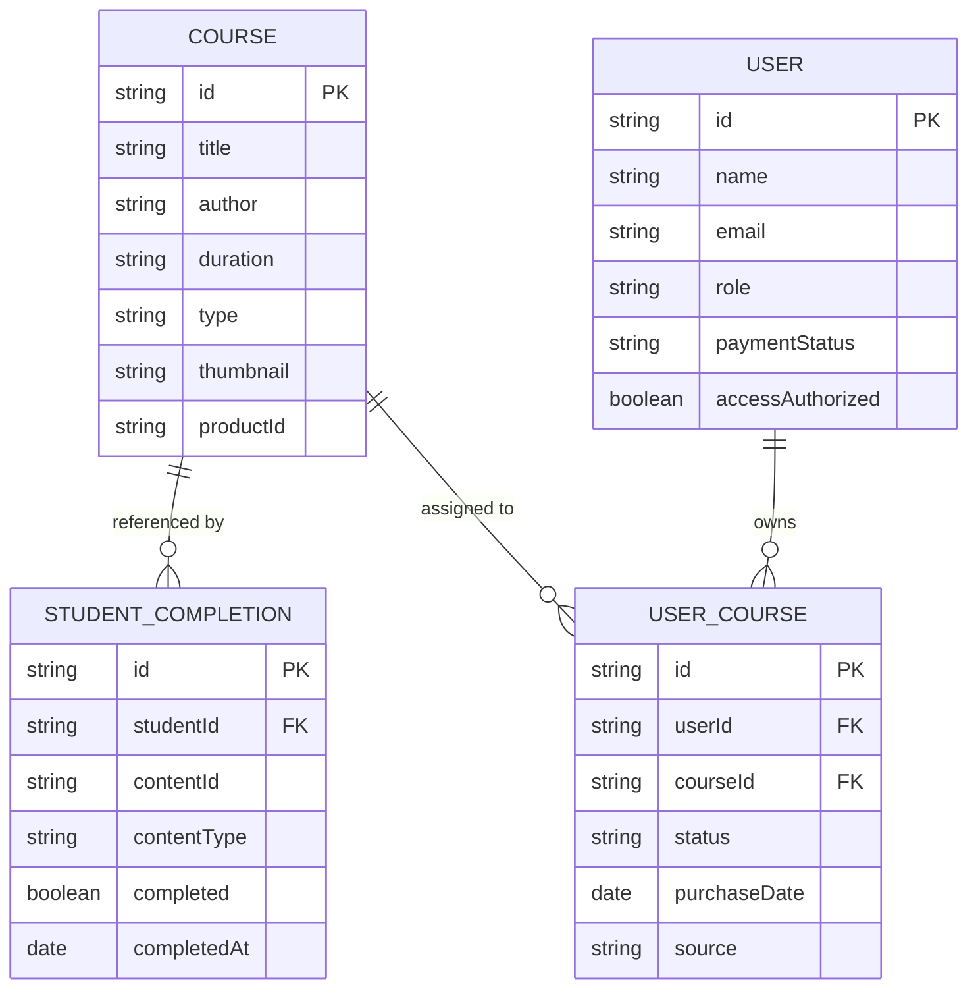

# Data Access Patterns & Queries

<cite>
**Referenced Files in This Document**
- [firebase.ts](file://lib/firebase.ts)
- [index.ts](file://lib/db/index.ts)
- [config.ts](file://lib/db/config.ts)
- [types.ts](file://lib/db/types.ts)
- [courses.ts](file://lib/db/courses.ts)
- [mindful.ts](file://lib/db/mindful.ts)
- [music.ts](file://lib/db/music.ts)
- [completions.ts](file://lib/db/completions.ts)
- [students.ts](file://lib/db/students.ts)
- [subscriptions.ts](file://lib/db/subscriptions.ts)
- [admin.ts](file://lib/db/admin.ts)
- [userCourses.ts](file://lib/db/userCourses.ts)
- [asaas.ts](file://lib/db/asaas.ts)
</cite>

## Table of Contents
1. [Introduction](#introduction)
2. [Project Structure](#project-structure)
3. [Core Components](#core-components)
4. [Architecture Overview](#architecture-overview)
5. [Detailed Component Analysis](#detailed-component-analysis)
6. [Dependency Analysis](#dependency-analysis)
7. [Performance Considerations](#performance-considerations)
8. [Troubleshooting Guide](#troubleshooting-guide)
9. [Conclusion](#conclusion)
10. [Appendices](#appendices)

## Introduction
This document focuses on database query optimization and data access patterns used in the application. It covers CRUD operations, batch operations, transactions, real-time subscriptions, and strategies for pagination, filtering, indexing, caching, and performance with large datasets. Practical examples illustrate complex queries, cross-collection joins via client-side merging, and subscription-driven state synchronization.

## Project Structure
The data access layer is organized under a dedicated module that centralizes Firestore initialization, collection names, shared types, and domain-specific repositories. A barrel export file aggregates exports for convenient imports across the app.

**Diagram sources**
- [firebase.ts](file://lib/firebase.ts#L1-L25)
- [config.ts](file://lib/db/config.ts#L1-L19)
- [types.ts](file://lib/db/types.ts#L1-L90)
- [index.ts](file://lib/db/index.ts#L1-L38)

**Section sources**
- [firebase.ts](file://lib/firebase.ts#L1-L25)
- [index.ts](file://lib/db/index.ts#L1-L38)

## Core Components
- Firestore initialization with persistent local cache and multi-tab manager for offline resilience and fast reads.
- Centralized collection names and admin constants for consistent access.
- Strongly typed domain models for courses, completions, students, and user-course mappings.
- Domain repositories encapsulate CRUD and query logic per entity with access control checks.

Key capabilities:
- Admin-required operations enforced via user role checks.
- User access control based on explicit authorization flags and active course associations.
- Real-time subscriptions for counts and recent activity streams.
- Cross-collection retrieval via client-side joins (e.g., completion records joined with users and courses).

**Section sources**
- [firebase.ts](file://lib/firebase.ts#L16-L24)
- [config.ts](file://lib/db/config.ts#L11-L19)
- [types.ts](file://lib/db/types.ts#L36-L89)
- [admin.ts](file://lib/db/admin.ts#L66-L127)
- [userCourses.ts](file://lib/db/userCourses.ts#L7-L23)

## Architecture Overview
The data access architecture follows a layered pattern:
- Initialization layer: Firebase app and Firestore client configured with persistence.
- Domain layer: Repositories per resource (courses, mindful, music, students, completions).
- Access control layer: Admin enforcement and user authorization checks.
- Subscription layer: Real-time listeners for counts and recent completions.

**Diagram sources**
- [firebase.ts](file://lib/firebase.ts#L16-L24)
- [courses.ts](file://lib/db/courses.ts#L1-L98)
- [mindful.ts](file://lib/db/mindful.ts#L1-L93)
- [music.ts](file://lib/db/music.ts#L1-L93)
- [students.ts](file://lib/db/students.ts#L1-L285)
- [completions.ts](file://lib/db/completions.ts#L1-L56)
- [userCourses.ts](file://lib/db/userCourses.ts#L1-L112)
- [subscriptions.ts](file://lib/db/subscriptions.ts#L1-L93)
- [admin.ts](file://lib/db/admin.ts#L66-L127)

## Detailed Component Analysis

### Firestore Initialization and Caching
- Local cache enabled with multi-tab manager to keep data synchronized across tabs and resilient offline.
- Firestore client exported for use across repositories.

Optimization implications:
- Reads benefit from local cache; writes are queued and synced when online.
- Multi-tab manager ensures consistent state across browser tabs.

**Section sources**
- [firebase.ts](file://lib/firebase.ts#L16-L24)

### CRUD Operations and Access Control
Common patterns:
- Fetch all with ordering by title.
- Add/update/delete guarded by admin checks.
- User-scoped fetches filtered by access authorization and active course associations.

Examples by file:
- Courses: [getCourses](file://lib/db/courses.ts#L8-L17), [addCourse](file://lib/db/courses.ts#L19-L28), [updateCourse](file://lib/db/courses.ts#L30-L40), [deleteCourse](file://lib/db/courses.ts#L42-L52), [getCoursesForUser](file://lib/db/courses.ts#L54-L97)
- Mindful flows: [getMindfulFlows](file://lib/db/mindful.ts#L8-L17), [addMindfulFlow](file://lib/db/mindful.ts#L19-L28), [updateMindfulFlow](file://lib/db/mindful.ts#L30-L40), [deleteMindfulFlow](file://lib/db/mindful.ts#L42-L52), [getMindfulFlowsForUser](file://lib/db/mindful.ts#L54-L92)
- Music: [getMusic](file://lib/db/music.ts#L8-L17), [addMusic](file://lib/db/music.ts#L19-L28), [updateMusic](file://lib/db/music.ts#L30-L40), [deleteMusic](file://lib/db/music.ts#L42-L52), [getMusicForUser](file://lib/db/music.ts#L54-L92)
- Students: [getAllStudents](file://lib/db/students.ts#L7-L63), [addStudent](file://lib/db/students.ts#L65-L84), [updateStudent](file://lib/db/students.ts#L86-L96), [deleteStudent](file://lib/db/students.ts#L98-L108), [findAndMergeStudentByEmail](file://lib/db/students.ts#L111-L144), [exportStudentData](file://lib/db/students.ts#L147-L180), [importStudentData](file://lib/db/students.ts#L183-L259), [getStudentsWithAccessControl](file://lib/db/students.ts#L262-L284)
- Completions: [getStudentCompletion](file://lib/db/completions.ts#L6-L29), [markContentComplete](file://lib/db/completions.ts#L31-L55)

Access control:
- Admin enforcement: [requireAdmin](file://lib/db/admin.ts#L7-L22)
- User access check: [checkUserAccess](file://lib/db/admin.ts#L86-L127)
- User-course mapping: [getUserCourses](file://lib/db/userCourses.ts#L7-L23), [grantCourseAccess](file://lib/db/userCourses.ts#L25-L68), [revokeCourseAccess](file://lib/db/userCourses.ts#L70-L87), [hasCourseAccess](file://lib/db/userCourses.ts#L101-L111), [hasAnyCourseAccess](file://lib/db/userCourses.ts#L89-L99)

**Diagram sources**
- [courses.ts](file://lib/db/courses.ts#L8-L17)
- [admin.ts](file://lib/db/admin.ts#L7-L22)

**Section sources**
- [courses.ts](file://lib/db/courses.ts#L8-L97)
- [mindful.ts](file://lib/db/mindful.ts#L8-L92)
- [music.ts](file://lib/db/music.ts#L8-L92)
- [students.ts](file://lib/db/students.ts#L7-L284)
- [completions.ts](file://lib/db/completions.ts#L6-L55)
- [admin.ts](file://lib/db/admin.ts#L7-L127)
- [userCourses.ts](file://lib/db/userCourses.ts#L7-L111)

### Batch Operations and Transactions
Observed patterns:
- Bulk import/export of student data using client-side loops and per-document operations.
- No explicit server-side transaction wrappers are used in the client code; Firestore batch writes would require a separate abstraction.

Recommendations:
- Wrap multiple writes in a single transaction when consistency across documents is required.
- For large imports, consider chunking and retry with exponential backoff.

**Section sources**
- [students.ts](file://lib/db/students.ts#L183-L259)
- [asaas.ts](file://lib/db/asaas.ts#L88-L144)

### Real-Time Subscriptions and State Synchronization
Real-time listeners:
- Subscribe to student count: [subscribeToStudents](file://lib/db/subscriptions.ts#L6-L13)
- Subscribe to courses: [subscribeToCourses](file://lib/db/subscriptions.ts#L15-L23)
- Subscribe to recent completions with client-side joins: [subscribeToRecentCompletions](file://lib/db/subscriptions.ts#L25-L73)
- Subscribe to all completions: [subscribeToAllCompletions](file://lib/db/subscriptions.ts#L75-L92)

Client-side join pattern:
- For each completion, fetch associated user and course documents to enrich the payload.

**Diagram sources**
- [subscriptions.ts](file://lib/db/subscriptions.ts#L25-L73)

**Section sources**
- [subscriptions.ts](file://lib/db/subscriptions.ts#L6-L92)

### Complex Queries and Filtering Strategies
- Single-collection queries with ordering and filtering:
  - Courses ordered by title: [getCourses](file://lib/db/courses.ts#L8-L17)
  - Mindful flows ordered by title: [getMindfulFlows](file://lib/db/mindful.ts#L8-L17)
  - Music ordered by title: [getMusic](file://lib/db/music.ts#L8-L17)
  - Students filtered by role: [getAllStudents](file://lib/db/students.ts#L7-L63)
- Cross-collection filtering via client-side logic:
  - User-scoped content filtering by productId and active course associations: [getCoursesForUser](file://lib/db/courses.ts#L54-L97), [getMindfulFlowsForUser](file://lib/db/mindful.ts#L54-L92), [getMusicForUser](file://lib/db/music.ts#L54-L92)
  - Active course lookup: [getUserCourses](file://lib/db/userCourses.ts#L7-L23)

Filtering complexity:
- Client-side filter after fetching all items for user-scoped content.
- Consider adding server-side filters (e.g., productId) to reduce payload size.

**Section sources**
- [courses.ts](file://lib/db/courses.ts#L8-L97)
- [mindful.ts](file://lib/db/mindful.ts#L8-L92)
- [music.ts](file://lib/db/music.ts#L8-L92)
- [userCourses.ts](file://lib/db/userCourses.ts#L7-L23)

### Pagination and Large Dataset Considerations
Current state:
- Ordered fetches without pagination.
- Client-side sorting for student lists.

Recommended improvements:
- Use cursor-based pagination with startAfter/endBefore for large collections.
- Apply compound filters to narrow result sets before ordering.
- Implement server-side aggregation for frequently accessed metrics (counts, totals).

**Section sources**
- [students.ts](file://lib/db/students.ts#L55-L58)

### Indexing and Query Optimization
Observed queries:
- Order by title on courses, mindful, and music collections.
- Filter by role on users.
- Filter by active status on user_courses.
- Equality filters on user_courses for userId and courseId.

Indexing recommendations:
- Ensure composite indexes exist for:
  - user_courses: (userId, status)
  - user_courses: (userId, courseId, status)
  - student_completions: (completed, completedAt)
  - users: (role)
- Consider adding indexes for frequent filters like productId on mindful and music collections.

**Section sources**
- [userCourses.ts](file://lib/db/userCourses.ts#L89-L111)
- [subscriptions.ts](file://lib/db/subscriptions.ts#L25-L31)
- [students.ts](file://lib/db/students.ts#L147-L152)

### Caching and Offline Behavior
- Persistent local cache with multi-tab manager enables offline reads and fast subsequent loads.
- Real-time listeners automatically reconcile with cached data upon reconnect.

Best practices:
- Prefer local cache reads for cold starts.
- Use onSnapshot for reactive UI updates.
- Avoid unnecessary network requests by leveraging cached data.

**Section sources**
- [firebase.ts](file://lib/firebase.ts#L18-L22)

### Error Handling, Retry, and Graceful Degradation
Patterns observed:
- Try/catch around Firestore operations with console logging.
- Early returns with empty arrays or nulls on failure.
- Subscription error callbacks log errors.

Recommendations:
- Implement retry with exponential backoff for transient failures.
- Provide fallback UI states (loading skeletons, empty states).
- Surface user-friendly messages and enable manual retries.

**Section sources**
- [courses.ts](file://lib/db/courses.ts#L13-L16)
- [mindful.ts](file://lib/db/mindful.ts#L13-L16)
- [music.ts](file://lib/db/music.ts#L13-L16)
- [students.ts](file://lib/db/students.ts#L59-L62)
- [subscriptions.ts](file://lib/db/subscriptions.ts#L10-L12)
- [subscriptions.ts](file://lib/db/subscriptions.ts#L20-L22)
- [subscriptions.ts](file://lib/db/subscriptions.ts#L70-L72)
- [subscriptions.ts](file://lib/db/subscriptions.ts#L90-L91)

## Dependency Analysis
The repositories depend on:
- Firestore client initialized in firebase.ts
- Collection names from config.ts
- Shared types from types.ts
- Access control helpers from admin.ts
- User-course mapping from userCourses.ts

**Diagram sources**
- [firebase.ts](file://lib/firebase.ts#L1-L25)
- [config.ts](file://lib/db/config.ts#L1-L19)
- [types.ts](file://lib/db/types.ts#L1-L90)
- [courses.ts](file://lib/db/courses.ts#L1-L98)
- [mindful.ts](file://lib/db/mindful.ts#L1-L93)
- [music.ts](file://lib/db/music.ts#L1-L93)
- [students.ts](file://lib/db/students.ts#L1-L285)
- [completions.ts](file://lib/db/completions.ts#L1-L56)
- [subscriptions.ts](file://lib/db/subscriptions.ts#L1-L93)
- [admin.ts](file://lib/db/admin.ts#L1-L307)
- [userCourses.ts](file://lib/db/userCourses.ts#L1-L112)
- [asaas.ts](file://lib/db/asaas.ts#L1-L145)

**Section sources**
- [index.ts](file://lib/db/index.ts#L1-L38)

## Performance Considerations
- Prefer indexed fields for filters and order-by clauses.
- Use targeted queries with equality filters before ordering.
- Implement pagination for large lists.
- Cache aggressively; leverage local cache for offline-first UX.
- Minimize client-side filtering by adding server-side filters where possible.
- Batch writes and use transactions for atomicity across documents.

[No sources needed since this section provides general guidance]

## Troubleshooting Guide
Common issues and mitigations:
- Permission denied: Ensure admin checks pass and user roles are correctly stored.
  - Reference: [requireAdmin](file://lib/db/admin.ts#L7-L22), [getUserRole](file://lib/db/admin.ts#L67-L83)
- Access not granted: Verify access flags and active course associations.
  - Reference: [checkUserAccess](file://lib/db/admin.ts#L86-L127), [getUserCourses](file://lib/db/userCourses.ts#L7-L23)
- Slow initial load: Enable pagination and add appropriate indexes.
  - Reference: [getCourses](file://lib/db/courses.ts#L8-L17), [getMindfulFlows](file://lib/db/mindful.ts#L8-L17), [getMusic](file://lib/db/music.ts#L8-L17)
- Real-time listener errors: Log and recover gracefully; re-subscribe on disconnect.
  - Reference: [subscribeToStudents](file://lib/db/subscriptions.ts#L6-L13), [subscribeToCourses](file://lib/db/subscriptions.ts#L15-L23), [subscribeToRecentCompletions](file://lib/db/subscriptions.ts#L25-L73)

**Section sources**
- [admin.ts](file://lib/db/admin.ts#L7-L127)
- [userCourses.ts](file://lib/db/userCourses.ts#L7-L23)
- [courses.ts](file://lib/db/courses.ts#L8-L17)
- [mindful.ts](file://lib/db/mindful.ts#L8-L17)
- [music.ts](file://lib/db/music.ts#L8-L17)
- [subscriptions.ts](file://lib/db/subscriptions.ts#L6-L73)

## Conclusion
The application employs a clean separation of concerns with repositories encapsulating Firestore operations, robust access control, and real-time subscriptions for responsive UIs. To scale effectively, prioritize indexing, pagination, and targeted queries; leverage local caching; and adopt retry and graceful degradation strategies for reliability.

[No sources needed since this section summarizes without analyzing specific files]

## Appendices

### Data Model Overview

**Diagram sources**
- [types.ts](file://lib/db/types.ts#L36-L89)