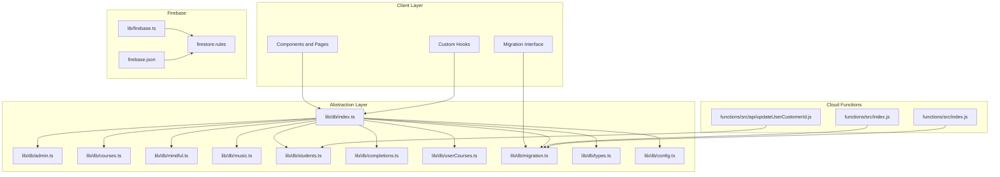
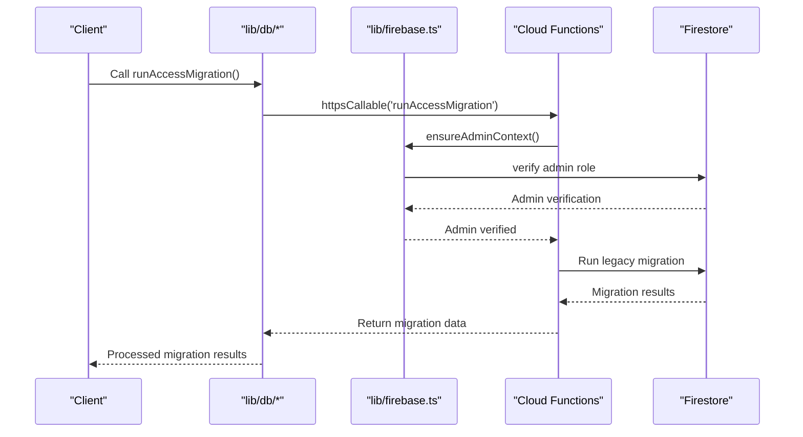
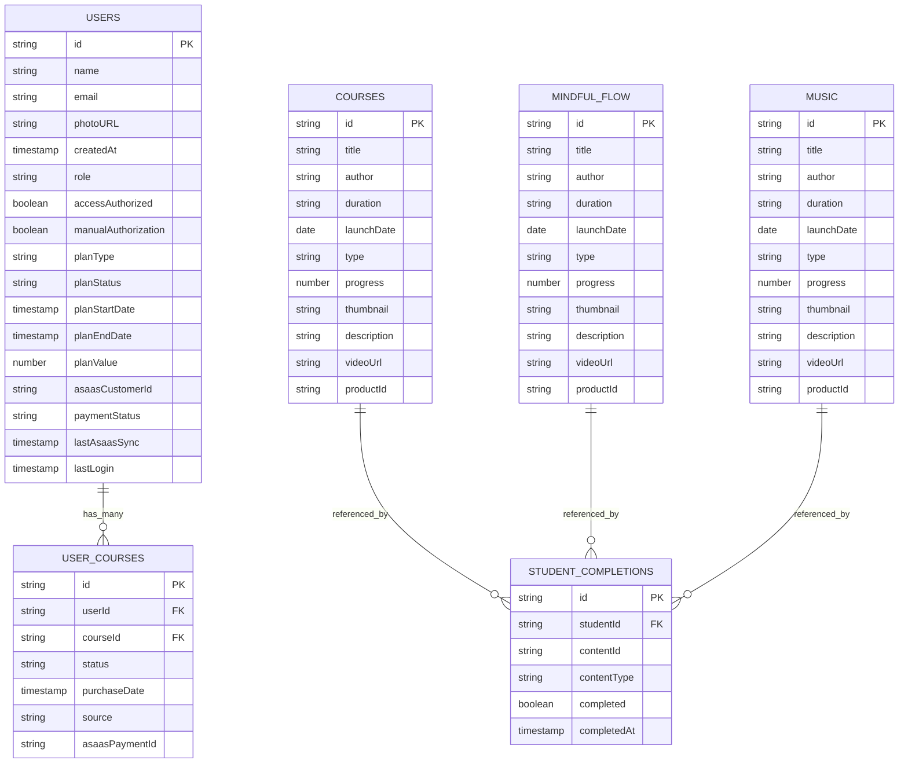
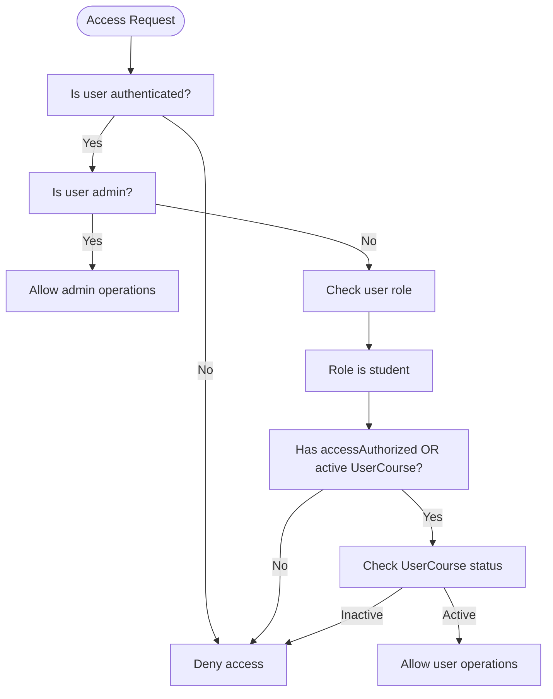
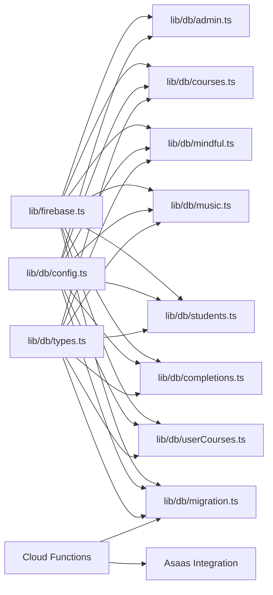
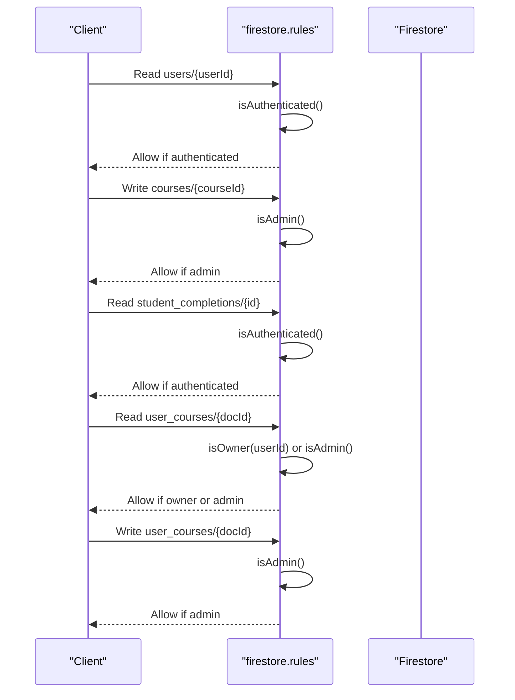

# Database Design & Abstraction

<cite>
**Referenced Files in This Document**
- [firebase.json](file://firebase.json)
- [firestore.rules](file://firestore.rules)
- [lib/firebase.ts](file://lib/firebase.ts)
- [lib/db/index.ts](file://lib/db/index.ts)
- [lib/db/config.ts](file://lib/db/config.ts)
- [lib/db/types.ts](file://lib/db/types.ts)
- [lib/db/admin.ts](file://lib/db/admin.ts)
- [lib/db/courses.ts](file://lib/db/courses.ts)
- [lib/db/mindful.ts](file://lib/db/mindful.ts)
- [lib/db/music.ts](file://lib/db/music.ts)
- [lib/db/students.ts](file://lib/db/students.ts)
- [lib/db/completions.ts](file://lib/db/completions.ts)
- [lib/db/userCourses.ts](file://lib/db/userCourses.ts)
- [lib/db/migration.ts](file://lib/db/migration.ts)
- [functions/src/index.js](file://functions/src/index.js)
- [functions/src/api/updateUserCustomerId.js](file://functions/src/api/updateUserCustomerId.js)
</cite>

## Update Summary
**Changes Made**
- Added comprehensive documentation for new UserCourse entity system
- Documented the complete migration system for legacy course conversion
- Enhanced database access patterns with improved user access control
- Added Cloud Functions integration for migration operations
- Updated data model to include user-course relationships and access management

## Table of Contents
1. [Introduction](#introduction)
2. [Project Structure](#project-structure)
3. [Core Components](#core-components)
4. [Architecture Overview](#architecture-overview)
5. [Detailed Component Analysis](#detailed-component-analysis)
6. [Dependency Analysis](#dependency-analysis)
7. [Performance Considerations](#performance-considerations)
8. [Security Rules and Access Control](#security-rules-and-access-control)
9. [Data Migration and Schema Evolution](#data-migration-and-schema-evolution)
10. [Backup and Data Lifecycle Management](#backup-and-data-lifecycle-management)
11. [Practical Queries and Data Access Patterns](#practical-queries-and-data-access-patterns)
12. [Integration with Firebase Services](#integration-with-firebase-services)
13. [Troubleshooting Guide](#troubleshooting-guide)
14. [Conclusion](#conclusion)

## Introduction
This document provides comprehensive database design and abstraction documentation for the Firestore-backed data layer. It covers the schema for users, courses, mindful flows, music content, student completions, and the new user-course access mapping system. The system now includes a sophisticated migration framework for converting legacy course access patterns to the new UserCourse entity system, along with enhanced database access patterns that provide granular control over content access.

## Project Structure
The database abstraction is organized under a dedicated module that exposes typed APIs for CRUD operations, subscriptions, administrative tasks, and migration operations. Centralized configuration defines collection names and admin email lists. Security is enforced via Firestore security rules with enhanced access control patterns.

**Diagram sources**
- [lib/db/index.ts:1-38](file://lib/db/index.ts#L1-L38)
- [lib/db/admin.ts:1-307](file://lib/db/admin.ts#L1-L307)
- [lib/db/courses.ts:1-98](file://lib/db/courses.ts#L1-L98)
- [lib/db/mindful.ts:1-87](file://lib/db/mindful.ts#L1-L87)
- [lib/db/music.ts:1-87](file://lib/db/music.ts#L1-L87)
- [lib/db/students.ts:1-285](file://lib/db/students.ts#L1-L285)
- [lib/db/completions.ts:1-56](file://lib/db/completions.ts#L1-L56)
- [lib/db/userCourses.ts:1-112](file://lib/db/userCourses.ts#L1-L112)
- [lib/db/migration.ts:1-64](file://lib/db/migration.ts#L1-L64)
- [lib/db/types.ts:1-90](file://lib/db/types.ts#L1-L90)
- [lib/db/config.ts:1-19](file://lib/db/config.ts#L1-L19)
- [lib/firebase.ts:1-25](file://lib/firebase.ts#L1-L25)
- [firebase.json:1-20](file://firebase.json#L1-L20)
- [firestore.rules:1-92](file://firestore.rules#L1-L92)
- [functions/src/index.js:1-387](file://functions/src/index.js#L1-L387)
- [functions/src/api/updateUserCustomerId.js:1-74](file://functions/src/api/updateUserCustomerId.js#L1-L74)

**Section sources**
- [lib/db/index.ts:1-38](file://lib/db/index.ts#L1-L38)
- [lib/db/config.ts:1-19](file://lib/db/config.ts#L1-L19)
- [lib/firebase.ts:1-25](file://lib/firebase.ts#L1-L25)
- [firebase.json:1-20](file://firebase.json#L1-L20)
- [firestore.rules:1-92](file://firestore.rules#L1-L92)

## Core Components
- Collection names and constants are centralized for consistency and maintainability.
- Typed interfaces define the shape of documents across collections, including the new UserCourse entity.
- Abstraction functions encapsulate Firestore operations with enhanced access control helpers.
- Migration system provides automated conversion from legacy access patterns to UserCourse entities.
- Cloud Functions handle server-side operations for migration and Asaas integration.

Key exports from the database barrel file include:
- Types for courses, mindful flows, music, students, user-course mappings, and completions.
- Admin and access control utilities with enhanced user access checking.
- CRUD and subscription functions for courses, mindful flows, music, students, and completions.
- User-course access management with granular access control.
- Migration utilities for legacy course conversion.
- Asaas payment integration endpoints.

**Section sources**
- [lib/db/index.ts:1-38](file://lib/db/index.ts#L1-L38)
- [lib/db/config.ts:1-19](file://lib/db/config.ts#L1-L19)
- [lib/db/types.ts:1-90](file://lib/db/types.ts#L1-L90)

## Architecture Overview
The client initializes Firebase and Firestore with persistent caching. The abstraction layer wraps Firestore operations, enforces enhanced access control, and provides typed APIs. The new UserCourse entity system centralizes access management, while Cloud Functions handle complex migration operations that bypass client-side Firestore rules.

**Diagram sources**
- [lib/db/migration.ts:4-63](file://lib/db/migration.ts#L4-L63)
- [functions/src/index.js:344-356](file://functions/src/index.js#L344-L356)
- [lib/db/admin.ts:10-19](file://lib/db/admin.ts#L10-L19)

## Detailed Component Analysis

### Data Model Definitions
The following entities and relationships are defined by the types and collections, including the new UserCourse system:

**Diagram sources**
- [lib/db/types.ts:1-90](file://lib/db/types.ts#L1-L90)
- [lib/db/config.ts:11-19](file://lib/db/config.ts#L11-L19)

**Section sources**
- [lib/db/types.ts:1-90](file://lib/db/types.ts#L1-L90)
- [lib/db/config.ts:11-19](file://lib/db/config.ts#L11-L19)

### Collections and Field Specifications

- users
  - Fields: id, name, email, photoURL, createdAt, role, accessAuthorized, manualAuthorization, planType, planStatus, planStartDate, planEndDate, planValue, asaasCustomerId, paymentStatus, lastAsaasSync, lastLogin.
  - Validation: role must be 'admin' or 'student'; access flags control content visibility; financial fields align with payment provider integration.

- courses
  - Fields: id, title, author, duration, launchDate, type, progress, thumbnail, description, videoUrl, productId, modules, galleries.
  - Validation: type constrained to supported media types; productId links content to purchased courses.

- mindful_flow
  - Same structure as courses; used for guided content linked to course products.

- music
  - Same structure as courses; used for audio content linked to course products.

- user_courses
  - **New Entity**: Fields: id, userId, courseId, status, purchaseDate, source, asaasPaymentId.
  - **Validation**: status constrained to active/expired/pending; source indicates origin (asaas/manual); productId links content to courses for access control.

- student_completions
  - Fields: id (studentId_contentType_contentId), studentId, contentId, contentType, completed, completedAt.
  - Validation: contentType constrained to course/mindful/music; completedAt optional and only present when completed=true.

**Section sources**
- [lib/db/types.ts:36-90](file://lib/db/types.ts#L36-L90)
- [lib/db/config.ts:11-19](file://lib/db/config.ts#L11-L19)

### Enhanced Access Control and Authorization
The system now includes a sophisticated UserCourse entity that centralizes access management:

- **Admins** can read/write most resources; regular users can read published content and manage their own profiles.
- **Enhanced Content Visibility**: Content visibility is controlled by user role, explicit access flags, or active course mappings through the UserCourse entity.
- **Granular Access Control**: Users must have active UserCourse records to access specific courses.
- **Migration Support**: Legacy access patterns are automatically converted to UserCourse entities during migration.
- **Admin Email Management**: Supports dynamic promotion/removal of administrators.

**Diagram sources**
- [firestore.rules:23-84](file://firestore.rules#L23-L84)
- [lib/db/admin.ts:86-127](file://lib/db/admin.ts#L86-L127)
- [lib/db/userCourses.ts:89-111](file://lib/db/userCourses.ts#L89-L111)

**Section sources**
- [firestore.rules:1-92](file://firestore.rules#L1-L92)
- [lib/db/admin.ts:1-307](file://lib/db/admin.ts#L1-L307)

### Query Patterns and Indexing Strategies
Enhanced query patterns with UserCourse entity support:

- **List courses ordered by title**
  - Current: orderBy('title')
  - Recommended index: composite index on (title)

- **List mindful flows ordered by title**
  - Current: orderBy('title')
  - Recommended index: composite index on (title)

- **List music ordered by title**
  - Current: orderBy('title')
  - Recommended index: composite index on (title)

- **Get user's course access**
  - **Enhanced**: where('userId', '==', uid) AND where('status', '==', 'active')
  - Recommended index: composite index on (userId, status)

- **Get user-course mapping by courseId and status**
  - **Enhanced**: where('courseId', '==', cid) AND where('status', '==', 'active')
  - Recommended index: composite index on (courseId, status)

- **Get student completions by studentId and contentType**
  - Current: composite document id using studentId_contentType_contentId
  - Recommended: ensure efficient lookup by id; consider adding contentType index if querying by contentType frequently

- **Get students with role=student and optionally filter by access flags**
  - Current: where('role', '==', 'student')
  - Recommended index: composite index on (role, accessAuthorized) if filtering by access

**Section sources**
- [lib/db/courses.ts:8-17](file://lib/db/courses.ts#L8-L17)
- [lib/db/mindful.ts:8-17](file://lib/db/mindful.ts#L8-L17)
- [lib/db/music.ts:8-17](file://lib/db/music.ts#L8-L17)
- [lib/db/userCourses.ts:7-23](file://lib/db/userCourses.ts#L7-L23)
- [lib/db/completions.ts:6-29](file://lib/db/completions.ts#L6-L29)

### Enhanced Data Access Patterns
The new UserCourse entity enables sophisticated access control patterns:

- **Admin-only operations**: create/update/delete for courses, mindful flows, music, and admin email management.
- **Enhanced User-scoped reads**: courses/mindful/music filtered by access flags, active course mappings, or UserCourse status.
- **Completion tracking**: upsert by composite id; read by composite id.
- **Migration operations**: automated conversion from legacy access patterns to UserCourse entities.
- **Asaas integration**: seamless payment processing with automatic access grant.

Examples (paths only):
- Fetch courses for a user: [getCoursesForUser:54-96](file://lib/db/courses.ts#L54-L96)
- **New**: Get user's course assignments: [getUserCourses:7-23](file://lib/db/userCourses.ts#L7-L23)
- **New**: Grant course access: [grantCourseAccess:25-68](file://lib/db/userCourses.ts#L25-L68)
- **New**: Revoke course access: [revokeCourseAccess:70-87](file://lib/db/userCourses.ts#L70-L87)
- **New**: Check course access: [hasCourseAccess:101-111](file://lib/db/userCourses.ts#L101-L111)
- **New**: Check any course access: [hasAnyCourseAccess:89-99](file://lib/db/userCourses.ts#L89-L99)
- **New**: Run migration: [runAccessMigration:4-63](file://lib/db/migration.ts#L4-L63)
- Mark content complete: [markContentComplete:31-55](file://lib/db/completions.ts#L31-L55)
- Export student data: [exportStudentData:147-180](file://lib/db/students.ts#L147-L180)

**Section sources**
- [lib/db/courses.ts:54-96](file://lib/db/courses.ts#L54-L96)
- [lib/db/userCourses.ts:7-112](file://lib/db/userCourses.ts#L7-L112)
- [lib/db/migration.ts:4-63](file://lib/db/migration.ts#L4-L63)
- [lib/db/completions.ts:31-55](file://lib/db/completions.ts#L31-L55)
- [lib/db/students.ts:147-180](file://lib/db/students.ts#L147-L180)

## Dependency Analysis
The abstraction layer now includes enhanced dependencies for the UserCourse system and migration capabilities. Functions are grouped by domain with expanded functionality for access management and migration operations.

**Diagram sources**
- [lib/firebase.ts:1-25](file://lib/firebase.ts#L1-L25)
- [lib/db/admin.ts:1-307](file://lib/db/admin.ts#L1-L307)
- [lib/db/courses.ts:1-98](file://lib/db/courses.ts#L1-L98)
- [lib/db/mindful.ts:1-87](file://lib/db/mindful.ts#L1-L87)
- [lib/db/music.ts:1-87](file://lib/db/music.ts#L1-L87)
- [lib/db/students.ts:1-285](file://lib/db/students.ts#L1-L285)
- [lib/db/completions.ts:1-56](file://lib/db/completions.ts#L1-L56)
- [lib/db/userCourses.ts:1-112](file://lib/db/userCourses.ts#L1-L112)
- [lib/db/migration.ts:1-64](file://lib/db/migration.ts#L1-L64)
- [lib/db/config.ts:1-19](file://lib/db/config.ts#L1-L19)
- [lib/db/types.ts:1-90](file://lib/db/types.ts#L1-L90)
- [functions/src/index.js:1-387](file://functions/src/index.js#L1-L387)
- [functions/src/api/updateUserCustomerId.js:1-74](file://functions/src/api/updateUserCustomerId.js#L1-L74)

**Section sources**
- [lib/db/index.ts:1-38](file://lib/db/index.ts#L1-L38)
- [lib/db/config.ts:1-19](file://lib/db/config.ts#L1-L19)
- [lib/db/types.ts:1-90](file://lib/db/types.ts#L1-L90)

## Performance Considerations
Enhanced performance considerations with UserCourse entity optimization:

- **Client-side caching**: Firestore initialized with persistent local cache and multi-tab manager to reduce network usage and improve responsiveness.
- **Sorting and pagination**: Prefer server-side ordering with indexes; avoid client-side sorting for large datasets.
- **Batch operations**: Group writes for access grants and updates to minimize round trips.
- **Composite indexes**: Create composite indexes for frequent multi-field filters and orderBys, especially for UserCourse queries.
- **Denormalization**: Use productId to link content to courses; this reduces joins and simplifies queries.
- **Lazy loading**: Load content lists first, then fetch details on demand.
- **Migration optimization**: Cloud Functions handle heavy migration operations server-side, bypassing client limitations.
- **Access control optimization**: UserCourse queries are optimized for frequent access pattern checks.

**Section sources**
- [lib/firebase.ts:18-22](file://lib/firebase.ts#L18-L22)

## Security Rules and Access Control
Enhanced security rules with UserCourse entity support:

Security rules enforce:
- Authentication checks for all requests.
- Ownership checks for user documents and activities.
- Admin-only write operations for most collections.
- **Enhanced Content visibility**: Controlled by user role, access flags, or active UserCourse mappings.
- **UserCourse access control**: Users can only read their own access records; admins can read all.
- **Special handling for admin emails and primary admin.**
- **Migration security**: Only admins can execute migration operations via Cloud Functions.

**Diagram sources**
- [firestore.rules:5-89](file://firestore.rules#L5-L89)

**Section sources**
- [firestore.rules:1-92](file://firestore.rules#L1-L92)

## Data Migration and Schema Evolution
**Enhanced** Migration system with comprehensive legacy course conversion:

The migration system provides automated conversion from legacy access patterns to the new UserCourse entity system:

- **Migration Hook**: [runAccessMigration:4-63](file://lib/db/migration.ts#L4-L63) provides client-side interface for initiating migrations.
- **Cloud Functions**: [runAccessMigration:344-356](file://functions/src/index.js#L344-L356) and [runAccessMigrationHttp:358-387](file://functions/src/index.js#L358-L387) handle server-side migration operations.
- **Backward Compatibility**: Course retrieval falls back to returning all courses if legacy access data is insufficient.
- **Type Evolution**: Optional fields and union types enable additive schema changes without breaking existing documents.
- **Legacy Conversion**: Automatic conversion of legacy authorized users to UserCourse entities with active status.
- **Content Migration**: Missing productId fields in mindful_flow and music collections are automatically populated.

**Migration Process**:
1. **Discover courses and primary course**: Identify all existing courses and establish primary course for fallback scenarios.
2. **Migrate legacy users**: Convert users with accessAuthorized=true to UserCourse entries with active status.
3. **Fix content productId**: Populate missing productId fields in mindful_flow and music collections.
4. **Generate reports**: Provide detailed migration statistics and results.

**Section sources**
- [lib/db/migration.ts:4-63](file://lib/db/migration.ts#L4-L63)
- [functions/src/index.js:43-104](file://functions/src/index.js#L43-L104)
- [lib/db/index.ts:36-38](file://lib/db/index.ts#L36-L38)
- [lib/db/courses.ts:71-75](file://lib/db/courses.ts#L71-L75)

## Backup and Data Lifecycle Management
- **Backups**: Use Firestore Data Transfer or scheduled exports via Cloud Functions for periodic backups.
- **Retention**: Define retention policies for logs and temporary data; archive historical student_completions if needed.
- **Archival**: Move inactive user data (e.g., deactivated accounts) to cold storage after policy-defined periods.
- **Migration backups**: Consider backing up UserCourse entities before running major migrations.
- **Access control audits**: Regularly audit UserCourse records to ensure data integrity.

## Practical Queries and Data Access Patterns
**Enhanced** Common operations with UserCourse entity support:

- Get all courses: [getCourses:8-17](file://lib/db/courses.ts#L8-L17)
- Get courses for a user: [getCoursesForUser:54-96](file://lib/db/courses.ts#L54-L96)
- Get mindful flows for a user: [getMindfulFlowsForUser:54-86](file://lib/db/mindful.ts#L54-L86)
- Get music for a user: [getMusicForUser:54-86](file://lib/db/music.ts#L54-L86)
- **New**: Get user's course assignments: [getUserCourses:7-23](file://lib/db/userCourses.ts#L7-L23)
- **New**: Grant course access: [grantCourseAccess:25-68](file://lib/db/userCourses.ts#L25-L68)
- **New**: Revoke course access: [revokeCourseAccess:70-87](file://lib/db/userCourses.ts#L70-L87)
- **New**: Check course access: [hasCourseAccess:101-111](file://lib/db/userCourses.ts#L101-L111)
- **New**: Check any course access: [hasAnyCourseAccess:89-99](file://lib/db/userCourses.ts#L89-L99)
- **New**: Run migration: [runAccessMigration:4-63](file://lib/db/migration.ts#L4-L63)
- Mark content complete: [markContentComplete:31-55](file://lib/db/completions.ts#L31-L55)
- Get student completion: [getStudentCompletion:6-29](file://lib/db/completions.ts#L6-L29)
- Export student data: [exportStudentData:147-180](file://lib/db/students.ts#L147-L180)
- Import student data: [importStudentData:182-259](file://lib/db/students.ts#L182-L259)

**Section sources**
- [lib/db/courses.ts:8-96](file://lib/db/courses.ts#L8-L96)
- [lib/db/mindful.ts:8-86](file://lib/db/mindful.ts#L8-L86)
- [lib/db/music.ts:8-86](file://lib/db/music.ts#L8-L86)
- [lib/db/userCourses.ts:7-112](file://lib/db/userCourses.ts#L7-L112)
- [lib/db/migration.ts:4-63](file://lib/db/migration.ts#L4-L63)
- [lib/db/completions.ts:6-55](file://lib/db/completions.ts#L6-L55)
- [lib/db/students.ts:147-259](file://lib/db/students.ts#L147-L259)

## Integration with Firebase Services
**Enhanced** Integration with expanded Cloud Functions and migration capabilities:

- **Authentication**: User identity validated in both client and server rules.
- **Firestore**: Persistent caching enabled for offline and multi-tab support.
- **Storage**: Separate bucket configured for file uploads.
- **Cloud Functions**: 
  - **Migration Functions**: [runAccessMigration:344-356](file://functions/src/index.js#L344-L356) and [runAccessMigrationHttp:358-387](file://functions/src/index.js#L358-L387) for server-side migration operations.
  - **Asaas Integration**: [updateUserCustomerId:12-74](file://functions/src/api/updateUserCustomerId.js#L12-L74) for payment processing.
  - **Fallback mechanisms**: HTTP endpoints for migration operations when callable authentication fails.
- **HTTPS Callable Functions**: Client-side migration interface with automatic fallback to HTTP endpoints.

**Section sources**
- [lib/firebase.ts:1-25](file://lib/firebase.ts#L1-L25)
- [firebase.json:1-20](file://firebase.json#L1-L20)
- [functions/src/index.js:344-387](file://functions/src/index.js#L344-L387)
- [functions/src/api/updateUserCustomerId.js:12-74](file://functions/src/api/updateUserCustomerId.js#L12-L74)

## Troubleshooting Guide
**Enhanced** Troubleshooting with UserCourse and migration support:

- **Authentication failures**: Ensure user is signed in and Firestore rules permit authenticated access.
- **Permission denied**: Verify user role and access flags; confirm admin privileges if write operations are required.
- **Slow queries**: Add composite indexes for orderBy and multi-field filters; avoid client-side sorting for large datasets.
- **Migration issues**: 
  - Use the migration hook to reconcile access data; verify productId linkage for content.
  - Check Cloud Function deployment status if callable migration fails.
  - Use HTTP fallback endpoint when callable authentication fails.
  - Verify admin credentials for migration operations.
- **Data export/import errors**: Validate CSV format and email uniqueness; handle partial failures gracefully.
- **UserCourse access problems**: Verify UserCourse records exist with active status for intended courses.
- **Migration rollback**: Consider backing up UserCourse entities before running migrations.

**Section sources**
- [firestore.rules:1-92](file://firestore.rules#L1-L92)
- [lib/db/admin.ts:7-22](file://lib/db/admin.ts#L7-L22)
- [lib/db/students.ts:182-259](file://lib/db/students.ts#L182-L259)
- [lib/db/migration.ts:13-63](file://lib/db/migration.ts#L13-L63)
- [functions/src/index.js:358-387](file://functions/src/index.js#L358-L387)

## Conclusion
The database design leverages enhanced typed abstractions, centralized configuration, and strict security rules to provide a robust, scalable foundation. The new UserCourse entity system provides granular access control, while the comprehensive migration framework ensures seamless transition from legacy access patterns. By following recommended indexing patterns, maintaining backward compatibility, implementing secure access controls, and utilizing Cloud Functions for complex operations, the system supports efficient content delivery, accurate progress tracking, reliable administrative workflows, and smooth data migration processes.