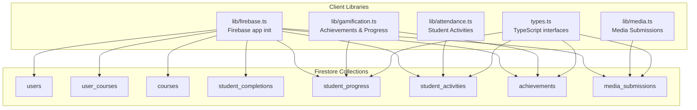
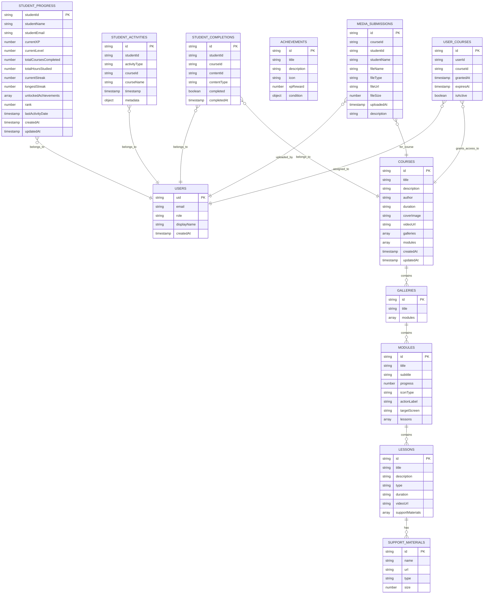
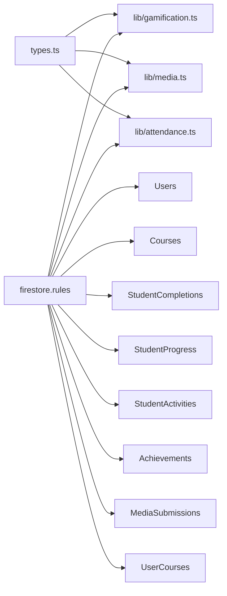

# Firestore Schema Design

<cite>
**Referenced Files in This Document**
- [firestore.rules](file://firestore.rules)
- [firebase.ts](file://lib/firebase.ts)
- [types.ts](file://types.ts)
- [gamification.ts](file://lib/gamification.ts)
- [media.ts](file://lib/media.ts)
- [attendance.ts](file://lib/attendance.ts)
- [CourseDetail.tsx](file://components/CourseDetail.tsx)
- [db/index.ts](file://lib/db/index.ts)
</cite>

## Table of Contents
1. [Introduction](#introduction)
2. [Project Structure](#project-structure)
3. [Core Components](#core-components)
4. [Architecture Overview](#architecture-overview)
5. [Detailed Component Analysis](#detailed-component-analysis)
6. [Dependency Analysis](#dependency-analysis)
7. [Performance Considerations](#performance-considerations)
8. [Troubleshooting Guide](#troubleshooting-guide)
9. [Conclusion](#conclusion)

## Introduction
This document describes the Firestore database schema design for the application, focusing on the collections and documents used for Users, Courses, Lessons, Modules, StudentCompletions, Achievements, and Media. It explains entity relationships, field definitions, data types, validation rules, required/optional properties, primary keys, foreign key references, indexing strategies, and practical examples. It also covers denormalization decisions and their performance implications.

## Project Structure
The schema is implemented across client-side libraries and TypeScript types, with Firestore security rules governing access. Collections are accessed via Firestore SDK methods and referenced by UI components.

**Diagram sources**
- [firebase.ts](file://lib/firebase.ts#L1-L25)
- [gamification.ts](file://lib/gamification.ts#L1-L349)
- [media.ts](file://lib/media.ts#L1-L369)
- [attendance.ts](file://lib/attendance.ts#L1-L177)
- [types.ts](file://types.ts#L1-L125)

**Section sources**
- [firebase.ts](file://lib/firebase.ts#L1-L25)
- [types.ts](file://types.ts#L1-L125)

## Core Components
This section defines the primary collections and their documents, including fields, data types, and ownership rules.

- Users (users)
  - Purpose: Store user profiles and roles.
  - Primary key: Document ID equals the user’s Firebase UID.
  - Fields:
    - uid: string (required)
    - email: string (required)
    - role: string (enum: admin or user) (required)
    - displayName: string (optional)
    - createdAt: timestamp (optional)
  - Access control: Self-read/write for authenticated users; admin overrides.

- Courses (courses)
  - Purpose: Course catalog and metadata.
  - Primary key: Document ID is the course identifier.
  - Fields:
    - title: string (required)
    - description: string (required)
    - author: string (required)
    - duration: string (optional)
    - coverImage: string (optional)
    - videoUrl: string (optional)
    - galleries: array of gallery objects (optional) — supports new nested structure
    - modules: array of module objects (optional) — legacy support
    - createdAt: timestamp (optional)
    - updatedAt: timestamp (optional)
  - Access control: Authenticated read; admin write.

- Galleries and Modules/Lessons
  - Galleries (nested under courses):
    - id: string (required)
    - title: string (required)
    - modules: array of modules (required if galleries present)
  - Modules (under galleries or courses):
    - id: string (required)
    - title: string (required)
    - subtitle: string (optional)
    - progress: number (optional)
    - iconType: string (enum) (required)
    - actionLabel: string (required)
    - targetScreen: string (optional)
    - lessons: array of lessons (required)
  - Lessons (under modules):
    - id: string (required)
    - title: string (required)
    - description: string (optional)
    - type: string (enum: video, audio, pdf) (required)
    - duration: string (optional)
    - videoUrl: string (optional)
    - supportMaterials: array of support materials (optional)
  - Support materials:
    - id: string (required)
    - name: string (required)
    - url: string (required)
    - type: string (enum: image, audio, pdf) (required)
    - size: number (optional)

- StudentCompletions (student_completions)
  - Purpose: Track completion of courses and lessons per student.
  - Primary key: Document ID is a composite key or generated by Firestore.
  - Fields:
    - studentId: string (required)
    - courseId: string (required)
    - contentId: string (required) — identifies course or lesson
    - contentType: string (enum: course, lesson) (required)
    - completed: boolean (required)
    - completedAt: timestamp (optional)
  - Access control: Authenticated read; admin create/update/delete.

- Student Progress (student_progress)
  - Purpose: Gamification and progress tracking per student.
  - Primary key: Document ID equals the student’s Firebase UID.
  - Fields:
    - studentId: string (required)
    - studentName: string (required)
    - studentEmail: string (required)
    - currentXP: number (required)
    - currentLevel: number (required)
    - totalCoursesCompleted: number (required)
    - totalHoursStudied: number (required)
    - currentStreak: number (required)
    - longestStreak: number (required)
    - unlockedAchievements: array of strings (achievement IDs) (required)
    - rank: number (optional)
    - lastActivityDate: timestamp (optional)
    - createdAt: timestamp (required)
    - updatedAt: timestamp (required)
  - Access control: Owner read/write; admin read/write.

- Student Activities (student_activities)
  - Purpose: Audit trail of student actions.
  - Primary key: Document ID is a Firestore-generated ID.
  - Fields:
    - studentId: string (required)
    - activityType: string (enum: course_completed, course_started, lesson_completed, mindful_flow, media_upload) (required)
    - courseId: string (optional)
    - courseName: string (optional)
    - timestamp: timestamp (required)
    - metadata: object (optional)
  - Access control: Owner read; admin read.

- Achievements (achievements)
  - Purpose: Define unlockable badges and XP rewards.
  - Primary key: Document ID is the achievement identifier.
  - Fields:
    - id: string (required)
    - title: string (required)
    - description: string (required)
    - icon: string (required)
    - xpReward: number (required)
    - condition: object (required)
      - type: string (enum: course_count, streak_days, hours_studied, first_course) (required)
      - threshold: number (required)
  - Access control: Authenticated read; admin write.

- Media Submissions (media_submissions)
  - Purpose: Track uploaded student work and support materials.
  - Primary key: Document ID is a Firestore-generated ID.
  - Fields:
    - courseId: string (required)
    - studentId: string (required)
    - studentName: string (required)
    - fileName: string (required)
    - fileType: string (enum: image, video, audio, pdf, document) (required)
    - fileUrl: string (required)
    - fileSize: number (required)
    - uploadedAt: timestamp (required)
    - description: string (optional)
  - Access control: Owner read; admin read.

- User Courses (user_courses)
  - Purpose: Grant or revoke course access to users.
  - Primary key: Document ID is a Firestore-generated ID.
  - Fields:
    - userId: string (required)
    - courseId: string (required)
    - grantedAt: timestamp (required)
    - expiresAt: timestamp (optional)
    - isActive: boolean (required)
  - Access control: Owner read; admin read/write.

**Section sources**
- [firestore.rules](file://firestore.rules#L23-L89)
- [types.ts](file://types.ts#L27-L125)
- [gamification.ts](file://lib/gamification.ts#L5-L125)
- [media.ts](file://lib/media.ts#L6-L117)
- [attendance.ts](file://lib/attendance.ts#L5-L30)

## Architecture Overview
The schema follows a normalized design with deliberate denormalization for performance. Courses are structured with optional galleries/modules/lessons to support both simple single-video courses and complex modular learning paths. Student progress and activities are stored separately to enable efficient queries and reduce write contention.

**Diagram sources**
- [types.ts](file://types.ts#L27-L125)
- [gamification.ts](file://lib/gamification.ts#L5-L125)
- [media.ts](file://lib/media.ts#L6-L117)
- [attendance.ts](file://lib/attendance.ts#L5-L30)

## Detailed Component Analysis

### Users Collection
- Purpose: Central identity and role management.
- Ownership: Users can read/update their own profile; admins can manage all.
- Security: Enforced via rules that check request.auth and document ownership.

**Section sources**
- [firestore.rules](file://firestore.rules#L23-L29)

### Courses Collection
- Purpose: Course catalog and content structure.
- Structure: Supports two modes:
  - Legacy: modules array containing lessons.
  - New: galleries array containing modules containing lessons.
- Fields: Rich metadata for UI rendering and navigation.
- Queries: UI components fetch courses and navigate nested structures.

**Section sources**
- [firestore.rules](file://firestore.rules#L37-L41)
- [types.ts](file://types.ts#L27-L50)
- [CourseDetail.tsx](file://components/CourseDetail.tsx#L29-L54)

### Modules and Lessons
- Purpose: Hierarchical organization of learning content.
- Relationships: Modules belong to galleries or courses; lessons belong to modules.
- Support materials: Optional attachments for lessons.

**Section sources**
- [types.ts](file://types.ts#L27-L50)

### StudentCompletions
- Purpose: Track completion of courses and lessons per student.
- Keys: Composite logic via studentId, courseId, contentId, contentType.
- Usage: UI marks content complete and logs activities.

**Section sources**
- [CourseDetail.tsx](file://components/CourseDetail.tsx#L128-L146)
- [attendance.ts](file://lib/attendance.ts#L7-L30)

### Student Progress and Achievements
- Purpose: Gamification and progress tracking.
- Student Progress:
  - Primary key: studentId equals the user’s Firebase UID.
  - Fields: XP, level, streaks, achievements, timestamps.
- Achievements:
  - Primary key: achievement id.
  - Condition-based unlocks tied to progress thresholds.

**Section sources**
- [firestore.rules](file://firestore.rules#L63-L71)
- [types.ts](file://types.ts#L108-L125)
- [gamification.ts](file://lib/gamification.ts#L5-L125)

### Student Activities
- Purpose: Audit trail of user actions.
- Fields: Type, course context, timestamp, metadata.
- Queries: UI and backend compute stats and recent activity.

**Section sources**
- [firestore.rules](file://firestore.rules#L67-L71)
- [types.ts](file://types.ts#L84-L93)
- [attendance.ts](file://lib/attendance.ts#L5-L30)

### Media Submissions
- Purpose: Store uploaded student work and support materials.
- Storage: Files uploaded to Cloud Storage; metadata stored in Firestore.
- Queries: Fetch by courseId or studentId with ordering.

**Section sources**
- [firestore.rules](file://firestore.rules#L73-L76)
- [types.ts](file://types.ts#L70-L82)
- [media.ts](file://lib/media.ts#L6-L117)

### User Courses
- Purpose: Manage course access grants.
- Fields: userId, courseId, timestamps, isActive flag.
- Access control: Owner can read own records; admin manages all.

**Section sources**
- [firestore.rules](file://firestore.rules#L78-L89)
- [db/index.ts](file://lib/db/index.ts#L33-L35)

## Dependency Analysis
The schema depends on:
- TypeScript types for consistent field definitions across the app.
- Firestore security rules for access control.
- Client libraries for CRUD operations and UI integrations.

**Diagram sources**
- [types.ts](file://types.ts#L1-L125)
- [firestore.rules](file://firestore.rules#L1-L97)
- [gamification.ts](file://lib/gamification.ts#L1-L349)
- [media.ts](file://lib/media.ts#L1-L369)
- [attendance.ts](file://lib/attendance.ts#L1-L177)

**Section sources**
- [types.ts](file://types.ts#L1-L125)
- [firestore.rules](file://firestore.rules#L1-L97)

## Performance Considerations
- Indexing strategies:
  - Compound indexes for frequent queries:
    - student_activities: (studentId, timestamp desc)
    - student_activities: (courseId, timestamp desc)
    - media_submissions: (courseId, uploadedAt desc)
    - media_submissions: (studentId, uploadedAt desc)
    - student_completions: (studentId, courseId, contentId)
    - student_progress: (currentXP desc)
    - user_courses: (userId, isActive)
    - user_courses: (courseId, isActive)
- Denormalization benefits:
  - student_progress stores derived metrics (XP, level, streaks) to avoid expensive aggregations.
  - courses embed galleries/modules/lessons to minimize reads for course pages.
- Query patterns:
  - UI components rely on ordered queries and equality filters to keep latency low.
- Storage separation:
  - Large binary assets are stored in Cloud Storage; Firestore stores only metadata.

[No sources needed since this section provides general guidance]

## Troubleshooting Guide
- Authentication errors:
  - Ensure request.auth is present for protected operations.
- Permission denied:
  - Verify user role and ownership checks in rules.
- CORS errors on uploads:
  - Configure CORS for Cloud Storage or adjust rules to allow authenticated uploads.
- Missing data:
  - Confirm indexes exist for targeted queries (e.g., studentId, courseId).
- Streak calculation anomalies:
  - Validate activity timestamps and timezone handling.

**Section sources**
- [firestore.rules](file://firestore.rules#L5-L21)
- [media.ts](file://lib/media.ts#L44-L77)
- [attendance.ts](file://lib/attendance.ts#L122-L161)

## Conclusion
The schema balances flexibility and performance. Courses support both simple and complex structures, while gamification and activity collections enable robust analytics and engagement tracking. Security rules enforce strict access control, and denormalized fields streamline common queries. Proper indexing and storage separation further optimize performance for real-time UI experiences.