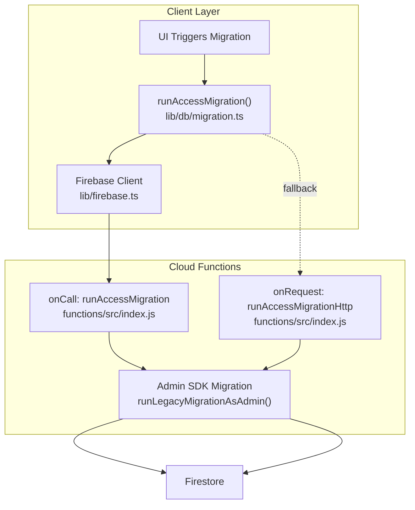
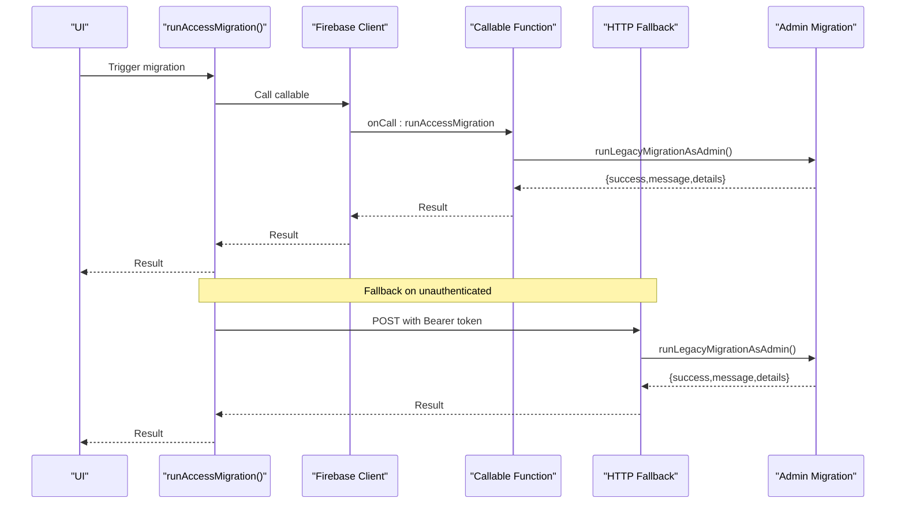
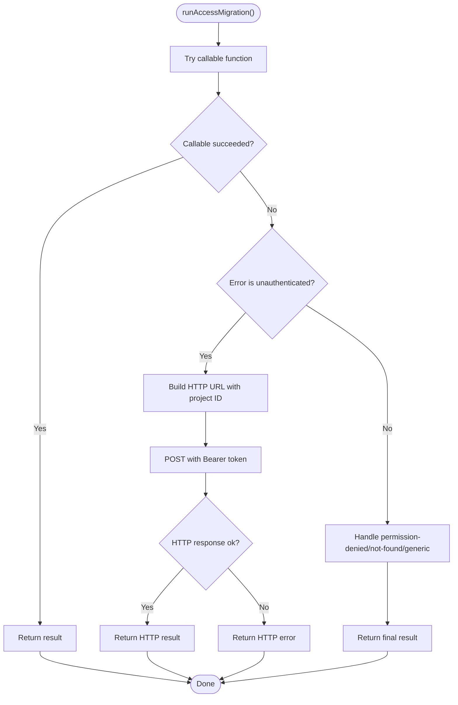
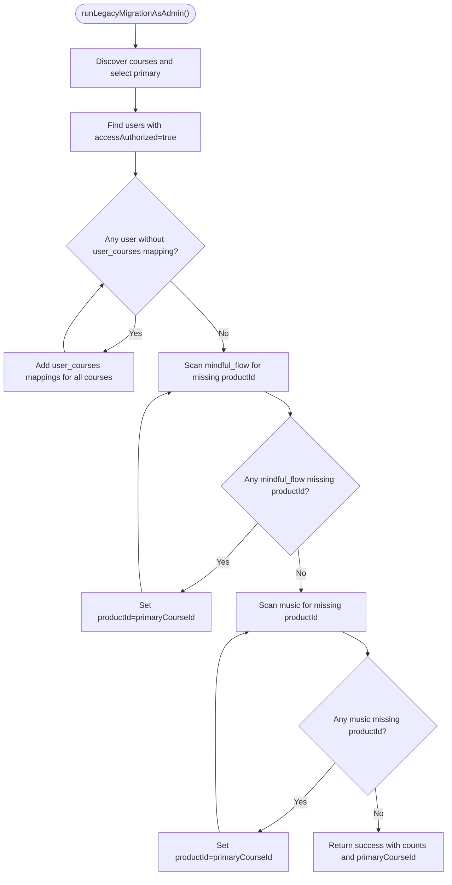
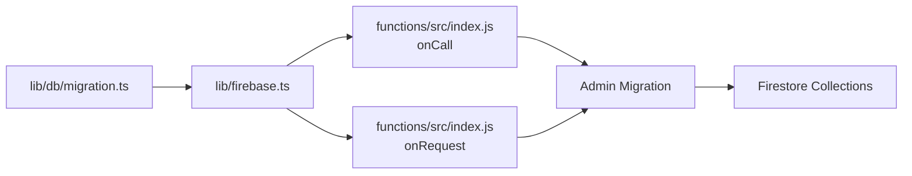

# Schema Evolution & Migration

<cite>
**Referenced Files in This Document**
- [migration.ts](file://lib/db/migration.ts)
- [index.js](file://functions/src/index.js)
- [firebase.ts](file://lib/firebase.ts)
- [config.test.ts](file://test/db/config.test.ts)
- [types.ts](file://types.ts)
- [gamification.ts](file://lib/gamification.ts)
</cite>

## Table of Contents
1. [Introduction](#introduction)
2. [Project Structure](#project-structure)
3. [Core Components](#core-components)
4. [Architecture Overview](#architecture-overview)
5. [Detailed Component Analysis](#detailed-component-analysis)
6. [Dependency Analysis](#dependency-analysis)
7. [Performance Considerations](#performance-considerations)
8. [Troubleshooting Guide](#troubleshooting-guide)
9. [Conclusion](#conclusion)
10. [Appendices](#appendices)

## Introduction
This document explains the database schema evolution and migration strategies implemented in the project, focusing on the migration pipeline for adding new fields, restructuring collections, and maintaining backward compatibility. It documents the runAccessMigration function and related utilities, outlines data transformation patterns, rollback considerations, and provides practical examples for common scenarios such as adding new achievement types, updating user roles, and modifying course structures. It also covers testing, production deployment, and monitoring migration success, along with guidelines for planning major schema changes with minimal downtime.

## Project Structure
The migration system spans two layers:
- Frontend client wrapper that triggers migrations via callable functions and falls back to HTTP endpoints when needed.
- Backend Cloud Functions that execute migrations with administrative privileges, bypassing Firestore client-side security rules.

**Diagram sources**
- [migration.ts](file://lib/db/migration.ts#L1-L64)
- [index.js](file://functions/src/index.js#L344-L387)
- [firebase.ts](file://lib/firebase.ts#L1-L25)

**Section sources**
- [migration.ts](file://lib/db/migration.ts#L1-L64)
- [index.js](file://functions/src/index.js#L1-L387)
- [firebase.ts](file://lib/firebase.ts#L1-L25)

## Core Components
- Client migration wrapper: Provides a single entry point to trigger migrations and handles authentication fallbacks.
- Callable function: Validates admin context and invokes the migration routine.
- HTTP fallback function: Accepts explicit Bearer tokens for environments where callable auth is unreliable.
- Migration routine: Discovers courses, migrates legacy users into user_courses, and backfills productId fields for mindful_flow and music collections.

Key responsibilities:
- Authentication enforcement for admin-only migrations.
- Idempotent transformations where possible.
- Structured reporting of migrated counts and primary course discovery.

**Section sources**
- [migration.ts](file://lib/db/migration.ts#L4-L63)
- [index.js](file://functions/src/index.js#L10-L19)
- [index.js](file://functions/src/index.js#L43-L104)
- [index.js](file://functions/src/index.js#L344-L387)

## Architecture Overview
The migration architecture enforces strict admin-only execution and supports two execution paths:
- Callable path: Uses Firebase callable functions for seamless auth.
- HTTP path: Uses explicit Bearer tokens for environments with callable auth limitations.

**Diagram sources**
- [migration.ts](file://lib/db/migration.ts#L4-L63)
- [index.js](file://functions/src/index.js#L344-L387)
- [index.js](file://functions/src/index.js#L43-L104)

## Detailed Component Analysis

### Migration Wrapper (Client)
The wrapper encapsulates:
- Callable invocation of the migration function.
- Unauthenticated fallback to an HTTP endpoint with explicit Bearer token.
- Error handling for permission-denied, not-found/unimplemented, and generic errors.
- Structured return with success flag, message, and optional details.

**Diagram sources**
- [migration.ts](file://lib/db/migration.ts#L4-L63)

**Section sources**
- [migration.ts](file://lib/db/migration.ts#L4-L63)

### Callable Migration Endpoint
- Validates admin context using Firestore user lookup.
- Invokes the migration routine and rethrows non-HTTPS errors as internal.
- Returns structured results to the client.

**Section sources**
- [index.js](file://functions/src/index.js#L10-L19)
- [index.js](file://functions/src/index.js#L344-L356)

### HTTP Migration Endpoint
- Validates Bearer token by decoding and checking user role.
- Supports CORS preflight OPTIONS.
- Executes the same migration routine and returns structured results.

**Section sources**
- [index.js](file://functions/src/index.js#L21-L41)
- [index.js](file://functions/src/index.js#L358-L387)

### Migration Routine (Admin)
The routine performs four steps:
1. Discover courses and select a primary course ID.
2. Migrate legacy authorized users into user_courses if missing mappings.
3. Backfill productId for mindful_flow entries missing it.
4. Backfill productId for music entries missing it.

It reports counts for users, mindful_flow, and music, plus the discovered primary course ID.

**Diagram sources**
- [index.js](file://functions/src/index.js#L43-L104)

**Section sources**
- [index.js](file://functions/src/index.js#L43-L104)

### Data Types and Collections Impacted
- Courses: Source of primary course ID for productId backfill.
- Users: Legacy access flag migration into user_courses.
- user_courses: New mapping collection for course enrollment.
- mindful_flow: Content collection requiring productId backfill.
- music: Content collection requiring productId backfill.

These relationships inform how to plan and validate migrations.

**Section sources**
- [index.js](file://functions/src/index.js#L43-L104)

### Gamification and Achievement Types
Achievement definitions and default sets are defined in gamification utilities. When evolving schema for achievements:
- Add new achievement types by extending the Achievement interface and default arrays.
- Maintain backward compatibility by ensuring existing achievement IDs remain stable.
- Use seeding routines to populate defaults in new environments.

**Section sources**
- [types.ts](file://types.ts#L95-L106)
- [gamification.ts](file://lib/gamification.ts#L304-L348)

## Dependency Analysis
The migration system depends on:
- Firebase client initialization and callable functions.
- Admin SDK for privileged operations against Firestore.
- Firestore collections for reading and writing migration targets.

**Diagram sources**
- [migration.ts](file://lib/db/migration.ts#L1-L2)
- [firebase.ts](file://lib/firebase.ts#L1-L25)
- [index.js](file://functions/src/index.js#L344-L387)

**Section sources**
- [migration.ts](file://lib/db/migration.ts#L1-L2)
- [firebase.ts](file://lib/firebase.ts#L1-L25)
- [index.js](file://functions/src/index.js#L344-L387)

## Performance Considerations
- Batch operations: Prefer batch writes for large-scale field updates to reduce transaction costs.
- Indexing: Ensure queries on user_courses.userId and productId are indexed to speed up scans and updates.
- Pagination: For very large datasets, iterate with pagination to avoid timeouts.
- Idempotency: Design migrations to be safe on repeated runs to minimize downtime risks.
- Monitoring: Log counts and timing per step to detect slow operations and failures.

## Troubleshooting Guide
Common issues and resolutions:
- Unauthenticated: The wrapper attempts a fallback HTTP call with a fresh ID token. Ensure the user is signed in and the token refresh succeeds.
- Permission denied: Only users with admin role can execute migrations. Verify the user’s role in Firestore.
- Function not found: Deploy Cloud Functions and retry. The wrapper distinguishes missing functions from other errors.
- HTTP errors: Inspect the returned message and status code from the HTTP endpoint.

Testing admin configuration:
- Unit tests validate admin email detection and primary admin constants.

**Section sources**
- [migration.ts](file://lib/db/migration.ts#L13-L62)
- [index.js](file://functions/src/index.js#L10-L19)
- [config.test.ts](file://test/db/config.test.ts#L1-L25)

## Conclusion
The project implements a robust, admin-only migration system with callable and HTTP fallback paths. The migration routine is designed to backfill missing fields and establish new mappings while reporting progress. By following the guidelines in this document—prioritizing idempotency, testing, and monitoring—you can safely evolve the schema with minimal downtime and strong backward compatibility.

## Appendices

### Practical Migration Scenarios

- Adding new achievement types
  - Extend the Achievement interface and add new default entries.
  - Seed defaults in new environments; existing users retain previous achievements.
  - Reference: Achievement interface and default sets.

  **Section sources**
  - [types.ts](file://types.ts#L95-L106)
  - [gamification.ts](file://lib/gamification.ts#L304-L348)

- Updating user roles
  - Enforce admin-only execution via callable or HTTP with Bearer token.
  - Use Firestore transactions to update role fields atomically.
  - Reference: Admin context validation and HTTP token verification.

  **Section sources**
  - [index.js](file://functions/src/index.js#L10-L19)
  - [index.js](file://functions/src/index.js#L21-L41)

- Modifying course structures
  - Discover courses and derive a primary course ID for productId backfill.
  - Iterate over mindful_flow and music to set productId consistently.
  - Reference: Migration routine for productId backfill.

  **Section sources**
  - [index.js](file://functions/src/index.js#L43-L104)

### Testing Migration Scripts
- Unit tests for admin configuration help validate role checks.
- Integration tests can simulate migration steps against a test Firestore instance.
- Snapshot assertions can verify transformed documents after migration.

**Section sources**
- [config.test.ts](file://test/db/config.test.ts#L1-L25)

### Production Deployment Strategies
- Deploy Cloud Functions first; verify callable availability before triggering migrations.
- Schedule migrations during low-traffic windows; monitor logs and metrics.
- Use canary deployments for risky changes; roll back by re-running reverse migration if needed.

### Monitoring Migration Success
- Track counts returned by the migration routine (users, mindful_flow, music).
- Monitor function execution logs for errors and latency.
- Validate data integrity post-migration using targeted queries.