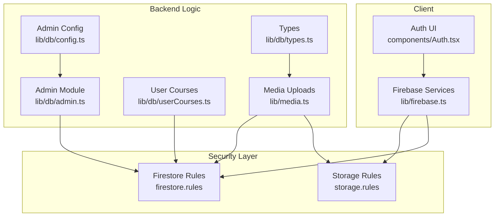
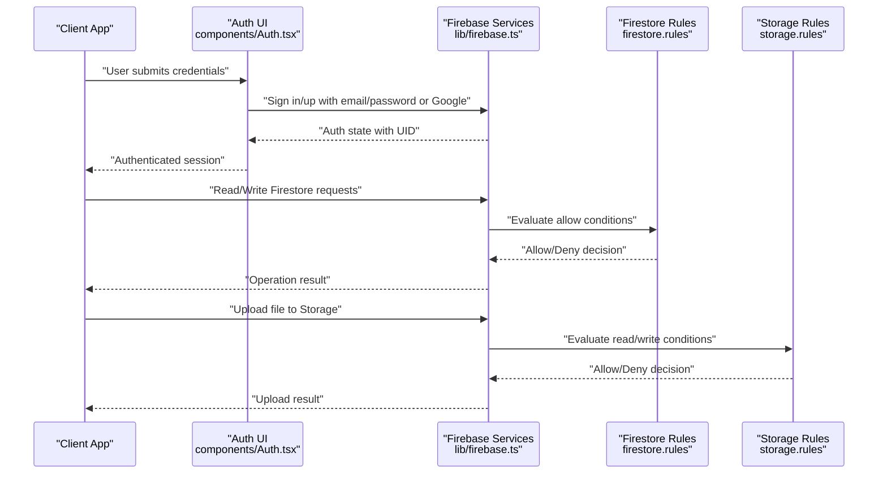
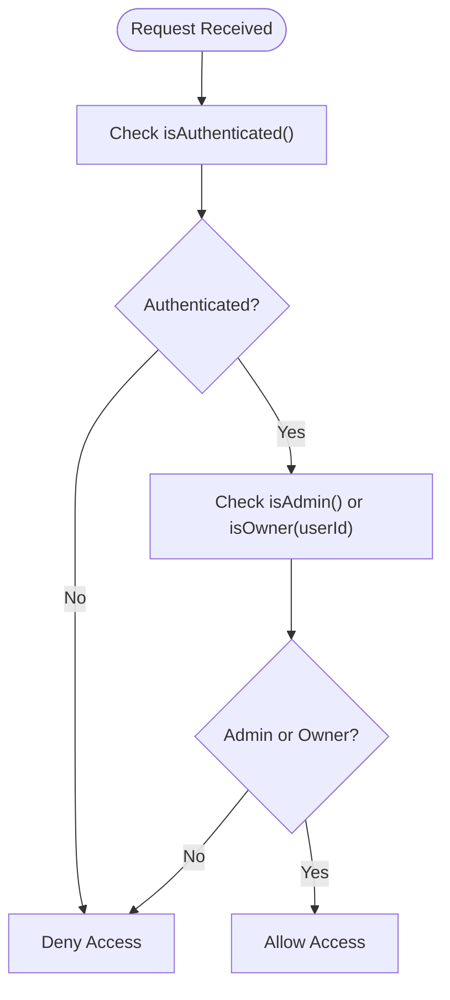
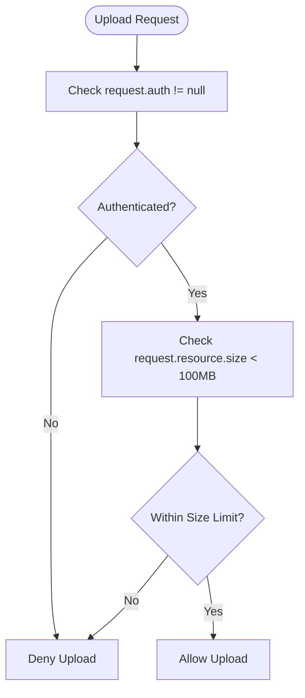
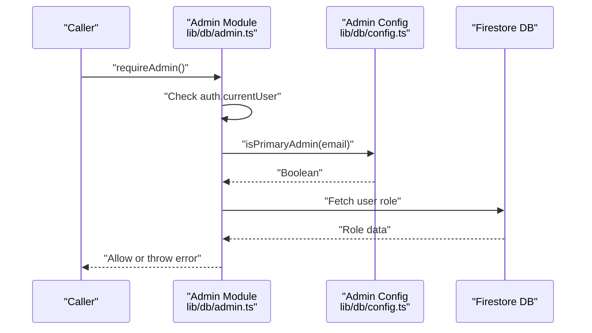
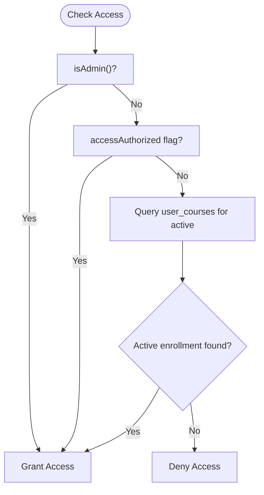
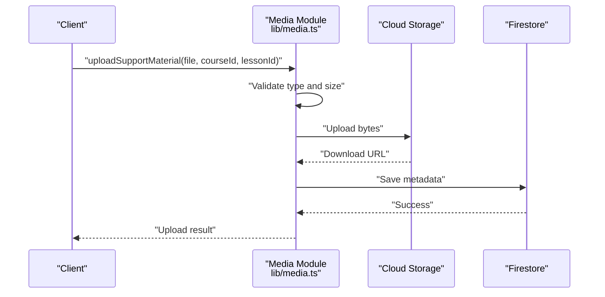
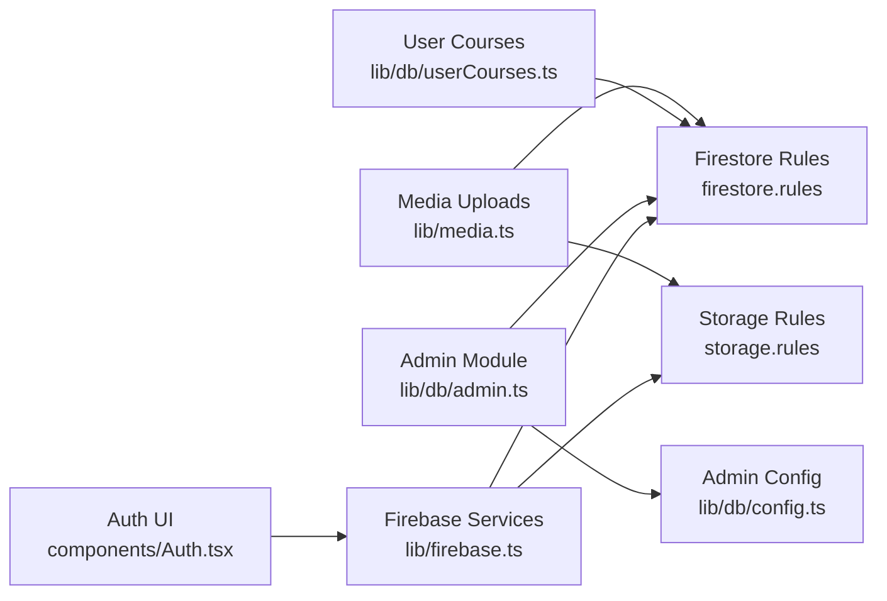

# Security Rules Implementation

<cite>
**Referenced Files in This Document**
- [firestore.rules](file://firestore.rules)
- [storage.rules](file://storage.rules)
- [firebase.ts](file://lib/firebase.ts)
- [config.ts](file://lib/db/config.ts)
- [admin.ts](file://lib/db/admin.ts)
- [userCourses.ts](file://lib/db/userCourses.ts)
- [media.ts](file://lib/media.ts)
- [types.ts](file://lib/db/types.ts)
- [Auth.tsx](file://components/Auth.tsx)
- [config.test.ts](file://test/db/config.test.ts)
</cite>

## Table of Contents
1. [Introduction](#introduction)
2. [Project Structure](#project-structure)
3. [Core Components](#core-components)
4. [Architecture Overview](#architecture-overview)
5. [Detailed Component Analysis](#detailed-component-analysis)
6. [Dependency Analysis](#dependency-analysis)
7. [Performance Considerations](#performance-considerations)
8. [Troubleshooting Guide](#troubleshooting-guide)
9. [Conclusion](#conclusion)

## Introduction
This document explains the security model implemented for Firestore and Cloud Storage in the project. It covers rule syntax, conditional logic, and permission patterns for different user roles (student, admin, primary admin). It documents read/write permissions per collection, field-level security, and data validation rules. It also includes examples of authenticated access, role-based restrictions, content moderation controls, user ownership verification, admin privilege escalation, and data isolation between users. Finally, it provides troubleshooting guidance for permission denied errors and testing strategies for security rules.

## Project Structure
Security is enforced at two layers:
- Firestore security rules define fine-grained access control for collections and documents.
- Cloud Storage security rules enforce authenticated access and size limits for uploads.

The client initializes Firebase services and authenticates users. Role-based checks are centralized in the database module, which also manages admin email lists and user access control.

**Diagram sources**
- [Auth.tsx](file://components/Auth.tsx#L1-L265)
- [firebase.ts](file://lib/firebase.ts#L1-L25)
- [firestore.rules](file://firestore.rules#L1-L97)
- [storage.rules](file://storage.rules#L1-L11)
- [config.ts](file://lib/db/config.ts#L1-L19)
- [admin.ts](file://lib/db/admin.ts#L1-L307)
- [userCourses.ts](file://lib/db/userCourses.ts#L1-L112)
- [media.ts](file://lib/media.ts#L1-L369)
- [types.ts](file://lib/db/types.ts#L1-L90)

**Section sources**
- [firestore.rules](file://firestore.rules#L1-L97)
- [storage.rules](file://storage.rules#L1-L11)
- [firebase.ts](file://lib/firebase.ts#L1-L25)
- [config.ts](file://lib/db/config.ts#L1-L19)
- [admin.ts](file://lib/db/admin.ts#L1-L307)
- [userCourses.ts](file://lib/db/userCourses.ts#L1-L112)
- [media.ts](file://lib/media.ts#L1-L369)
- [types.ts](file://lib/db/types.ts#L1-L90)
- [Auth.tsx](file://components/Auth.tsx#L1-L265)

## Core Components
- Firestore Rules Engine
  - Provides helpers for authentication, admin checks, and ownership verification.
  - Enforces read/write policies per collection and documents.
  - Includes a catch-all deny for undefined paths.

- Cloud Storage Rules Engine
  - Requires authenticated users for read/write.
  - Limits upload size to prevent abuse.

- Admin Management
  - Centralizes admin email lists and role resolution.
  - Enforces admin-only operations via requireAdmin().
  - Supports dynamic promotion/removal of admins and access control for students.

- Access Control for Collections
  - Users: read by authenticated; create/update/delete restricted by ownership or admin.
  - Admin Emails: read/write restricted to admins.
  - Courses, Mindful Flow, Music: read open to authenticated; write restricted to admins.
  - Student Completions: read and create open to authenticated; update/delete restricted to admins.
  - Student Progress: read/write allowed for owners or admins.
  - Student Activities: read/create controlled by ownership or admin; update/delete restricted to admins.
  - Achievements: read open to authenticated; write restricted to admins.
  - User Courses: read allows owners or admins; create/update allowed for authenticated; delete restricted to admins.

- Field-Level Security and Validation
  - Ownership checks ensure users can only modify their own progress and activities.
  - Admin bypass allows privileged users to manage content and access records.
  - Size limits in storage rules prevent oversized uploads.

**Section sources**
- [firestore.rules](file://firestore.rules#L5-L94)
- [storage.rules](file://storage.rules#L4-L8)
- [admin.ts](file://lib/db/admin.ts#L6-L22)
- [config.ts](file://lib/db/config.ts#L1-L19)

## Architecture Overview
The security architecture combines server-side Firestore rules with client-side authentication and admin enforcement. Admin privileges can be granted via email lists or a primary admin fallback. Storage access is strictly limited to authenticated users with size constraints.

**Diagram sources**
- [Auth.tsx](file://components/Auth.tsx#L21-L92)
- [firebase.ts](file://lib/firebase.ts#L1-L25)
- [firestore.rules](file://firestore.rules#L1-L97)
- [storage.rules](file://storage.rules#L1-L11)

## Detailed Component Analysis

### Firestore Security Rules
- Helpers
  - isAuthenticated(): Ensures a user is signed in.
  - isAdmin(): Checks role field or primary admin email.
  - isOwner(userId): Confirms the requesting user owns the target document.

- Collection Policies
  - Users: Read allowed to authenticated; create/update allowed by owner; delete allowed by admin.
  - Admin Emails: Read/Write restricted to admins.
  - Courses, Mindful Flow, Music: Read allowed to authenticated; Write restricted to admins.
  - Student Completions: Read and create allowed to authenticated; update/delete restricted to admins.
  - Student Progress: Read/Write allowed to owners or admins.
  - Student Activities: Read/Create controlled by ownership or admin; update/delete restricted to admins.
  - Achievements: Read allowed to authenticated; Write restricted to admins.
  - User Courses: Read allows owners or admins; Create/Update allowed to authenticated; Delete restricted to admins.

- Default Deny
  - Any path not explicitly matched is denied.

**Diagram sources**
- [firestore.rules](file://firestore.rules#L5-L21)
- [firestore.rules](file://firestore.rules#L23-L94)

**Section sources**
- [firestore.rules](file://firestore.rules#L5-L94)

### Cloud Storage Access Control
- Read requires authenticated users.
- Write requires authenticated users and enforces a 100 MB size limit.
- Media upload logic validates file types and sizes before uploading.

**Diagram sources**
- [storage.rules](file://storage.rules#L4-L8)
- [media.ts](file://lib/media.ts#L314-L332)

**Section sources**
- [storage.rules](file://storage.rules#L4-L8)
- [media.ts](file://lib/media.ts#L314-L332)

### Role-Based Access Control and Admin Privileges
- Admin Email Lists
  - Primary admin email and secondary admin emails are centrally managed.
  - Case-insensitive checks ensure robust matching.

- Admin Enforcement
  - requireAdmin(): Throws if caller is not authenticated or lacks admin role.
  - Used for sensitive operations like promoting/removing admins, granting/revoke access, and managing content.

- Role Assignment
  - New users receive role based on admin email list; admins are auto-authorized.
  - Students may be authorized via explicit flags or active course access.

**Diagram sources**
- [admin.ts](file://lib/db/admin.ts#L6-L22)
- [config.ts](file://lib/db/config.ts#L8-L9)

**Section sources**
- [admin.ts](file://lib/db/admin.ts#L6-L22)
- [config.ts](file://lib/db/config.ts#L1-L19)

### User Courses and Access Control
- Access Mapping
  - user_courses documents link users to courses with status and source.
  - Read allowed for owners or admins; create/update allowed for authenticated; delete restricted to admins.

- Access Verification
  - hasCourseAccess() and hasAnyCourseAccess() query active enrollments.
  - checkUserAccess() consolidates authorization via flags or active courses.

**Diagram sources**
- [firestore.rules](file://firestore.rules#L78-L89)
- [admin.ts](file://lib/db/admin.ts#L85-L127)
- [userCourses.ts](file://lib/db/userCourses.ts#L89-L99)

**Section sources**
- [firestore.rules](file://firestore.rules#L78-L89)
- [admin.ts](file://lib/db/admin.ts#L85-L127)
- [userCourses.ts](file://lib/db/userCourses.ts#L89-L99)

### Media Uploads and Content Moderation Controls
- Upload Flow
  - Validates inputs and file type.
  - Enforces size limits (e.g., support materials max 50 MB).
  - Stores metadata in Firestore and uploads binary to Storage.

- Moderation Controls
  - Storage rules restrict uploads to authenticated users.
  - Admins can manage content and access records to moderate usage.

**Diagram sources**
- [media.ts](file://lib/media.ts#L301-L368)
- [storage.rules](file://storage.rules#L4-L8)

**Section sources**
- [media.ts](file://lib/media.ts#L301-L368)
- [storage.rules](file://storage.rules#L4-L8)

## Dependency Analysis
- Authentication and Initialization
  - Client initializes Firebase services and relies on auth state for security decisions.
- Admin Dependencies
  - Admin enforcement depends on auth.currentUser and Firestore user documents.
  - Admin email lists are used to derive roles and privileges.
- Collection Dependencies
  - User Courses depend on user roles and access flags.
  - Media uploads depend on Storage rules and Firestore metadata.

**Diagram sources**
- [Auth.tsx](file://components/Auth.tsx#L1-L265)
- [firebase.ts](file://lib/firebase.ts#L1-L25)
- [firestore.rules](file://firestore.rules#L1-L97)
- [storage.rules](file://storage.rules#L1-L11)
- [admin.ts](file://lib/db/admin.ts#L1-L307)
- [config.ts](file://lib/db/config.ts#L1-L19)
- [userCourses.ts](file://lib/db/userCourses.ts#L1-L112)
- [media.ts](file://lib/media.ts#L1-L369)

**Section sources**
- [Auth.tsx](file://components/Auth.tsx#L1-L265)
- [firebase.ts](file://lib/firebase.ts#L1-L25)
- [admin.ts](file://lib/db/admin.ts#L1-L307)
- [userCourses.ts](file://lib/db/userCourses.ts#L1-L112)
- [media.ts](file://lib/media.ts#L1-L369)

## Performance Considerations
- Rule Evaluation
  - Prefer simple boolean helpers and avoid deep nested get() calls in hot paths.
  - Keep collection-specific rules concise to minimize evaluation overhead.
- Storage Uploads
  - Enforce size limits client-side to reduce failed uploads and wasted bandwidth.
  - Use resumable uploads for large files to improve reliability.
- Access Queries
  - Use targeted queries with where clauses to limit document reads for access checks.

## Troubleshooting Guide
- Permission Denied Errors
  - Verify authentication: ensure the client is signed in and auth state is present.
  - Check role: confirm the user’s role is stored and accessible in Firestore.
  - Review collection rules: ensure the requested operation is permitted for the user’s role.
  - Validate ownership: for owner-restricted paths, confirm the document’s userId matches the authenticated UID.
  - Confirm admin privileges: for admin-only operations, verify the user meets admin criteria (role or primary admin email).

- Storage Upload Issues
  - Unauthorized errors: ensure the user is authenticated and Storage rules allow write.
  - CORS errors: configure CORS for the bucket or adjust Storage rules to permit uploads.
  - Size limits: verify the file size complies with the configured limits.

- Testing Strategies
  - Unit tests for admin configuration helpers to validate case-insensitive email checks.
  - Integration tests to simulate authenticated and admin operations against Firestore rules.
  - E2E tests to verify upload flows and access control in real-time.

**Section sources**
- [config.test.ts](file://test/db/config.test.ts#L1-L26)
- [storage.rules](file://storage.rules#L4-L8)
- [media.ts](file://lib/media.ts#L54-L77)

## Conclusion
The project implements a layered security model combining Firestore and Cloud Storage rules with centralized admin management. Role-based access control ensures that students can access curated content while admins maintain broad privileges for content and access management. Ownership checks and default denies protect user data and isolate access between users. By following the documented patterns and troubleshooting steps, developers can maintain secure and reliable access control across the platform.