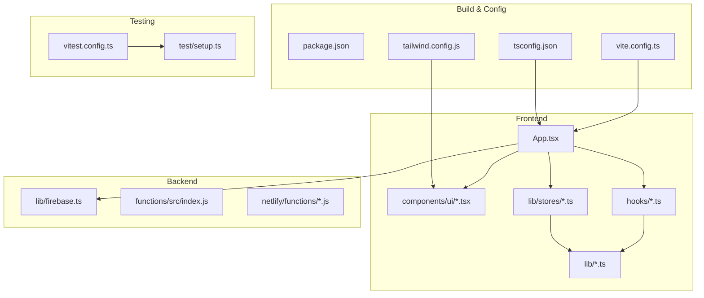
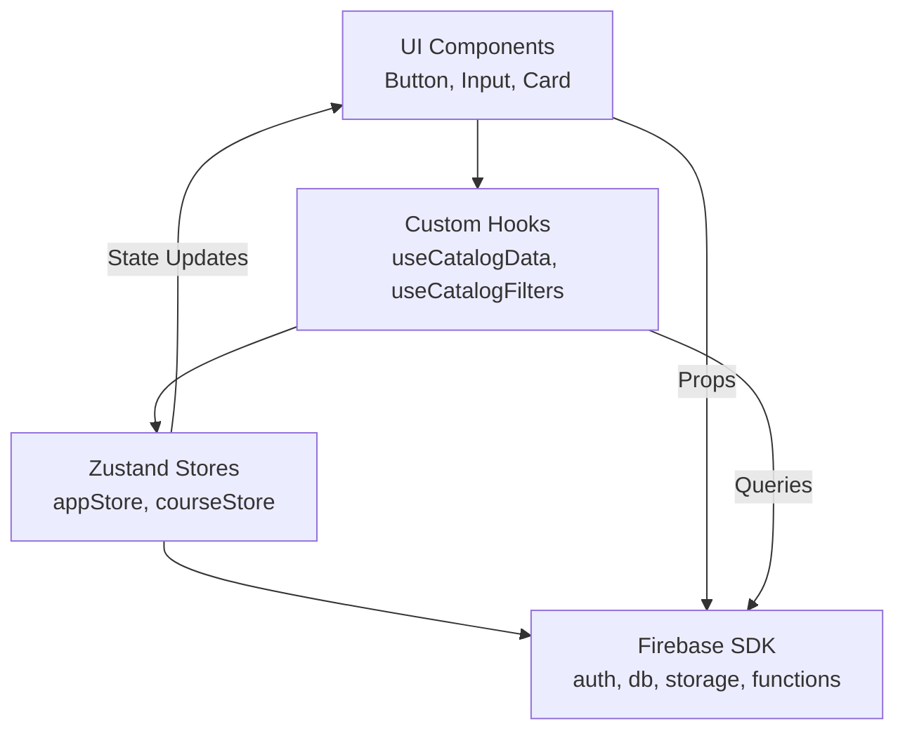
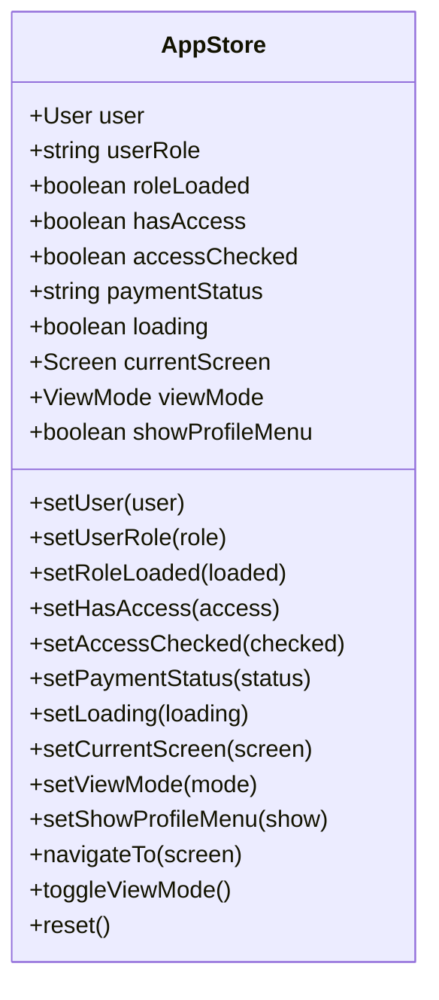
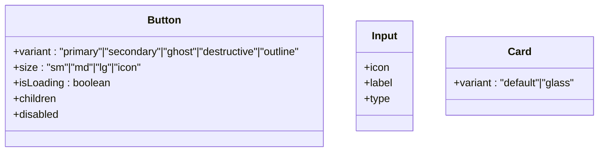
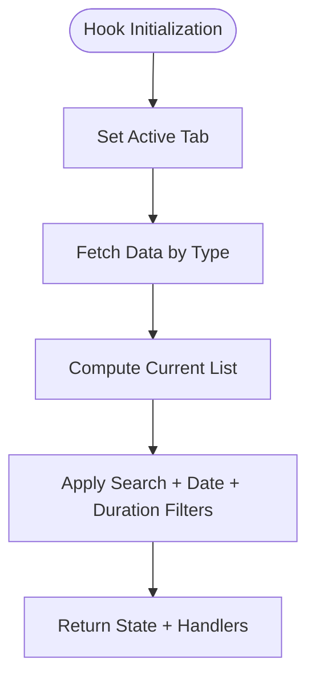
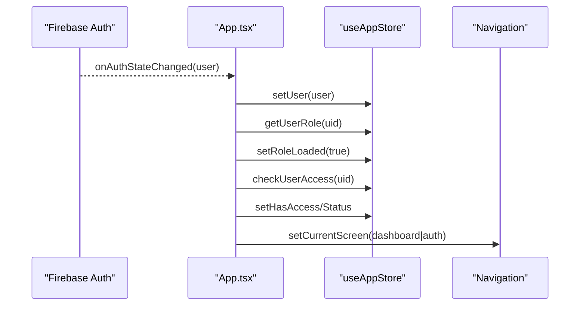
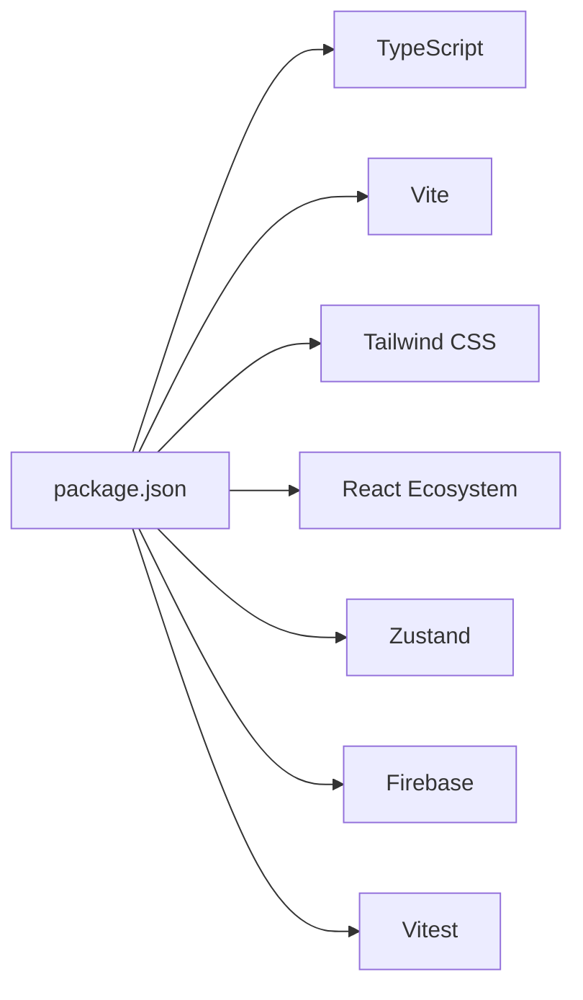

# Development Guidelines

<cite>
**Referenced Files in This Document**
- [package.json](file://package.json)
- [tsconfig.json](file://tsconfig.json)
- [vite.config.ts](file://vite.config.ts)
- [tailwind.config.js](file://tailwind.config.js)
- [README.md](file://README.md)
- [App.tsx](file://App.tsx)
- [lib/firebase.ts](file://lib/firebase.ts)
- [lib/stores/appStore.ts](file://lib/stores/appStore.ts)
- [hooks/useCatalogData.ts](file://hooks/useCatalogData.ts)
- [hooks/useCatalogFilters.ts](file://hooks/useCatalogFilters.ts)
- [components/ui/Button.tsx](file://components/ui/Button.tsx)
- [components/ui/Input.tsx](file://components/ui/Input.tsx)
- [components/ui/Card.tsx](file://components/ui/Card.tsx)
- [test/setup.ts](file://test/setup.ts)
- [vitest.config.ts](file://vitest.config.ts)
</cite>

## Table of Contents
1. [Introduction](#introduction)
2. [Project Structure](#project-structure)
3. [Core Components](#core-components)
4. [Architecture Overview](#architecture-overview)
5. [Detailed Component Analysis](#detailed-component-analysis)
6. [Dependency Analysis](#dependency-analysis)
7. [Performance Considerations](#performance-considerations)
8. [Troubleshooting Guide](#troubleshooting-guide)
9. [Conclusion](#conclusion)
10. [Appendices](#appendices)

## Introduction
This document provides comprehensive development guidelines and best practices for contributing to Fluentoria. It covers code style standards, TypeScript configuration, component development patterns, state management, performance optimization, architectural decisions, testing, code review processes, documentation standards, and development workflow. The goal is to ensure consistent, maintainable, and scalable contributions aligned with the project’s design system and performance goals.

## Project Structure
Fluentoria is a React application built with Vite and TypeScript, styled with Tailwind CSS and a custom design system. State is managed with Zustand stores, and authentication and persistence are handled by Firebase. The repository is organized by feature and domain:
- components: Feature-specific React components, including UI primitives under ui/
- hooks: Custom React hooks encapsulating data fetching and filtering logic
- lib: Shared libraries for Firebase, stores, utilities, and domain logic
- functions/netlify/functions: Backend/cloud functions
- test: Unit tests with Vitest and JSDOM
- Root configs: package.json, tsconfig.json, vite.config.ts, tailwind.config.js

**Diagram sources**
- [App.tsx](file://App.tsx#L1-L449)
- [lib/firebase.ts](file://lib/firebase.ts#L1-L25)
- [lib/stores/appStore.ts](file://lib/stores/appStore.ts#L1-L82)
- [hooks/useCatalogData.ts](file://hooks/useCatalogData.ts#L1-L157)
- [hooks/useCatalogFilters.ts](file://hooks/useCatalogFilters.ts#L1-L86)
- [components/ui/Button.tsx](file://components/ui/Button.tsx#L1-L49)
- [components/ui/Input.tsx](file://components/ui/Input.tsx#L1-L40)
- [components/ui/Card.tsx](file://components/ui/Card.tsx#L1-L24)
- [package.json](file://package.json#L1-L44)
- [tsconfig.json](file://tsconfig.json#L1-L30)
- [vite.config.ts](file://vite.config.ts#L1-L33)
- [tailwind.config.js](file://tailwind.config.js#L1-L72)
- [vitest.config.ts](file://vitest.config.ts#L1-L19)
- [test/setup.ts](file://test/setup.ts#L1-L2)

**Section sources**
- [README.md](file://README.md#L1-L41)
- [package.json](file://package.json#L1-L44)
- [tsconfig.json](file://tsconfig.json#L1-L30)
- [vite.config.ts](file://vite.config.ts#L1-L33)
- [tailwind.config.js](file://tailwind.config.js#L1-L72)

## Core Components
- App shell and routing: Implements lazy-loaded routes, authentication state synchronization, navigation, and PWA shortcut handling.
- UI primitives: Reusable components (Button, Input, Card) designed with the project’s design tokens and Tailwind utilities.
- Custom hooks: Encapsulate catalog data fetching and filtering logic, enabling separation of concerns and testability.
- State stores: Centralized state via Zustand for user, navigation, and UI flags.
- Firebase integration: Centralized initialization and exports for auth, Firestore, Storage, and Functions.

Key patterns:
- Composition over inheritance: UI components accept props and render children.
- Forward refs for DOM access where needed.
- Memoization via useMemo/useCallback to optimize rendering and reduce unnecessary re-renders.
- Suspense boundaries for graceful loading during code-split route transitions.

**Section sources**
- [App.tsx](file://App.tsx#L1-L449)
- [components/ui/Button.tsx](file://components/ui/Button.tsx#L1-L49)
- [components/ui/Input.tsx](file://components/ui/Input.tsx#L1-L40)
- [components/ui/Card.tsx](file://components/ui/Card.tsx#L1-L24)
- [hooks/useCatalogData.ts](file://hooks/useCatalogData.ts#L1-L157)
- [hooks/useCatalogFilters.ts](file://hooks/useCatalogFilters.ts#L1-L86)
- [lib/stores/appStore.ts](file://lib/stores/appStore.ts#L1-L82)
- [lib/firebase.ts](file://lib/firebase.ts#L1-L25)

## Architecture Overview
The application follows a layered architecture:
- Presentation layer: React components and UI primitives
- Domain layer: Hooks and stores encapsulating business logic
- Infrastructure layer: Firebase SDK for auth, Firestore, Storage, and Functions
- Build and tooling: Vite, TypeScript, Tailwind, Vitest

**Diagram sources**
- [App.tsx](file://App.tsx#L1-L449)
- [lib/stores/appStore.ts](file://lib/stores/appStore.ts#L1-L82)
- [hooks/useCatalogData.ts](file://hooks/useCatalogData.ts#L1-L157)
- [hooks/useCatalogFilters.ts](file://hooks/useCatalogFilters.ts#L1-L86)
- [lib/firebase.ts](file://lib/firebase.ts#L1-L25)

## Detailed Component Analysis

### State Management with Zustand
- Central store pattern: Define a single store with typed actions and selectors.
- Minimal state shape: Keep state flat and granular to avoid deep updates.
- Derived state: Compute derived values from the store to prevent recomputation.
- Store reset: Provide a reset action for cleanup during logout or navigation.

**Diagram sources**
- [lib/stores/appStore.ts](file://lib/stores/appStore.ts#L1-L82)

**Section sources**
- [lib/stores/appStore.ts](file://lib/stores/appStore.ts#L1-L82)
- [App.tsx](file://App.tsx#L40-L108)

### UI Primitive Patterns (Button, Input, Card)
- Props-first design: Variants and sizes are controlled via props with sensible defaults.
- Utility-first styling: Use shared utility functions and Tailwind classes aligned with the design system.
- Accessibility: Respect disabled states and forward refs for focus management.
- Icon support: Inputs support optional icons for enhanced UX.

**Diagram sources**
- [components/ui/Button.tsx](file://components/ui/Button.tsx#L1-L49)
- [components/ui/Input.tsx](file://components/ui/Input.tsx#L1-L40)
- [components/ui/Card.tsx](file://components/ui/Card.tsx#L1-L24)

**Section sources**
- [components/ui/Button.tsx](file://components/ui/Button.tsx#L1-L49)
- [components/ui/Input.tsx](file://components/ui/Input.tsx#L1-L40)
- [components/ui/Card.tsx](file://components/ui/Card.tsx#L1-L24)

### Data Fetching and Filtering Hooks
- Separation of concerns: useCatalogData manages CRUD operations and lists; useCatalogFilters handles search and filters.
- Memoization: useMemo for derived filtered lists; useCallback for handlers to prevent re-renders.
- Side effects: useEffect orchestrates data loading based on active tabs.
- Form orchestration: Editing/viewing modes and confirm dialogs for deletions.

**Diagram sources**
- [hooks/useCatalogData.ts](file://hooks/useCatalogData.ts#L1-L157)
- [hooks/useCatalogFilters.ts](file://hooks/useCatalogFilters.ts#L1-L86)

**Section sources**
- [hooks/useCatalogData.ts](file://hooks/useCatalogData.ts#L1-L157)
- [hooks/useCatalogFilters.ts](file://hooks/useCatalogFilters.ts#L1-L86)

### Authentication and Navigation Flow
- Auth state sync: onAuthStateChanged updates user, role, and access flags.
- Access control: Unauthorized users are blocked except for admins.
- Navigation: Zustand-driven navigation with scroll-to-top behavior.
- PWA shortcuts: URL param parsing triggers navigation to specific screens.

**Diagram sources**
- [App.tsx](file://App.tsx#L65-L108)
- [lib/stores/appStore.ts](file://lib/stores/appStore.ts#L48-L81)
- [lib/firebase.ts](file://lib/firebase.ts#L1-L25)

**Section sources**
- [App.tsx](file://App.tsx#L65-L108)
- [lib/stores/appStore.ts](file://lib/stores/appStore.ts#L48-L81)
- [lib/firebase.ts](file://lib/firebase.ts#L1-L25)

## Dependency Analysis
- Frontend dependencies: React 19, React DOM, Tailwind Merge, clsx, lucide-react, recharts, zustand, firebase.
- Dev dependencies: TypeScript ~5.8, Vite, Tailwind CSS v4, React plugin, Vitest, jsdom, puppeteer, sharp.
- Build and toolchain: Vite config defines aliases, environment injection, and HMR; Tailwind config extends design tokens and spacing scales.

**Diagram sources**
- [package.json](file://package.json#L1-L44)
- [tsconfig.json](file://tsconfig.json#L1-L30)
- [vite.config.ts](file://vite.config.ts#L1-L33)
- [tailwind.config.js](file://tailwind.config.js#L1-L72)

**Section sources**
- [package.json](file://package.json#L1-L44)
- [tsconfig.json](file://tsconfig.json#L1-L30)
- [vite.config.ts](file://vite.config.ts#L1-L33)
- [tailwind.config.js](file://tailwind.config.js#L1-L72)

## Performance Considerations
- Code splitting: Route components are lazy-loaded with Suspense fallbacks to improve initial load performance.
- Memoization: Prefer useMemo/useCallback in hooks to avoid unnecessary renders.
- Rendering: Keep components pure; minimize heavy computations in render paths.
- State granularity: Use small, focused Zustand slices to reduce re-renders.
- Styling: Leverage Tailwind utilities and CSS variables to avoid runtime style calculations.
- Assets: Optimize images and media assets; consider lazy-loading non-critical resources.
- Dev server: HMR and polling are configured for reliable development experience.

[No sources needed since this section provides general guidance]

## Troubleshooting Guide
Common issues and resolutions:
- Authentication state not updating:
  - Verify Firebase credentials are present in environment variables.
  - Confirm onAuthStateChanged subscriptions are active and unsubscribed on unmount.
- Unauthorized access screen appears:
  - Check access checks and payment status updates in the store.
  - Ensure admin email overrides are applied when necessary.
- UI not reflecting design tokens:
  - Confirm Tailwind content paths include component files.
  - Validate color and spacing scales in the Tailwind config.
- Tests failing in JSDOM:
  - Ensure setup files are loaded and match Vitest configuration.
  - Verify environment variables are injected via Vite define.

**Section sources**
- [lib/firebase.ts](file://lib/firebase.ts#L1-L25)
- [App.tsx](file://App.tsx#L65-L108)
- [lib/stores/appStore.ts](file://lib/stores/appStore.ts#L48-L81)
- [tailwind.config.js](file://tailwind.config.js#L1-L72)
- [vitest.config.ts](file://vitest.config.ts#L1-L19)
- [test/setup.ts](file://test/setup.ts#L1-L2)

## Conclusion
These guidelines establish a consistent foundation for building, testing, and maintaining Fluentoria. By adhering to the component composition patterns, state management best practices, and performance recommendations outlined here, contributors can deliver robust, scalable features aligned with the project’s design system and architecture.

[No sources needed since this section summarizes without analyzing specific files]

## Appendices

### A. Code Style Standards
- TypeScript
  - Strict compiler options enabled; isolated modules and bundler resolution for modern builds.
  - JSX transform set to react-jsx; path aliases configured for clean imports.
- React
  - Prefer functional components with hooks; forward refs for imperative DOM access.
  - Use explicit prop typing and defaults; avoid excessive inline styles.
- Styling
  - Use Tailwind utilities and design tokens; avoid ad-hoc CSS.
  - Keep class names concise and semantic; group related utilities.

**Section sources**
- [tsconfig.json](file://tsconfig.json#L1-L30)
- [vite.config.ts](file://vite.config.ts#L1-L33)
- [tailwind.config.js](file://tailwind.config.js#L1-L72)

### B. Component Development Patterns
- Primitive components: Accept props for variant, size, and state; expose ref forwarding.
- Container components: Orchestrate data fetching, state, and child component composition.
- Hooks: Encapsulate side effects and derived logic; export typed handlers and state.
- Stores: Keep state minimal; compute derived values; provide reset actions.

**Section sources**
- [components/ui/Button.tsx](file://components/ui/Button.tsx#L1-L49)
- [components/ui/Input.tsx](file://components/ui/Input.tsx#L1-L40)
- [components/ui/Card.tsx](file://components/ui/Card.tsx#L1-L24)
- [hooks/useCatalogData.ts](file://hooks/useCatalogData.ts#L1-L157)
- [hooks/useCatalogFilters.ts](file://hooks/useCatalogFilters.ts#L1-L86)
- [lib/stores/appStore.ts](file://lib/stores/appStore.ts#L1-L82)

### C. Testing Requirements
- Test runner: Vitest with jsdom environment.
- Setup: Global setup file registers testing utilities.
- Coverage: Include unit tests for hooks, stores, and small components.
- Mocks: Isolate external dependencies (e.g., Firebase) in tests.

**Section sources**
- [vitest.config.ts](file://vitest.config.ts#L1-L19)
- [test/setup.ts](file://test/setup.ts#L1-L2)

### D. Code Review and Documentation Standards
- Review checklist
  - Correctness: Does the change address the intended problem?
  - Performance: Are memoization and rendering optimized?
  - Accessibility: Are focus and keyboard interactions preserved?
  - Tests: Are new or modified logic covered?
  - Documentation: Are changes reflected in relevant docs?
- Documentation
  - Keep README and inline comments up to date.
  - Add component usage examples where helpful.

[No sources needed since this section provides general guidance]

### E. Development Workflow and Branch Management
- Branching
  - Feature branches per task; prefix with feature/, fix/, chore/.
  - Rebase before merge to keep history linear.
- Commit hygiene
  - Clear, imperative commit messages; reference issues.
- CI/CD
  - Run tests locally before pushing.
  - Ensure build succeeds in CI environments.

[No sources needed since this section provides general guidance]

### F. Debugging and Profiling
- Browser devtools
  - React DevTools for component tree and hooks inspection.
  - Network tab for API and asset loading diagnostics.
- Logging
  - Use structured logs for auth and navigation flows.
- Profiling
  - Use React Profiler to identify expensive renders.
  - Measure bundle size with Vite’s build analyzer.

[No sources needed since this section provides general guidance]