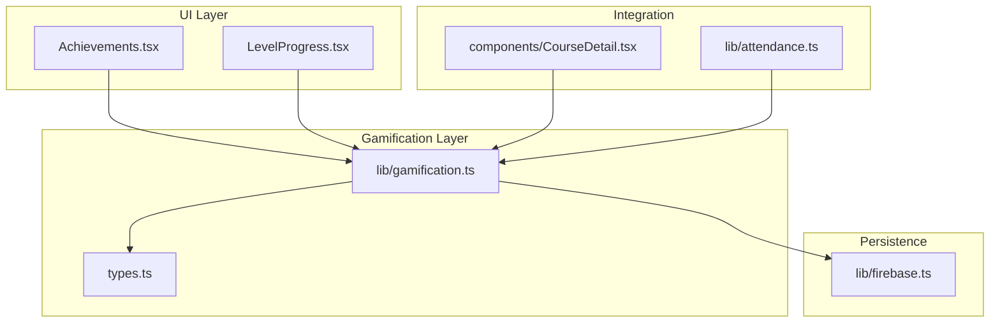
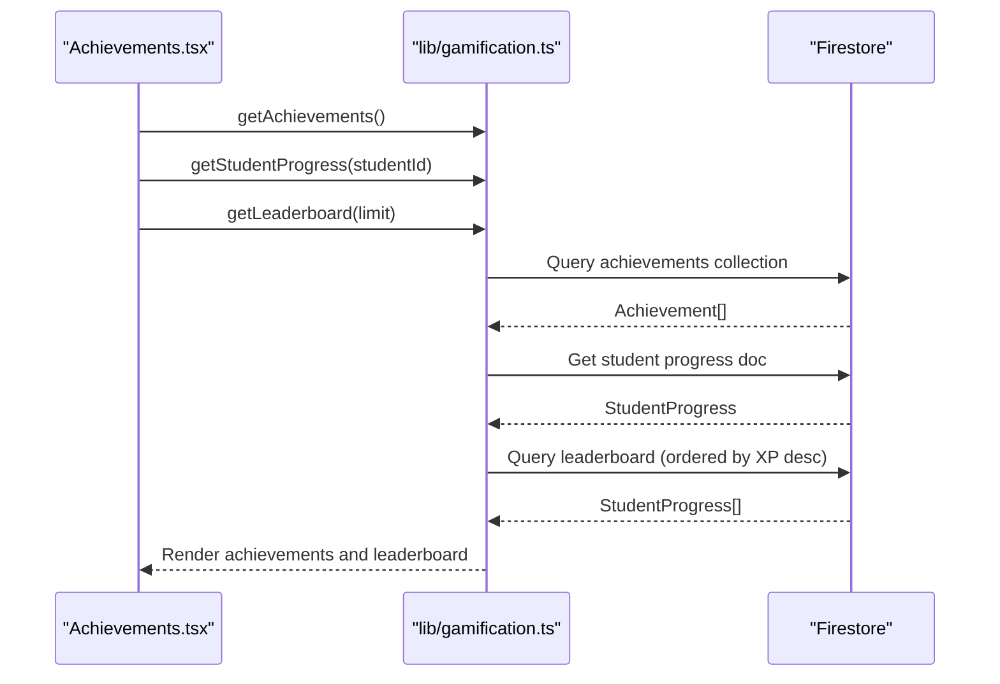
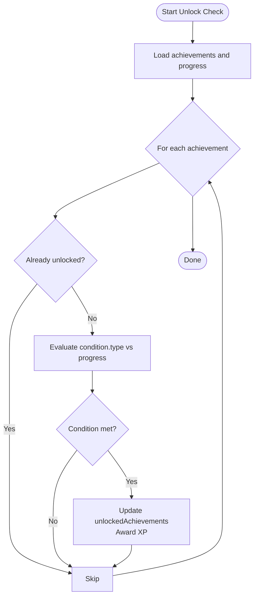
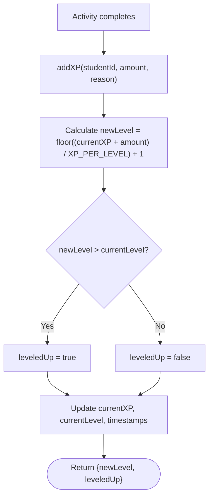
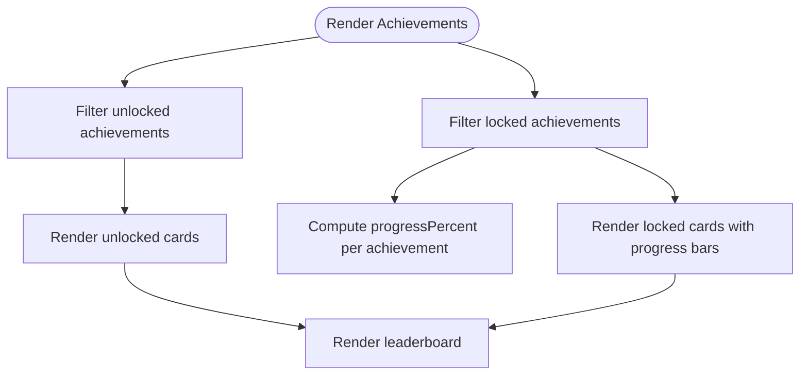
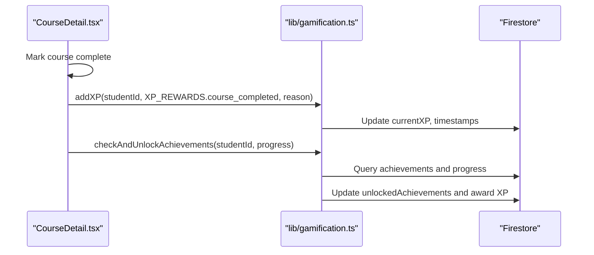
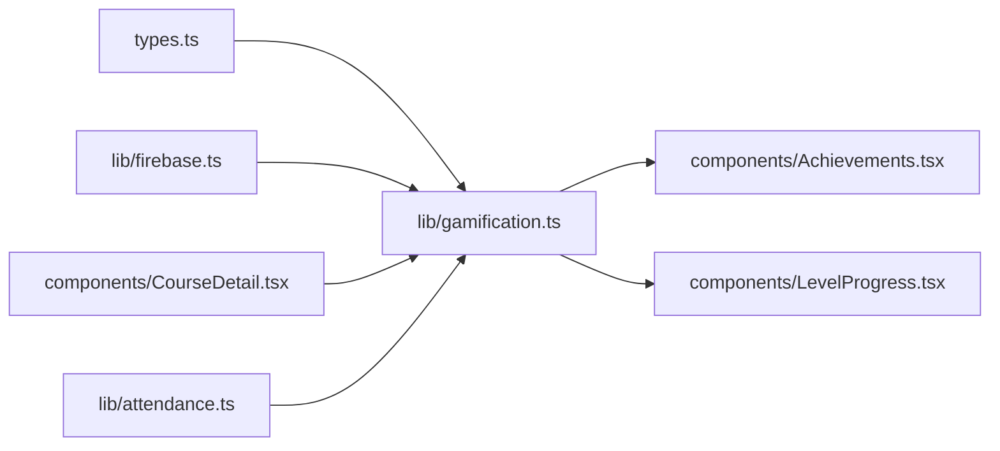

# Achievement System

<cite>
**Referenced Files in This Document**
- [Achievements.tsx](file://components/Achievements.tsx)
- [gamification.ts](file://lib/gamification.ts)
- [types.ts](file://types.ts)
- [firebase.ts](file://lib/firebase.ts)
- [LevelProgress.tsx](file://components/LevelProgress.tsx)
- [CourseDetail.tsx](file://components/CourseDetail.tsx)
- [attendance.ts](file://lib/attendance.ts)
</cite>

## Table of Contents
1. [Introduction](#introduction)
2. [Project Structure](#project-structure)
3. [Core Components](#core-components)
4. [Architecture Overview](#architecture-overview)
5. [Detailed Component Analysis](#detailed-component-analysis)
6. [Dependency Analysis](#dependency-analysis)
7. [Performance Considerations](#performance-considerations)
8. [Troubleshooting Guide](#troubleshooting-guide)
9. [Conclusion](#conclusion)

## Introduction
This document explains the achievement system that powers learning recognition and motivation in the platform. It covers the data model for achievements and student progress, unlock criteria across four achievement types, XP reward mechanisms, configuration options, progress calculation algorithms, and UI components for displaying unlocked versus locked achievements. It also details how achievements integrate with student progress tracking, the relationship between learning milestones and achievement triggers, and the behavioral psychology principles applied.

## Project Structure
The achievement system spans UI components, a gamification library, and shared types. Key areas:
- UI: Achievement display and leaderboard rendering
- Library: Achievement definition, unlock logic, XP calculations, progress persistence
- Types: Shared data contracts for achievements and progress
- Firebase: Persistence layer for achievements and student progress
- Integration: Course completion and streak tracking feed into achievement checks

**Diagram sources**
- [Achievements.tsx](file://components/Achievements.tsx#L1-L346)
- [gamification.ts](file://lib/gamification.ts#L1-L349)
- [types.ts](file://types.ts#L95-L125)
- [firebase.ts](file://lib/firebase.ts#L1-L25)
- [LevelProgress.tsx](file://components/LevelProgress.tsx#L1-L73)
- [CourseDetail.tsx](file://components/CourseDetail.tsx#L129-L146)
- [attendance.ts](file://lib/attendance.ts#L125-L161)

**Section sources**
- [Achievements.tsx](file://components/Achievements.tsx#L1-L346)
- [gamification.ts](file://lib/gamification.ts#L1-L349)
- [types.ts](file://types.ts#L95-L125)
- [firebase.ts](file://lib/firebase.ts#L1-L25)
- [LevelProgress.tsx](file://components/LevelProgress.tsx#L1-L73)
- [CourseDetail.tsx](file://components/CourseDetail.tsx#L129-L146)
- [attendance.ts](file://lib/attendance.ts#L125-L161)

## Core Components
- Achievement data model: Defines title, description, icon, XP reward, and condition with type and threshold.
- StudentProgress model: Tracks XP, level, course completions, study hours, current/longest streak, and unlocked achievements.
- Achievement configuration: Stored in Firestore under the achievements collection; defaults are provided for seeding.
- Unlock logic: Checks progress against achievement conditions and unlocks upon meeting thresholds.
- XP system: Fixed XP per activity, level calculation, and streak bonuses.
- UI rendering: Displays unlocked achievements with full styling, locked achievements with progress bars, and a leaderboard.

**Section sources**
- [types.ts](file://types.ts#L95-L125)
- [gamification.ts](file://lib/gamification.ts#L198-L275)
- [Achievements.tsx](file://components/Achievements.tsx#L34-L53)

## Architecture Overview
The system follows a layered architecture:
- UI components fetch achievements, student progress, and leaderboard data concurrently.
- The gamification library orchestrates unlock checks, XP awards, and progress updates.
- Firestore persists achievements and student progress.
- Integration points (course completion, streak tracking) trigger XP and subsequent achievement checks.

**Diagram sources**
- [Achievements.tsx](file://components/Achievements.tsx#L20-L32)
- [gamification.ts](file://lib/gamification.ts#L198-L302)

## Detailed Component Analysis

### Achievement Data Model
Achievement fields:
- id: Unique identifier
- title: Display name
- description: Explanation of the achievement
- icon: Emoji/icon for visual representation
- xpReward: XP awarded upon unlock
- condition: type and threshold defining unlock criteria

StudentProgress fields:
- Identifiers and timestamps
- currentXP, currentLevel
- totalCoursesCompleted, totalHoursStudied
- currentStreak, longestStreak
- unlockedAchievements: array of achievement IDs

Behavioral psychology principles:
- Mastery: Course count and hours studied achievements encourage sustained engagement.
- Consistency: Streak-based achievements reinforce habit formation.
- First Completion: Addresses the "completion gap" by rewarding initial participation.

**Section sources**
- [types.ts](file://types.ts#L95-L125)

### Achievement Types and Unlock Criteria
Supported achievement types:
- course_count: Unlocks when totalCoursesCompleted reaches threshold.
- streak_days: Unlocks when currentStreak reaches threshold.
- hours_studied: Unlocks when totalHoursStudied reaches threshold.
- first_course: Unlocks after completing at least one course (threshold 1).

Unlock algorithm:
- Fetch all achievements and current progress.
- For each achievement not yet unlocked, evaluate condition against progress.
- If condition met, persist achievement in unlockedAchievements and award XP.

**Diagram sources**
- [gamification.ts](file://lib/gamification.ts#L232-L275)

**Section sources**
- [gamification.ts](file://lib/gamification.ts#L232-L275)

### XP Reward Mechanisms
XP rewards and progression:
- Fixed XP per activity (e.g., course completion, mindful flow, lesson completion, media upload).
- Level calculation: currentLevel = floor(currentXP / XP_PER_LEVEL) + 1.
- XP for next level: XP_PER_LEVEL.
- Streak bonus: Every 7-day increment grants bonus XP.

**Diagram sources**
- [gamification.ts](file://lib/gamification.ts#L100-L129)

**Section sources**
- [gamification.ts](file://lib/gamification.ts#L8-L40)
- [gamification.ts](file://lib/gamification.ts#L100-L129)

### Progress Calculation and UI Rendering
Progress calculation for locked achievements:
- course_count: min((completed / threshold) * 100, 100)
- streak_days: min((currentStreak / threshold) * 100, 100)
- hours_studied: min((studied / threshold) * 100, 100)
- first_course: 100% if completed >= 1, else 0%

UI rendering:
- Unlocked achievements: Full color, XP badge, trophy indicator.
- Locked achievements: Grayscale icon, progress bar showing percentage, lock icon label.
- Leaderboard: Podium for top 3 with special styling and full table with position badges.

**Diagram sources**
- [Achievements.tsx](file://components/Achievements.tsx#L34-L53)
- [Achievements.tsx](file://components/Achievements.tsx#L115-L191)

**Section sources**
- [Achievements.tsx](file://components/Achievements.tsx#L34-L53)
- [Achievements.tsx](file://components/Achievements.tsx#L115-L191)

### Achievement Configuration System
Configuration options:
- Achievements stored in Firestore under the achievements collection.
- Defaults provided via getDefaultAchievements() for seeding.
- Admin settings include XP values and streak rules (in Settings UI), while achievement definitions live in Firestore.

Integration points:
- Course completion logs activity and awards XP, then triggers achievement checks.
- Streak tracking updates currentStreak and longestStreak; every 7-day increment awards bonus XP and may unlock streak achievements.

**Diagram sources**
- [CourseDetail.tsx](file://components/CourseDetail.tsx#L133-L140)
- [gamification.ts](file://lib/gamification.ts#L232-L275)

**Section sources**
- [gamification.ts](file://lib/gamification.ts#L198-L211)
- [gamification.ts](file://lib/gamification.ts#L305-L348)
- [CourseDetail.tsx](file://components/CourseDetail.tsx#L133-L140)
- [attendance.ts](file://lib/attendance.ts#L125-L161)

### Behavioral Psychology Principles Applied
- Variable reward schedule: Random XP and occasional streak bonuses maintain engagement.
- Mastery principle: Course count and hours studied achievements reward sustained effort.
- Social comparison: Leaderboard fosters healthy competition.
- Loss aversion: Locked achievements with visible progress motivate closure.
- Habit stacking: Streak achievements link daily actions to long-term goals.

[No sources needed since this section synthesizes principles without analyzing specific files]

## Dependency Analysis
Key dependencies and relationships:
- Achievements.tsx depends on gamification.ts for data retrieval and unlock checks.
- gamification.ts depends on types.ts for data contracts and firebase.ts for persistence.
- CourseDetail.tsx and attendance.ts feed progress data that triggers achievement checks.
- LevelProgress.tsx reuses gamification utilities for XP progress visualization.

**Diagram sources**
- [types.ts](file://types.ts#L95-L125)
- [gamification.ts](file://lib/gamification.ts#L1-L349)
- [firebase.ts](file://lib/firebase.ts#L1-L25)
- [Achievements.tsx](file://components/Achievements.tsx#L1-L346)
- [LevelProgress.tsx](file://components/LevelProgress.tsx#L1-L73)
- [CourseDetail.tsx](file://components/CourseDetail.tsx#L129-L146)
- [attendance.ts](file://lib/attendance.ts#L125-L161)

**Section sources**
- [Achievements.tsx](file://components/Achievements.tsx#L1-L346)
- [gamification.ts](file://lib/gamification.ts#L1-L349)
- [types.ts](file://types.ts#L95-L125)
- [firebase.ts](file://lib/firebase.ts#L1-L25)
- [LevelProgress.tsx](file://components/LevelProgress.tsx#L1-L73)
- [CourseDetail.tsx](file://components/CourseDetail.tsx#L129-L146)
- [attendance.ts](file://lib/attendance.ts#L125-L161)

## Performance Considerations
- Concurrent data fetching: Achievements.tsx loads achievements, progress, and leaderboard in parallel to reduce latency.
- Efficient unlock checks: checkAndUnlockAchievements iterates over achievements once per refresh, avoiding repeated Firestore reads per achievement.
- Progressive rendering: Locked achievement progress bars update reactively based on computed percentages.
- Leaderboard slicing: getLeaderboard limits results to improve responsiveness.

[No sources needed since this section provides general guidance]

## Troubleshooting Guide
Common issues and resolutions:
- Achievement not unlocking: Verify progress thresholds and that the achievement is not already unlocked. Confirm XP award and unlock updates occur atomically.
- Progress not reflected: Ensure getStudentProgress returns the latest data and that checkAndUnlockAchievements runs after XP updates.
- UI shows stale progress: Confirm getProgressTowards uses current progress values and that the component re-renders after state updates.
- Firestore errors: Review gamification.ts error logging for fetch/update failures and ensure proper initialization in firebase.ts.

**Section sources**
- [gamification.ts](file://lib/gamification.ts#L43-L64)
- [gamification.ts](file://lib/gamification.ts#L163-L195)
- [Achievements.tsx](file://components/Achievements.tsx#L16-L32)

## Conclusion
The achievement system combines clear data models, robust unlock logic, and engaging UI to reinforce learning behaviors. By aligning achievement types with mastery, consistency, and first steps, and integrating seamlessly with XP and streak mechanics, it supports sustained engagement and progress tracking. The modular design ensures maintainability and scalability, with Firestore-backed configuration enabling flexible customization.