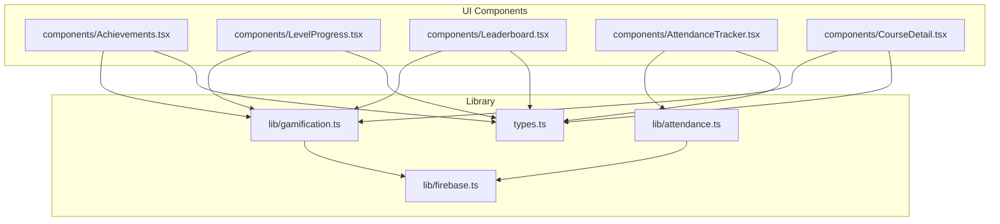
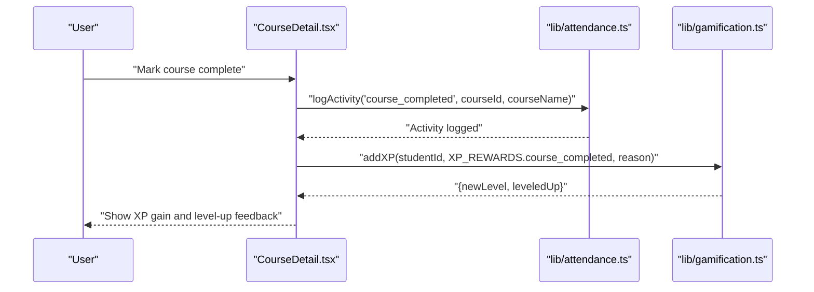
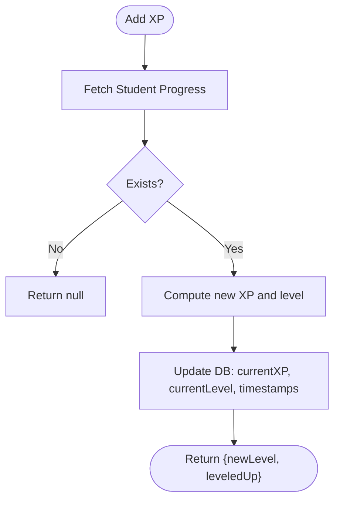
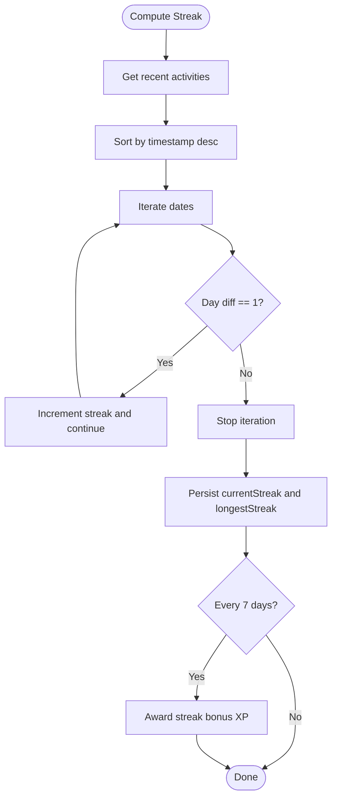
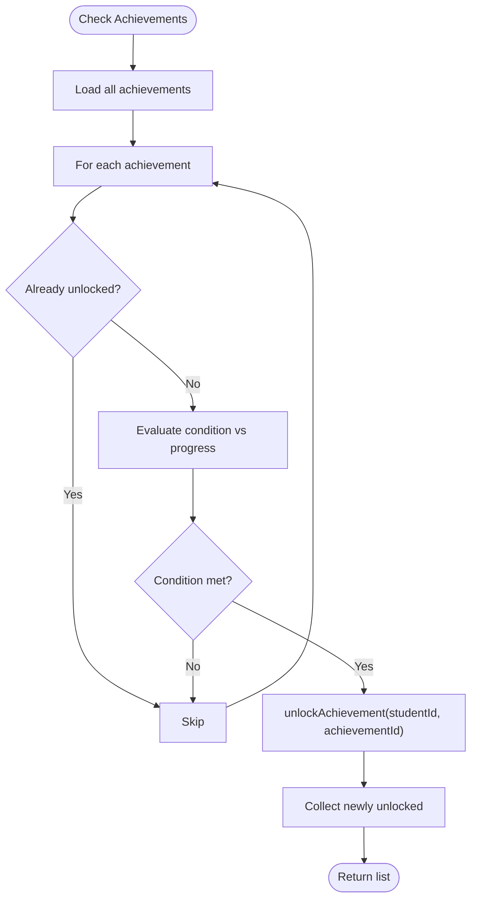
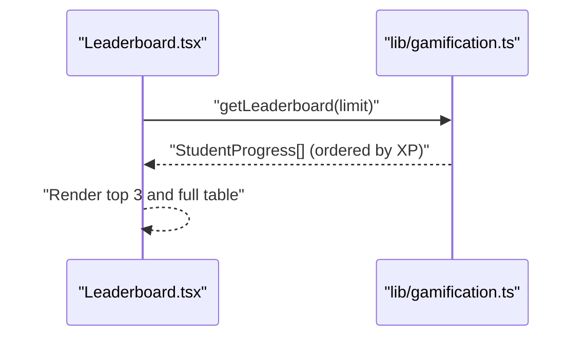
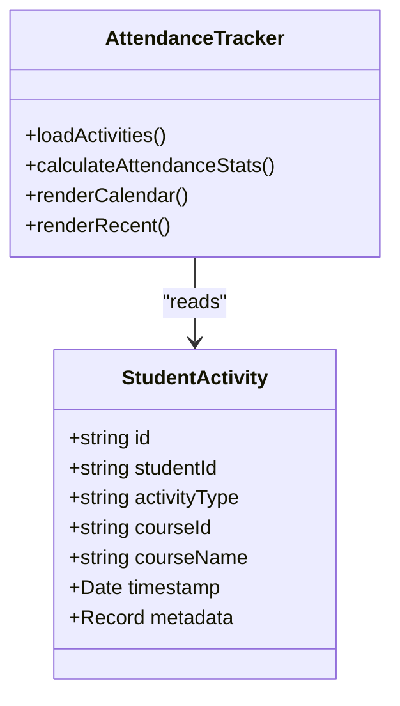
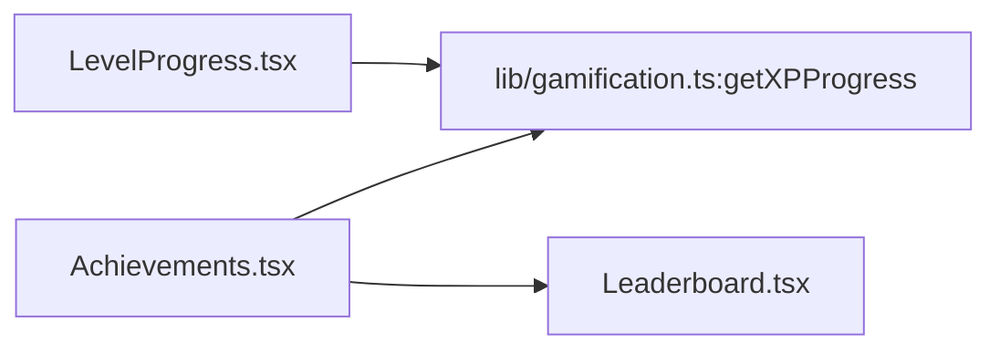
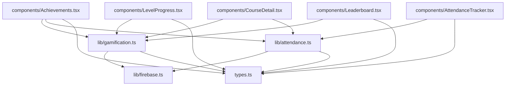

# Gamification & Progress Tracking

<cite>
**Referenced Files in This Document**
- [lib/gamification.ts](file://lib/gamification.ts)
- [components/Achievements.tsx](file://components/Achievements.tsx)
- [components/LevelProgress.tsx](file://components/LevelProgress.tsx)
- [components/Leaderboard.tsx](file://components/Leaderboard.tsx)
- [lib/attendance.ts](file://lib/attendance.ts)
- [components/AttendanceTracker.tsx](file://components/AttendanceTracker.tsx)
- [components/CourseDetail.tsx](file://components/CourseDetail.tsx)
- [lib/firebase.ts](file://lib/firebase.ts)
- [types.ts](file://types.ts)
</cite>

## Table of Contents
1. [Introduction](#introduction)
2. [Project Structure](#project-structure)
3. [Core Components](#core-components)
4. [Architecture Overview](#architecture-overview)
5. [Detailed Component Analysis](#detailed-component-analysis)
6. [Dependency Analysis](#dependency-analysis)
7. [Performance Considerations](#performance-considerations)
8. [Troubleshooting Guide](#troubleshooting-guide)
9. [Conclusion](#conclusion)
10. [Appendices](#appendices)

## Introduction
This document explains the gamification and progress tracking system used to motivate learners through XP rewards, leveling, streaks, achievements, and leaderboards. It covers how learning activities trigger XP, how XP translates into levels and progress bars, how streaks are tracked and rewarded, how achievements are defined and unlocked automatically, and how leaderboards surface social comparison. It also outlines the behavioral psychology principles applied and provides examples of configuration and analytics.

## Project Structure
The gamification system spans shared logic in a library module and UI components that render progress, achievements, and leaderboards. Learning activities are logged and used to compute streaks and unlock achievements.

**Diagram sources**
- [lib/gamification.ts](file://lib/gamification.ts#L1-L349)
- [lib/attendance.ts](file://lib/attendance.ts#L1-L177)
- [lib/firebase.ts](file://lib/firebase.ts#L1-L25)
- [types.ts](file://types.ts#L95-L125)
- [components/Achievements.tsx](file://components/Achievements.tsx#L1-L346)
- [components/LevelProgress.tsx](file://components/LevelProgress.tsx#L1-L73)
- [components/Leaderboard.tsx](file://components/Leaderboard.tsx#L1-L208)
- [components/AttendanceTracker.tsx](file://components/AttendanceTracker.tsx#L1-L249)
- [components/CourseDetail.tsx](file://components/CourseDetail.tsx#L1-L200)

**Section sources**
- [lib/gamification.ts](file://lib/gamification.ts#L1-L349)
- [lib/attendance.ts](file://lib/attendance.ts#L1-L177)
- [lib/firebase.ts](file://lib/firebase.ts#L1-L25)
- [types.ts](file://types.ts#L95-L125)
- [components/Achievements.tsx](file://components/Achievements.tsx#L1-L346)
- [components/LevelProgress.tsx](file://components/LevelProgress.tsx#L1-L73)
- [components/Leaderboard.tsx](file://components/Leaderboard.tsx#L1-L208)
- [components/AttendanceTracker.tsx](file://components/AttendanceTracker.tsx#L1-L249)
- [components/CourseDetail.tsx](file://components/CourseDetail.tsx#L1-L200)

## Core Components
- XP and Level System: Centralized XP calculations, level computation, and XP progress display.
- Student Progress: CRUD operations for learner profiles including XP, level, streaks, and achievements.
- Achievements: Achievement definitions, automatic unlocking checks, and progress visualization.
- Streak Tracking: Streak computation from activity logs and periodic XP bonuses.
- Leaderboard: Real-time ranking by XP with social comparison visuals.
- Attendance Logging: Activity logging and recent activity queries used for analytics and streaks.

**Section sources**
- [lib/gamification.ts](file://lib/gamification.ts#L8-L40)
- [lib/gamification.ts](file://lib/gamification.ts#L43-L98)
- [lib/gamification.ts](file://lib/gamification.ts#L198-L275)
- [lib/attendance.ts](file://lib/attendance.ts#L7-L30)
- [lib/attendance.ts](file://lib/attendance.ts#L122-L161)
- [components/Leaderboard.tsx](file://components/Leaderboard.tsx#L1-L208)
- [components/Achievements.tsx](file://components/Achievements.tsx#L1-L346)

## Architecture Overview
The system integrates learning activities with gamification rewards. When a user completes an activity (e.g., course), the app logs the event and awards XP. The XP increases the learner’s level and updates progress bars. Streaks are computed from recent activities and periodically award XP bonuses. Achievements unlock automatically when conditions are met. Leaderboards reflect live XP rankings.

**Diagram sources**
- [components/CourseDetail.tsx](file://components/CourseDetail.tsx#L128-L146)
- [lib/attendance.ts](file://lib/attendance.ts#L7-L30)
- [lib/gamification.ts](file://lib/gamification.ts#L100-L129)

## Detailed Component Analysis

### XP and Level System
- XP per level and reward constants define the scale.
- Level calculation and XP progress helpers power the progress bar.
- Adding XP updates current XP, level, timestamps, and optionally triggers level-up feedback.

**Diagram sources**
- [lib/gamification.ts](file://lib/gamification.ts#L100-L129)

**Section sources**
- [lib/gamification.ts](file://lib/gamification.ts#L8-L40)
- [lib/gamification.ts](file://lib/gamification.ts#L100-L129)
- [components/LevelProgress.tsx](file://components/LevelProgress.tsx#L1-L73)

### Streak Tracking and Bonuses
- Streaks are computed from sorted activity dates over the last 30 days.
- When a streak crosses a 7-day milestone, bonus XP is awarded.
- Streak updates persist current and longest streaks and refresh timestamps.

**Diagram sources**
- [lib/attendance.ts](file://lib/attendance.ts#L122-L161)
- [lib/gamification.ts](file://lib/gamification.ts#L131-L161)

**Section sources**
- [lib/attendance.ts](file://lib/attendance.ts#L122-L161)
- [lib/gamification.ts](file://lib/gamification.ts#L131-L161)
- [components/AttendanceTracker.tsx](file://components/AttendanceTracker.tsx#L1-L249)

### Achievement System
- Achievement types include course count, streak days, hours studied, and first course.
- Achievements are fetched from Firestore and checked against current progress.
- Unlocking an achievement grants XP and persists the unlocked ID.

**Diagram sources**
- [lib/gamification.ts](file://lib/gamification.ts#L198-L275)
- [lib/gamification.ts](file://lib/gamification.ts#L163-L195)

**Section sources**
- [lib/gamification.ts](file://lib/gamification.ts#L198-L275)
- [lib/gamification.ts](file://lib/gamification.ts#L163-L195)
- [types.ts](file://types.ts#L95-L106)
- [components/Achievements.tsx](file://components/Achievements.tsx#L1-L346)

### Leaderboard Implementation
- Leaderboard queries students ordered by XP descending and slices to top N.
- UI renders podiums and a full table with rank badges and icons.
- Social comparison highlights the current user’s row.

**Diagram sources**
- [components/Leaderboard.tsx](file://components/Leaderboard.tsx#L1-L208)
- [lib/gamification.ts](file://lib/gamification.ts#L278-L302)

**Section sources**
- [lib/gamification.ts](file://lib/gamification.ts#L278-L302)
- [components/Leaderboard.tsx](file://components/Leaderboard.tsx#L1-L208)

### Habit Formation Monitoring and Daily Practice Integration
- Attendance logging records activity events with timestamps and metadata.
- Attendance tracker visualizes 30-day activity calendar and recent activity list.
- Streaks feed into XP bonuses and achievements, reinforcing consistent practice.

**Diagram sources**
- [types.ts](file://types.ts#L84-L93)
- [components/AttendanceTracker.tsx](file://components/AttendanceTracker.tsx#L1-L249)
- [lib/attendance.ts](file://lib/attendance.ts#L7-L30)

**Section sources**
- [lib/attendance.ts](file://lib/attendance.ts#L7-L30)
- [lib/attendance.ts](file://lib/attendance.ts#L122-L161)
- [components/AttendanceTracker.tsx](file://components/AttendanceTracker.tsx#L1-L249)

### Progress Visualization Components
- LevelProgress displays current level, XP in current level, and progress percentage.
- Achievements page shows overall progress, unlocked and locked achievements with progress bars, and leaderboard.

**Diagram sources**
- [components/LevelProgress.tsx](file://components/LevelProgress.tsx#L1-L73)
- [lib/gamification.ts](file://lib/gamification.ts#L28-L40)
- [components/Achievements.tsx](file://components/Achievements.tsx#L1-L346)
- [components/Leaderboard.tsx](file://components/Leaderboard.tsx#L1-L208)

**Section sources**
- [components/LevelProgress.tsx](file://components/LevelProgress.tsx#L1-L73)
- [components/Achievements.tsx](file://components/Achievements.tsx#L1-L346)
- [components/Leaderboard.tsx](file://components/Leaderboard.tsx#L1-L208)

## Dependency Analysis
- Data persistence: Firestore collections for student progress, achievements, and activities.
- Types: Strongly typed models for achievements and student progress.
- UI components depend on gamification and attendance libraries for rendering and interactivity.

**Diagram sources**
- [lib/gamification.ts](file://lib/gamification.ts#L1-L7)
- [lib/attendance.ts](file://lib/attendance.ts#L1-L5)
- [lib/firebase.ts](file://lib/firebase.ts#L1-L25)
- [types.ts](file://types.ts#L95-L125)
- [components/Achievements.tsx](file://components/Achievements.tsx#L1-L8)
- [components/LevelProgress.tsx](file://components/LevelProgress.tsx#L1-L4)
- [components/Leaderboard.tsx](file://components/Leaderboard.tsx#L1-L5)
- [components/AttendanceTracker.tsx](file://components/AttendanceTracker.tsx#L1-L5)
- [components/CourseDetail.tsx](file://components/CourseDetail.tsx#L1-L11)

**Section sources**
- [lib/gamification.ts](file://lib/gamification.ts#L1-L7)
- [lib/attendance.ts](file://lib/attendance.ts#L1-L5)
- [lib/firebase.ts](file://lib/firebase.ts#L1-L25)
- [types.ts](file://types.ts#L95-L125)
- [components/Achievements.tsx](file://components/Achievements.tsx#L1-L8)
- [components/LevelProgress.tsx](file://components/LevelProgress.tsx#L1-L4)
- [components/Leaderboard.tsx](file://components/Leaderboard.tsx#L1-L5)
- [components/AttendanceTracker.tsx](file://components/AttendanceTracker.tsx#L1-L5)
- [components/CourseDetail.tsx](file://components/CourseDetail.tsx#L1-L11)

## Performance Considerations
- Firestore queries for leaderboard and achievements are paginated via limits; keep leaderboard sizes reasonable.
- Batch updates for streaks and XP reduce write contention.
- Client-side caching via Firebase local cache improves responsiveness for repeated reads.

## Troubleshooting Guide
- If XP does not increase after completing a course, verify the activity logging and XP award call paths.
- If streaks do not increment, confirm recent activity timestamps and date normalization logic.
- If achievements do not unlock, ensure achievement conditions match current progress and that the check routine runs after progress updates.

**Section sources**
- [components/CourseDetail.tsx](file://components/CourseDetail.tsx#L128-L146)
- [lib/attendance.ts](file://lib/attendance.ts#L122-L161)
- [lib/gamification.ts](file://lib/gamification.ts#L232-L275)

## Conclusion
The gamification system ties learning actions directly to XP, levels, streaks, and achievements, while leaderboards foster healthy competition. The modular design separates concerns between data access, UI rendering, and behavioral analytics, enabling easy tuning of XP values, achievement thresholds, and leaderboard parameters.

## Appendices

### Achievement Types and Unlocking Criteria
- First course: Unlocks upon completing at least one course.
- Course count: Unlocks upon reaching a specified number of completed courses.
- Streak days: Unlocks upon maintaining a consecutive day streak.
- Hours studied: Unlocks upon reaching a cumulative study hour threshold.

**Section sources**
- [lib/gamification.ts](file://lib/gamification.ts#L247-L260)
- [types.ts](file://types.ts#L95-L106)

### XP Reward Mechanisms
- Course completion: Grants a fixed XP amount.
- Mindful flow: Grants a fixed XP amount.
- Media upload: Grants a fixed XP amount.
- Streak bonus: Grants a fixed XP amount every 7 days of streak.

**Section sources**
- [lib/gamification.ts](file://lib/gamification.ts#L10-L17)
- [components/CourseDetail.tsx](file://components/CourseDetail.tsx#L138-L139)

### Level Progression Mechanics
- Level is computed by dividing total XP by XP per level and flooring to integer.
- XP progress shows current XP in the level, required XP for the level, and percentage to next level.

**Section sources**
- [lib/gamification.ts](file://lib/gamification.ts#L19-L26)
- [lib/gamification.ts](file://lib/gamification.ts#L28-L40)
- [components/LevelProgress.tsx](file://components/LevelProgress.tsx#L12-L69)

### Streak Tracking Functionality
- Streaks are computed from the most recent activities, counting consecutive calendar days.
- Longest streak is updated when a new maximum is reached.
- Every 7-day milestone increments the streak and awards bonus XP.

**Section sources**
- [lib/attendance.ts](file://lib/attendance.ts#L122-L161)
- [lib/gamification.ts](file://lib/gamification.ts#L131-L161)

### Leaderboard Implementation Details
- Rankings are derived from current XP values, ordered descending.
- Top 3 receive special podium styling; others are shown in a table with rank badges and icons.
- Current user is highlighted in the table.

**Section sources**
- [lib/gamification.ts](file://lib/gamification.ts#L278-L302)
- [components/Leaderboard.tsx](file://components/Leaderboard.tsx#L67-L125)
- [components/Leaderboard.tsx](file://components/Leaderboard.tsx#L127-L202)

### Habit Formation and Daily Practice Integration
- Activities are logged with timestamps and grouped by type.
- Attendance tracker visualizes 30-day activity and recent activity list.
- Streaks and XP bonuses reinforce consistent daily participation.

**Section sources**
- [lib/attendance.ts](file://lib/attendance.ts#L7-L30)
- [lib/attendance.ts](file://lib/attendance.ts#L122-L161)
- [components/AttendanceTracker.tsx](file://components/AttendanceTracker.tsx#L66-L204)

### Behavioral Psychology Principles Applied
- Variable reward schedules: Random streak bonuses and XP-triggered level-ups maintain engagement.
- Social comparison: Leaderboards and podiums encourage competitive motivation.
- Mastery and competence: Clear XP and level progression signals mastery growth.
- Loss aversion: Longest streak counter encourages continuity to avoid losing progress.
- Immediate feedback: On-completion XP gains and level-up indicators reinforce desired behaviors.

### Examples of Achievement Configurations
- Example: “First Steps” requires one course completion and awards a small XP reward.
- Example: “Dedicated Student” requires a 7-day streak and awards a moderate XP reward.
- Example: “Course Master” requires 10 course completions and awards a larger XP reward.
- Example: “Unstoppable” requires a 30-day streak and awards a large XP reward.
- Example: “Scholar” requires 50 course completions and awards a very large XP reward.

**Section sources**
- [lib/gamification.ts](file://lib/gamification.ts#L305-L348)

### Progress Analytics and Motivation Strategies
- Track completion rates, mindful flow participation, and streaks to identify at-risk learners.
- Use leaderboard visibility to drive friendly competition.
- Adjust XP values and achievement thresholds to balance challenge and attainability.
- Highlight milestones (e.g., every 7-day streak) to sustain momentum.