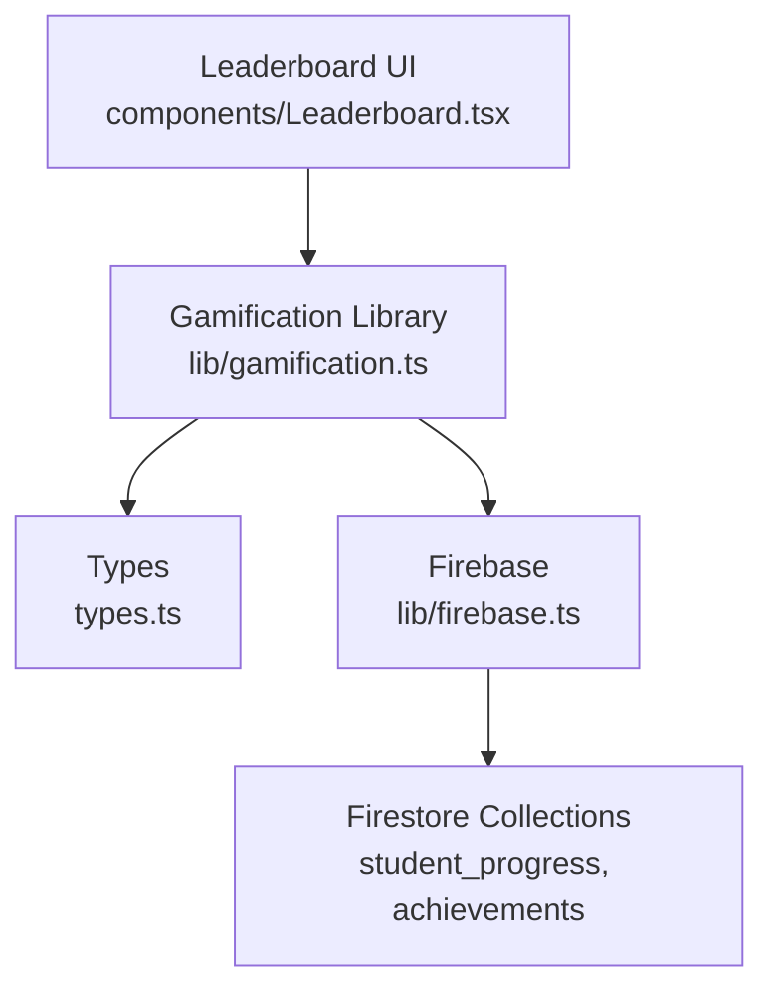
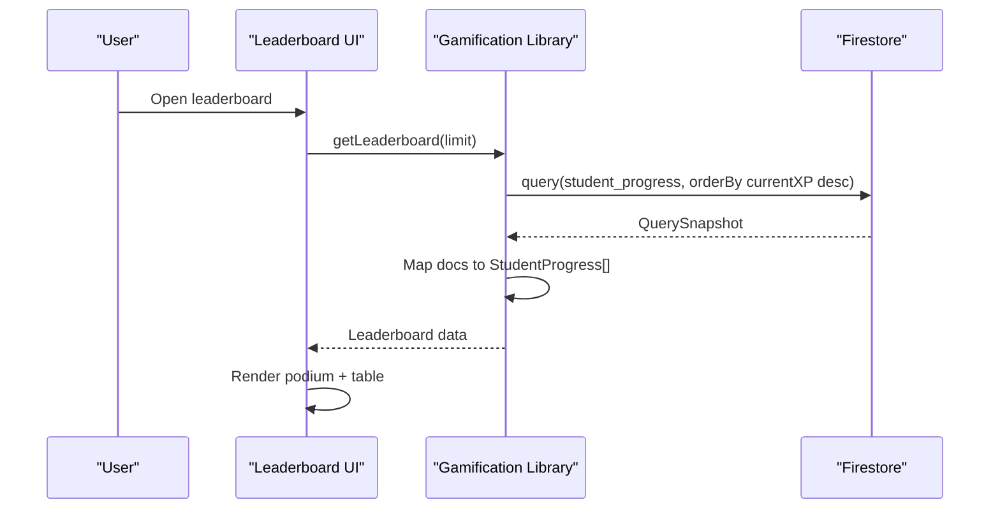
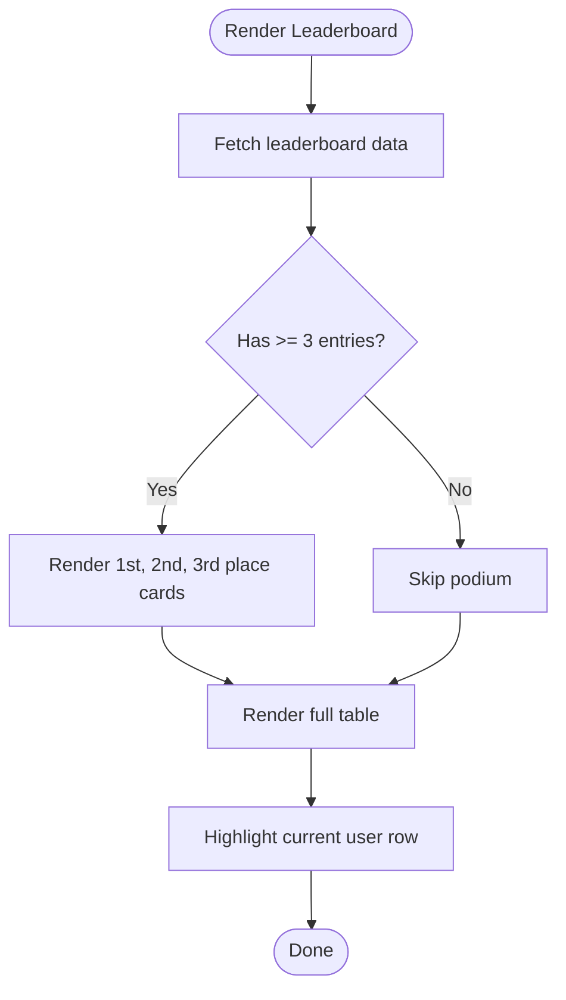
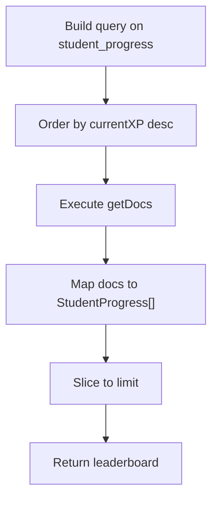
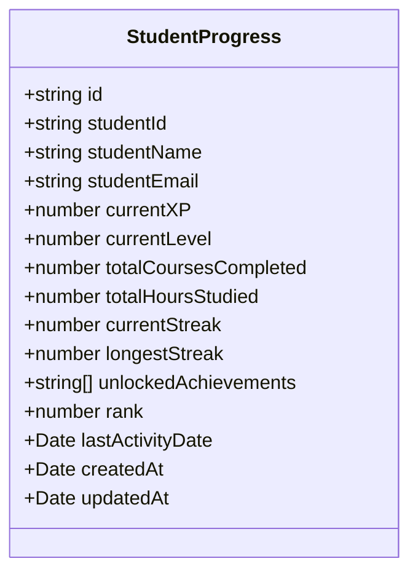
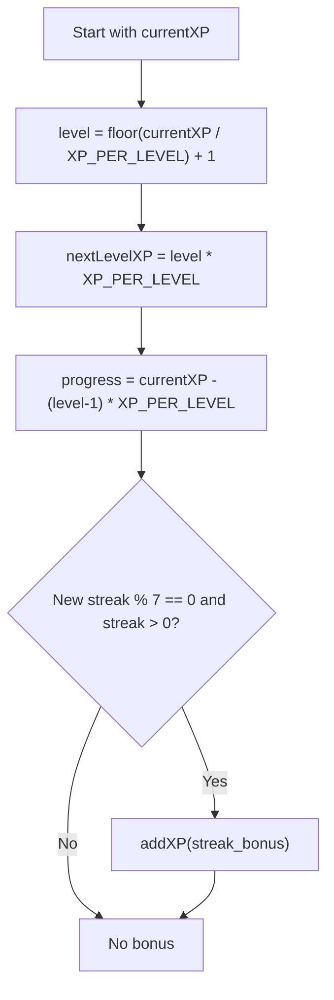
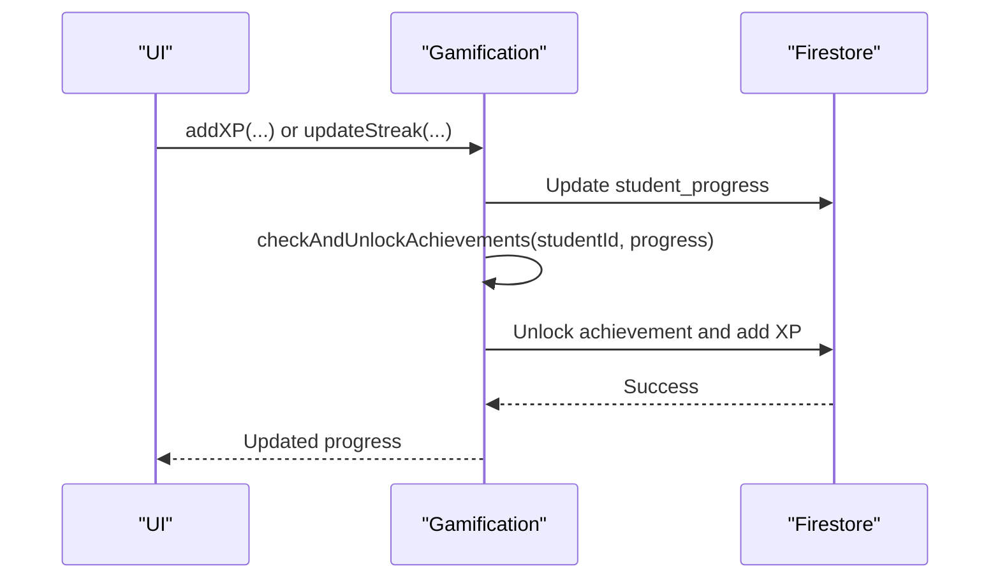
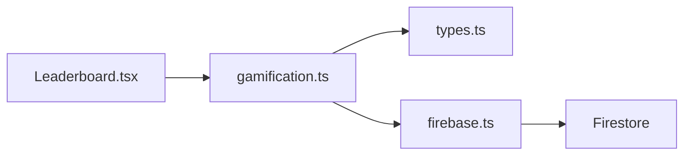

# Leaderboard System

<cite>
**Referenced Files in This Document**
- [Leaderboard.tsx](file://components/Leaderboard.tsx)
- [gamification.ts](file://lib/gamification.ts)
- [firebase.ts](file://lib/firebase.ts)
- [types.ts](file://types.ts)
- [App.tsx](file://App.tsx)
- [StudentDashboard.tsx](file://components/StudentDashboard.tsx)
</cite>

## Table of Contents
1. [Introduction](#introduction)
2. [Project Structure](#project-structure)
3. [Core Components](#core-components)
4. [Architecture Overview](#architecture-overview)
5. [Detailed Component Analysis](#detailed-component-analysis)
6. [Dependency Analysis](#dependency-analysis)
7. [Performance Considerations](#performance-considerations)
8. [Troubleshooting Guide](#troubleshooting-guide)
9. [Conclusion](#conclusion)

## Introduction
This document explains the leaderboard system in the Fluentoria application. It covers real-time ranking algorithms, score calculation methods, position determination logic, data structures, sorting criteria, refresh mechanisms, podium display, full leaderboard table, user identification features, query examples, pagination strategies, performance optimization for large datasets, social comparison features, ranking notifications, integration with achievement systems, privacy settings, seasonal resets, and competitive gaming elements.

## Project Structure
The leaderboard system spans UI components, a gamification library, and Firebase integration:
- UI: Leaderboard component renders the podium and full table.
- Logic: Gamification library handles XP calculations, streak bonuses, achievement unlocks, and leaderboard retrieval.
- Data: Firebase Firestore stores student progress and achievements.
- Types: Strongly typed interfaces define the leaderboard data model.

**Diagram sources**
- [Leaderboard.tsx](file://components/Leaderboard.tsx#L1-L208)
- [gamification.ts](file://lib/gamification.ts#L1-L349)
- [firebase.ts](file://lib/firebase.ts#L1-L25)
- [types.ts](file://types.ts#L108-L125)

**Section sources**
- [Leaderboard.tsx](file://components/Leaderboard.tsx#L1-L208)
- [gamification.ts](file://lib/gamification.ts#L1-L349)
- [firebase.ts](file://lib/firebase.ts#L1-L25)
- [types.ts](file://types.ts#L108-L125)

## Core Components
- Leaderboard UI: Fetches leaderboard data, displays top 3 podium and full table, highlights the current user, and shows XP, level, completed courses, and streak.
- Gamification Library: Provides XP calculations, streak management, achievement checks, and leaderboard retrieval.
- Firebase: Initializes Firestore and exposes the database connection used by gamification functions.
- Types: Defines StudentProgress and Achievement interfaces used across the system.

Key responsibilities:
- Real-time ranking: Leaderboard fetches sorted data from Firestore.
- Score calculation: XP rewards and level progression are computed centrally.
- Position determination: Positions are derived from the ordered list.
- Social comparison: Current user is highlighted in the table.
- Integration: Achievements and XP updates influence rankings indirectly.

**Section sources**
- [Leaderboard.tsx](file://components/Leaderboard.tsx#L11-L24)
- [gamification.ts](file://lib/gamification.ts#L100-L161)
- [firebase.ts](file://lib/firebase.ts#L16-L24)
- [types.ts](file://types.ts#L108-L125)

## Architecture Overview
The leaderboard architecture follows a clean separation of concerns:
- UI triggers leaderboard retrieval.
- Gamification library queries Firestore and transforms documents into typed models.
- UI renders the podium and full table with icons, badges, and user highlighting.

**Diagram sources**
- [Leaderboard.tsx](file://components/Leaderboard.tsx#L19-L24)
- [gamification.ts](file://lib/gamification.ts#L278-L302)

**Section sources**
- [Leaderboard.tsx](file://components/Leaderboard.tsx#L11-L24)
- [gamification.ts](file://lib/gamification.ts#L278-L302)

## Detailed Component Analysis

### Leaderboard UI Component
Responsibilities:
- Fetch leaderboard data on mount.
- Render top 3 podium with special styling and icons.
- Render a full leaderboard table with columns for position, student info, level, XP total, courses completed, and streak.
- Highlight the current user row.
- Display XP totals with locale formatting and streak visuals.

Position determination:
- Positions are computed from the sorted array index plus one.

User identification:
- Uses currentUserId prop to compare against each student’s studentId and marks the row accordingly.

Podium display:
- Special styling and icons for ranks 1, 2, and 3.

Full leaderboard table:
- Columns include position badge/icon, avatar initials, name and email, level, XP total, courses completed, and streak with optional fire emoji for long streaks.

**Diagram sources**
- [Leaderboard.tsx](file://components/Leaderboard.tsx#L67-L125)
- [Leaderboard.tsx](file://components/Leaderboard.tsx#L127-L202)
- [Leaderboard.tsx](file://components/Leaderboard.tsx#L142-L151)

**Section sources**
- [Leaderboard.tsx](file://components/Leaderboard.tsx#L11-L24)
- [Leaderboard.tsx](file://components/Leaderboard.tsx#L67-L125)
- [Leaderboard.tsx](file://components/Leaderboard.tsx#L127-L202)

### Gamification Library: Leaderboard Retrieval
Leaderboard algorithm:
- Query the student_progress collection.
- Sort by currentXP in descending order.
- Map Firestore documents to StudentProgress with date conversions.
- Slice to the requested limit.

Sorting criteria:
- Primary sort: currentXP descending.
- No secondary sort is applied; ties are broken by Firestore ordering behavior.

Ranking refresh mechanism:
- The UI component fetches data on mount.
- There is no built-in real-time listener for leaderboard updates in the current implementation.

**Diagram sources**
- [gamification.ts](file://lib/gamification.ts#L278-L302)

**Section sources**
- [gamification.ts](file://lib/gamification.ts#L278-L302)

### Data Model: StudentProgress
Fields used by the leaderboard:
- studentId, studentName, studentEmail
- currentXP, currentLevel
- totalCoursesCompleted
- currentStreak, longestStreak
- createdAt, updatedAt, lastActivityDate
- rank (optional field present in the type definition)

**Diagram sources**
- [types.ts](file://types.ts#L108-L125)

**Section sources**
- [types.ts](file://types.ts#L108-L125)

### XP Calculation and Level Progression
XP mechanics:
- XP rewards are defined centrally.
- Level is calculated as floor(currentXP / XP_PER_LEVEL) + 1.
- XP for next level is derived from current level.
- XP progress within the current level is computed for UI and progression tracking.

Streak bonuses:
- Every 7-day increment awards bonus XP and may trigger achievement checks.

**Diagram sources**
- [gamification.ts](file://lib/gamification.ts#L19-L40)
- [gamification.ts](file://lib/gamification.ts#L131-L161)

**Section sources**
- [gamification.ts](file://lib/gamification.ts#L10-L17)
- [gamification.ts](file://lib/gamification.ts#L19-L40)
- [gamification.ts](file://lib/gamification.ts#L131-L161)

### Achievement Integration and Notifications
Achievement checks:
- On XP updates or streak increments, the system evaluates conditions and unlocks achievements.
- Newly unlocked achievements grant XP and are stored in the student’s progress record.

Ranking impact:
- Achievements do not directly change ranking; however, unlocked achievements increase currentXP, which can improve position.

**Diagram sources**
- [gamification.ts](file://lib/gamification.ts#L100-L129)
- [gamification.ts](file://lib/gamification.ts#L131-L161)
- [gamification.ts](file://lib/gamification.ts#L232-L275)

**Section sources**
- [gamification.ts](file://lib/gamification.ts#L163-L195)
- [gamification.ts](file://lib/gamification.ts#L232-L275)

### Social Comparison and User Identification
Social comparison:
- The leaderboard shows relative positions and XP totals, enabling users to compare themselves to peers.

User identification:
- The current user is highlighted in the table.
- The dashboard shows the user’s global rank.

**Section sources**
- [Leaderboard.tsx](file://components/Leaderboard.tsx#L142-L151)
- [StudentDashboard.tsx](file://components/StudentDashboard.tsx#L105-L116)

### Privacy, Seasonal Resets, and Competitive Elements
Privacy settings:
- The current implementation does not expose explicit privacy controls for leaderboard visibility. Student names and emails are shown in the table.

Seasonal resets:
- No seasonal reset logic is implemented in the current codebase.

Competitive elements:
- Streaks and achievements introduce competitive incentives; XP rewards encourage participation.

**Section sources**
- [Leaderboard.tsx](file://components/Leaderboard.tsx#L172-L173)
- [gamification.ts](file://lib/gamification.ts#L10-L17)

## Dependency Analysis
The leaderboard depends on:
- UI component for rendering.
- Gamification library for data retrieval and XP/streak logic.
- Firebase for Firestore connectivity.
- Types for data modeling.

**Diagram sources**
- [Leaderboard.tsx](file://components/Leaderboard.tsx#L1-L5)
- [gamification.ts](file://lib/gamification.ts#L1-L3)
- [firebase.ts](file://lib/firebase.ts#L1-L25)
- [types.ts](file://types.ts#L108-L125)

**Section sources**
- [Leaderboard.tsx](file://components/Leaderboard.tsx#L1-L5)
- [gamification.ts](file://lib/gamification.ts#L1-L3)
- [firebase.ts](file://lib/firebase.ts#L1-L25)
- [types.ts](file://types.ts#L108-L125)

## Performance Considerations
Current state:
- Leaderboard retrieval performs a full collection scan sorted by currentXP and slices the result. This is efficient for small to medium datasets but may degrade as the number of students grows.

Recommendations:
- Add server-side pagination by implementing cursor-based pagination or offset-based pagination in the gamification library.
- Introduce a leaderboard cache with periodic refresh intervals.
- Consider precomputing global ranks periodically and storing them in a separate collection to avoid repeated sorting.
- Use Firestore composite indexes on (currentXP, studentId) to optimize sorting and filtering.
- Implement client-side debouncing for frequent leaderboard reloads.
- Add real-time listeners for live updates if needed, balancing performance and freshness.

[No sources needed since this section provides general guidance]

## Troubleshooting Guide
Common issues and resolutions:
- Empty leaderboard: Verify that student_progress documents exist and contain currentXP values.
- Incorrect positions: Ensure currentXP is updated consistently; confirm sorting by currentXP desc.
- Streak bonus not awarded: Confirm streak increments and modulo 7 logic; verify XP addition after milestone.
- Achievement unlock failures: Check achievement conditions and Firestore permissions.

**Section sources**
- [gamification.ts](file://lib/gamification.ts#L131-L161)
- [gamification.ts](file://lib/gamification.ts#L232-L275)

## Conclusion
The leaderboard system in Fluentoria provides a clear, functional ranking based on XP totals with a visually engaging podium and a comprehensive table. While the current implementation focuses on simplicity and immediate correctness, future enhancements should address scalability through pagination and caching, introduce real-time updates, and consider privacy controls, seasonal resets, and richer competitive features.