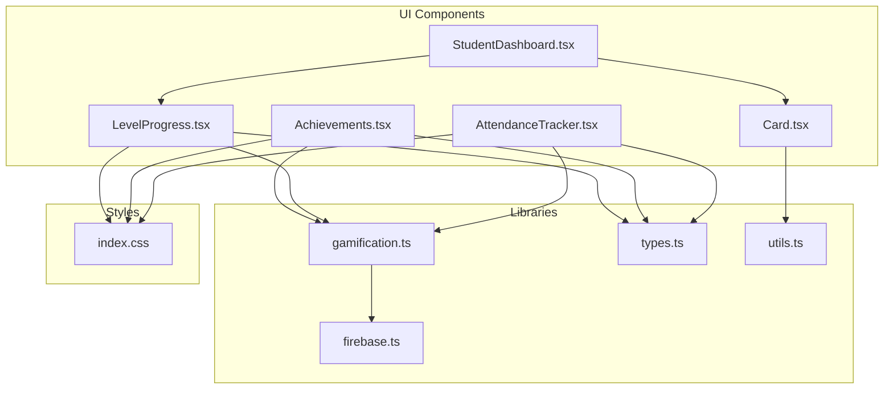
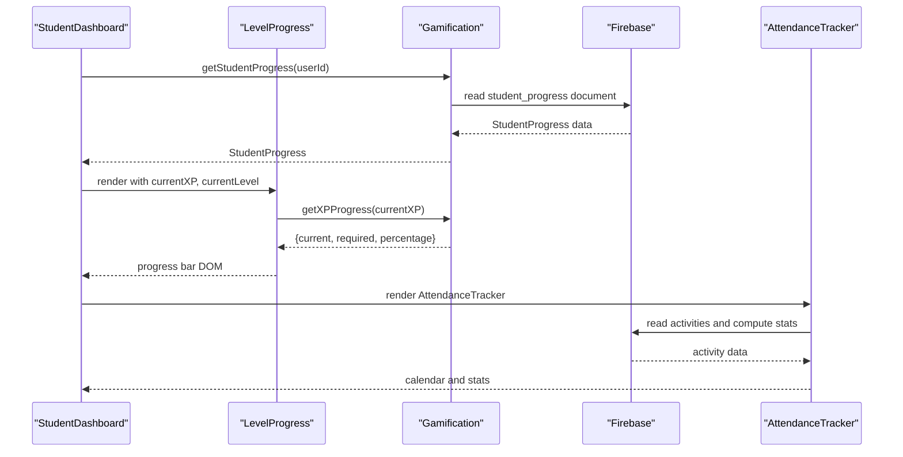
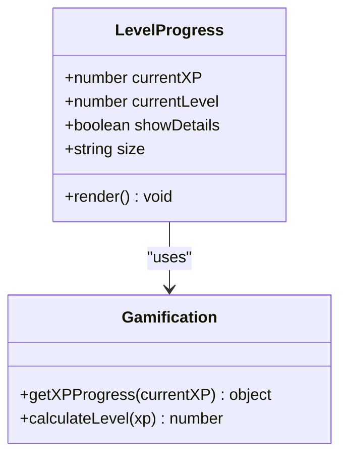
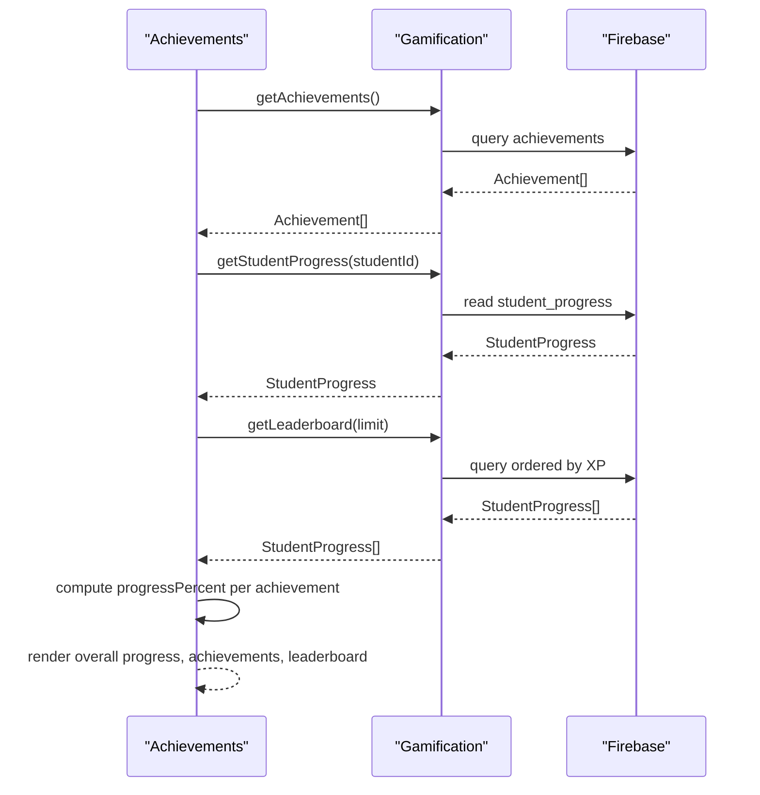
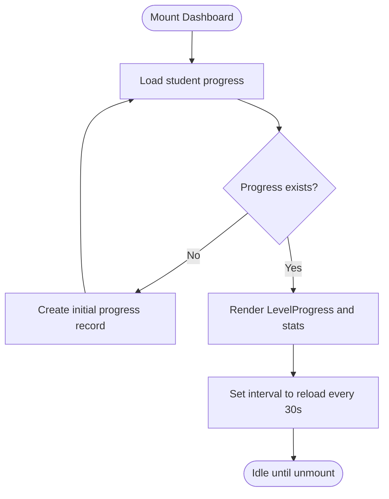
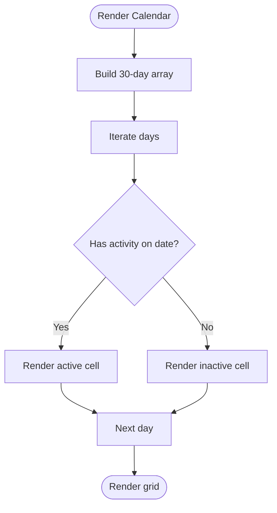
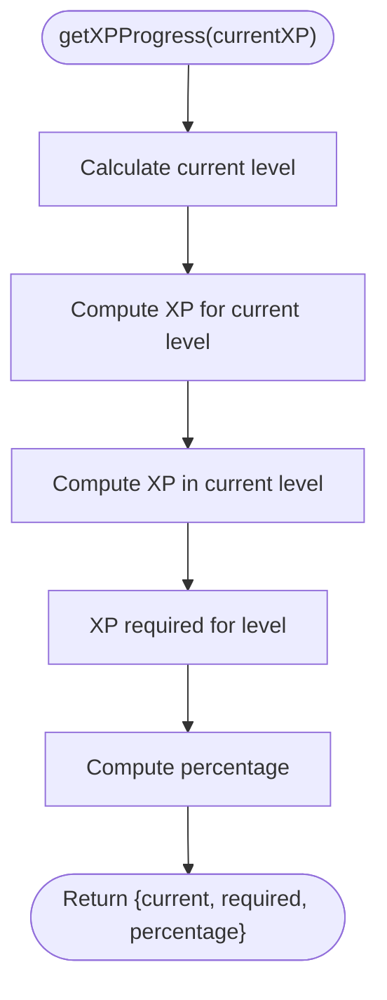
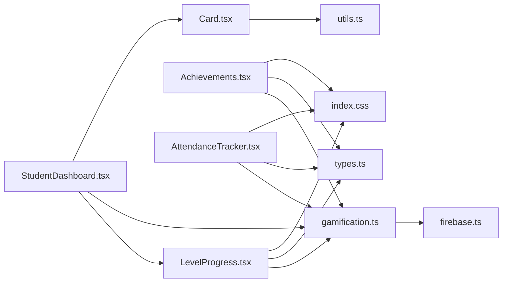

# Progress Visualization

<cite>
**Referenced Files in This Document**
- [LevelProgress.tsx](file://components/LevelProgress.tsx)
- [Achievements.tsx](file://components/Achievements.tsx)
- [StudentDashboard.tsx](file://components/StudentDashboard.tsx)
- [AttendanceTracker.tsx](file://components/AttendanceTracker.tsx)
- [gamification.ts](file://lib/gamification.ts)
- [types.ts](file://types.ts)
- [firebase.ts](file://lib/firebase.ts)
- [Card.tsx](file://components/ui/Card.tsx)
- [index.css](file://index.css)
</cite>

## Table of Contents
1. [Introduction](#introduction)
2. [Project Structure](#project-structure)
3. [Core Components](#core-components)
4. [Architecture Overview](#architecture-overview)
5. [Detailed Component Analysis](#detailed-component-analysis)
6. [Dependency Analysis](#dependency-analysis)
7. [Performance Considerations](#performance-considerations)
8. [Troubleshooting Guide](#troubleshooting-guide)
9. [Conclusion](#conclusion)
10. [Appendices](#appendices)

## Introduction
This document explains the progress visualization system used to display learning progression, level advancement, and achievement completion in the application. It covers the progress bar implementation, level progress displays, achievement completion tracking visuals, and the UI components that show overall progress, course completion percentages, and skill mastery indicators. It also documents visual design patterns, color coding systems, progress animation effects, data binding and real-time updates, responsive design considerations, integration between metrics and dashboards, user feedback mechanisms, accessibility features, and export capabilities.

## Project Structure
The progress visualization system is composed of:
- UI components that render progress bars and achievement cards
- A gamification library that computes XP, levels, and progress metrics
- Types that define the shape of progress and achievement data
- Firebase integration for persistence and real-time updates
- Utility classes and animations for responsive and accessible UI

**Diagram sources**
- [LevelProgress.tsx](file://components/LevelProgress.tsx#L1-L73)
- [Achievements.tsx](file://components/Achievements.tsx#L1-L346)
- [StudentDashboard.tsx](file://components/StudentDashboard.tsx#L1-L135)
- [AttendanceTracker.tsx](file://components/AttendanceTracker.tsx#L1-L249)
- [gamification.ts](file://lib/gamification.ts#L1-L349)
- [types.ts](file://types.ts#L1-L125)
- [firebase.ts](file://lib/firebase.ts#L1-L25)
- [Card.tsx](file://components/ui/Card.tsx#L1-L24)
- [index.css](file://index.css#L80-L158)

**Section sources**
- [LevelProgress.tsx](file://components/LevelProgress.tsx#L1-L73)
- [Achievements.tsx](file://components/Achievements.tsx#L1-L346)
- [StudentDashboard.tsx](file://components/StudentDashboard.tsx#L1-L135)
- [AttendanceTracker.tsx](file://components/AttendanceTracker.tsx#L1-L249)
- [gamification.ts](file://lib/gamification.ts#L1-L349)
- [types.ts](file://types.ts#L1-L125)
- [firebase.ts](file://lib/firebase.ts#L1-L25)
- [Card.tsx](file://components/ui/Card.tsx#L1-L24)
- [index.css](file://index.css#L80-L158)

## Core Components
- LevelProgress: Renders a progress bar indicating current XP toward the next level, with optional details and size variants.
- Achievements: Displays overall progress, individual achievement progress bars, and a leaderboard with podium visuals.
- StudentDashboard: Integrates LevelProgress and stats cards, periodically reloads progress data, and navigates to achievements.
- AttendanceTracker: Visualizes activity calendar and recent activities, complementing progress metrics with streak and course completion stats.
- Gamification library: Computes XP, levels, progress percentages, and manages achievement unlocking and leaderboard queries.
- Types: Defines Achievement and StudentProgress interfaces used across components.
- Firebase: Provides Firestore persistence for progress and achievements.
- UI utilities: Tailwind-based styles and animations for responsive and accessible progress visuals.

**Section sources**
- [LevelProgress.tsx](file://components/LevelProgress.tsx#L5-L73)
- [Achievements.tsx](file://components/Achievements.tsx#L6-L346)
- [StudentDashboard.tsx](file://components/StudentDashboard.tsx#L12-L135)
- [AttendanceTracker.tsx](file://components/AttendanceTracker.tsx#L7-L249)
- [gamification.ts](file://lib/gamification.ts#L8-L349)
- [types.ts](file://types.ts#L95-L125)
- [firebase.ts](file://lib/firebase.ts#L1-L25)
- [Card.tsx](file://components/ui/Card.tsx#L4-L24)
- [index.css](file://index.css#L80-L158)

## Architecture Overview
The progress visualization architecture centers around a reactive data flow:
- Components request progress data from the gamification library.
- The gamification library reads/writes to Firestore via Firebase.
- Components render progress bars, stats cards, and achievement lists.
- Real-time updates are achieved through periodic polling and UI animations.

**Diagram sources**
- [StudentDashboard.tsx](file://components/StudentDashboard.tsx#L20-L43)
- [LevelProgress.tsx](file://components/LevelProgress.tsx#L12-L18)
- [gamification.ts](file://lib/gamification.ts#L43-L64)
- [firebase.ts](file://lib/firebase.ts#L1-L25)
- [AttendanceTracker.tsx](file://components/AttendanceTracker.tsx#L24-L37)

## Detailed Component Analysis

### LevelProgress Component
Purpose:
- Visualizes a single student’s XP progress toward the next level with a gradient progress bar and optional details.

Key behaviors:
- Computes progress values using the gamification library.
- Supports small, medium, and large sizes with proportional typography and bar thickness.
- Displays level number, XP current/required, and percentage to next level when details are enabled.
- Uses a smooth transition animation for progress bar width changes.

Visual design patterns:
- Gradient bar from primary to orange for energy and progression.
- Responsive sizing classes for text and bar height.
- Iconography (zap) aligned with XP theme.

Accessibility:
- Uses semantic text and contrast-compliant colors.
- No dynamic aria-live regions are present; consider adding live regions for screen readers if needed.

Real-time updates:
- The parent component triggers periodic reloads; LevelProgress itself does not poll.

Responsive design:
- Size variants adapt to different container widths.
- Typography scales with size to maintain readability.

Integration:
- Consumes getXPProgress from gamification library.
- Used within StudentDashboard for prominent progress display.

**Section sources**
- [LevelProgress.tsx](file://components/LevelProgress.tsx#L5-L73)
- [gamification.ts](file://lib/gamification.ts#L28-L40)

#### LevelProgress Class Diagram

**Diagram sources**
- [LevelProgress.tsx](file://components/LevelProgress.tsx#L12-L18)
- [gamification.ts](file://lib/gamification.ts#L28-L40)

### Achievements Component
Purpose:
- Displays overall progress, individual achievement progress bars, and a leaderboard with top performers.

Key behaviors:
- Loads achievements, student progress, and leaderboard concurrently.
- Computes progress percentage toward each achievement based on thresholds.
- Renders unlocked and locked achievement cards with progress bars.
- Shows a podium layout for top 3 students and a full leaderboard table.

Visual design patterns:
- Gradient bars for overall progress and achievement progress.
- Color-coded badges and icons for top ranks (gold, silver, bronze).
- Hover animations and subtle gradients for interactive elements.
- Consistent dark theme with accent colors for XP and achievements.

Accessibility:
- Uses readable typography and sufficient contrast.
- Interactive elements provide hover/focus affordances.

Real-time updates:
- Achievements are checked and unlocked automatically when conditions are met.
- Leaderboard data is fetched on mount and can be refreshed via navigation.

Integration:
- Uses gamification functions for achievements, progress, and leaderboard.
- Renders alongside StudentDashboard for holistic progress view.

**Section sources**
- [Achievements.tsx](file://components/Achievements.tsx#L10-L346)
- [gamification.ts](file://lib/gamification.ts#L198-L275)

#### Achievements Sequence Diagram

**Diagram sources**
- [Achievements.tsx](file://components/Achievements.tsx#L20-L32)
- [gamification.ts](file://lib/gamification.ts#L198-L302)

### StudentDashboard Component
Purpose:
- Serves as the central hub for progress visualization, integrating LevelProgress, stats cards, and navigation to achievements.

Key behaviors:
- Periodically reloads progress data every 30 seconds to reflect real-time updates.
- Creates initial progress record if missing.
- Renders LevelProgress prominently and links to the achievements page.
- Displays stats cards for total XP, unlocked achievements, and global rank.

Visual design patterns:
- Dark card-based layout with hover elevation effects.
- Icons and color accents align with XP and achievement themes.
- Smooth fade-in animation for content.

Real-time updates:
- Interval-based polling ensures timely reflection of XP and streak changes.

Integration:
- Composes LevelProgress and AttendanceTracker.
- Uses Card component for consistent card styling.

**Section sources**
- [StudentDashboard.tsx](file://components/StudentDashboard.tsx#L16-L135)
- [Card.tsx](file://components/ui/Card.tsx#L4-L24)

#### StudentDashboard Flowchart

**Diagram sources**
- [StudentDashboard.tsx](file://components/StudentDashboard.tsx#L20-L43)

### AttendanceTracker Component
Purpose:
- Visualizes recent activity and streaks with a calendar heatmap and recent activity list.

Key behaviors:
- Loads recent activities and computes stats (completed courses, mindful flows, current streak).
- Renders a 30-day calendar where each cell reflects activity presence.
- Shows recent activities with timestamps and course context.

Visual design patterns:
- Distinct colored icons and backgrounds for different activity types.
- Today highlighted with a ring for orientation.
- Hover scaling and transitions for interactivity.

Real-time updates:
- Reloading activities triggers recalculation of stats and calendar.

Integration:
- Uses attendance utilities to compute stats and recent activities.
- Complements progress visualization by showing streaks and course completion.

**Section sources**
- [AttendanceTracker.tsx](file://components/AttendanceTracker.tsx#L12-L249)

#### AttendanceTracker Calendar Visualization

**Diagram sources**
- [AttendanceTracker.tsx](file://components/AttendanceTracker.tsx#L66-L88)

### Gamification Library
Purpose:
- Centralizes XP calculations, level computation, progress metrics, achievement management, and leaderboard queries.

Key functions:
- XP and level math: calculateLevel, getXPForNextLevel, getXPProgress.
- Progress persistence: getStudentProgress, createStudentProgress, addXP, updateStreak.
- Achievement lifecycle: getAchievements, getAchievement, unlockAchievement, checkAndUnlockAchievements.
- Leaderboard: getLeaderboard.

Data model:
- StudentProgress includes XP, level, course counts, streaks, and unlocked achievements.
- Achievement defines title, description, icon, XP reward, and condition thresholds.

**Section sources**
- [gamification.ts](file://lib/gamification.ts#L8-L349)
- [types.ts](file://types.ts#L95-L125)

#### Gamification Progress Calculation

**Diagram sources**
- [gamification.ts](file://lib/gamification.ts#L28-L40)

### Types
Purpose:
- Define the shape of progress and achievement data structures used across components.

Key interfaces:
- Achievement: id, title, description, icon, xpReward, condition.
- StudentProgress: student identifiers, XP, level, course counts, streaks, unlocked achievements, timestamps.

**Section sources**
- [types.ts](file://types.ts#L95-L125)

### Firebase Integration
Purpose:
- Provide Firestore persistence for progress and achievements, enabling cross-tab caching and offline support.

Key aspects:
- Auth initialization for user context.
- Firestore initialized with persistent local cache and multi-tab manager.
- Storage and functions available for future integrations.

**Section sources**
- [firebase.ts](file://lib/firebase.ts#L1-L25)

### UI Utilities and Animations
Purpose:
- Provide consistent styling and motion for progress visuals.

Key utilities:
- cn for merging Tailwind classes.
- Hover elevation and scale transitions for interactive cards.
- Fade-in and floating animations for content and decorative elements.

**Section sources**
- [Card.tsx](file://components/ui/Card.tsx#L4-L24)
- [index.css](file://index.css#L80-L158)

## Dependency Analysis
The progress visualization system exhibits cohesive coupling around the gamification library and Firestore:
- UI components depend on gamification functions for data computation.
- Gamification depends on Firebase for persistence.
- Types define shared contracts across modules.
- UI utilities and styles unify the presentation.

**Diagram sources**
- [LevelProgress.tsx](file://components/LevelProgress.tsx#L1-L3)
- [Achievements.tsx](file://components/Achievements.tsx#L1-L4)
- [StudentDashboard.tsx](file://components/StudentDashboard.tsx#L1-L10)
- [AttendanceTracker.tsx](file://components/AttendanceTracker.tsx#L1-L5)
- [gamification.ts](file://lib/gamification.ts#L1-L3)
- [types.ts](file://types.ts#L1-L3)
- [firebase.ts](file://lib/firebase.ts#L1-L3)
- [Card.tsx](file://components/ui/Card.tsx#L1-L3)
- [index.css](file://index.css#L80-L158)

**Section sources**
- [LevelProgress.tsx](file://components/LevelProgress.tsx#L1-L3)
- [Achievements.tsx](file://components/Achievements.tsx#L1-L4)
- [StudentDashboard.tsx](file://components/StudentDashboard.tsx#L1-L10)
- [AttendanceTracker.tsx](file://components/AttendanceTracker.tsx#L1-L5)
- [gamification.ts](file://lib/gamification.ts#L1-L3)
- [types.ts](file://types.ts#L1-L3)
- [firebase.ts](file://lib/firebase.ts#L1-L3)
- [Card.tsx](file://components/ui/Card.tsx#L1-L3)
- [index.css](file://index.css#L80-L158)

## Performance Considerations
- Real-time updates: StudentDashboard polls every 30 seconds; adjust interval based on usage patterns and backend capacity.
- Rendering: LevelProgress and achievement progress bars use simple width transitions; keep data updates minimal to avoid frequent reflows.
- Firestore: Persistent local cache reduces network usage; batch operations if adding bulk progress updates.
- Animations: CSS transitions are lightweight; avoid excessive concurrent animations on low-end devices.
- Accessibility: Consider adding aria-live regions for dynamic progress updates to assistive technologies.

[No sources needed since this section provides general guidance]

## Troubleshooting Guide
Common issues and resolutions:
- Progress not updating: Verify periodic reload in StudentDashboard and that getStudentProgress resolves to a valid document.
- XP rewards not reflected: Ensure addXP is invoked on relevant events and Firestore writes succeed.
- Achievement thresholds not unlocking: Confirm checkAndUnlockAchievements runs after progress updates and conditions match thresholds.
- Leaderboard empty: Check Firestore query permissions and that student_progress documents have currentXP populated.
- Calendar not rendering: Ensure recent activities are loaded and dates are normalized to midnight for comparison.

**Section sources**
- [StudentDashboard.tsx](file://components/StudentDashboard.tsx#L20-L43)
- [gamification.ts](file://lib/gamification.ts#L100-L129)
- [gamification.ts](file://lib/gamification.ts#L232-L275)
- [AttendanceTracker.tsx](file://components/AttendanceTracker.tsx#L24-L37)

## Conclusion
The progress visualization system combines modular UI components with a robust gamification library and Firestore-backed persistence. It delivers clear, animated progress indicators, comprehensive achievement tracking, and integrated leaderboard insights. The design emphasizes responsiveness, accessibility, and real-time updates through periodic polling and targeted animations.

[No sources needed since this section summarizes without analyzing specific files]

## Appendices

### Visual Design Patterns and Color Coding
- XP and level: Primary to orange gradient for progress bars.
- Achievements: Gold, silver, bronze for top ranks; muted grays for locked/unavailable states.
- Cards: Dark theme with subtle borders and hover elevation.
- Icons: Zap for XP, Trophy for achievements, flame for streaks.

**Section sources**
- [LevelProgress.tsx](file://components/LevelProgress.tsx#L44-L58)
- [Achievements.tsx](file://components/Achievements.tsx#L58-L76)
- [AttendanceTracker.tsx](file://components/AttendanceTracker.tsx#L122-L133)

### Progress Animation Effects
- Transition-based width animation for progress bars.
- Hover-scale transitions for interactive cards.
- Fade-in and floating animations for content and decorative elements.

**Section sources**
- [LevelProgress.tsx](file://components/LevelProgress.tsx#L58-L58)
- [Card.tsx](file://components/ui/Card.tsx#L9-L20)
- [index.css](file://index.css#L108-L140)

### Data Binding and Real-Time Updates
- StudentDashboard loads and periodically refreshes progress.
- LevelProgress receives props for currentXP and currentLevel.
- Achievements computes progress percentages client-side based on StudentProgress.

**Section sources**
- [StudentDashboard.tsx](file://components/StudentDashboard.tsx#L27-L43)
- [LevelProgress.tsx](file://components/LevelProgress.tsx#L12-L18)
- [Achievements.tsx](file://components/Achievements.tsx#L38-L53)

### Responsive Design Considerations
- Size variants for LevelProgress (sm/md/lg) adjust typography and bar thickness.
- Grid layouts adapt from 2 to 4 columns for stats and achievement cards.
- Calendar grid adapts to available space while maintaining square cells.

**Section sources**
- [LevelProgress.tsx](file://components/LevelProgress.tsx#L20-L36)
- [StudentDashboard.tsx](file://components/StudentDashboard.tsx#L77-L118)
- [Achievements.tsx](file://components/Achievements.tsx#L119-L191)

### Integration Between Metrics and Dashboards
- StudentDashboard composes LevelProgress and stats cards.
- AttendanceTracker complements progress with streak and course completion visuals.
- Achievements integrates with leaderboard and XP rewards.

**Section sources**
- [StudentDashboard.tsx](file://components/StudentDashboard.tsx#L55-L130)
- [AttendanceTracker.tsx](file://components/AttendanceTracker.tsx#L98-L244)
- [Achievements.tsx](file://components/Achievements.tsx#L99-L341)

### User Feedback Mechanisms
- Hover elevations and subtle scaling for interactive elements.
- Clear stat cards with icons and directional indicators.
- Animated loading states and transitions for smoother UX.

**Section sources**
- [Card.tsx](file://components/ui/Card.tsx#L9-L20)
- [StudentDashboard.tsx](file://components/StudentDashboard.tsx#L77-L118)
- [AttendanceTracker.tsx](file://components/AttendanceTracker.tsx#L98-L96)

### Accessibility Features
- Semantic text and contrast-compliant colors.
- Hover/focus affordances on interactive cards.
- Consider adding aria-live regions for dynamic progress updates.

**Section sources**
- [LevelProgress.tsx](file://components/LevelProgress.tsx#L40-L67)
- [Achievements.tsx](file://components/Achievements.tsx#L115-L191)
- [AttendanceTracker.tsx](file://components/AttendanceTracker.tsx#L146-L244)

### Progress Export Capabilities
- The settings module includes exportStudentData and importStudentData functions for administrative data management.
- These functions enable progress data export and import workflows.

**Section sources**
- [Settings.tsx](file://components/Settings.tsx#L200-L213)
- [Settings.tsx](file://components/Settings.tsx#L215-L240)

### Progress Sharing Functionality
- The codebase does not expose explicit sharing APIs for progress or achievements.
- Consider extending the achievements view with shareable URLs or social sharing buttons if required.

[No sources needed since this section provides general guidance]