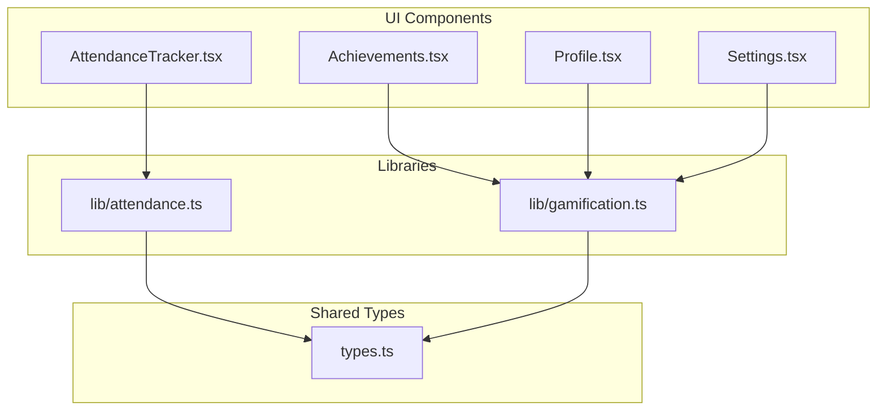
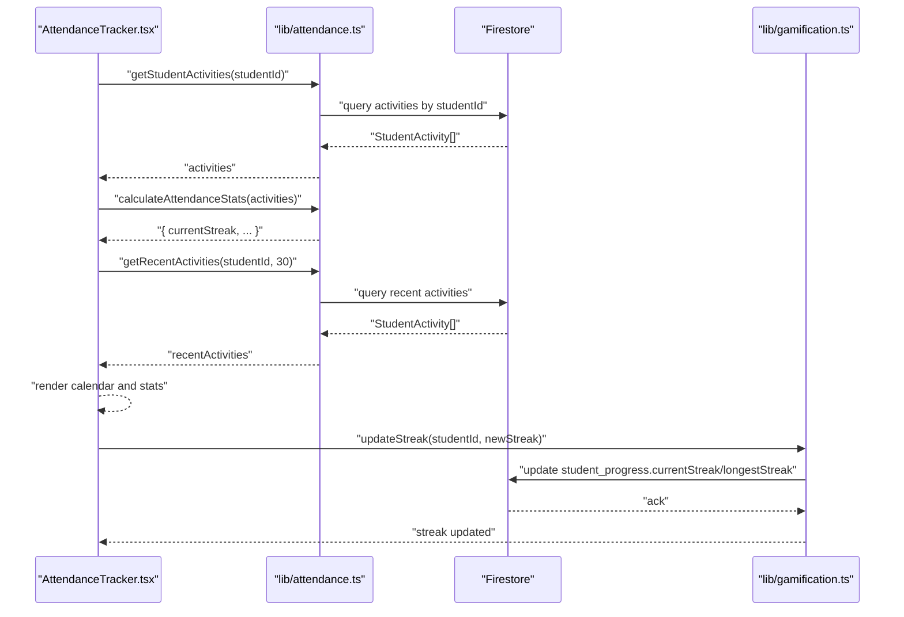
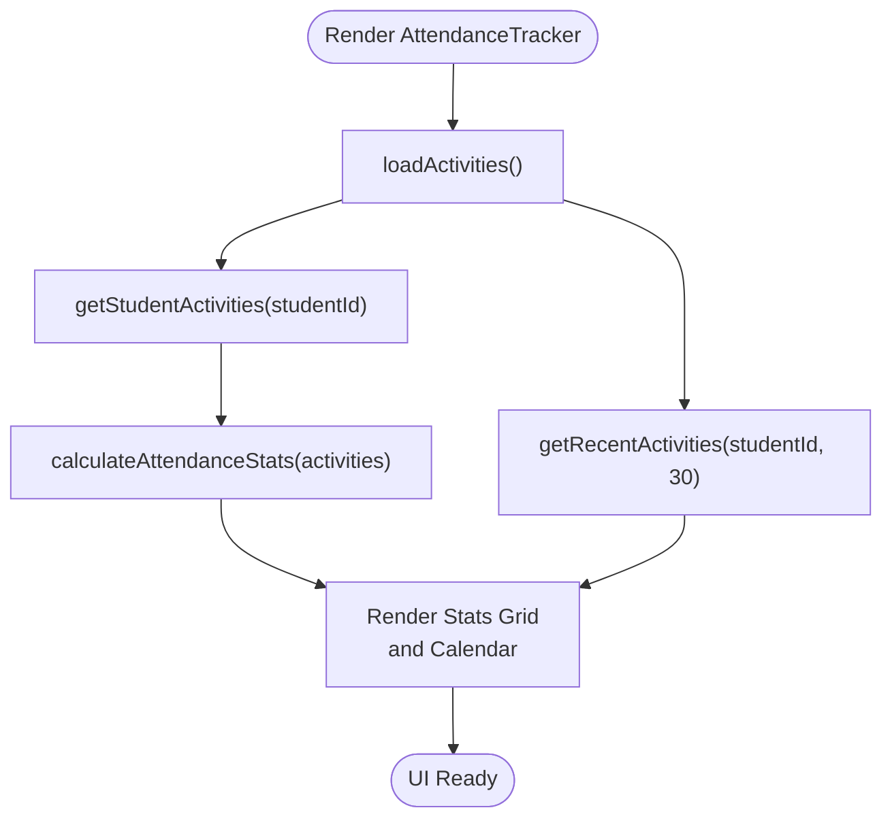
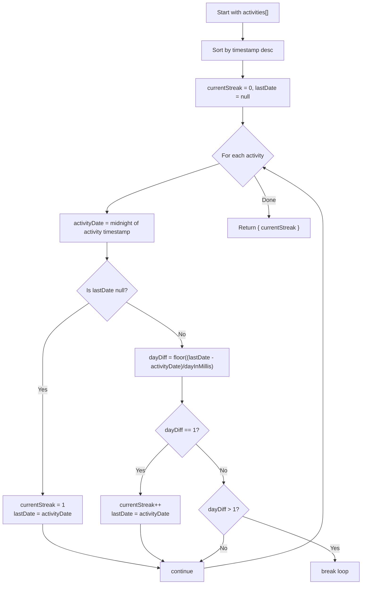
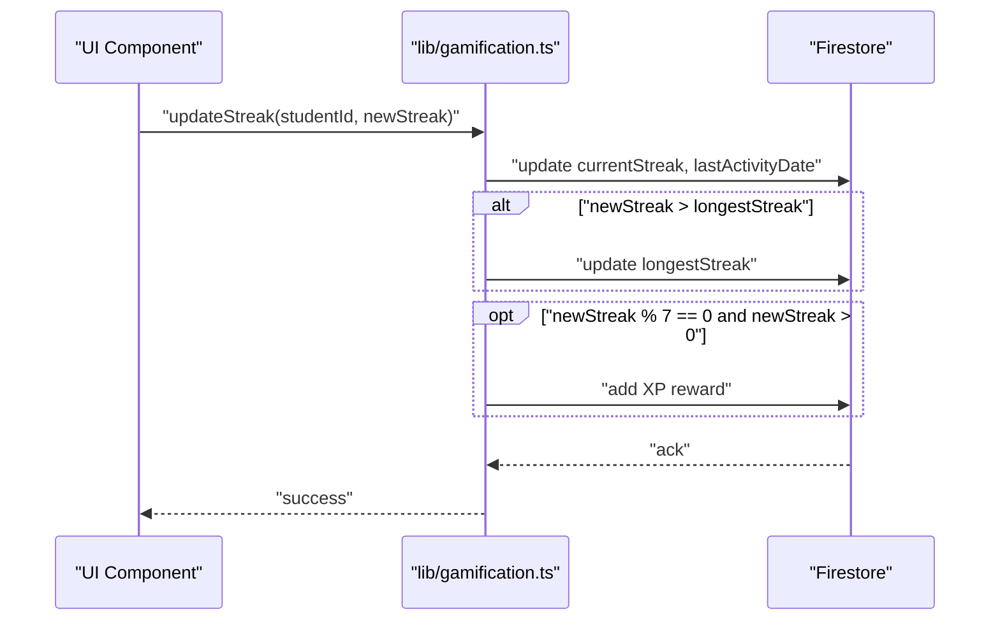
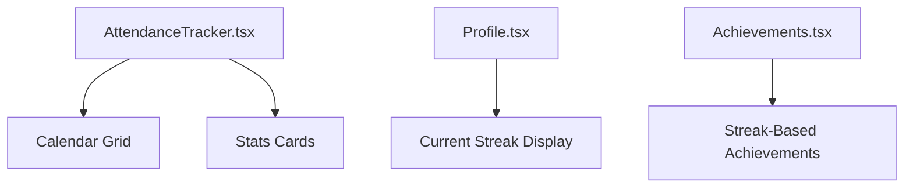
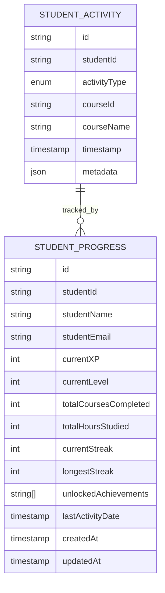
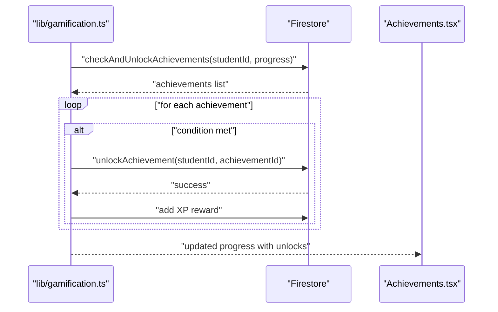
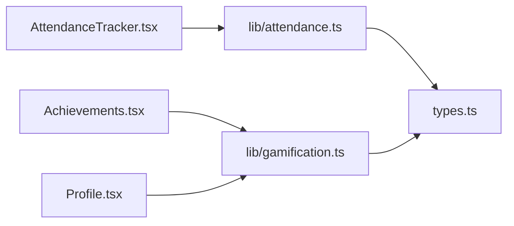
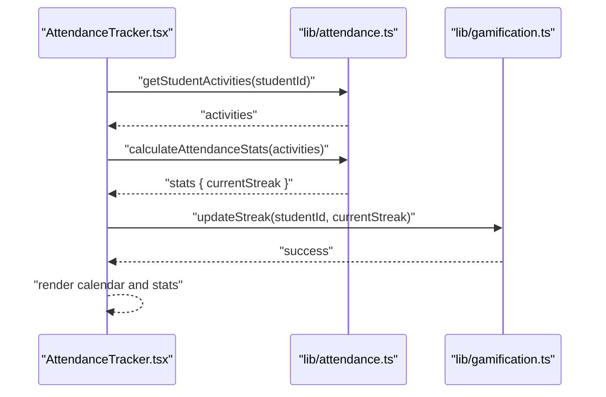

# Streak Tracking

<cite>
**Referenced Files in This Document**
- [AttendanceTracker.tsx](file://components/AttendanceTracker.tsx)
- [attendance.ts](file://lib/attendance.ts)
- [gamification.ts](file://lib/gamification.ts)
- [Achievements.tsx](file://components/Achievements.tsx)
- [Profile.tsx](file://components/Profile.tsx)
- [Settings.tsx](file://components/Settings.tsx)
- [types.ts](file://types.ts)
</cite>

## Table of Contents
1. [Introduction](#introduction)
2. [Project Structure](#project-structure)
3. [Core Components](#core-components)
4. [Architecture Overview](#architecture-overview)
5. [Detailed Component Analysis](#detailed-component-analysis)
6. [Dependency Analysis](#dependency-analysis)
7. [Performance Considerations](#performance-considerations)
8. [Troubleshooting Guide](#troubleshooting-guide)
9. [Conclusion](#conclusion)
10. [Appendices](#appendices)

## Introduction
This document explains the streak tracking system used to monitor daily attendance, compute current and longest streaks, and integrate streak data with gamification and achievements. It covers:
- Daily attendance monitoring via activity logs
- Streak calculation algorithms and date-based logic
- Habit formation tracking and streak visualization
- Streak preservation mechanisms (grace period, recovery, and milestones)
- Streak visualization components and progress indicators
- Streak-related achievements and XP bonuses
- Examples of streak data models and integration with attendance records
- Psychological impact on retention and best practices
- Streak reset scenarios, data synchronization, and statistics reporting

## Project Structure
The streak tracking system spans UI components, data libraries, and shared types:
- UI components render streak stats, calendar views, and achievements
- Libraries manage activity logging, streak computation, and progress updates
- Types define the data models for activities and progress

**Diagram sources**
- [AttendanceTracker.tsx](file://components/AttendanceTracker.tsx#L1-L249)
- [attendance.ts](file://lib/attendance.ts#L1-L177)
- [gamification.ts](file://lib/gamification.ts#L1-L349)
- [Achievements.tsx](file://components/Achievements.tsx#L1-L346)
- [Profile.tsx](file://components/Profile.tsx#L1-L386)
- [Settings.tsx](file://components/Settings.tsx#L1-L200)
- [types.ts](file://types.ts#L84-L125)

**Section sources**
- [AttendanceTracker.tsx](file://components/AttendanceTracker.tsx#L1-L249)
- [attendance.ts](file://lib/attendance.ts#L1-L177)
- [gamification.ts](file://lib/gamification.ts#L1-L349)
- [Achievements.tsx](file://components/Achievements.tsx#L1-L346)
- [Profile.tsx](file://components/Profile.tsx#L1-L386)
- [Settings.tsx](file://components/Settings.tsx#L1-L200)
- [types.ts](file://types.ts#L84-L125)

## Core Components
- AttendanceTracker: Renders recent activity calendar, streak stats, and recent activity list.
- attendance.ts: Logs activities, fetches student/course activities, computes attendance stats including streaks, and filters recent activities.
- gamification.ts: Manages XP, level progression, streak updates, achievement checks, and leaderboard retrieval.
- Achievements: Displays unlocked/locked achievements, progress bars, and leaderboard.
- Profile: Shows current streak and other stats in the user profile.
- Settings: Defines configurable streak rules (e.g., grace period, timezone, bonus multiplier).
- types.ts: Declares StudentActivity and StudentProgress models used across the system.

Key responsibilities:
- AttendanceTracker orchestrates UI rendering and calls attendance library functions to compute stats and recent activities.
- attendance.ts calculates streaks by scanning sorted activity timestamps and counting consecutive days.
- gamification.ts updates current and longest streaks, awards XP bonuses on milestones, and checks for achievement unlocks.
- Achievements and Profile consume StudentProgress to visualize streaks and related metrics.
- Settings exposes admin-configurable streak parameters.

**Section sources**
- [AttendanceTracker.tsx](file://components/AttendanceTracker.tsx#L12-L37)
- [attendance.ts](file://lib/attendance.ts#L122-L161)
- [gamification.ts](file://lib/gamification.ts#L131-L161)
- [Achievements.tsx](file://components/Achievements.tsx#L10-L32)
- [Profile.tsx](file://components/Profile.tsx#L158-L163)
- [Settings.tsx](file://components/Settings.tsx#L108-L112)
- [types.ts](file://types.ts#L84-L125)

## Architecture Overview
The streak tracking pipeline integrates UI, persistence, and gamification logic.

**Diagram sources**
- [AttendanceTracker.tsx](file://components/AttendanceTracker.tsx#L24-L37)
- [attendance.ts](file://lib/attendance.ts#L32-L62)
- [attendance.ts](file://lib/attendance.ts#L122-L161)
- [attendance.ts](file://lib/attendance.ts#L163-L176)
- [gamification.ts](file://lib/gamification.ts#L131-L161)

## Detailed Component Analysis

### AttendanceTracker: Daily Monitoring and Visualization
- Loads activities and recent activities for a student.
- Computes stats including currentStreak using attendance.ts.
- Renders a 30-day calendar grid where each cell reflects whether an activity occurred on that day.
- Displays recent activities with icons and labels.

**Diagram sources**
- [AttendanceTracker.tsx](file://components/AttendanceTracker.tsx#L24-L37)
- [attendance.ts](file://lib/attendance.ts#L32-L62)
- [attendance.ts](file://lib/attendance.ts#L122-L161)
- [attendance.ts](file://lib/attendance.ts#L163-L176)

**Section sources**
- [AttendanceTracker.tsx](file://components/AttendanceTracker.tsx#L24-L37)
- [AttendanceTracker.tsx](file://components/AttendanceTracker.tsx#L66-L88)
- [AttendanceTracker.tsx](file://components/AttendanceTracker.tsx#L146-L205)

### Streak Calculation Algorithm
The algorithm counts consecutive calendar days by:
- Sorting activities by timestamp descending
- Iterating from the most recent activity
- Comparing each activity’s date (midnight UTC-equivalent) to the previous date
- Incrementing the streak if the difference is exactly one day; stopping otherwise

**Diagram sources**
- [attendance.ts](file://lib/attendance.ts#L127-L152)

**Section sources**
- [attendance.ts](file://lib/attendance.ts#L127-L152)

### Streak Updates and Milestones
- updateStreak writes the new current streak and updates longest streak if exceeded.
- Awards XP bonus every 7 days of streak (milestone celebration).
- Integrates with achievement checks to unlock streak-based badges.

**Diagram sources**
- [gamification.ts](file://lib/gamification.ts#L131-L161)

**Section sources**
- [gamification.ts](file://lib/gamification.ts#L131-L161)

### Streak Visualization and Progress Indicators
- AttendanceTracker renders a 30-day grid with color-coded cells indicating activity presence per day.
- Stats grid displays currentStreak prominently.
- Profile shows current streak in the user stats panel.
- Achievements lists streak-based milestones and progress toward locked streak achievements.

**Diagram sources**
- [AttendanceTracker.tsx](file://components/AttendanceTracker.tsx#L100-L144)
- [AttendanceTracker.tsx](file://components/AttendanceTracker.tsx#L146-L205)
- [Profile.tsx](file://components/Profile.tsx#L245-L253)
- [Achievements.tsx](file://components/Achievements.tsx#L115-L191)

**Section sources**
- [AttendanceTracker.tsx](file://components/AttendanceTracker.tsx#L100-L144)
- [AttendanceTracker.tsx](file://components/AttendanceTracker.tsx#L146-L205)
- [Profile.tsx](file://components/Profile.tsx#L245-L253)
- [Achievements.tsx](file://components/Achievements.tsx#L115-L191)

### Streak Data Models
- StudentActivity: Represents a single learning activity with type, courseId, courseName, timestamp, and metadata.
- StudentProgress: Tracks XP, level, course totals, current/longest streaks, and unlocked achievements.

**Diagram sources**
- [types.ts](file://types.ts#L84-L93)
- [types.ts](file://types.ts#L109-L125)

**Section sources**
- [types.ts](file://types.ts#L84-L93)
- [types.ts](file://types.ts#L109-L125)

### Streak Preservation Mechanisms
- Grace period: Admins can configure a grace period (e.g., hours) to preserve streaks after a missed day within policy.
- Recovery: When a user resumes, the streak restarts from the last valid day; the system does not automatically extend beyond the computed consecutive day count.
- Milestone celebrations: Every 7-day increment grants XP rewards, encouraging continued streak maintenance.

Note: The current implementation computes streaks based on strict consecutive day logic. Grace period and recovery policies are configurable in Settings and intended to guide administrative behavior and UX messaging.

**Section sources**
- [Settings.tsx](file://components/Settings.tsx#L108-L112)
- [gamification.ts](file://lib/gamification.ts#L149-L152)

### Streak Bonus Systems and Achievements
- XP bonus: Awarded when the streak reaches multiples of 7.
- Achievements: Streak-based conditions trigger unlocks (e.g., “Dedicated Learner” for 7-day streak, “Unstoppable” for 30-day streak).
- Achievement checks run against current progress to unlock new badges and award XP.

**Diagram sources**
- [gamification.ts](file://lib/gamification.ts#L232-L275)
- [gamification.ts](file://lib/gamification.ts#L163-L195)

**Section sources**
- [gamification.ts](file://lib/gamification.ts#L10-L17)
- [gamification.ts](file://lib/gamification.ts#L232-L275)
- [gamification.ts](file://lib/gamification.ts#L163-L195)

### Integration with Attendance Records
- Activities are logged with timestamps and types (e.g., course_completed, mindful_flow).
- Attendance stats derive from these records, including counts and current streak.
- Recent activities feed the calendar visualization and recent activity list.

**Section sources**
- [attendance.ts](file://lib/attendance.ts#L7-L30)
- [attendance.ts](file://lib/attendance.ts#L32-L62)
- [attendance.ts](file://lib/attendance.ts#L122-L161)

### Streak Reset Scenarios
- Reset occurs when a day is skipped beyond the configured grace period.
- Longest streak persists independently and is updated when exceeded.
- Administrative controls (e.g., auto-delete inactive accounts) indirectly influence streak continuity by affecting account activity.

**Section sources**
- [Settings.tsx](file://components/Settings.tsx#L78-L79)
- [gamification.ts](file://lib/gamification.ts#L139-L147)

### Data Synchronization Across Devices
- All streak and progress data is stored in Firestore, ensuring cross-device consistency.
- Components fetch latest data on mount and periodically refresh to reflect real-time changes.

**Section sources**
- [gamification.ts](file://lib/gamification.ts#L43-L64)
- [Profile.tsx](file://components/Profile.tsx#L20-L26)

### Streak Statistics Reporting
- Current and longest streaks are part of StudentProgress.
- Leaderboard queries rank students by XP and display current streaks.
- Achievements report progress percentages toward streak milestones.

**Section sources**
- [gamification.ts](file://lib/gamification.ts#L278-L302)
- [Achievements.tsx](file://components/Achievements.tsx#L193-L340)

## Dependency Analysis
The system exhibits clear separation of concerns:
- UI depends on attendance and gamification libraries
- Libraries depend on Firestore for persistence
- Types unify data contracts across modules

**Diagram sources**
- [AttendanceTracker.tsx](file://components/AttendanceTracker.tsx#L1-L10)
- [attendance.ts](file://lib/attendance.ts#L1-L5)
- [Achievements.tsx](file://components/Achievements.tsx#L1-L8)
- [gamification.ts](file://lib/gamification.ts#L1-L6)
- [types.ts](file://types.ts#L84-L125)

**Section sources**
- [AttendanceTracker.tsx](file://components/AttendanceTracker.tsx#L1-L10)
- [attendance.ts](file://lib/attendance.ts#L1-L5)
- [Achievements.tsx](file://components/Achievements.tsx#L1-L8)
- [gamification.ts](file://lib/gamification.ts#L1-L6)
- [types.ts](file://types.ts#L84-L125)

## Performance Considerations
- Calendar rendering: The 30-day grid iterates over fixed dates; keep rendering optimized by avoiding unnecessary re-computations.
- Activity queries: Fetch recent activities with a bounded window to reduce payload size.
- Streak computation: Sorting and iteration are linear in the number of activities; ensure efficient Firestore indexing on timestamp and studentId.
- Periodic refresh: Profile auto-refreshes every 10 seconds; consider debouncing or throttling in high-traffic scenarios.

## Troubleshooting Guide
Common issues and resolutions:
- Streak not updating: Verify that updateStreak is called with the computed value and that Firestore writes succeed.
- Incorrect calendar highlights: Confirm date normalization to midnight and locale/timezone considerations.
- Achievement not unlocking: Ensure checkAndUnlockAchievements runs after progress updates and that thresholds match current progress.
- Missing recent activities: Validate getRecentActivities date range and query filters.

**Section sources**
- [gamification.ts](file://lib/gamification.ts#L131-L161)
- [attendance.ts](file://lib/attendance.ts#L163-L176)
- [Achievements.tsx](file://components/Achievements.tsx#L20-L32)

## Conclusion
The streak tracking system combines precise date-based streak computation, robust gamification mechanics, and intuitive UI visualization. Administrators can configure grace periods and recovery policies, while users benefit from XP bonuses and milestone achievements that reinforce habit formation. With Firestore-backed persistence and periodic synchronization, streak data remains consistent across devices and supports meaningful reporting and social motivation via leaderboards.

## Appendices

### Example Workflows

#### Computing and Displaying a Streak

**Diagram sources**
- [AttendanceTracker.tsx](file://components/AttendanceTracker.tsx#L24-L37)
- [attendance.ts](file://lib/attendance.ts#L122-L161)
- [gamification.ts](file://lib/gamification.ts#L131-L161)

### Streak Data Model Definitions
- StudentActivity: Fields include identifiers, type, course linkage, timestamp, and metadata.
- StudentProgress: Fields include XP, level, totals, current/longest streaks, and achievement unlocks.

**Section sources**
- [types.ts](file://types.ts#L84-L93)
- [types.ts](file://types.ts#L109-L125)