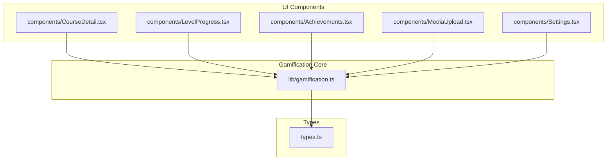
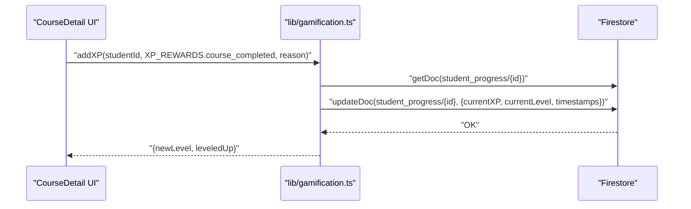
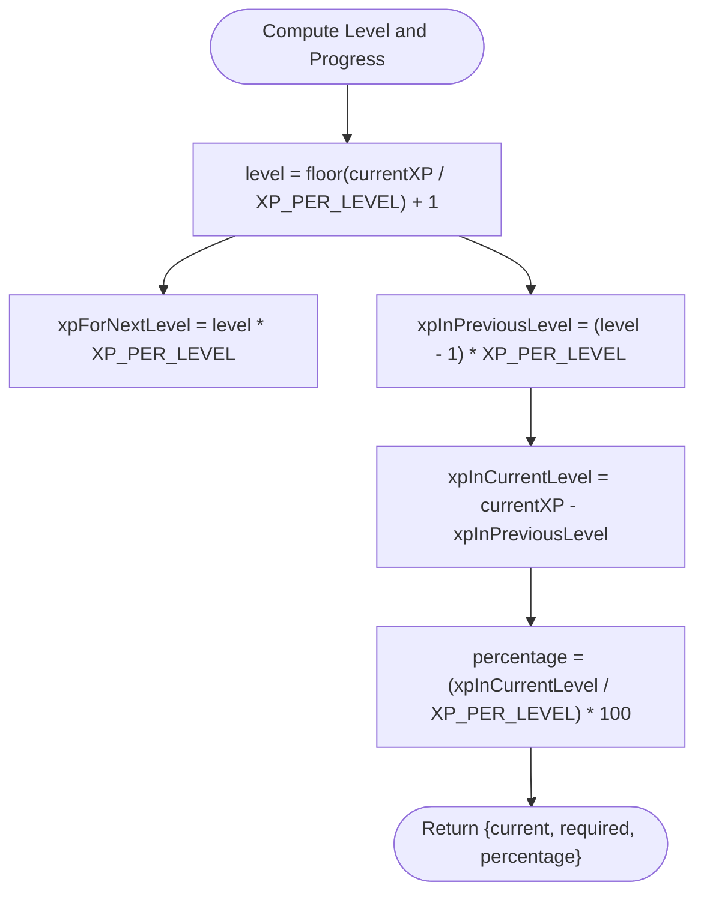
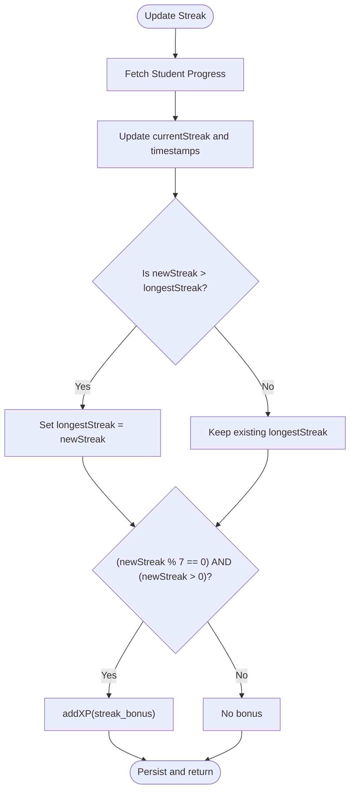
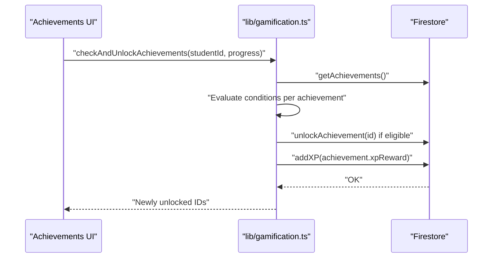
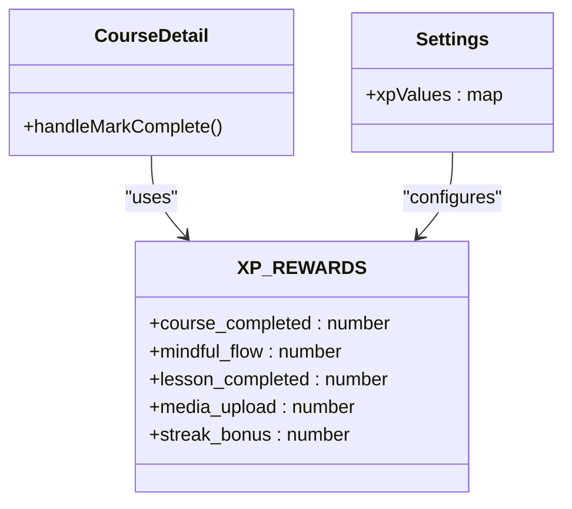
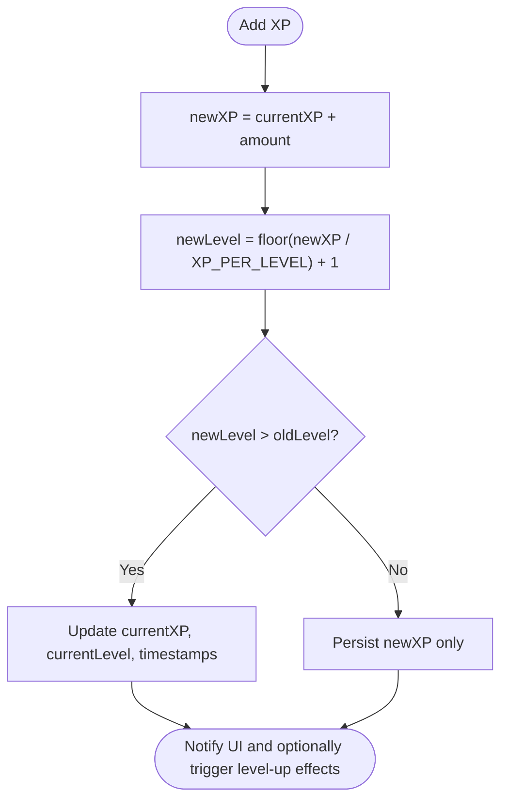
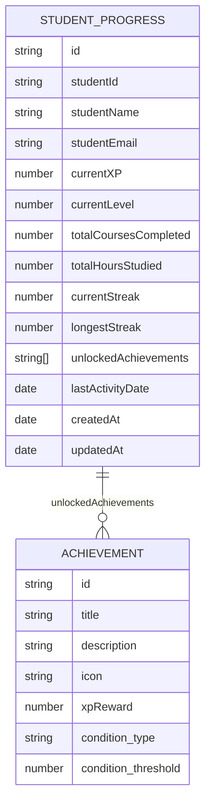
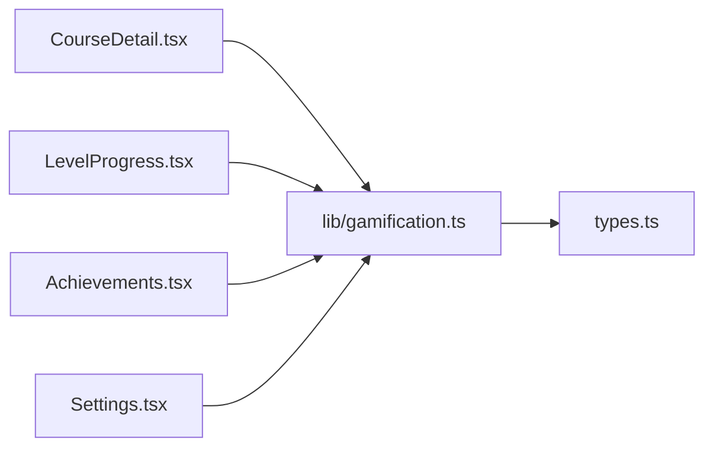

# XP Reward Mechanics

<cite>
**Referenced Files in This Document**
- [gamification.ts](file://lib/gamification.ts)
- [Achievements.tsx](file://components/Achievements.tsx)
- [LevelProgress.tsx](file://components/LevelProgress.tsx)
- [CourseDetail.tsx](file://components/CourseDetail.tsx)
- [MediaUpload.tsx](file://components/MediaUpload.tsx)
- [Settings.tsx](file://components/Settings.tsx)
- [types.ts](file://types.ts)
</cite>

## Table of Contents
1. [Introduction](#introduction)
2. [Project Structure](#project-structure)
3. [Core Components](#core-components)
4. [Architecture Overview](#architecture-overview)
5. [Detailed Component Analysis](#detailed-component-analysis)
6. [Dependency Analysis](#dependency-analysis)
7. [Performance Considerations](#performance-considerations)
8. [Troubleshooting Guide](#troubleshooting-guide)
9. [Conclusion](#conclusion)

## Introduction
This document explains the XP reward system in Fluentoria, detailing how experience points are calculated, rewarded, and consumed across learning activities. It covers the XP accumulation process, level progression mechanics, streak bonuses, achievement-based XP rewards, and administrative configuration capabilities. It also outlines the mathematical formulas used for XP scaling and leveling, and provides guidance for maintaining balanced XP economics to sustain long-term player engagement.

## Project Structure
The XP system spans several modules:
- Core logic resides in a dedicated gamification library that defines XP rewards, calculates levels, manages progress, and handles streak and achievement unlocks.
- UI components visualize progress, leaderboard, and achievements.
- Administrative settings enable dynamic configuration of XP values and level caps.
- Types define the data structures used across the system.

**Diagram sources**
- [gamification.ts](file://lib/gamification.ts#L1-L349)
- [LevelProgress.tsx](file://components/LevelProgress.tsx#L1-L73)
- [Achievements.tsx](file://components/Achievements.tsx#L1-L346)
- [CourseDetail.tsx](file://components/CourseDetail.tsx#L1-L526)
- [MediaUpload.tsx](file://components/MediaUpload.tsx#L1-L589)
- [Settings.tsx](file://components/Settings.tsx#L800-L915)
- [types.ts](file://types.ts#L1-L125)

**Section sources**
- [gamification.ts](file://lib/gamification.ts#L1-L349)
- [types.ts](file://types.ts#L95-L125)

## Core Components
- XP Rewards and Level Calculation
  - XP per level is constant, enabling linear scaling of experience thresholds.
  - Level calculation uses integer division of total XP by XP_PER_LEVEL plus one.
  - XP needed for the next level equals current level multiplied by XP_PER_LEVEL.
  - Progress within a level is computed as current XP minus XP in the previous level, with a percentage derived from the progress divided by XP_PER_LEVEL.

- Student Progress Management
  - Retrieves and creates student progress documents with initial XP, level, and streak metrics.
  - Adds XP atomically and updates timestamps and level accordingly.
  - Updates streaks and awards periodic streak bonuses.

- Achievement System
  - Defines achievement conditions (course count, streak days, hours studied, first course).
  - Automatically checks and unlocks achievements when conditions are met.
  - Awards XP when achievements are unlocked.

- Leaderboard
  - Sorts students by current XP descending to compute rankings.

**Section sources**
- [gamification.ts](file://lib/gamification.ts#L9-L40)
- [gamification.ts](file://lib/gamification.ts#L43-L98)
- [gamification.ts](file://lib/gamification.ts#L100-L129)
- [gamification.ts](file://lib/gamification.ts#L131-L161)
- [gamification.ts](file://lib/gamification.ts#L163-L195)
- [gamification.ts](file://lib/gamification.ts#L197-L275)
- [gamification.ts](file://lib/gamification.ts#L277-L302)

## Architecture Overview
The XP system follows a clean separation of concerns:
- Data model: StudentProgress and Achievement types encapsulate state and conditions.
- Business logic: gamification.ts centralizes XP math, level computation, streak handling, and achievement checks.
- UI integration: Components consume the gamification APIs to render progress, leaderboard, and achievements.
- Administration: Settings allow operators to adjust XP values and level caps dynamically.

**Diagram sources**
- [CourseDetail.tsx](file://components/CourseDetail.tsx#L128-L146)
- [gamification.ts](file://lib/gamification.ts#L100-L129)

## Detailed Component Analysis

### XP Calculation and Level Progression
- XP per level: Constant value determines the experience threshold for each level.
- Level calculation: Level equals floor(total XP / XP_PER_LEVEL) + 1.
- XP for next level: Level × XP_PER_LEVEL.
- Progress within level: Current XP minus XP in the previous level, with a percentage computed as progress / XP_PER_LEVEL × 100.

**Diagram sources**
- [gamification.ts](file://lib/gamification.ts#L19-L40)

**Section sources**
- [gamification.ts](file://lib/gamification.ts#L9-L40)

### Streak Bonuses and Decay Considerations
- Streak tracking updates current and longest streaks.
- Every seven-day increment awards a fixed streak bonus.
- No explicit XP decay mechanism is present in the current implementation.

**Diagram sources**
- [gamification.ts](file://lib/gamification.ts#L131-L161)

**Section sources**
- [gamification.ts](file://lib/gamification.ts#L131-L161)

### Achievement-Based XP Rewards
- Achievement conditions include course count, streak days, hours studied, and first course.
- When conditions are met, achievements unlock automatically and grant XP.
- Achievement definitions include XP rewards and icons for visual feedback.

**Diagram sources**
- [Achievements.tsx](file://components/Achievements.tsx#L20-L32)
- [gamification.ts](file://lib/gamification.ts#L232-L275)
- [gamification.ts](file://lib/gamification.ts#L163-L195)

**Section sources**
- [gamification.ts](file://lib/gamification.ts#L197-L275)
- [Achievements.tsx](file://components/Achievements.tsx#L34-L56)

### Activity-Based XP Generation
- Course completion: Awards a fixed amount upon marking a course complete.
- Mindful flow: Configurable XP value via admin settings.
- Media upload: Configurable XP value via admin settings.
- Lesson completion: Defined in XP rewards but not explicitly called in the provided CourseDetail.tsx; ensure logging and XP awarding align with intended gameplay.

**Diagram sources**
- [gamification.ts](file://lib/gamification.ts#L10-L17)
- [CourseDetail.tsx](file://components/CourseDetail.tsx#L128-L146)
- [Settings.tsx](file://components/Settings.tsx#L813-L871)

**Section sources**
- [gamification.ts](file://lib/gamification.ts#L10-L17)
- [CourseDetail.tsx](file://components/CourseDetail.tsx#L128-L146)
- [Settings.tsx](file://components/Settings.tsx#L813-L871)

### Level-Up System and Progression Milestones
- Experience thresholds: Each level requires exactly XP_PER_LEVEL more XP than the previous level.
- Level bonuses: None explicitly defined; XP rewards remain static across levels.
- Progress milestones: Visualized via progress bars and percentage displays.

**Diagram sources**
- [gamification.ts](file://lib/gamification.ts#L100-L129)

**Section sources**
- [gamification.ts](file://lib/gamification.ts#L19-L40)
- [gamification.ts](file://lib/gamification.ts#L100-L129)
- [LevelProgress.tsx](file://components/LevelProgress.tsx#L12-L70)

### Data Models
- StudentProgress: Tracks XP, level, courses completed, study hours, streaks, and unlocked achievements.
- Achievement: Defines conditions, XP reward, and metadata for unlocking.

**Diagram sources**
- [types.ts](file://types.ts#L108-L125)
- [types.ts](file://types.ts#L95-L106)

**Section sources**
- [types.ts](file://types.ts#L95-L125)

## Dependency Analysis
- CourseDetail depends on gamification.addXP and XP_REWARDS to award XP on course completion.
- LevelProgress consumes getXPProgress to render progress visuals.
- Achievements integrates with gamification to fetch and evaluate achievements and to update leaderboard data.
- Settings enables dynamic configuration of XP values and level caps, influencing the entire XP economy.

**Diagram sources**
- [CourseDetail.tsx](file://components/CourseDetail.tsx#L10-L11)
- [LevelProgress.tsx](file://components/LevelProgress.tsx#L3)
- [Achievements.tsx](file://components/Achievements.tsx#L4)
- [Settings.tsx](file://components/Settings.tsx#L813-L871)
- [gamification.ts](file://lib/gamification.ts#L1-L349)
- [types.ts](file://types.ts#L95-L125)

**Section sources**
- [CourseDetail.tsx](file://components/CourseDetail.tsx#L10-L11)
- [LevelProgress.tsx](file://components/LevelProgress.tsx#L3)
- [Achievements.tsx](file://components/Achievements.tsx#L4)
- [Settings.tsx](file://components/Settings.tsx#L813-L871)
- [gamification.ts](file://lib/gamification.ts#L1-L349)
- [types.ts](file://types.ts#L95-L125)

## Performance Considerations
- Level computations are O(1) arithmetic operations, negligible overhead.
- Firestore reads/writes for progress updates are infrequent and localized, minimizing latency.
- Achievement checks iterate through stored achievements; keep the achievement list concise for optimal performance.
- UI rendering leverages memoization-friendly progress calculations; avoid unnecessary re-renders by passing stable props.

## Troubleshooting Guide
- XP not increasing after completing an activity
  - Verify that the activity handler calls the appropriate gamification function and passes the correct XP reward value.
  - Confirm that addXP resolves successfully and timestamps are updated.

- Streak bonus not awarded
  - Ensure updateStreak is invoked with increments divisible by seven and that the streak threshold is exceeded.
  - Check that addXP is called with the streak bonus value.

- Achievement not unlocking
  - Confirm that checkAndUnlockAchievements runs after progress updates and that conditions match current progress.
  - Verify that the achievement exists in Firestore and that the student has not already unlocked it.

- Leaderboard ordering incorrect
  - Ensure getLeaderboard sorts by currentXP in descending order and trims to the desired limit.

**Section sources**
- [gamification.ts](file://lib/gamification.ts#L100-L129)
- [gamification.ts](file://lib/gamification.ts#L131-L161)
- [gamification.ts](file://lib/gamification.ts#L232-L275)
- [gamification.ts](file://lib/gamification.ts#L277-L302)

## Conclusion
Fluentoria’s XP reward system employs a straightforward, linear progression model with configurable activity-based rewards and periodic streak bonuses. The gamification library centralizes XP math and progress management, while UI components provide clear feedback on progress and achievements. Administrators can tune XP values and level caps to balance challenge and motivation. To maintain engagement, consider introducing diminishing returns for repetitive actions, milestone bonuses, and seasonal events that amplify XP gains during key learning periods.