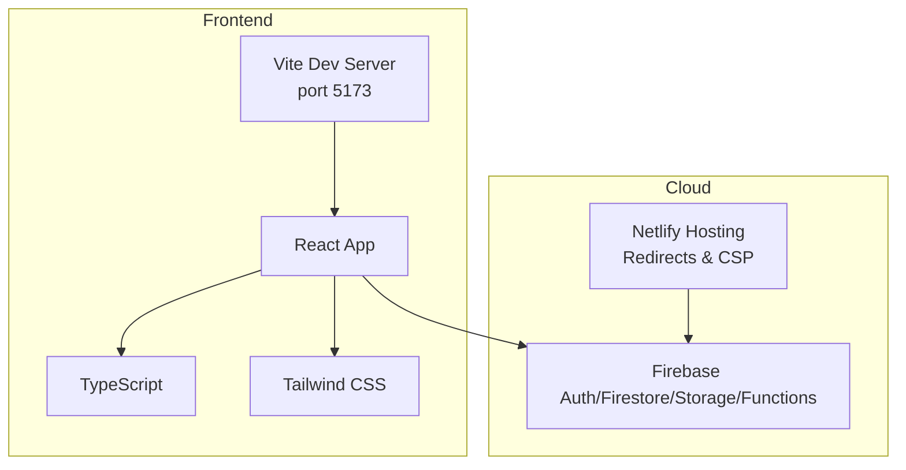
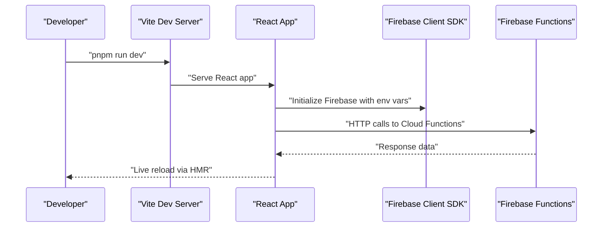
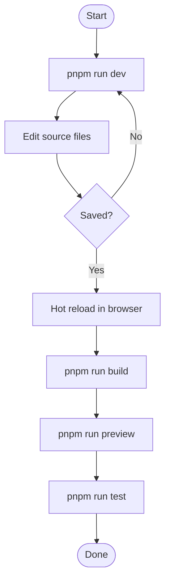
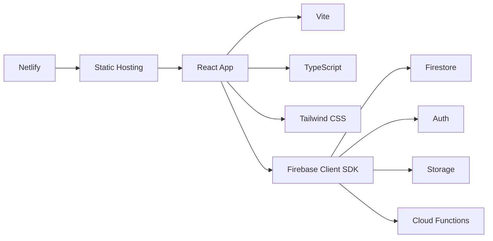

# Getting Started

<cite>
**Referenced Files in This Document**
- [README.md](file://README.md)
- [package.json](file://package.json)
- [vite.config.ts](file://vite.config.ts)
- [tsconfig.json](file://tsconfig.json)
- [tailwind.config.js](file://tailwind.config.js)
- [postcss.config.js](file://postcss.config.js)
- [netlify.toml](file://netlify.toml)
- [firebase.json](file://firebase.json)
- [lib/firebase.ts](file://lib/firebase.ts)
- [lib/db/config.ts](file://lib/db/config.ts)
- [functions/src/index.js](file://functions/src/index.js)
- [implementation_plan.md](file://implementation_plan.md)
</cite>

## Table of Contents
1. [Introduction](#introduction)
2. [Project Structure](#project-structure)
3. [Core Components](#core-components)
4. [Architecture Overview](#architecture-overview)
5. [Detailed Component Analysis](#detailed-component-analysis)
6. [Dependency Analysis](#dependency-analysis)
7. [Performance Considerations](#performance-considerations)
8. [Troubleshooting Guide](#troubleshooting-guide)
9. [Conclusion](#conclusion)
10. [Appendices](#appendices)

## Introduction
This guide helps you set up a development environment for Fluentoria, a React-based learning platform integrated with Firebase and Netlify. It covers prerequisites, installation, environment configuration, development workflow, production build and preview, testing, and troubleshooting. The project uses Vite for the dev server and build pipeline, TypeScript for type safety, Tailwind CSS for styling, and Firebase for authentication, Firestore, Storage, and Cloud Functions. Netlify is used for hosting and static assets, with serverless functions for backend tasks.

## Project Structure
Fluentoria follows a frontend-first structure with integrated backend functions and cloud configuration:
- Frontend: React application built with Vite and TypeScript
- Styling: Tailwind CSS with PostCSS
- Backend: Firebase Cloud Functions (Node.js)
- Hosting: Netlify with redirects and CSP headers
- Cloud: Firebase configuration for Firestore, Storage, and Functions

**Diagram sources**
- [vite.config.ts](file://vite.config.ts#L8-L20)
- [lib/firebase.ts](file://lib/firebase.ts#L1-L25)
- [netlify.toml](file://netlify.toml#L1-L65)

**Section sources**
- [README.md](file://README.md#L23-L31)
- [package.json](file://package.json#L6-L12)
- [vite.config.ts](file://vite.config.ts#L1-L33)
- [tsconfig.json](file://tsconfig.json#L1-L30)
- [tailwind.config.js](file://tailwind.config.js#L1-L72)
- [postcss.config.js](file://postcss.config.js#L1-L7)
- [netlify.toml](file://netlify.toml#L1-L65)
- [firebase.json](file://firebase.json#L1-L20)

## Core Components
- Package scripts: development, build, preview, and test commands are defined in the package manifest.
- Vite configuration: defines dev server, HMR, environment variable exposure, and path aliases.
- TypeScript configuration: module resolution, JSX transform, and path mapping.
- Tailwind and PostCSS: styling pipeline and theme customization.
- Netlify configuration: build commands, environment, redirects, and security headers.
- Firebase configuration: Firestore and Storage rules, Functions codebase definition.
- Firebase client initialization: environment variables for app config.
- Implementation plan: outlines multi-product architecture and user-course mapping.

**Section sources**
- [package.json](file://package.json#L6-L12)
- [vite.config.ts](file://vite.config.ts#L5-L32)
- [tsconfig.json](file://tsconfig.json#L1-L30)
- [tailwind.config.js](file://tailwind.config.js#L1-L72)
- [postcss.config.js](file://postcss.config.js#L1-L7)
- [netlify.toml](file://netlify.toml#L1-L65)
- [firebase.json](file://firebase.json#L1-L20)
- [lib/firebase.ts](file://lib/firebase.ts#L7-L14)

## Architecture Overview
The development stack integrates React frontend, Vite dev server, Firebase client SDK, and Firebase Functions. Netlify handles hosting and static asset delivery with CSP and redirect rules.

**Diagram sources**
- [README.md](file://README.md#L25-L31)
- [vite.config.ts](file://vite.config.ts#L8-L20)
- [lib/firebase.ts](file://lib/firebase.ts#L1-L25)
- [functions/src/index.js](file://functions/src/index.js#L144-L339)

## Detailed Component Analysis

### Prerequisites
- Node.js: The project targets a modern runtime; Netlify pins Node version for builds.
- pnpm: The project uses pnpm lock files and scripts.
- Firebase CLI: Required to deploy Functions and manage Firebase resources.

Environment variables used by the app:
- Firebase client-side: VITE_FIREBASE_* variables for API key, auth domain, project ID, storage bucket, messaging sender ID, and app ID.
- Gemini AI: GEMINI_API_KEY is exposed to the app via Vite’s define mechanism.

Environment variables used by Firebase Functions:
- asaas.webhook_token: Secret token for verifying Asaas webhooks.

Environment variables used by Netlify:
- NODE_VERSION: pinned to 20 for build consistency.

**Section sources**
- [lib/firebase.ts](file://lib/firebase.ts#L7-L14)
- [vite.config.ts](file://vite.config.ts#L22-L25)
- [functions/src/index.js](file://functions/src/index.js#L162-L179)
- [netlify.toml](file://netlify.toml#L6-L7)

### Step-by-Step Installation
1. Install dependencies
   - Use pnpm to install all dependencies as defined in the manifest.
2. Start the development server
   - Run the dev script to launch Vite with hot module replacement.
3. Build for production
   - Run the build script to generate the optimized static bundle.
4. Preview the production build locally
   - Use the preview script to serve the built assets.

Verification steps:
- Confirm the dev server starts on port 5173.
- Open the app in a browser and verify UI loads.
- Check that environment variables are applied (e.g., Firebase SDK initializes).

**Section sources**
- [README.md](file://README.md#L25-L31)
- [package.json](file://package.json#L6-L12)
- [vite.config.ts](file://vite.config.ts#L8-L20)

### Environment Setup and Configuration
- Set Firebase client environment variables in your Vite environment files so the app can initialize Firebase at runtime.
- Configure Gemini AI API key if you intend to use AI features.
- For Firebase Functions, configure the asaas.webhook_token using Firebase Functions config.
- Netlify build environment is already configured to use Node 20.

Key configuration files:
- Vite: dev server, HMR, environment variable exposure, and path alias.
- TypeScript: module resolution, JSX transform, and path mapping.
- Tailwind: content globs, theme extensions, and plugin configuration.
- PostCSS: Tailwind and Autoprefixer plugins.
- Netlify: build command, environment, redirects, and headers.
- Firebase: Firestore and Storage rules, Functions codebase.

**Section sources**
- [vite.config.ts](file://vite.config.ts#L5-L32)
- [tsconfig.json](file://tsconfig.json#L1-L30)
- [tailwind.config.js](file://tailwind.config.js#L1-L72)
- [postcss.config.js](file://postcss.config.js#L1-L7)
- [netlify.toml](file://netlify.toml#L1-L65)
- [firebase.json](file://firebase.json#L1-L20)

### Development Workflow
- Run the dev server: launches Vite with HMR enabled.
- Build for production: generates optimized assets for deployment.
- Preview production build: serves the dist folder locally.
- Run tests: executes unit tests with Vitest.

**Diagram sources**
- [README.md](file://README.md#L25-L31)
- [package.json](file://package.json#L6-L12)

**Section sources**
- [README.md](file://README.md#L23-L38)
- [package.json](file://package.json#L6-L12)

### Production Build and Deployment
- Build: Generates the production bundle.
- Deploy: Use Firebase CLI to deploy Functions and hosting resources as configured.
- Netlify: The project includes Netlify configuration for hosting; however, the primary backend functions are in Firebase. Align your deployment strategy with your chosen hosting provider.

**Section sources**
- [README.md](file://README.md#L35-L37)
- [firebase.json](file://firebase.json#L8-L19)
- [netlify.toml](file://netlify.toml#L1-L4)

### Testing Procedures
- Unit tests: run with Vitest using the provided scripts.
- Watch mode: run tests in watch mode during development.
- Manual verification: follow the multi-product verification plan to ensure course access logic works as designed.

**Section sources**
- [package.json](file://package.json#L10-L11)
- [implementation_plan.md](file://implementation_plan.md#L179-L193)

### First-Time Setup Example
- Install dependencies using pnpm.
- Create a .env file with Firebase client variables (VITE_FIREBASE_*).
- Optionally set GEMINI_API_KEY for AI features.
- Start the dev server and verify the app loads.
- For Firebase Functions, set asaas.webhook_token via Firebase Functions config.
- Build and preview to confirm production behavior.

**Section sources**
- [README.md](file://README.md#L25-L31)
- [lib/firebase.ts](file://lib/firebase.ts#L7-L14)
- [vite.config.ts](file://vite.config.ts#L22-L25)
- [functions/src/index.js](file://functions/src/index.js#L162-L179)

## Dependency Analysis
The project’s frontend depends on React, Vite, TypeScript, Tailwind CSS, and Firebase client SDKs. Firebase Functions handle Asaas webhooks and migrations. Netlify provides hosting and security headers.

**Diagram sources**
- [package.json](file://package.json#L13-L24)
- [lib/firebase.ts](file://lib/firebase.ts#L1-L25)
- [netlify.toml](file://netlify.toml#L1-L65)

**Section sources**
- [package.json](file://package.json#L13-L42)
- [lib/firebase.ts](file://lib/firebase.ts#L1-L25)
- [netlify.toml](file://netlify.toml#L1-L65)

## Performance Considerations
- Use Vite’s fast dev server and HMR for efficient iteration.
- Keep environment variables minimal and scoped to avoid unnecessary client exposure.
- Tailwind’s content scanning should match actual source paths to prevent unused CSS bloat.
- Prefer lazy loading for heavy components and images.
- Monitor Firebase Functions cold starts and optimize initialization logic.

## Troubleshooting Guide
Common setup issues and environment-specific considerations:
- Missing Firebase environment variables
  - Symptom: App fails to initialize Firebase.
  - Fix: Add VITE_FIREBASE_* variables to your environment and rebuild.
- Missing Gemini API key
  - Symptom: AI features unavailable.
  - Fix: Set GEMINI_API_KEY in your environment; Vite exposes it to the app.
- Firebase Functions webhook token misconfiguration
  - Symptom: Asaas webhooks rejected with 500 or 401.
  - Fix: Set asaas.webhook_token via Firebase Functions config and ensure the header matches.
- Netlify Node version mismatch
  - Symptom: Build failures or runtime errors.
  - Fix: Ensure your CI or local Node version aligns with the pinned version.
- Port conflicts during development
  - Symptom: Dev server cannot bind to port 5173.
  - Fix: Change the port in Vite config or free the port.
- Hot module replacement issues
  - Symptom: Changes not reflected immediately.
  - Fix: Enable polling in Vite config if watching on network mounts or WSL.

**Section sources**
- [lib/firebase.ts](file://lib/firebase.ts#L7-L14)
- [vite.config.ts](file://vite.config.ts#L8-L20)
- [functions/src/index.js](file://functions/src/index.js#L162-L179)
- [netlify.toml](file://netlify.toml#L6-L7)

## Conclusion
You now have the essentials to set up Fluentoria locally, configure environment variables, run the development server, build for production, and run tests. Align your deployment strategy with Firebase Functions for backend needs and Netlify for hosting. Use the troubleshooting tips to resolve common environment issues quickly.

## Appendices
- Multi-product architecture and user-course mapping are documented in the implementation plan, including Firestore collections and access control logic.

**Section sources**
- [implementation_plan.md](file://implementation_plan.md#L70-L176)