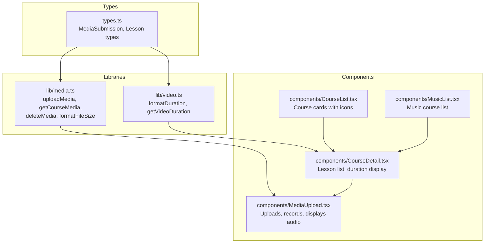
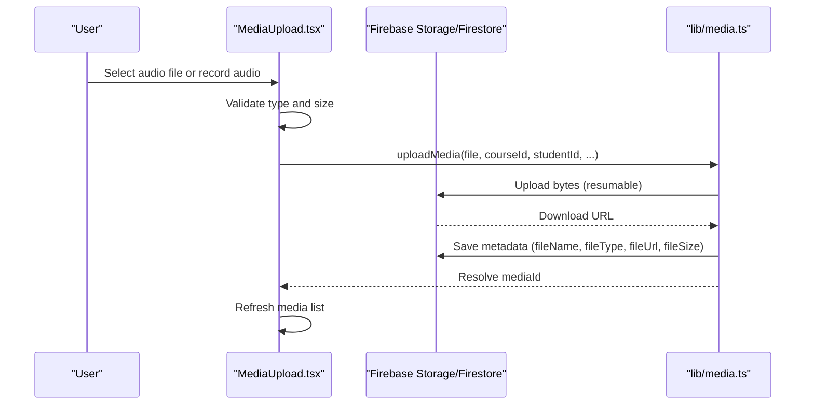
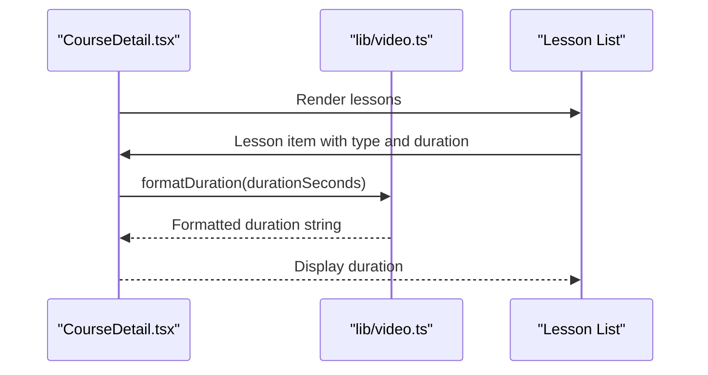
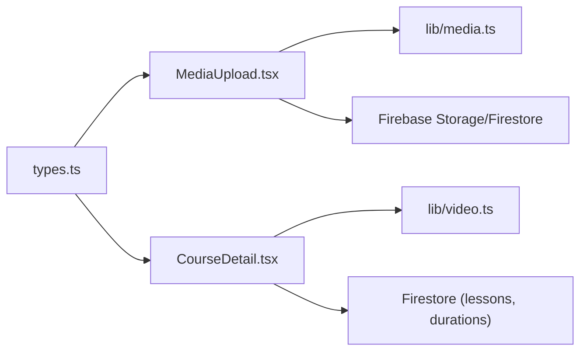

# Audio Material Playback

<cite>
**Referenced Files in This Document**
- [types.ts](file://types.ts)
- [media.ts](file://lib/media.ts)
- [video.ts](file://lib/video.ts)
- [MediaUpload.tsx](file://components/MediaUpload.tsx)
- [CourseDetail.tsx](file://components/CourseDetail.tsx)
- [CourseList.tsx](file://components/CourseList.tsx)
- [MusicList.tsx](file://components/MusicList.tsx)
</cite>

## Table of Contents
1. [Introduction](#introduction)
2. [Project Structure](#project-structure)
3. [Core Components](#core-components)
4. [Architecture Overview](#architecture-overview)
5. [Detailed Component Analysis](#detailed-component-analysis)
6. [Dependency Analysis](#dependency-analysis)
7. [Performance Considerations](#performance-considerations)
8. [Troubleshooting Guide](#troubleshooting-guide)
9. [Conclusion](#conclusion)

## Introduction
This document describes the audio material playback system in the learning platform. It covers supported audio formats, browser compatibility, integration with course lessons, and the upload/recording pipeline for audio submissions. It also outlines the current UI affordances for audio playback and provides recommendations for implementing a native HTML5 audio player with controls, progress tracking, and accessibility features.

## Project Structure
The audio playback and submission features span several areas:
- Types define the media model and lesson types.
- Utilities provide upload, retrieval, and formatting helpers.
- Components render lists and detail views for courses and lessons, and manage audio uploads and recordings.
- Course detail integrates with video utilities for duration formatting and lesson selection.

**Diagram sources**
- [types.ts](file://types.ts#L71-L82)
- [media.ts](file://lib/media.ts#L8-L117)
- [video.ts](file://lib/video.ts#L134-L148)
- [MediaUpload.tsx](file://components/MediaUpload.tsx#L1-L589)
- [CourseDetail.tsx](file://components/CourseDetail.tsx#L1-L474)
- [CourseList.tsx](file://components/CourseList.tsx#L1-L112)
- [MusicList.tsx](file://components/MusicList.tsx#L1-L135)

**Section sources**
- [types.ts](file://types.ts#L71-L82)
- [media.ts](file://lib/media.ts#L8-L117)
- [video.ts](file://lib/video.ts#L134-L148)
- [MediaUpload.tsx](file://components/MediaUpload.tsx#L1-L589)
- [CourseDetail.tsx](file://components/CourseDetail.tsx#L1-L474)
- [CourseList.tsx](file://components/CourseList.tsx#L1-L112)
- [MusicList.tsx](file://components/MusicList.tsx#L1-L135)

## Core Components
- MediaSubmission model supports audio files via fileType: 'audio'.
- Upload pipeline supports audio via MIME type detection and validation.
- Recording pipeline captures WebM audio via MediaRecorder.
- Course detail renders lesson lists with icons indicating audio lessons and displays durations.

**Section sources**
- [types.ts](file://types.ts#L71-L82)
- [media.ts](file://lib/media.ts#L282-L288)
- [media.ts](file://lib/media.ts#L301-L368)
- [MediaUpload.tsx](file://components/MediaUpload.tsx#L157-L189)
- [CourseDetail.tsx](file://components/CourseDetail.tsx#L394-L474)

## Architecture Overview
The audio system combines:
- Upload and storage: Firebase Storage and Firestore for metadata.
- Duration handling: Uses video utility functions to format durations for lessons.
- Rendering: Course detail lists lessons with audio indicators; music list shows audio courses.

**Diagram sources**
- [MediaUpload.tsx](file://components/MediaUpload.tsx#L86-L155)
- [media.ts](file://lib/media.ts#L8-L117)

**Section sources**
- [MediaUpload.tsx](file://components/MediaUpload.tsx#L86-L155)
- [media.ts](file://lib/media.ts#L8-L117)

## Detailed Component Analysis

### Audio File Support and Browser Compatibility
- Supported audio submissions are detected by MIME type prefix 'audio/' and stored as audio files.
- Recorded audio uses MediaRecorder with WebM container; the component converts the recorded blob to a File object for upload.
- Browser compatibility relies on:
  - MediaRecorder API for recording.
  - File API for selecting files.
  - Blob and URL.createObjectUrl for previews.
  - Standardized audio containers supported by Firebase Storage and browsers.

Recommendations:
- Prefer widely supported formats (e.g., MP3, OGG, or WebM) when possible.
- Provide fallbacks for unsupported browsers by checking MediaRecorder availability and offering instructions.
- Ensure HTTPS for microphone access and secure storage endpoints.

**Section sources**
- [media.ts](file://lib/media.ts#L282-L288)
- [MediaUpload.tsx](file://components/MediaUpload.tsx#L157-L189)
- [MediaUpload.tsx](file://components/MediaUpload.tsx#L105-L110)

### Native HTML5 Audio Element Usage
- The current codebase primarily handles audio uploads and displays lesson icons for audio types. There is no explicit native HTML5 audio element rendering in the referenced files.
- To integrate a native HTML5 audio player:
  - Use the audio element with src pointing to the stored fileUrl.
  - Add controls for play/pause, progress bar, volume, and timeline navigation.
  - Implement event listeners for loadedmetadata, timeupdate, ended to populate duration and track progress.
  - Apply accessibility attributes such as aria-label and keyboard handlers for controls.

[No sources needed since this section provides implementation guidance]

### Audio Player Interface Controls
Current UI affordances:
- Lesson list displays icons indicating audio lessons.
- Duration strings are shown alongside lessons using a shared formatting utility.

Proposed controls for a native HTML5 audio player:
- Play/Pause button toggling playback state.
- Progress bar reflecting currentTime and duration with seek scrubbing.
- Volume control with mute toggle.
- Timeline navigation via click or drag.
- Keyboard shortcuts (Space to play/pause, arrow keys for seeking, M for mute).

[No sources needed since this section provides implementation guidance]

### Integration with Course Lessons
- Lesson lists in course detail show audio lessons with a microphone icon and duration.
- Duration is captured via video utility functions and stored per lesson to display consistently.

**Diagram sources**
- [CourseDetail.tsx](file://components/CourseDetail.tsx#L74-L89)
- [video.ts](file://lib/video.ts#L134-L148)

**Section sources**
- [CourseDetail.tsx](file://components/CourseDetail.tsx#L394-L474)
- [video.ts](file://lib/video.ts#L134-L148)

### Automatic Duration Detection and Progress Tracking
- Duration detection uses a shared utility to format seconds into MM:SS or HH:MM:SS.
- Progress tracking is handled at the course level in course cards and lists; lesson-level progress could be extended similarly.

Recommendations:
- Store lesson durations in Firestore when metadata is available.
- Track currentTime during playback to compute progress percentage.
- Persist progress to Firestore to resume later.

**Section sources**
- [video.ts](file://lib/video.ts#L134-L148)
- [CourseList.tsx](file://components/CourseList.tsx#L110-L112)
- [MusicList.tsx](file://components/MusicList.tsx#L104-L107)

### Accessibility Features
Current state:
- No explicit ARIA attributes or keyboard navigation are present in the referenced audio-related components.

Recommended enhancements:
- Add role="region" and aria-label to the audio player container.
- Use aria-live regions for dynamic updates (e.g., current time, duration).
- Implement keyboard navigation for controls (Spacebar to play/pause, arrows to adjust volume and seek).
- Provide skip links to jump to the main content and controls.
- Ensure sufficient color contrast and visible focus states.

[No sources needed since this section provides implementation guidance]

### Audio Quality Optimization and Streaming Performance
- Use compressed audio formats (e.g., MP3 or Opus) for reduced bandwidth.
- Enable resumable uploads with progress feedback to improve perceived performance.
- Preload minimal metadata (e.g., duration) to avoid heavy decoding until playback starts.
- Consider adaptive streaming for long-form audio.

[No sources needed since this section provides general guidance]

### Mobile Device Considerations
- Touch-friendly controls with adequate size and spacing.
- Lock orientation if needed for immersive experiences.
- Handle autoplay policies (silent autoplay preferred, user gesture required for audio).
- Provide visual feedback for loading states and buffering.

[No sources needed since this section provides general guidance]

## Dependency Analysis
The audio system depends on:
- MediaSubmission type for consistent metadata.
- Upload utilities for storage and metadata persistence.
- Video utilities for duration formatting.
- Components for rendering and user interaction.

**Diagram sources**
- [types.ts](file://types.ts#L71-L82)
- [MediaUpload.tsx](file://components/MediaUpload.tsx#L1-L589)
- [media.ts](file://lib/media.ts#L8-L117)
- [video.ts](file://lib/video.ts#L134-L148)
- [CourseDetail.tsx](file://components/CourseDetail.tsx#L1-L474)

**Section sources**
- [types.ts](file://types.ts#L71-L82)
- [media.ts](file://lib/media.ts#L8-L117)
- [video.ts](file://lib/video.ts#L134-L148)
- [MediaUpload.tsx](file://components/MediaUpload.tsx#L1-L589)
- [CourseDetail.tsx](file://components/CourseDetail.tsx#L1-L474)

## Performance Considerations
- Optimize upload bandwidth with resumable uploads and progress reporting.
- Defer heavy decoding until playback begins.
- Cache formatted durations and thumbnails to reduce repeated computations.
- Minimize DOM updates during timeupdate events by throttling UI refreshes.

[No sources needed since this section provides general guidance]

## Troubleshooting Guide
Common issues and resolutions:
- CORS errors during upload: Configure Firebase Storage CORS and storage rules as indicated by upload error handling.
- Microphone permission denied: Prompt users to enable microphone access and reload the page.
- Unsupported audio format: Ensure files conform to accepted MIME types and container formats.

**Section sources**
- [media.ts](file://lib/media.ts#L54-L77)
- [MediaUpload.tsx](file://components/MediaUpload.tsx#L178-L181)

## Conclusion
The platform currently supports uploading and organizing audio files, recording audio via the browser, and displaying audio lessons with duration formatting. To implement a full-fidelity audio playback experience, integrate a native HTML5 audio player with robust controls, accessibility features, and progress tracking. Align the player with existing lesson metadata and course progress systems for a seamless user experience.