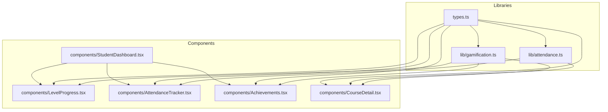
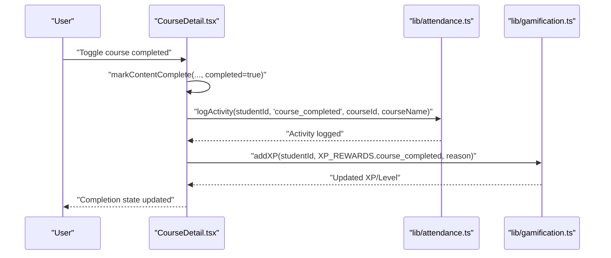
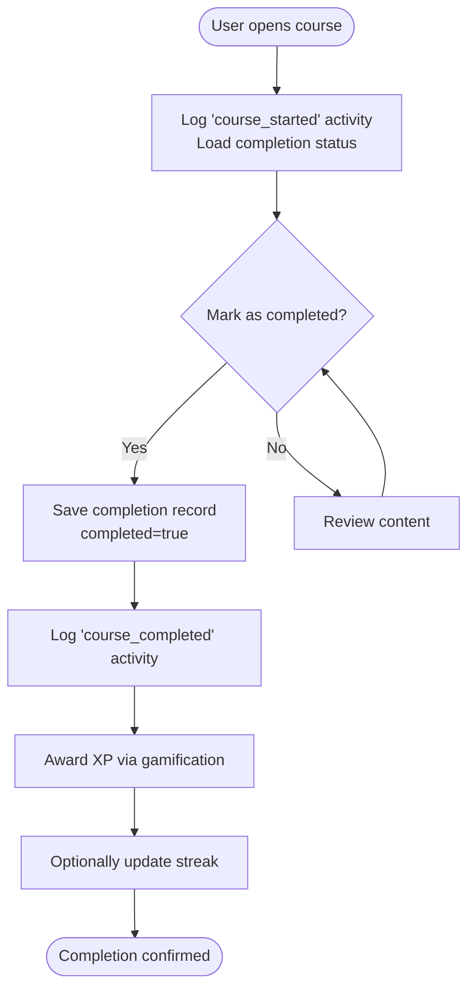
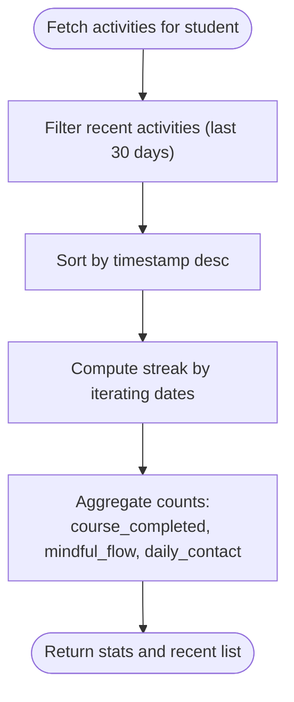
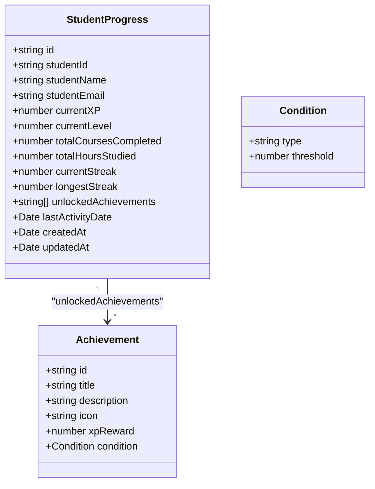
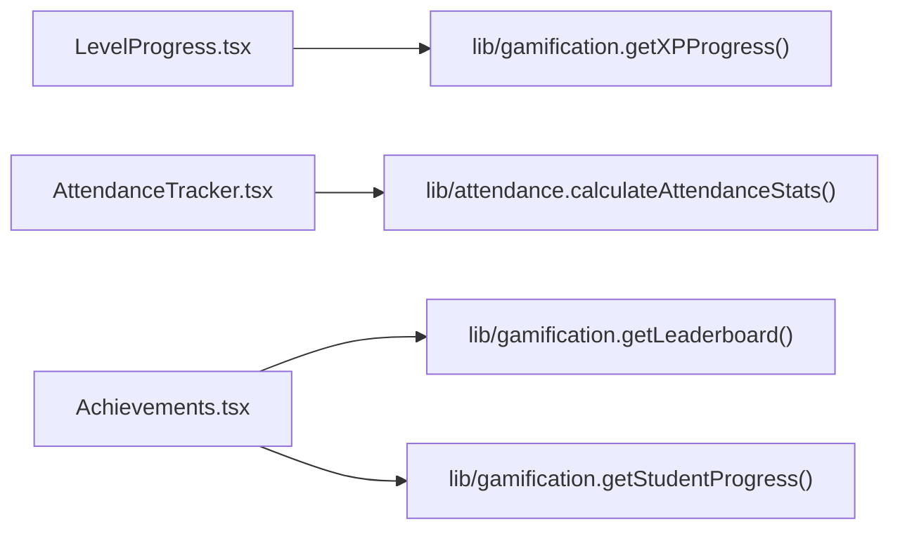
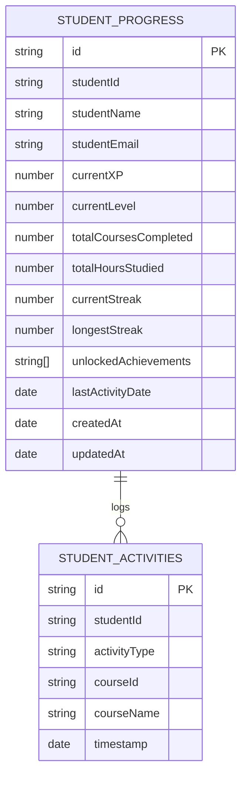
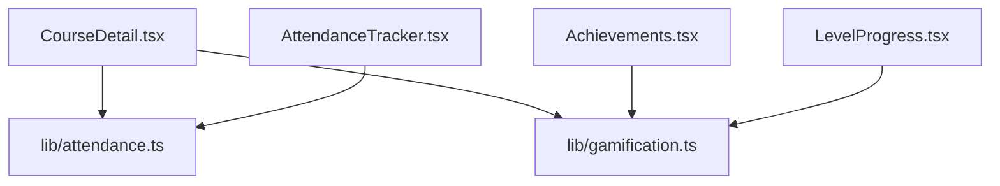

# Content Progress Tracking

<cite>
**Referenced Files in This Document**
- [gamification.ts](file://lib/gamification.ts)
- [attendance.ts](file://lib/attendance.ts)
- [types.ts](file://types.ts)
- [LevelProgress.tsx](file://components/LevelProgress.tsx)
- [Achievements.tsx](file://components/Achievements.tsx)
- [AttendanceTracker.tsx](file://components/AttendanceTracker.tsx)
- [CourseDetail.tsx](file://components/CourseDetail.tsx)
- [StudentDashboard.tsx](file://components/StudentDashboard.tsx)
</cite>

## Table of Contents
1. [Introduction](#introduction)
2. [Project Structure](#project-structure)
3. [Core Components](#core-components)
4. [Architecture Overview](#architecture-overview)
5. [Detailed Component Analysis](#detailed-component-analysis)
6. [Dependency Analysis](#dependency-analysis)
7. [Performance Considerations](#performance-considerations)
8. [Troubleshooting Guide](#troubleshooting-guide)
9. [Conclusion](#conclusion)

## Introduction
This document describes the content progress tracking system, covering lesson and course completion tracking, manual completion marking, streak maintenance, attendance logging, gamification integration (XP and achievements), progress visualization, and data persistence. It explains how content consumption feeds into overall course completion metrics and user analytics.

## Project Structure
The progress tracking system spans TypeScript libraries for gamification and attendance, React components for visualization and interaction, and shared types that define the data contracts.

**Diagram sources**
- [gamification.ts](file://lib/gamification.ts#L1-L349)
- [attendance.ts](file://lib/attendance.ts#L1-L177)
- [types.ts](file://types.ts#L84-L125)
- [LevelProgress.tsx](file://components/LevelProgress.tsx#L1-L73)
- [AttendanceTracker.tsx](file://components/AttendanceTracker.tsx#L1-L249)
- [Achievements.tsx](file://components/Achievements.tsx#L1-L346)
- [CourseDetail.tsx](file://components/CourseDetail.tsx#L1-L526)
- [StudentDashboard.tsx](file://components/StudentDashboard.tsx#L1-L135)

**Section sources**
- [gamification.ts](file://lib/gamification.ts#L1-L349)
- [attendance.ts](file://lib/attendance.ts#L1-L177)
- [types.ts](file://types.ts#L84-L125)
- [LevelProgress.tsx](file://components/LevelProgress.tsx#L1-L73)
- [AttendanceTracker.tsx](file://components/AttendanceTracker.tsx#L1-L249)
- [Achievements.tsx](file://components/Achievements.tsx#L1-L346)
- [CourseDetail.tsx](file://components/CourseDetail.tsx#L1-L526)
- [StudentDashboard.tsx](file://components/StudentDashboard.tsx#L1-L135)

## Core Components
- Gamification library: XP calculation, level progression, streak management, achievement unlocking, leaderboard retrieval, and default achievements.
- Attendance library: Activity logging, recent/recent activity queries, and attendance statistics computation.
- Shared types: Define activity types, achievement conditions, and student progress model.
- UI components:
  - LevelProgress: Visualizes XP progress toward the next level.
  - AttendanceTracker: Shows completion counts, streak, calendar heatmap, and recent activity.
  - Achievements: Displays unlocked/locked achievements, progress bars, and leaderboard.
  - CourseDetail: Handles course/lesson completion toggling, logs activities, and awards XP.
  - StudentDashboard: Aggregates progress, XP, achievements, and displays attendance.

**Section sources**
- [gamification.ts](file://lib/gamification.ts#L8-L349)
- [attendance.ts](file://lib/attendance.ts#L7-L177)
- [types.ts](file://types.ts#L84-L125)
- [LevelProgress.tsx](file://components/LevelProgress.tsx#L1-L73)
- [AttendanceTracker.tsx](file://components/AttendanceTracker.tsx#L1-L249)
- [Achievements.tsx](file://components/Achievements.tsx#L1-L346)
- [CourseDetail.tsx](file://components/CourseDetail.tsx#L128-L146)
- [StudentDashboard.tsx](file://components/StudentDashboard.tsx#L16-L43)

## Architecture Overview
The system integrates three pillars:
- Content consumption triggers attendance logging and optional XP awarding.
- Gamification tracks XP, levels, streaks, and unlocks achievements.
- Visualization surfaces progress, streaks, and leaderboard data.

**Diagram sources**
- [CourseDetail.tsx](file://components/CourseDetail.tsx#L128-L146)
- [attendance.ts](file://lib/attendance.ts#L7-L30)
- [gamification.ts](file://lib/gamification.ts#L100-L129)

## Detailed Component Analysis

### Lesson and Course Completion Tracking
- Automatic progress detection:
  - CourseDetail initializes by logging a "course_started" activity and loading completion status via a completion record lookup.
  - Completion state is stored per student and content type (course or lesson) and can be toggled.
- Manual completion marking:
  - The UI exposes a button to mark/unmark a course as completed. On completion:
    - The completion record is saved.
    - An activity of type "course_completed" is logged.
    - XP is awarded according to configured rewards.
- Streak maintenance:
  - Streak updates occur through gamification utilities; attendance computations derive streaks from recent activities.

**Diagram sources**
- [CourseDetail.tsx](file://components/CourseDetail.tsx#L56-L71)
- [CourseDetail.tsx](file://components/CourseDetail.tsx#L128-L146)
- [attendance.ts](file://lib/attendance.ts#L7-L30)
- [gamification.ts](file://lib/gamification.ts#L100-L129)

**Section sources**
- [CourseDetail.tsx](file://components/CourseDetail.tsx#L56-L71)
- [CourseDetail.tsx](file://components/CourseDetail.tsx#L128-L146)
- [attendance.ts](file://lib/attendance.ts#L7-L30)
- [gamification.ts](file://lib/gamification.ts#L100-L129)

### Attendance Logging and Statistics
- Logs structured activities with timestamps, student identifiers, and optional course context.
- Computes attendance statistics from activity history, including:
  - Counts for course completions, mindful flows, and daily contacts.
  - Current streak computed by scanning recent activities and counting consecutive calendar days.
- Provides recent activity filtering and calendar heatmap rendering for the last 30 days.

**Diagram sources**
- [attendance.ts](file://lib/attendance.ts#L32-L62)
- [attendance.ts](file://lib/attendance.ts#L163-L177)
- [attendance.ts](file://lib/attendance.ts#L122-L161)

**Section sources**
- [attendance.ts](file://lib/attendance.ts#L7-L30)
- [attendance.ts](file://lib/attendance.ts#L32-L62)
- [attendance.ts](file://lib/attendance.ts#L91-L120)
- [attendance.ts](file://lib/attendance.ts#L122-L161)
- [attendance.ts](file://lib/attendance.ts#L163-L177)

### Gamification: XP Rewards and Achievement Unlocking
- XP and leveling:
  - XP per level is constant; level is derived from cumulative XP.
  - Progress within a level is calculated and visualized.
- Streak bonuses:
  - Every 7-day streak increment may trigger a bonus XP award.
- Achievement system:
  - Achievements have conditions (course count, streak days, hours studied, first course).
  - Unlock checks evaluate current progress against thresholds and grant XP upon unlock.
  - Default achievements are provided for seeding.

**Diagram sources**
- [types.ts](file://types.ts#L108-L125)
- [types.ts](file://types.ts#L95-L106)

**Section sources**
- [gamification.ts](file://lib/gamification.ts#L8-L40)
- [gamification.ts](file://lib/gamification.ts#L131-L161)
- [gamification.ts](file://lib/gamification.ts#L232-L275)
- [gamification.ts](file://lib/gamification.ts#L305-L348)
- [types.ts](file://types.ts#L95-L125)

### Progress Visualization Components
- LevelProgress:
  - Displays current level, XP in current level, XP required, and percentage to next level.
- AttendanceTracker:
  - Shows summary cards (completed courses, mindful flows, streak, total activities).
  - Renders a 30-day calendar heatmap indicating activity presence per day.
  - Lists recent activities with labels and dates.
- Achievements:
  - Displays general progress bar, locked/unlocked achievements with progress bars, and a leaderboard table.
  - Highlights top ranks and current user position.

**Diagram sources**
- [LevelProgress.tsx](file://components/LevelProgress.tsx#L12-L69)
- [gamification.ts](file://lib/gamification.ts#L28-L40)
- [AttendanceTracker.tsx](file://components/AttendanceTracker.tsx#L12-L37)
- [attendance.ts](file://lib/attendance.ts#L122-L161)
- [Achievements.tsx](file://components/Achievements.tsx#L16-L32)
- [gamification.ts](file://lib/gamification.ts#L278-L302)

**Section sources**
- [LevelProgress.tsx](file://components/LevelProgress.tsx#L1-L73)
- [AttendanceTracker.tsx](file://components/AttendanceTracker.tsx#L1-L249)
- [Achievements.tsx](file://components/Achievements.tsx#L1-L346)

### Data Persistence and Analytics
- Student progress persistence:
  - StudentProgress documents are created and updated in Firestore under a dedicated collection.
  - Fields include XP, level, course counts, streaks, and timestamps.
- Activity persistence:
  - StudentActivity documents are stored with activity type, course context, and timestamps.
- Analytics:
  - Attendance statistics summarize counts and streaks from activity logs.
  - Leaderboard queries sort students by XP descending.

**Diagram sources**
- [gamification.ts](file://lib/gamification.ts#L43-L98)
- [attendance.ts](file://lib/attendance.ts#L7-L30)
- [types.ts](file://types.ts#L108-L125)
- [types.ts](file://types.ts#L84-L93)

**Section sources**
- [gamification.ts](file://lib/gamification.ts#L43-L98)
- [attendance.ts](file://lib/attendance.ts#L7-L30)
- [types.ts](file://types.ts#L84-L125)

### Relationship Between Content Consumption and Course Completion Metrics
- Content consumption (watching lessons, completing courses) is recorded as activities.
- These activities feed:
  - Course completion metrics (count of completed courses).
  - Streak calculations (consecutive days with activity).
  - Achievement unlocking (thresholds on courses, streaks, study hours).
  - XP accumulation and level progression.
- The dashboard aggregates these signals into actionable insights and visualizations.

**Section sources**
- [CourseDetail.tsx](file://components/CourseDetail.tsx#L56-L71)
- [CourseDetail.tsx](file://components/CourseDetail.tsx#L128-L146)
- [attendance.ts](file://lib/attendance.ts#L122-L161)
- [gamification.ts](file://lib/gamification.ts#L232-L275)
- [StudentDashboard.tsx](file://components/StudentDashboard.tsx#L76-L129)

## Dependency Analysis
- CourseDetail depends on:
  - Attendance logging for activity records.
  - Gamification for XP awarding and level progression.
  - Completion persistence utilities to save completion state.
- AttendanceTracker depends on:
  - Attendance library for fetching and computing stats.
- Achievements depends on:
  - Gamification for progress and leaderboard data.
- LevelProgress depends on:
  - Gamification for XP progress calculation.

**Diagram sources**
- [CourseDetail.tsx](file://components/CourseDetail.tsx#L9-L11)
- [attendance.ts](file://lib/attendance.ts#L1-L3)
- [gamification.ts](file://lib/gamification.ts#L1-L3)
- [LevelProgress.tsx](file://components/LevelProgress.tsx#L2-L3)
- [AttendanceTracker.tsx](file://components/AttendanceTracker.tsx#L3-L5)
- [Achievements.tsx](file://components/Achievements.tsx#L2-L4)

**Section sources**
- [CourseDetail.tsx](file://components/CourseDetail.tsx#L9-L11)
- [attendance.ts](file://lib/attendance.ts#L1-L3)
- [gamification.ts](file://lib/gamification.ts#L1-L3)
- [LevelProgress.tsx](file://components/LevelProgress.tsx#L2-L3)
- [AttendanceTracker.tsx](file://components/AttendanceTracker.tsx#L3-L5)
- [Achievements.tsx](file://components/Achievements.tsx#L2-L4)

## Performance Considerations
- Minimize repeated Firestore reads by caching student progress and activities where appropriate.
- Batch or debounce frequent updates (e.g., periodic progress reloads) to reduce network overhead.
- Use server-side ordering and limits for leaderboard queries to keep fetches efficient.
- Calendar rendering for 30 days is lightweight but avoid re-computing unnecessarily; memoize results.

## Troubleshooting Guide
- No progress data shown:
  - Ensure the student progress document exists; the dashboard attempts to create it if missing.
- Streak not updating:
  - Verify recent activities exist and are recent enough; streak computation requires consecutive calendar days.
- XP not awarded:
  - Confirm the reward amount is configured and the addXP operation completes successfully.
- Achievement not unlocking:
  - Check thresholds and conditions; ensure progress fields reflect the latest state.

**Section sources**
- [StudentDashboard.tsx](file://components/StudentDashboard.tsx#L30-L43)
- [gamification.ts](file://lib/gamification.ts#L131-L161)
- [gamification.ts](file://lib/gamification.ts#L100-L129)
- [gamification.ts](file://lib/gamification.ts#L232-L275)

## Conclusion
The content progress tracking system combines robust attendance logging, gamification mechanics, and intuitive visualizations to provide learners with meaningful feedback on their journey. By linking content consumption to XP, streaks, and achievements, it encourages sustained engagement while offering administrators insights through analytics and leaderboards.