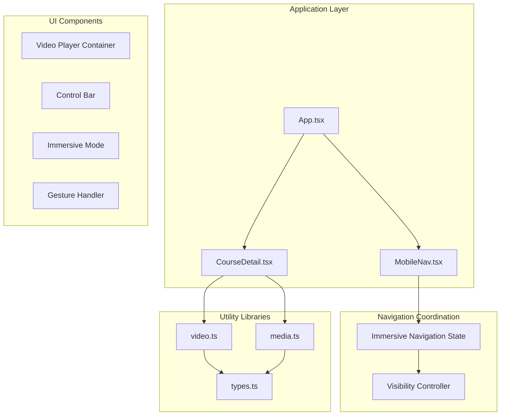
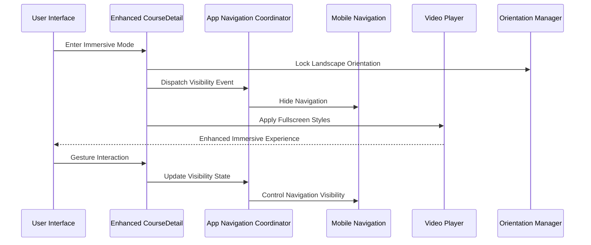
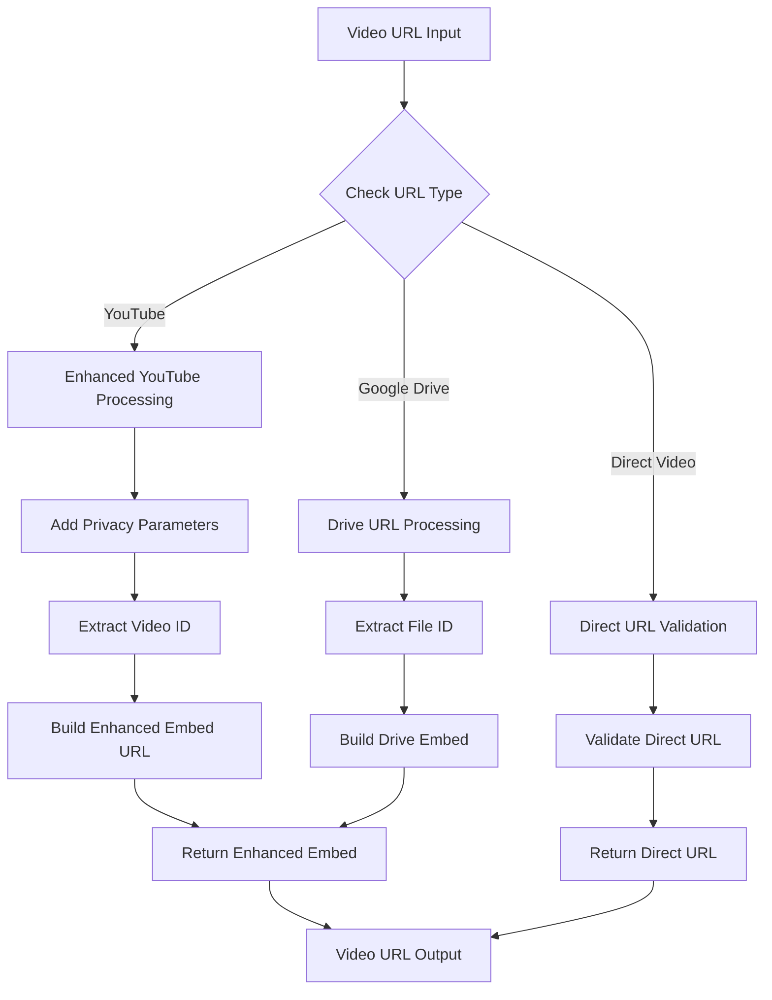
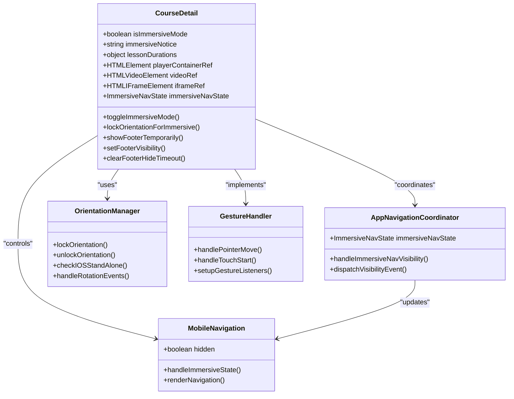
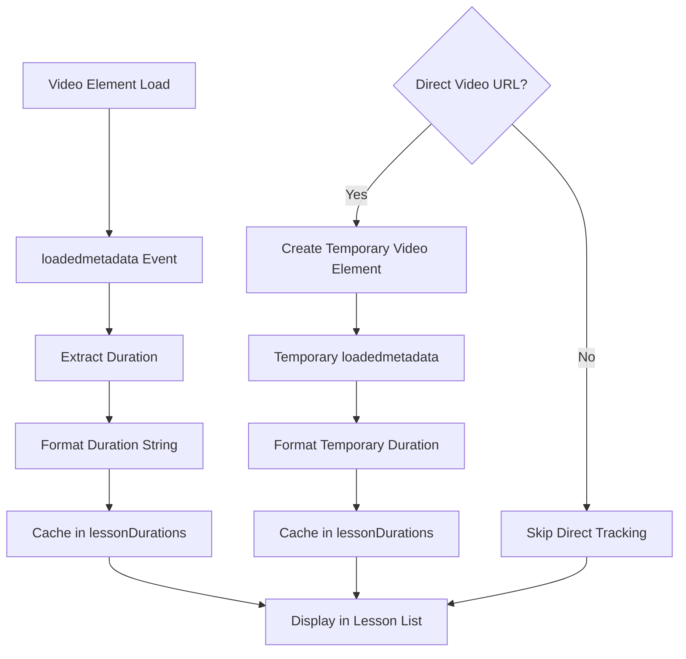
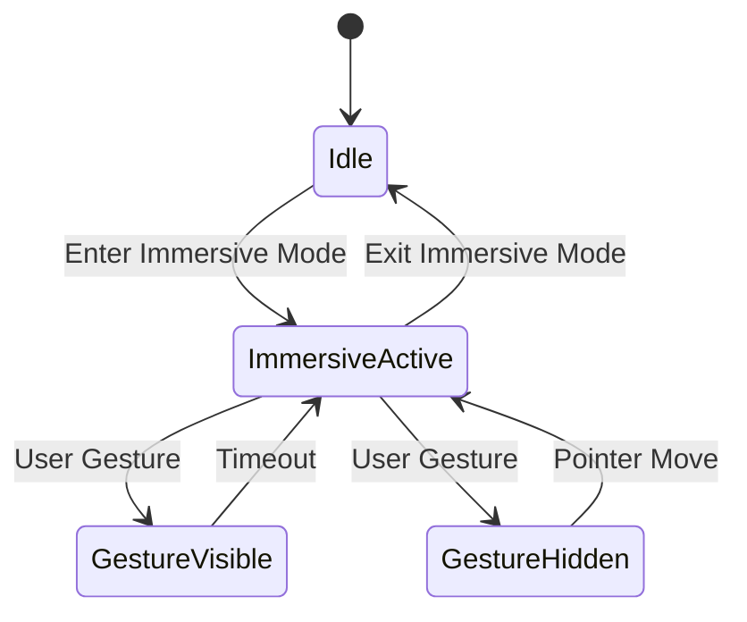
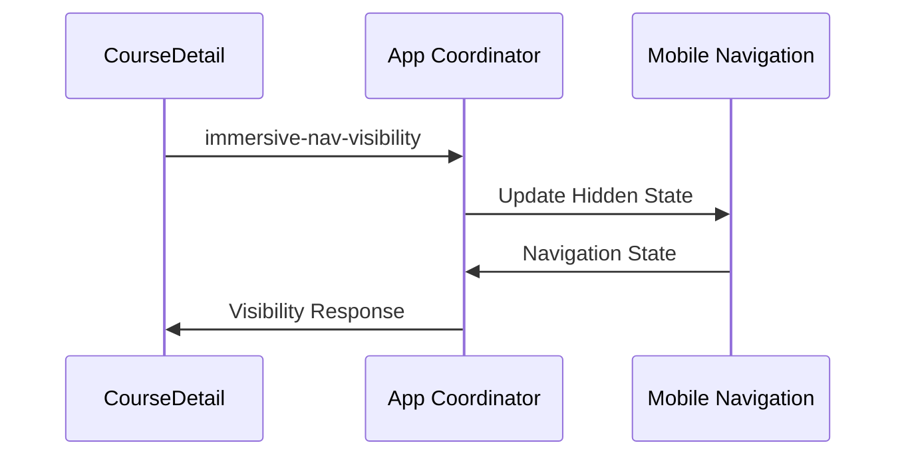
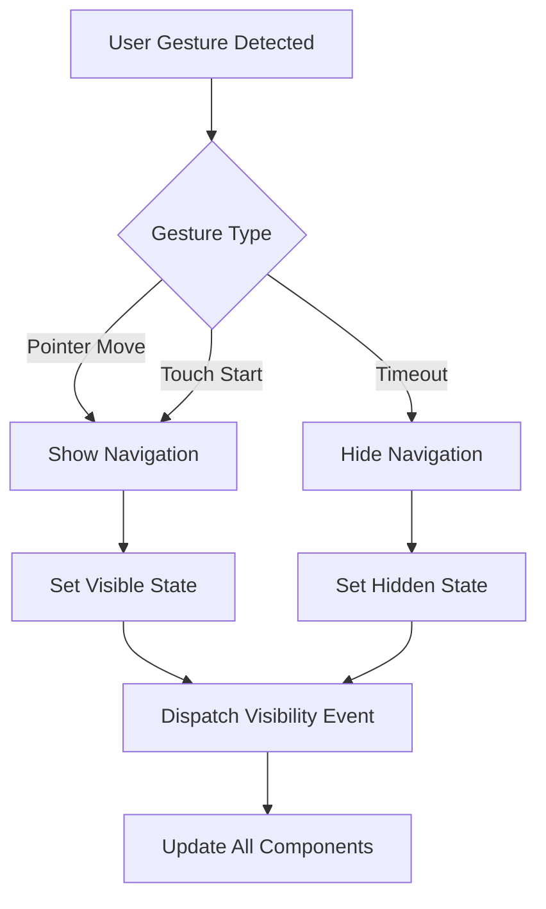
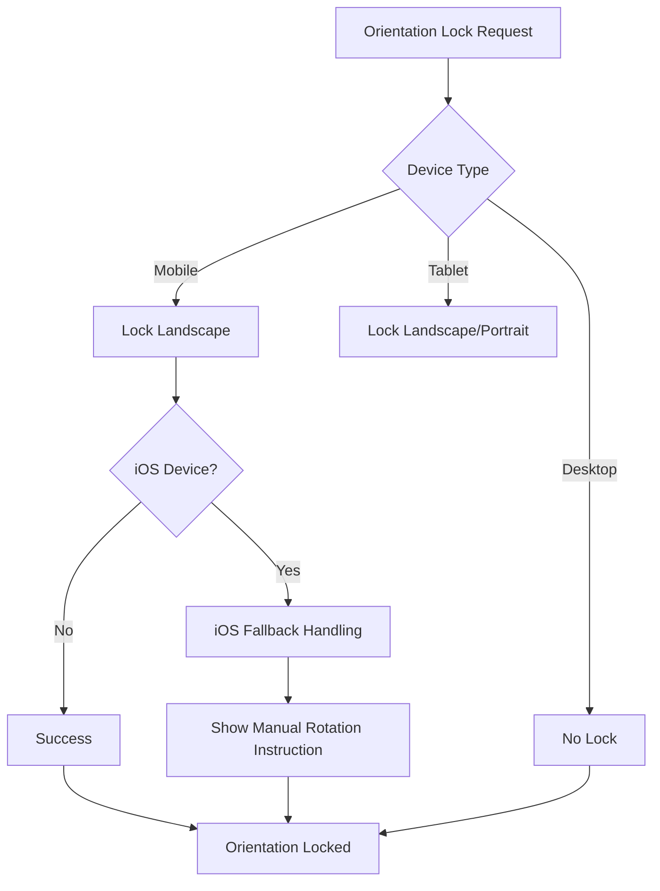
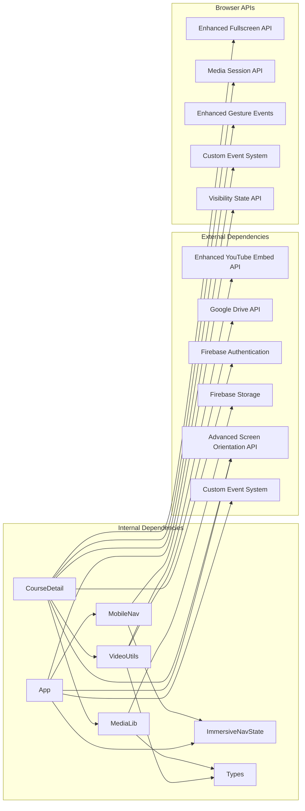

# Fullscreen Video Player

<cite>
**Referenced Files in This Document**
- [App.tsx](file://App.tsx)
- [CourseDetail.tsx](file://components/CourseDetail.tsx)
- [video.ts](file://lib/video.ts)
- [media.ts](file://lib/media.ts)
- [MediaUpload.tsx](file://components/MediaUpload.tsx)
- [types.ts](file://types.ts)
- [MobileNav.tsx](file://components/MobileNav.tsx)
</cite>

## Update Summary
**Changes Made**
- Enhanced immersive navigation system with sophisticated state management
- Added comprehensive orientation locking for mobile devices
- Implemented gesture controls and touch interaction handling
- Integrated iOS standalone mode detection and handling
- Added mobile navigation coordination with immersive mode
- Improved gesture-based UI visibility controls

## Table of Contents
1. [Introduction](#introduction)
2. [Project Structure](#project-structure)
3. [Core Components](#core-components)
4. [Architecture Overview](#architecture-overview)
5. [Detailed Component Analysis](#detailed-component-analysis)
6. [Immersive Navigation System](#immersive-navigation-system)
7. [Mobile Optimization Features](#mobile-optimization-features)
8. [Dependency Analysis](#dependency-analysis)
9. [Performance Considerations](#performance-considerations)
10. [Troubleshooting Guide](#troubleshooting-guide)
11. [Conclusion](#conclusion)

## Introduction
This document provides comprehensive technical documentation for the Enhanced Fullscreen Video Player feature within the Fluentoria learning platform. The feature now delivers a sophisticated immersive navigation experience with advanced capabilities including intelligent orientation locking, gesture-based UI controls, iOS standalone mode handling, and seamless mobile navigation coordination. The implementation spans multiple components and utility libraries, creating a cohesive ecosystem for immersive video playback across all device types.

## Project Structure
The enhanced fullscreen video player functionality is distributed across a sophisticated multi-layered architecture:

**Diagram sources**
- [App.tsx:40-491](file://App.tsx#L40-L491)
- [CourseDetail.tsx:1-690](file://components/CourseDetail.tsx#L1-L690)
- [video.ts:1-149](file://lib/video.ts#L1-L149)
- [media.ts:1-369](file://lib/media.ts#L1-L369)
- [MobileNav.tsx:1-119](file://components/MobileNav.tsx#L1-L119)

**Section sources**
- [App.tsx:40-491](file://App.tsx#L40-L491)
- [CourseDetail.tsx:1-690](file://components/CourseDetail.tsx#L1-L690)
- [video.ts:1-149](file://lib/video.ts#L1-L149)
- [media.ts:1-369](file://lib/media.ts#L1-L369)
- [MobileNav.tsx:1-119](file://components/MobileNav.tsx#L1-L119)

## Core Components
The enhanced fullscreen video player consists of five primary components working in sophisticated harmony:

### Enhanced Video Utility Library
The [`video.ts`:1-149](file://lib/video.ts#L1-L149) library provides comprehensive video processing capabilities including URL parsing, embed generation, duration formatting, and enhanced YouTube integration with privacy-focused parameters.

### Sophisticated Course Detail Component
The [`CourseDetail.tsx`:1-690](file://components/CourseDetail.tsx#L1-L690) serves as the central orchestrator for immersive video playback, implementing advanced state management, gesture controls, orientation locking, and responsive design patterns.

### Intelligent App-Level Navigation Coordinator
The [`App.tsx`:40-491](file://App.tsx#L40-L491) manages immersive navigation state across the entire application, coordinating visibility between the video player and mobile navigation system.

### Mobile Navigation Integration
The [`MobileNav.tsx`:1-119](file://components/MobileNav.tsx#L1-L119) component now intelligently responds to immersive mode states, hiding itself when video content is maximized for optimal viewing experience.

### Media Management System
The [`MediaUpload.tsx`:1-589](file://components/MediaUpload.tsx#L1-L589) component integrates video content management with enhanced upload capabilities and support material handling.

**Section sources**
- [video.ts:1-149](file://lib/video.ts#L1-L149)
- [CourseDetail.tsx:18-690](file://components/CourseDetail.tsx#L18-L690)
- [App.tsx:40-491](file://App.tsx#L40-L491)
- [MobileNav.tsx:1-119](file://components/MobileNav.tsx#L1-L119)
- [MediaUpload.tsx:14-589](file://components/MediaUpload.tsx#L14-L589)

## Architecture Overview
The enhanced fullscreen video player architecture implements a sophisticated state-driven design pattern with intelligent coordination between components:

**Diagram sources**
- [CourseDetail.tsx:233-270](file://components/CourseDetail.tsx#L233-L270)
- [CourseDetail.tsx:344-398](file://components/CourseDetail.tsx#L344-L398)
- [App.tsx:153-169](file://App.tsx#L153-L169)

The architecture implements several advanced design patterns:

1. **State Management Pattern**: Centralized immersive navigation state coordination
2. **Event-Driven Communication**: Custom events for cross-component communication
3. **Responsive Design Pattern**: Adaptive UI based on immersive mode state
4. **Gesture Recognition Pattern**: Touch and pointer event handling for UI controls

**Section sources**
- [CourseDetail.tsx:233-270](file://components/CourseDetail.tsx#L233-L270)
- [CourseDetail.tsx:344-398](file://components/CourseDetail.tsx#L344-L398)
- [App.tsx:153-169](file://App.tsx#L153-L169)

## Detailed Component Analysis

### Enhanced Video Utility Functions
The video utility library provides comprehensive video processing with enhanced YouTube integration:

**Diagram sources**
- [video.ts:12-107](file://lib/video.ts#L12-L107)

#### Enhanced YouTube URL Processing
The YouTube processing pipeline now includes privacy-focused parameters and enhanced embed URL construction with automatic fullscreen support and playsinline configuration for mobile devices.

#### Google Drive URL Processing
Google Drive integration maintains comprehensive URL format support with proper file identifier extraction and embed URL generation.

**Section sources**
- [video.ts:12-107](file://lib/video.ts#L12-L107)

### Sophisticated Course Detail Video Player Implementation
The [`CourseDetail.tsx`:344-398](file://components/CourseDetail.tsx#L344-L398) implements a comprehensive immersive video player with advanced state management:

**Diagram sources**
- [CourseDetail.tsx:233-270](file://components/CourseDetail.tsx#L233-L270)
- [CourseDetail.tsx:344-398](file://components/CourseDetail.tsx#L344-L398)
- [App.tsx:40-491](file://App.tsx#L40-L491)

#### Advanced Immersive Mode Features
The enhanced immersive mode implementation includes:

1. **Intelligent State Management**: Centralized state tracking with visibility coordination
2. **Advanced Orientation Locking**: Automatic landscape orientation for mobile devices with fallback handling
3. **Sophisticated Gesture Controls**: Touch and pointer events for dynamic UI visibility management
4. **Keyboard Shortcuts**: Escape key support for seamless exit from immersive mode
5. **iOS Standalone Mode Detection**: Special handling for iOS PWA environments

#### Responsive Design Integration
The player now features comprehensive responsive design with:
- Intelligent mobile device rotation constraints
- Adaptive UI scaling for tablet and desktop environments
- Special iOS standalone mode considerations for optimal user experience

**Section sources**
- [CourseDetail.tsx:233-270](file://components/CourseDetail.tsx#L233-L270)
- [CourseDetail.tsx:344-398](file://components/CourseDetail.tsx#L344-L398)
- [App.tsx:40-491](file://App.tsx#L40-L491)

### Duration Tracking and Management
The video player implements sophisticated duration tracking with enhanced caching mechanisms:

**Diagram sources**
- [CourseDetail.tsx:96-149](file://components/CourseDetail.tsx#L96-L149)

**Section sources**
- [CourseDetail.tsx:96-149](file://components/CourseDetail.tsx#L96-L149)
- [video.ts:113-148](file://lib/video.ts#L113-L148)

## Immersive Navigation System
The enhanced immersive navigation system provides sophisticated state coordination across the entire application:

### State Management Architecture
The immersive navigation system implements a centralized state management approach:

### Cross-Component Communication
The system uses custom events for seamless communication between components:

**Diagram sources**
- [CourseDetail.tsx:209-213](file://components/CourseDetail.tsx#L209-L213)
- [App.tsx:153-169](file://App.tsx#L153-L169)

**Section sources**
- [CourseDetail.tsx:209-213](file://components/CourseDetail.tsx#L209-L213)
- [App.tsx:153-169](file://App.tsx#L153-L169)

## Mobile Optimization Features
The enhanced video player includes comprehensive mobile optimization with sophisticated gesture handling:

### Advanced Gesture Controls
The system implements intelligent gesture recognition for dynamic UI management:

### Orientation Management
The system provides sophisticated orientation handling for different device types:

**Diagram sources**
- [CourseDetail.tsx:179-207](file://components/CourseDetail.tsx#L179-L207)

**Section sources**
- [CourseDetail.tsx:179-207](file://components/CourseDetail.tsx#L179-L207)
- [CourseDetail.tsx:400-407](file://components/CourseDetail.tsx#L400-L407)

## Dependency Analysis
The enhanced fullscreen video player relies on sophisticated dependencies and external services:

**Diagram sources**
- [CourseDetail.tsx:4-10](file://components/CourseDetail.tsx#L4-L10)
- [video.ts:1-149](file://lib/video.ts#L1-L149)
- [media.ts:1-369](file://lib/media.ts#L1-L369)
- [App.tsx:40-491](file://App.tsx#L40-L491)

### Enhanced External Service Integrations
The implementation now includes advanced integrations:

1. **Enhanced YouTube Embed API**: Privacy-focused parameters and automatic fullscreen support
2. **Google Drive API**: Comprehensive file preview integration with enhanced URL handling
3. **Firebase Authentication**: Advanced session management for immersive experiences
4. **Firebase Storage**: Optimized media upload and download with progress tracking

### Advanced Browser API Dependencies
The system leverages sophisticated browser APIs:

1. **Enhanced Screen Orientation API**: Advanced orientation control with fallback handling
2. **Custom Event System**: Sophisticated cross-component communication
3. **Visibility State API**: Advanced page visibility management
4. **Enhanced Gesture Events**: Comprehensive touch and pointer event handling

**Section sources**
- [CourseDetail.tsx:33-45](file://components/CourseDetail.tsx#L33-L45)
- [video.ts:33-35](file://lib/video.ts#L33-L35)
- [App.tsx:40-491](file://App.tsx#L40-L491)

## Performance Considerations
The enhanced fullscreen video player implementation incorporates advanced performance optimization strategies:

### Intelligent Resource Management
- **Lazy Loading Enhancement**: Conditional embed loading with enhanced caching strategies
- **Memory Optimization**: Sophisticated event listener management and DOM cleanup
- **State Optimization**: Efficient state updates with minimal re-render cycles

### Advanced Mobile Optimization
- **Orientation Lock Efficiency**: Minimal overhead with intelligent fallback handling
- **Gesture Event Debouncing**: Optimized touch handling with adaptive sensitivity
- **Battery Life Considerations**: Adaptive loading strategies with enhanced power management

### Enhanced Caching Strategies
- **Duration Caching**: Sophisticated lesson duration caching with cache invalidation
- **URL Processing Results**: Advanced URL parsing caching with real-time updates
- **Immersive State Persistence**: Intelligent state management across navigation

## Troubleshooting Guide

### Enhanced Common Issues and Solutions

#### Advanced YouTube Embed Problems
**Issue**: Videos fail to load from YouTube URLs with immersive mode
**Solution**: Verify URL format matches supported patterns, check network connectivity, and ensure privacy parameters are correctly applied

#### Sophisticated Google Drive Access Issues
**Issue**: Google Drive videos show permission errors in immersive mode
**Solution**: Ensure proper sharing permissions, verify file accessibility settings, and check embed URL generation

#### Advanced Orientation Lock Failures
**Issue**: Device rotation not locking in immersive mode with gesture controls
**Solution**: Check browser compatibility, verify user permission settings, and implement fallback manual rotation instructions

#### Enhanced Mobile Playback Issues
**Issue**: Videos don't play on mobile devices with gesture controls enabled
**Solution**: Verify autoplay policies, check user interaction requirements, and ensure proper gesture event handling

### Advanced Debugging Tools and Techniques
The enhanced implementation includes comprehensive debugging capabilities:

1. **Console Logging**: Extensive console output with immersive state tracking
2. **Error Boundaries**: Graceful error handling with immersive mode recovery
3. **State Inspection**: Real-time immersive state monitoring and debugging tools
4. **Network Monitoring**: Video loading progress with gesture event tracking
5. **Orientation Debugging**: Comprehensive orientation lock status monitoring

**Section sources**
- [CourseDetail.tsx:179-207](file://components/CourseDetail.tsx#L179-L207)
- [video.ts:96-107](file://lib/video.ts#L96-L107)

## Conclusion
The Enhanced Fullscreen Video Player feature represents a sophisticated evolution of modern web video playback capabilities within the Fluentoria learning platform. The implementation now delivers a truly immersive experience through advanced state management, intelligent navigation coordination, and comprehensive mobile optimization.

Key achievements include:
- **Sophisticated Immersive Navigation System**: Centralized state management with cross-component coordination
- **Advanced Orientation Control**: Intelligent device rotation management with fallback handling
- **Enhanced Gesture Controls**: Comprehensive touch and pointer event handling for dynamic UI management
- **iOS Standalone Mode Integration**: Specialized handling for iOS PWA environments
- **Mobile Navigation Coordination**: Seamless integration between video player and mobile navigation
- **Advanced Performance Optimization**: Sophisticated resource management and caching strategies

The implementation serves as a robust foundation for future enhancements and demonstrates best practices in modern React application development with TypeScript, advanced state management, and comprehensive browser API integration. The enhanced system provides a truly immersive learning experience that adapts seamlessly across all device types and usage scenarios.