# Learning Content Delivery

<cite>
**Referenced Files in This Document**
- [App.tsx](file://App.tsx)
- [types.ts](file://types.ts)
- [firebase.ts](file://lib/firebase.ts)
- [video.ts](file://lib/video.ts)
- [media.ts](file://lib/media.ts)
- [MediaUpload.tsx](file://components/MediaUpload.tsx)
- [CourseDetail.tsx](file://components/CourseDetail.tsx)
- [GalleryList.tsx](file://components/GalleryList.tsx)
- [MusicList.tsx](file://components/MusicList.tsx)
- [MindfulFlow.tsx](file://components/MindfulFlow.tsx)
- [service-worker.js](file://public/service-worker.js)
- [offline.html](file://public/offline.html)
- [check-payment-status.js](file://netlify/functions/check-payment-status.js)
- [attendance.ts](file://lib/attendance.ts)
- [gamification.ts](file://lib/gamification.ts)
</cite>

## Table of Contents
1. [Introduction](#introduction)
2. [Project Structure](#project-structure)
3. [Core Components](#core-components)
4. [Architecture Overview](#architecture-overview)
5. [Detailed Component Analysis](#detailed-component-analysis)
6. [Dependency Analysis](#dependency-analysis)
7. [Performance Considerations](#performance-considerations)
8. [Troubleshooting Guide](#troubleshooting-guide)
9. [Conclusion](#conclusion)

## Introduction
This document describes the learning content delivery system, focusing on how video lessons integrate with YouTube and Google Drive, how audio and PDF materials are managed, and how content progress tracking, completion criteria, and student engagement metrics are implemented. It also covers the media upload system, mindful flow content, music library management, gallery content systems, caching and offline capabilities, and moderation and accessibility considerations.

## Project Structure
The system is a React-based Progressive Web App (PWA) using Firebase for authentication, real-time data, and cloud storage. Key areas:
- Routing and navigation are handled in the main application shell with lazy-loaded screens.
- Content presentation and interactivity are implemented in dedicated components for galleries, course details, media uploads, mindful flow, and music.
- Utilities encapsulate video URL parsing, media upload and retrieval, and caching strategies.
- Netlify Functions provide server-side integrations for payment status checks.

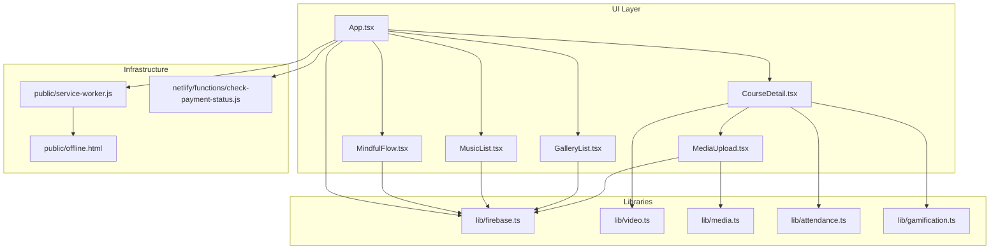

**Diagram sources**
- [App.tsx](file://App.tsx#L1-L449)
- [CourseDetail.tsx](file://components/CourseDetail.tsx#L1-L526)
- [MediaUpload.tsx](file://components/MediaUpload.tsx#L1-L589)
- [GalleryList.tsx](file://components/GalleryList.tsx#L1-L160)
- [MusicList.tsx](file://components/MusicList.tsx#L1-L136)
- [MindfulFlow.tsx](file://components/MindfulFlow.tsx#L1-L71)
- [firebase.ts](file://lib/firebase.ts#L1-L25)
- [video.ts](file://lib/video.ts#L1-L149)
- [media.ts](file://lib/media.ts#L1-L369)
- [service-worker.js](file://public/service-worker.js#L1-L261)
- [offline.html](file://public/offline.html#L1-L124)
- [check-payment-status.js](file://netlify/functions/check-payment-status.js#L1-L152)

**Section sources**
- [App.tsx](file://App.tsx#L1-L449)
- [firebase.ts](file://lib/firebase.ts#L1-L25)

## Core Components
- Video lesson integration:
  - YouTube and Google Drive URL parsing and embedding utilities.
  - CourseDetail renders either iframe-based embeds or native HTML5 video players depending on content type.
- Audio and PDF resource management:
  - Support materials are linked from lessons and presented as downloadable resources.
  - MediaUpload supports image, video, audio, PDF, and documents with previews and progress feedback.
- Content progress tracking and completion:
  - Course completion toggles are persisted and logged; XP rewards and level progression are tracked.
- Engagement metrics:
  - Student activities are logged and aggregated for streaks, completed courses, and mindful flow sessions.
- Mindful flow and music:
  - Dedicated lists and cards for guided sessions and playlists with progress indicators.
- Offline and caching:
  - Service worker implements cache-first and network-first strategies with an offline page fallback.

**Section sources**
- [video.ts](file://lib/video.ts#L1-L149)
- [CourseDetail.tsx](file://components/CourseDetail.tsx#L1-L526)
- [media.ts](file://lib/media.ts#L1-L369)
- [MediaUpload.tsx](file://components/MediaUpload.tsx#L1-L589)
- [attendance.ts](file://lib/attendance.ts#L1-L177)
- [gamification.ts](file://lib/gamification.ts#L1-L349)
- [MindfulFlow.tsx](file://components/MindfulFlow.tsx#L1-L71)
- [MusicList.tsx](file://components/MusicList.tsx#L1-L136)
- [service-worker.js](file://public/service-worker.js#L1-L261)

## Architecture Overview
The system integrates UI components with Firebase for identity, data, and storage, and leverages a service worker for offline readiness and performance. Payment status checks are performed server-side via a Netlify Function.

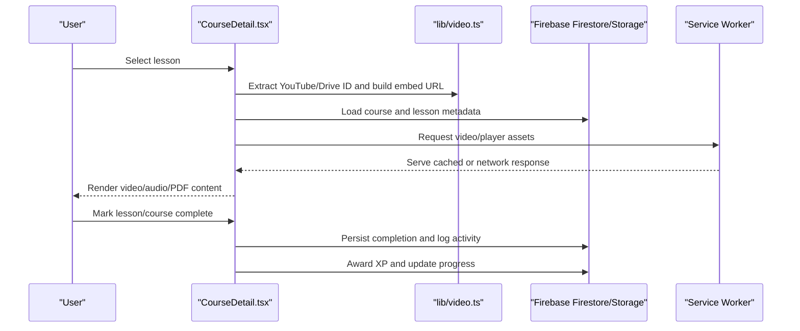

**Diagram sources**
- [CourseDetail.tsx](file://components/CourseDetail.tsx#L1-L526)
- [video.ts](file://lib/video.ts#L1-L149)
- [firebase.ts](file://lib/firebase.ts#L1-L25)
- [service-worker.js](file://public/service-worker.js#L1-L261)

## Detailed Component Analysis

### Video Lesson Integration (YouTube and Google Drive)
- URL parsing:
  - Extract YouTube video ID from multiple URL forms and derive embed URLs.
  - Detect Google Drive URLs and convert to preview embeds.
- Player rendering:
  - CourseDetail selects between iframe embeds (YouTube/Drive) and native HTML5 video for direct URLs.
  - Duration detection is supported for direct video URLs and lessons with durations.
- Embed utilities:
  - Safe extraction and formatting of thumbnails and embed URLs.

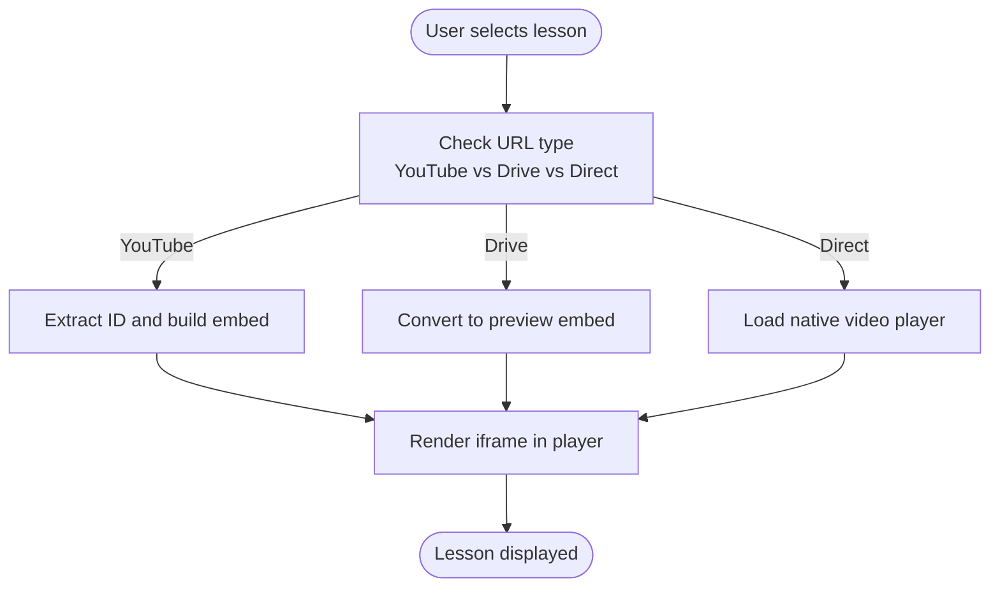

**Diagram sources**
- [video.ts](file://lib/video.ts#L1-L149)
- [CourseDetail.tsx](file://components/CourseDetail.tsx#L214-L256)

**Section sources**
- [video.ts](file://lib/video.ts#L1-L149)
- [CourseDetail.tsx](file://components/CourseDetail.tsx#L1-L526)

### Audio Material Playback and PDF Resource Management
- Support materials:
  - Lessons can include linked PDFs, images, and audio tracks; presented as clickable downloads with icons and sizes.
- Media upload system:
  - Accepts images, videos, audio, PDFs, and documents.
  - Validates MIME types and enforces a 50 MB size cap for support materials.
  - Provides progress callbacks and preview generation for images.
  - Stores files in Firebase Storage and persists metadata in Firestore.

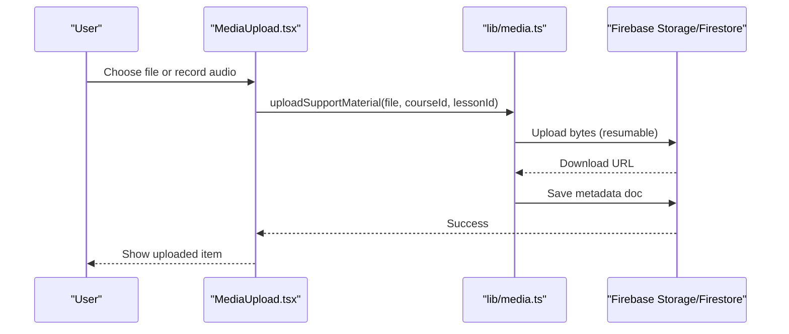

**Diagram sources**
- [MediaUpload.tsx](file://components/MediaUpload.tsx#L1-L589)
- [media.ts](file://lib/media.ts#L298-L369)

**Section sources**
- [CourseDetail.tsx](file://components/CourseDetail.tsx#L282-L321)
- [media.ts](file://lib/media.ts#L298-L369)
- [MediaUpload.tsx](file://components/MediaUpload.tsx#L1-L589)

### Content Progress Tracking, Completion Criteria, and Engagement Metrics
- Completion tracking:
  - CourseDetail toggles course completion state and logs activity.
  - Completion persistence and XP awarding are handled via gamification utilities.
- Engagement metrics:
  - Activities are logged for course starts, completions, mindful flow sessions, and media uploads.
  - Streak calculation and leaderboard queries are supported.

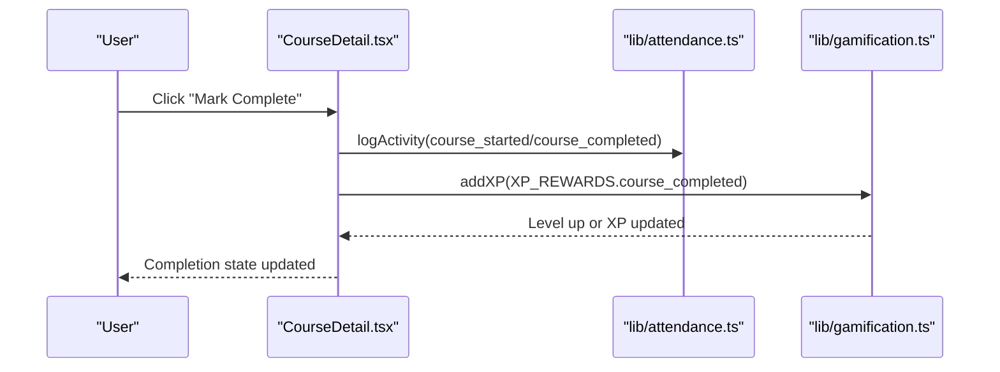

**Diagram sources**
- [CourseDetail.tsx](file://components/CourseDetail.tsx#L128-L146)
- [attendance.ts](file://lib/attendance.ts#L7-L30)
- [gamification.ts](file://lib/gamification.ts#L100-L129)

**Section sources**
- [CourseDetail.tsx](file://components/CourseDetail.tsx#L128-L146)
- [attendance.ts](file://lib/attendance.ts#L1-L177)
- [gamification.ts](file://lib/gamification.ts#L1-L349)

### Media Upload System (File Types, Size Limits, Workflows)
- Supported types and limits:
  - Support materials: images, audio, PDFs; max 50 MB.
  - General media submissions: images, videos, audio, PDFs, documents.
- Workflows:
  - Resumable uploads with progress callbacks.
  - Metadata stored alongside download URLs for retrieval and display.
  - Deletion removes both storage and Firestore records.

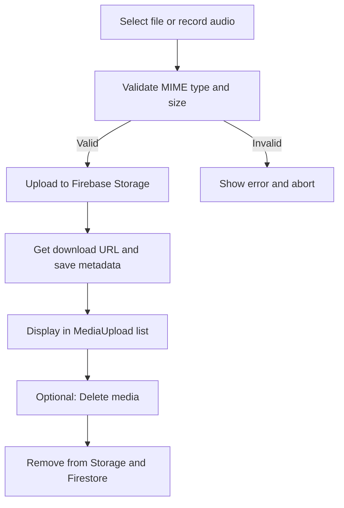

**Diagram sources**
- [media.ts](file://lib/media.ts#L1-L369)
- [MediaUpload.tsx](file://components/MediaUpload.tsx#L1-L589)

**Section sources**
- [media.ts](file://lib/media.ts#L1-L369)
- [MediaUpload.tsx](file://components/MediaUpload.tsx#L1-L589)

### Mindful Flow Content and Music Library Management
- Mindful flow:
  - Cards with categories, durations, and play actions; designed for quick access to guided sessions.
- Music library:
  - Lists courses categorized by type (video, audio, pdf), displays thumbnails, progress bars, and durations.
  - Search/filter support for easy discovery.

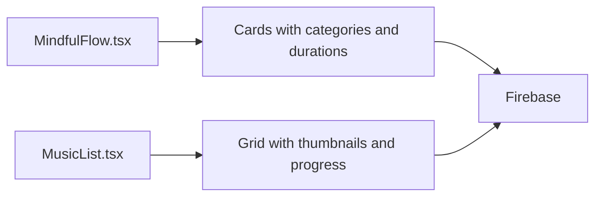

**Diagram sources**
- [MindfulFlow.tsx](file://components/MindfulFlow.tsx#L1-L71)
- [MusicList.tsx](file://components/MusicList.tsx#L1-L136)

**Section sources**
- [MindfulFlow.tsx](file://components/MindfulFlow.tsx#L1-L71)
- [MusicList.tsx](file://components/MusicList.tsx#L1-L136)

### Gallery Content Systems
- Gallery browsing:
  - Flattened galleries across courses are searchable and filterable.
  - Each gallery card shows module and lesson counts, cover images, and gradient placeholders.

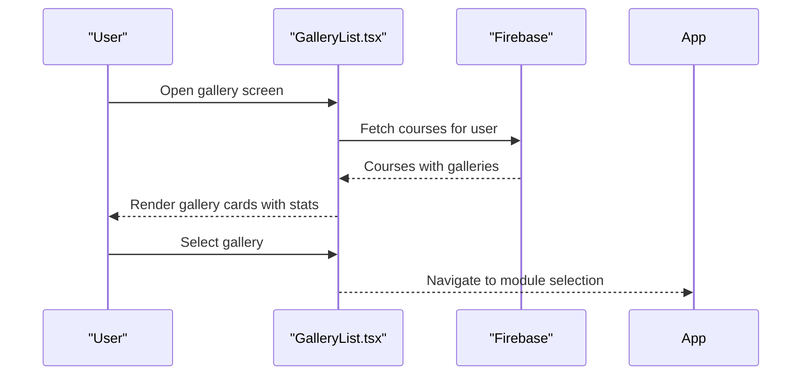

**Diagram sources**
- [GalleryList.tsx](file://components/GalleryList.tsx#L1-L160)

**Section sources**
- [GalleryList.tsx](file://components/GalleryList.tsx#L1-L160)

### Content Caching, Streaming Optimization, and Offline Access
- Service worker strategies:
  - Static assets cache-first; navigation requests network-first then cached app shell; dynamic assets network-first with caching.
  - Skips caching for video/audio range requests to avoid partial content issues.
- Offline page:
  - Friendly offline page with retry button and automatic reload when online.

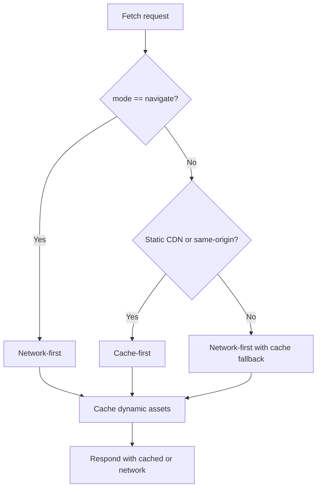

**Diagram sources**
- [service-worker.js](file://public/service-worker.js#L77-L161)

**Section sources**
- [service-worker.js](file://public/service-worker.js#L1-L261)
- [offline.html](file://public/offline.html#L1-L124)

### Payment Status Integration and Access Control
- Server-side verification:
  - Netlify Function verifies Firebase ID tokens and queries Asaas for confirmed payments.
  - Returns authorization status and payment details.
- Client-side gating:
  - App enforces access checks and redirects unauthorized users to a pending-access screen.

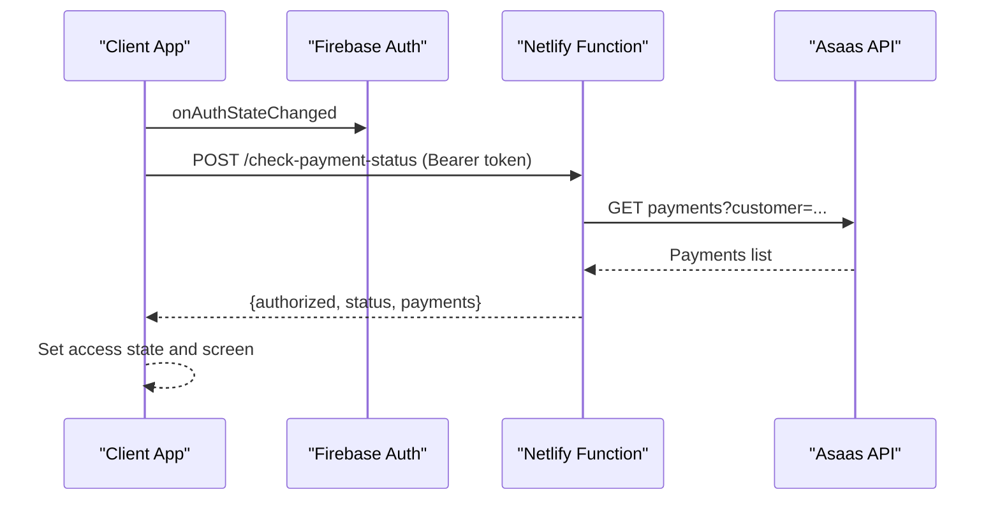

**Diagram sources**
- [check-payment-status.js](file://netlify/functions/check-payment-status.js#L1-L152)
- [App.tsx](file://App.tsx#L65-L108)

**Section sources**
- [check-payment-status.js](file://netlify/functions/check-payment-status.js#L1-L152)
- [App.tsx](file://App.tsx#L65-L108)

## Dependency Analysis
- UI components depend on:
  - Firebase for auth, Firestore, and Storage.
  - Utility libraries for video parsing and media operations.
  - Service worker for caching and offline behavior.
- Backend dependencies:
  - Netlify Functions for secure third-party payment verification.
- Data models:
  - Strongly typed models define media submissions, activities, and progress.

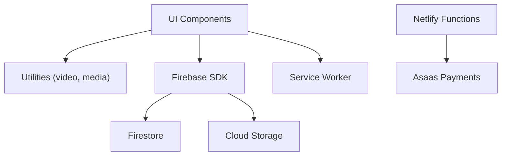

**Diagram sources**
- [App.tsx](file://App.tsx#L1-L449)
- [firebase.ts](file://lib/firebase.ts#L1-L25)
- [video.ts](file://lib/video.ts#L1-L149)
- [media.ts](file://lib/media.ts#L1-L369)
- [service-worker.js](file://public/service-worker.js#L1-L261)
- [check-payment-status.js](file://netlify/functions/check-payment-status.js#L1-L152)

**Section sources**
- [types.ts](file://types.ts#L70-L125)
- [firebase.ts](file://lib/firebase.ts#L1-L25)

## Performance Considerations
- Use cache-first for static assets and CDNs to reduce latency.
- Network-first for API and dynamic content ensures freshness.
- Avoid caching video/audio range requests to prevent partial content errors.
- Compress images and use appropriate video formats for efficient streaming.
- Lazy-load heavy components and split routes to minimize initial bundle size.

## Troubleshooting Guide
- CORS errors during uploads:
  - Configure Firebase Storage CORS or adjust rules as indicated in upload error handling.
- Authentication and authorization:
  - Verify Firebase ID token validity and ensure Netlify Function environment variables are set.
- Service worker offline behavior:
  - Confirm navigation fallback and offline.html availability; check skip-waiting and cache versions.
- Media upload failures:
  - Validate file types and sizes; monitor resumable upload progress and error messages.

**Section sources**
- [media.ts](file://lib/media.ts#L54-L77)
- [check-payment-status.js](file://netlify/functions/check-payment-status.js#L76-L86)
- [service-worker.js](file://public/service-worker.js#L57-L75)

## Conclusion
The learning content delivery system integrates robust media handling, structured content presentation, and comprehensive progress tracking. With Firebase powering identity, data, and storage, and a service worker ensuring offline readiness, it provides a resilient platform for video lessons, audio/PDF resources, mindful flow, and music content. Payment integration and activity analytics further support a complete educational experience.