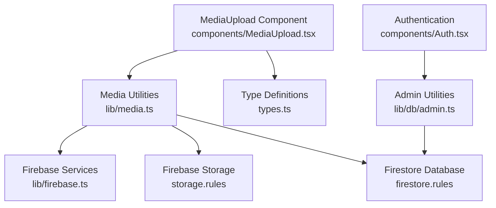
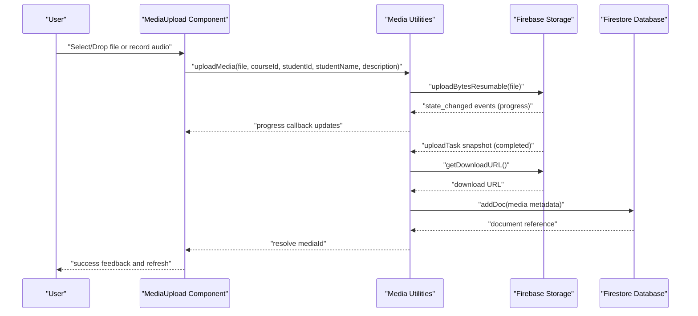
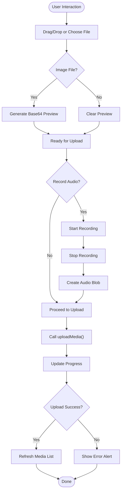
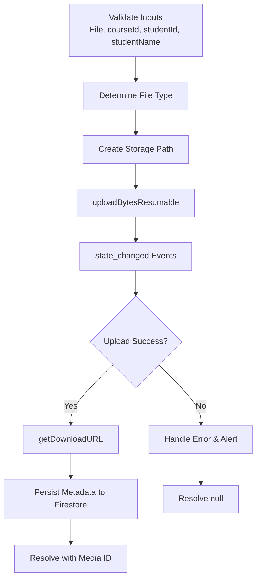
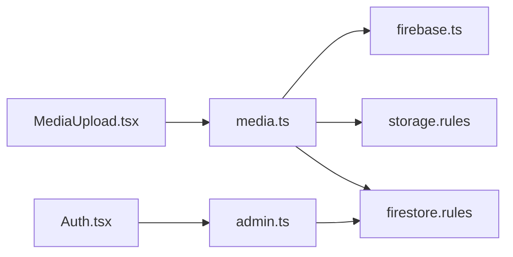

# Media Upload System

<cite>
**Referenced Files in This Document**
- [MediaUpload.tsx](file://components/MediaUpload.tsx)
- [media.ts](file://lib/media.ts)
- [firebase.ts](file://lib/firebase.ts)
- [types.ts](file://types.ts)
- [storage.rules](file://storage.rules)
- [firestore.rules](file://firestore.rules)
- [admin.ts](file://lib/db/admin.ts)
- [Auth.tsx](file://components/Auth.tsx)
</cite>

## Table of Contents
1. [Introduction](#introduction)
2. [Project Structure](#project-structure)
3. [Core Components](#core-components)
4. [Architecture Overview](#architecture-overview)
5. [Detailed Component Analysis](#detailed-component-analysis)
6. [Dependency Analysis](#dependency-analysis)
7. [Performance Considerations](#performance-considerations)
8. [Troubleshooting Guide](#troubleshooting-guide)
9. [Security and Access Control](#security-and-access-control)
10. [Conclusion](#conclusion)

## Introduction
This document provides comprehensive documentation for the media upload system, covering the complete workflow from drag-and-drop file selection to Firebase Storage integration and Firestore database updates. It details supported media formats, validation rules, progress tracking, error handling, and administrative controls. The system supports images, videos, audio files, PDFs, and general documents, with size limits and type restrictions enforced client-side and server-side.

## Project Structure
The media upload system spans UI components, utility libraries, and Firebase integrations:

- UI Layer: MediaUpload component handles user interactions, previews, recording, and displays uploaded content.
- Utility Layer: media.ts encapsulates upload logic, progress callbacks, metadata persistence, and file deletion.
- Firebase Layer: firebase.ts initializes Firebase services used by the media utilities.
- Type Definitions: types.ts defines the MediaSubmission interface used throughout the system.
- Security Rules: storage.rules and firestore.rules enforce access control and size limits.
- Administration: admin.ts provides role-based access checks and user authorization utilities.

**Diagram sources**
- [MediaUpload.tsx](file://components/MediaUpload.tsx#L1-L589)
- [media.ts](file://lib/media.ts#L1-L369)
- [firebase.ts](file://lib/firebase.ts#L1-L25)
- [types.ts](file://types.ts#L70-L82)
- [storage.rules](file://storage.rules#L1-L11)
- [firestore.rules](file://firestore.rules#L1-L97)
- [admin.ts](file://lib/db/admin.ts#L1-L307)
- [Auth.tsx](file://components/Auth.tsx#L1-L265)

**Section sources**
- [MediaUpload.tsx](file://components/MediaUpload.tsx#L1-L589)
- [media.ts](file://lib/media.ts#L1-L369)
- [firebase.ts](file://lib/firebase.ts#L1-L25)
- [types.ts](file://types.ts#L70-L82)
- [storage.rules](file://storage.rules#L1-L11)
- [firestore.rules](file://firestore.rules#L1-L97)
- [admin.ts](file://lib/db/admin.ts#L1-L307)
- [Auth.tsx](file://components/Auth.tsx#L1-L265)

## Core Components
- MediaUpload Component: Provides drag-and-drop, file selection, audio recording, preview generation, upload progress, and content display organized by type (videos, audios, other files).
- Media Utilities: Implements uploadMedia, uploadSupportMaterial, getCourseMedia, getStudentMedia, getAllStudentMediaGrouped, deleteMedia, and file size formatting.
- Firebase Integration: Initializes Firestore, Storage, Authentication, and Cloud Functions.
- Type Definitions: Defines MediaSubmission interface with fields for course association, student ownership, file metadata, and timestamps.
- Security Rules: Enforce authenticated read/write access and 100MB file size limit in Storage; define access patterns for Firestore collections.
- Admin Utilities: Provide role verification, user role retrieval, access authorization checks, and administrative actions.

**Section sources**
- [MediaUpload.tsx](file://components/MediaUpload.tsx#L1-L589)
- [media.ts](file://lib/media.ts#L1-L369)
- [firebase.ts](file://lib/firebase.ts#L1-L25)
- [types.ts](file://types.ts#L70-L82)
- [storage.rules](file://storage.rules#L1-L11)
- [firestore.rules](file://firestore.rules#L1-L97)
- [admin.ts](file://lib/db/admin.ts#L1-L307)

## Architecture Overview
The media upload workflow integrates UI interactions with Firebase Storage for file storage and Firestore for metadata persistence. The system enforces authentication and authorization at multiple layers, ensuring secure access and controlled modifications.

**Diagram sources**
- [MediaUpload.tsx](file://components/MediaUpload.tsx#L86-L155)
- [media.ts](file://lib/media.ts#L8-L117)
- [firebase.ts](file://lib/firebase.ts#L1-L25)

**Section sources**
- [MediaUpload.tsx](file://components/MediaUpload.tsx#L86-L155)
- [media.ts](file://lib/media.ts#L8-L117)
- [firebase.ts](file://lib/firebase.ts#L1-L25)

## Detailed Component Analysis

### MediaUpload Component
Responsibilities:
- Drag-and-drop and file selection handling with visual feedback.
- Audio recording using MediaRecorder API with preview and cancellation.
- File type detection and image preview generation.
- Upload initiation with progress tracking and success/error alerts.
- Display of uploaded media grouped by type with action buttons (download, delete).
- Admin visibility controls to show all student submissions.

Key behaviors:
- Drag events toggle highlight state and trigger file selection on drop.
- Selected files or recorded audio are previewed; images generate base64 previews.
- Upload progress updates are propagated via callback to the UI.
- Deletion requests confirm before proceeding and refresh the media list.

**Diagram sources**
- [MediaUpload.tsx](file://components/MediaUpload.tsx#L45-L155)

**Section sources**
- [MediaUpload.tsx](file://components/MediaUpload.tsx#L1-L589)

### Media Utilities
Responsibilities:
- uploadMedia: Validates inputs, determines file type, uploads to Firebase Storage, and persists metadata to Firestore.
- uploadSupportMaterial: Validates file type (images, audio, PDF) and size (≤50MB), uploads to a dedicated path, and returns download URL.
- getCourseMedia/getStudentMedia: Query Firestore for media associated with a course or student.
- deleteMedia: Removes file from Storage and metadata from Firestore.
- formatFileSize: Converts bytes to human-readable format.

Validation and restrictions:
- File type classification: image/*, video/*, audio/*, application/pdf mapped to 'image', 'video', 'audio', 'pdf'; others as 'document'.
- Size limits: Storage rules enforce ≤100MB; uploadSupportMaterial enforces ≤50MB for support materials.
- Progress tracking: Resumable upload with state_changed events reporting completion percentage.

**Diagram sources**
- [media.ts](file://lib/media.ts#L8-L117)

**Section sources**
- [media.ts](file://lib/media.ts#L1-L369)

### Firebase Integration
Initialization:
- Firebase app initialized with environment variables for credentials.
- Exports auth, db (Firestore with local cache), storage, and functions for use across utilities.

Usage:
- Media utilities use Firestore collection operations and Storage upload/ref/delete operations.
- Authentication ensures only authenticated users can access protected resources.

**Section sources**
- [firebase.ts](file://lib/firebase.ts#L1-L25)
- [media.ts](file://lib/media.ts#L1-L4)

### Type Definitions
MediaSubmission interface:
- Fields include identifiers, course and student associations, file metadata, timestamps, and optional description.
- Used consistently across UI and utilities for type safety.

**Section sources**
- [types.ts](file://types.ts#L70-L82)

## Dependency Analysis
The system exhibits clear separation of concerns:
- UI depends on media utilities for upload operations.
- Media utilities depend on Firebase services for storage and database operations.
- Security rules govern access to Storage and Firestore.
- Admin utilities provide role-based access checks and user authorization.

**Diagram sources**
- [MediaUpload.tsx](file://components/MediaUpload.tsx#L1-L5)
- [media.ts](file://lib/media.ts#L1-L4)
- [firebase.ts](file://lib/firebase.ts#L1-L25)
- [storage.rules](file://storage.rules#L1-L11)
- [firestore.rules](file://firestore.rules#L1-L97)
- [admin.ts](file://lib/db/admin.ts#L1-L307)
- [Auth.tsx](file://components/Auth.tsx#L1-L265)

**Section sources**
- [MediaUpload.tsx](file://components/MediaUpload.tsx#L1-L5)
- [media.ts](file://lib/media.ts#L1-L4)
- [firebase.ts](file://lib/firebase.ts#L1-L25)
- [storage.rules](file://storage.rules#L1-L11)
- [firestore.rules](file://firestore.rules#L1-L97)
- [admin.ts](file://lib/db/admin.ts#L1-L307)
- [Auth.tsx](file://components/Auth.tsx#L1-L265)

## Performance Considerations
- Resumable uploads: Firebase Storage uploadBytesResumable provides reliable transfers with progress callbacks, reducing failure impact.
- Client-side previews: Image previews are generated via FileReader for immediate feedback without server round trips.
- Efficient queries: getCourseMedia and getStudentMedia use Firestore queries with appropriate filters and ordering to minimize data transfer.
- Caching: Firestore local cache configuration improves offline availability and reduces repeated fetches.

## Troubleshooting Guide
Common issues and resolutions:
- CORS errors during upload: The upload utility detects CORS-related errors and suggests configuring CORS or updating Storage rules. Check browser console for detailed instructions.
- Unauthorized access: Ensure user is authenticated; Storage rules require authenticated users for read/write operations.
- File size exceeded: Storage rules limit files to ≤100MB; uploadSupportMaterial additionally restricts support materials to ≤50MB.
- Upload failures: The utility handles various Firebase Storage error codes (unauthorized, canceled, unknown) and provides user-friendly alerts with guidance.

**Section sources**
- [media.ts](file://lib/media.ts#L54-L77)
- [storage.rules](file://storage.rules#L5-L8)

## Security and Access Control
Access control mechanisms:
- Authentication: All operations require authenticated users; Firebase Authentication manages sign-in/sign-up flows.
- Authorization: Firestore rules define who can read/update/delete documents based on user roles and ownership.
- Admin privileges: Admin utilities enforce role checks for sensitive operations, ensuring only administrators can modify privileged data.
- Storage policies: Storage rules mandate authenticated access and enforce file size limits.

Administrative controls:
- Role verification: requireAdmin throws if the current user lacks administrative privileges.
- User role retrieval: getUserRole fetches user role from Firestore for UI decisions.
- Access authorization: checkUserAccess evaluates whether a student has explicit authorization or active course enrollment.

**Section sources**
- [firestore.rules](file://firestore.rules#L5-L21)
- [admin.ts](file://lib/db/admin.ts#L6-L22)
- [admin.ts](file://lib/db/admin.ts#L66-L83)
- [admin.ts](file://lib/db/admin.ts#L85-L127)
- [Auth.tsx](file://components/Auth.tsx#L1-L265)

## Conclusion
The media upload system provides a robust, secure, and user-friendly solution for managing educational content. It leverages Firebase Storage and Firestore for scalable file handling and metadata persistence, with comprehensive validation, progress tracking, and administrative oversight. The modular design ensures maintainability and extensibility, while strict access controls protect sensitive data and operations.