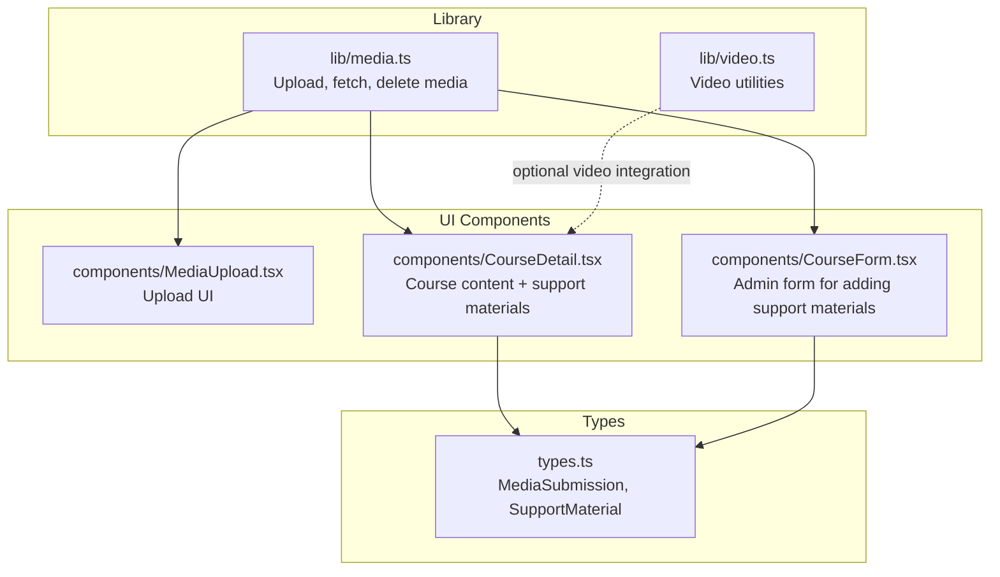
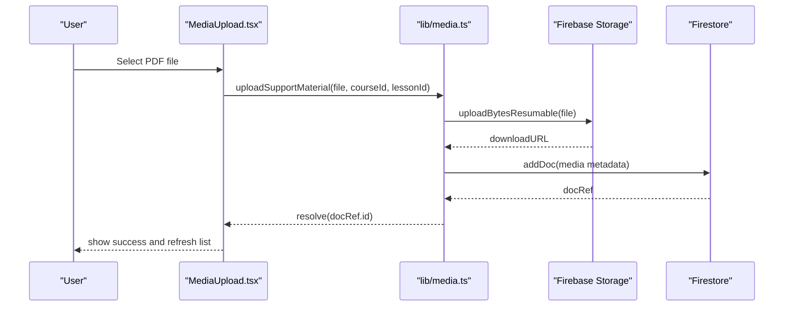
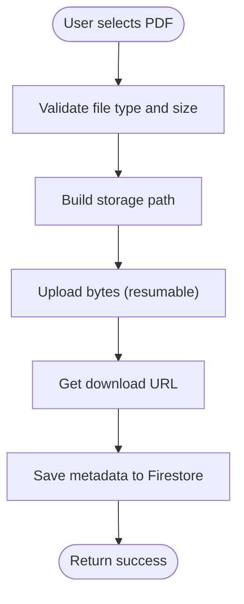
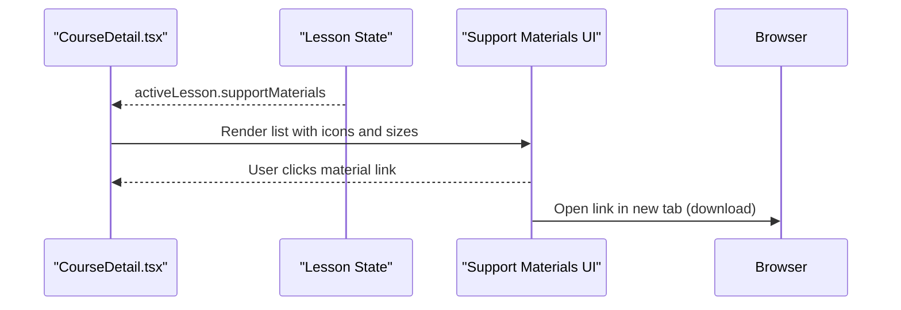
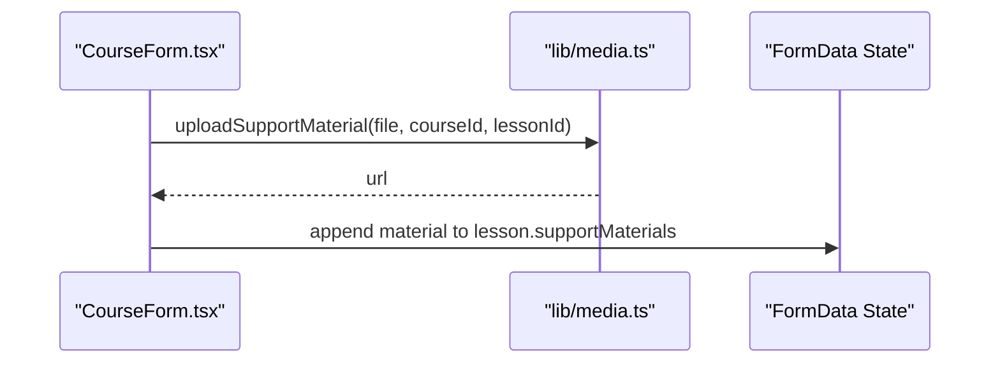
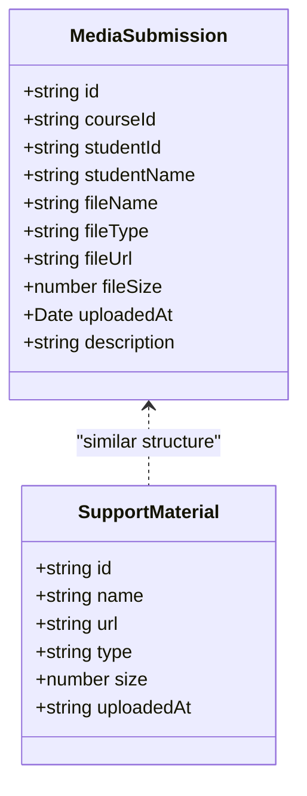
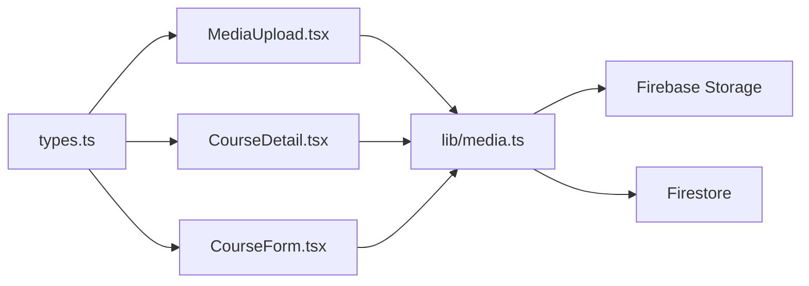

# PDF Resource Management

<cite>
**Referenced Files in This Document**
- [media.ts](file://lib/media.ts)
- [MediaUpload.tsx](file://components/MediaUpload.tsx)
- [CourseDetail.tsx](file://components/CourseDetail.tsx)
- [CourseForm.tsx](file://components/CourseForm.tsx)
- [types.ts](file://types.ts)
- [video.ts](file://lib/video.ts)
</cite>

## Table of Contents
1. [Introduction](#introduction)
2. [Project Structure](#project-structure)
3. [Core Components](#core-components)
4. [Architecture Overview](#architecture-overview)
5. [Detailed Component Analysis](#detailed-component-analysis)
6. [Dependency Analysis](#dependency-analysis)
7. [Performance Considerations](#performance-considerations)
8. [Troubleshooting Guide](#troubleshooting-guide)
9. [Conclusion](#conclusion)

## Introduction
This document describes the PDF resource management system within the learning platform. It covers how PDFs are uploaded, stored, retrieved, and integrated with course content. It also documents the support material integration that displays PDFs alongside video lessons, the download functionality, file metadata handling, and considerations for accessibility and security.

## Project Structure
The PDF resource management spans several modules:
- Library functions for media handling and storage
- UI components for uploading and displaying resources
- Course content integration for support materials
- Type definitions for media submissions and support materials

**Diagram sources**
- [media.ts](file://lib/media.ts#L1-L369)
- [MediaUpload.tsx](file://components/MediaUpload.tsx#L1-L589)
- [CourseDetail.tsx](file://components/CourseDetail.tsx#L280-L479)
- [CourseForm.tsx](file://components/CourseForm.tsx#L458-L657)
- [types.ts](file://types.ts#L70-L82)
- [video.ts](file://lib/video.ts#L1-L149)

**Section sources**
- [media.ts](file://lib/media.ts#L1-L369)
- [MediaUpload.tsx](file://components/MediaUpload.tsx#L1-L589)
- [CourseDetail.tsx](file://components/CourseDetail.tsx#L280-L479)
- [CourseForm.tsx](file://components/CourseForm.tsx#L458-L657)
- [types.ts](file://types.ts#L70-L82)
- [video.ts](file://lib/video.ts#L1-L149)

## Core Components
- Media library: Provides upload, fetch, delete, and file-type detection for PDFs and other media.
- Media upload UI: Handles drag-and-drop, file selection, previews, progress, and submission.
- Course detail: Displays support materials (including PDFs) alongside lessons and enables downloads.
- Course form: Allows administrators to attach support materials (PDFs/images/audio) to lessons.
- Types: Defines MediaSubmission and related structures for consistent handling.

**Section sources**
- [media.ts](file://lib/media.ts#L8-L117)
- [MediaUpload.tsx](file://components/MediaUpload.tsx#L14-L589)
- [CourseDetail.tsx](file://components/CourseDetail.tsx#L280-L479)
- [CourseForm.tsx](file://components/CourseForm.tsx#L458-L657)
- [types.ts](file://types.ts#L70-L82)

## Architecture Overview
The system uses Firebase for storage and metadata persistence. PDFs are treated as support materials for lessons and as part of the general media submission system.

**Diagram sources**
- [MediaUpload.tsx](file://components/MediaUpload.tsx#L124-L155)
- [media.ts](file://lib/media.ts#L301-L368)

## Detailed Component Analysis

### PDF Upload Pipeline
- Validation: Ensures file type is allowed (PDF, image, audio) and size does not exceed 50 MB.
- Storage path: Organized under support-materials/{courseId}/{lessonId}/timestamp_filename.pdf.
- Upload: Uses resumable upload with progress callbacks.
- Metadata: Stores filename, type, URL, size, timestamp, and courseId/lessonId linkage.

**Diagram sources**
- [media.ts](file://lib/media.ts#L301-L368)

**Section sources**
- [media.ts](file://lib/media.ts#L301-L368)

### Support Material Integration in Course Content
- CourseDetail displays support materials for the active lesson.
- PDFs are shown with a dedicated icon and file size.
- Clicking the link opens the file in a new tab for download or inline viewing.

**Diagram sources**
- [CourseDetail.tsx](file://components/CourseDetail.tsx#L282-L321)

**Section sources**
- [CourseDetail.tsx](file://components/CourseDetail.tsx#L282-L321)

### Admin Workflow for Adding PDFs
- CourseForm integrates support material uploads during content creation/editing.
- After upload, the system determines the type and adds the material to the lesson’s supportMaterials array with name, URL, type, size, and timestamp.

**Diagram sources**
- [CourseForm.tsx](file://components/CourseForm.tsx#L458-L518)
- [media.ts](file://lib/media.ts#L301-L368)

**Section sources**
- [CourseForm.tsx](file://components/CourseForm.tsx#L458-L518)
- [media.ts](file://lib/media.ts#L301-L368)

### Media Submission System (General)
- The MediaUpload component supports PDFs via the same pipeline as other media types.
- File type detection recognizes PDFs and renders appropriate icons.
- Users can preview images before upload and see progress during upload.

**Diagram sources**
- [types.ts](file://types.ts#L70-L82)

**Section sources**
- [MediaUpload.tsx](file://components/MediaUpload.tsx#L65-L78)
- [types.ts](file://types.ts#L70-L82)

## Dependency Analysis
- Media library depends on Firebase SDKs for storage and Firestore.
- UI components depend on the media library and types.
- CourseDetail and CourseForm depend on the media library and types for rendering and state updates.

**Diagram sources**
- [types.ts](file://types.ts#L70-L82)
- [MediaUpload.tsx](file://components/MediaUpload.tsx#L1-L50)
- [CourseDetail.tsx](file://components/CourseDetail.tsx#L1-L50)
- [CourseForm.tsx](file://components/CourseForm.tsx#L1-L50)
- [media.ts](file://lib/media.ts#L1-L10)

**Section sources**
- [media.ts](file://lib/media.ts#L1-L10)
- [types.ts](file://types.ts#L70-L82)

## Performance Considerations
- Resumable uploads reduce network failure impact and improve reliability for large PDFs.
- 50 MB limit prevents excessive storage usage and ensures reasonable load times.
- Metadata queries are filtered by courseId and ordered by upload time for efficient retrieval.

**Section sources**
- [media.ts](file://lib/media.ts#L326-L331)
- [media.ts](file://lib/media.ts#L163-L191)

## Troubleshooting Guide
- CORS errors during upload: The media library logs actionable guidance for configuring CORS or storage rules.
- Unauthorized or unknown storage errors: Specific error codes are handled with user-friendly alerts and suggestions.
- Download issues: Links open in a new tab; ensure the storage rules allow read access for intended users.

**Section sources**
- [media.ts](file://lib/media.ts#L54-L73)

## Conclusion
The PDF resource management system leverages Firebase for robust storage and metadata handling, integrates seamlessly with course content as support materials, and provides a user-friendly upload experience. Administrators can attach PDFs to lessons, while learners can access them via course pages. The system enforces size limits, offers resumable uploads, and surfaces helpful error messaging for common issues.