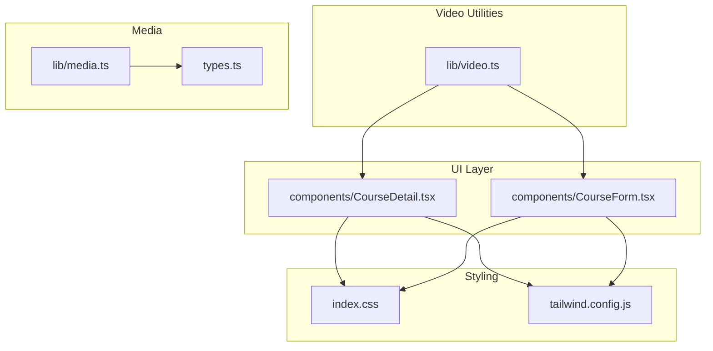
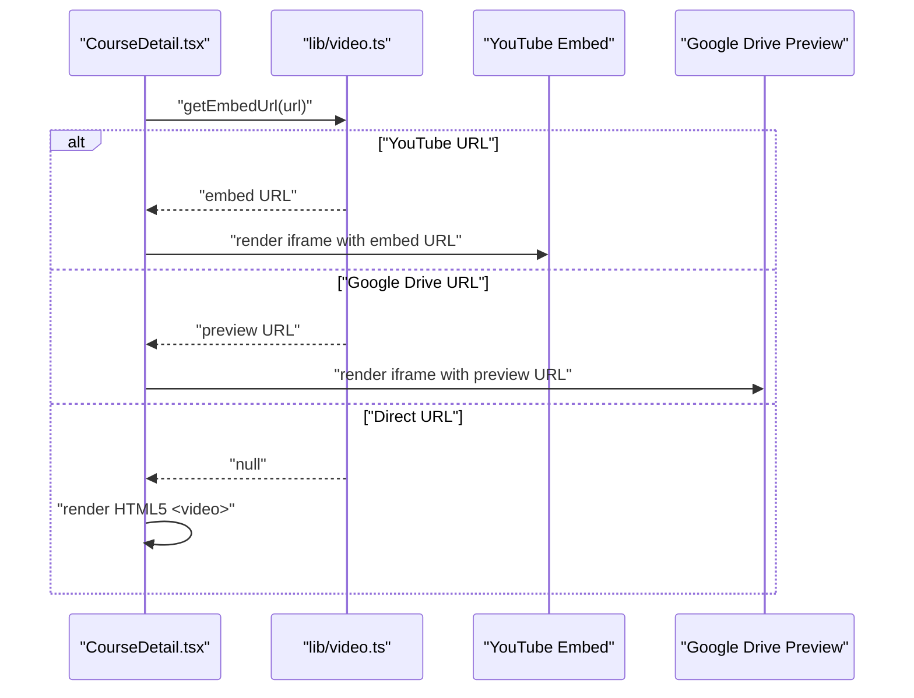
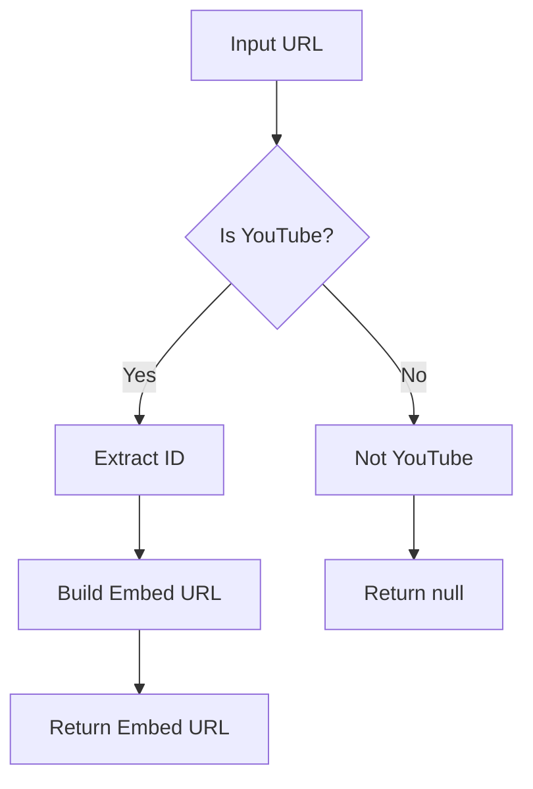
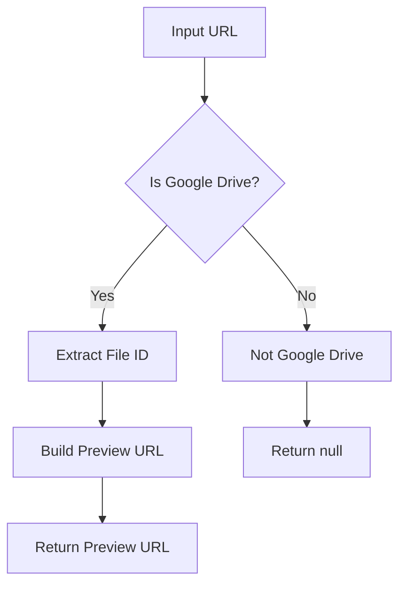
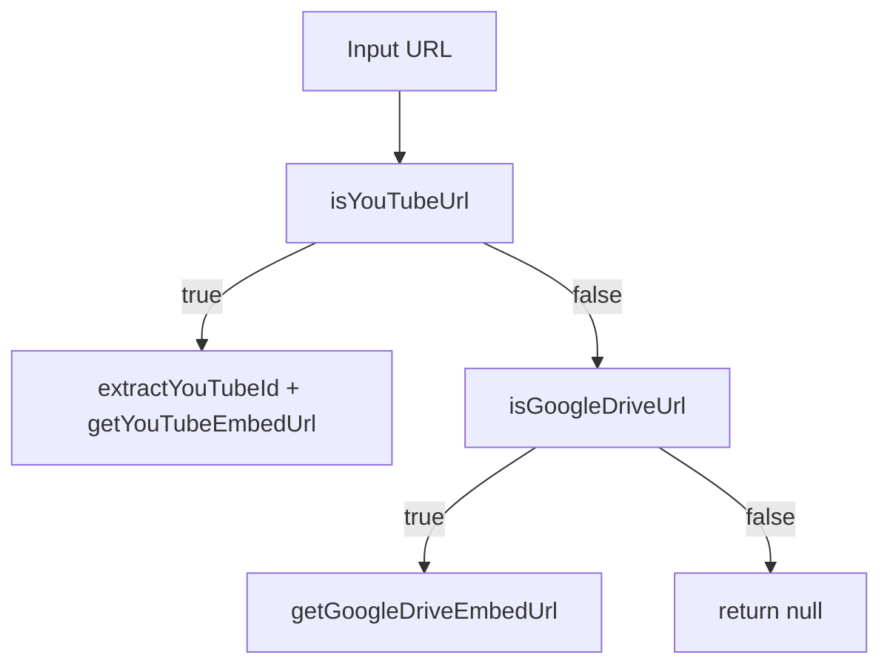
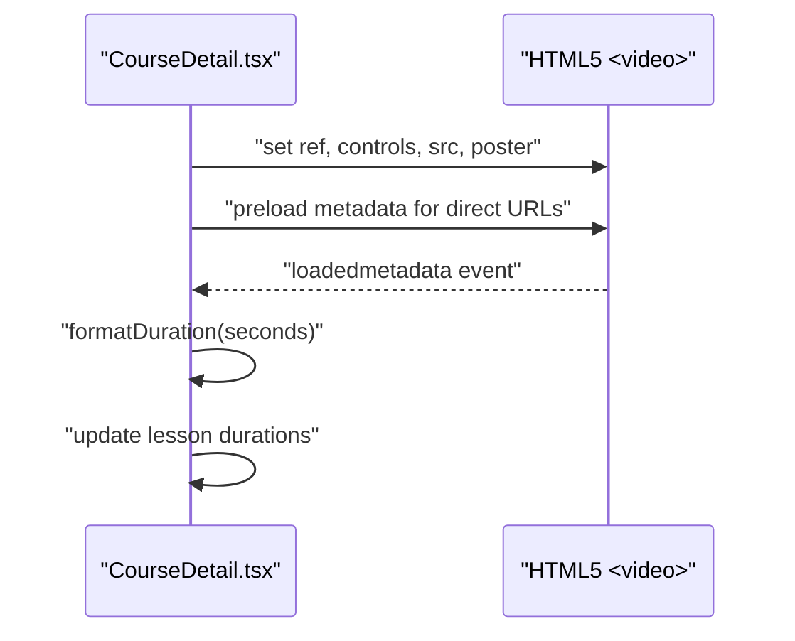
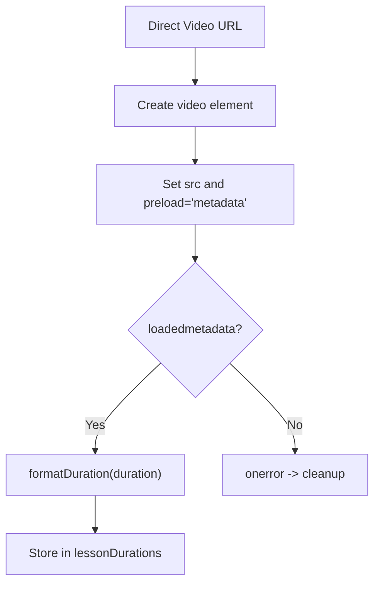
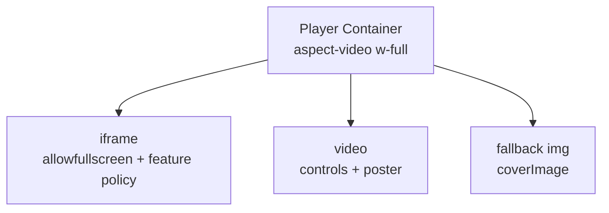
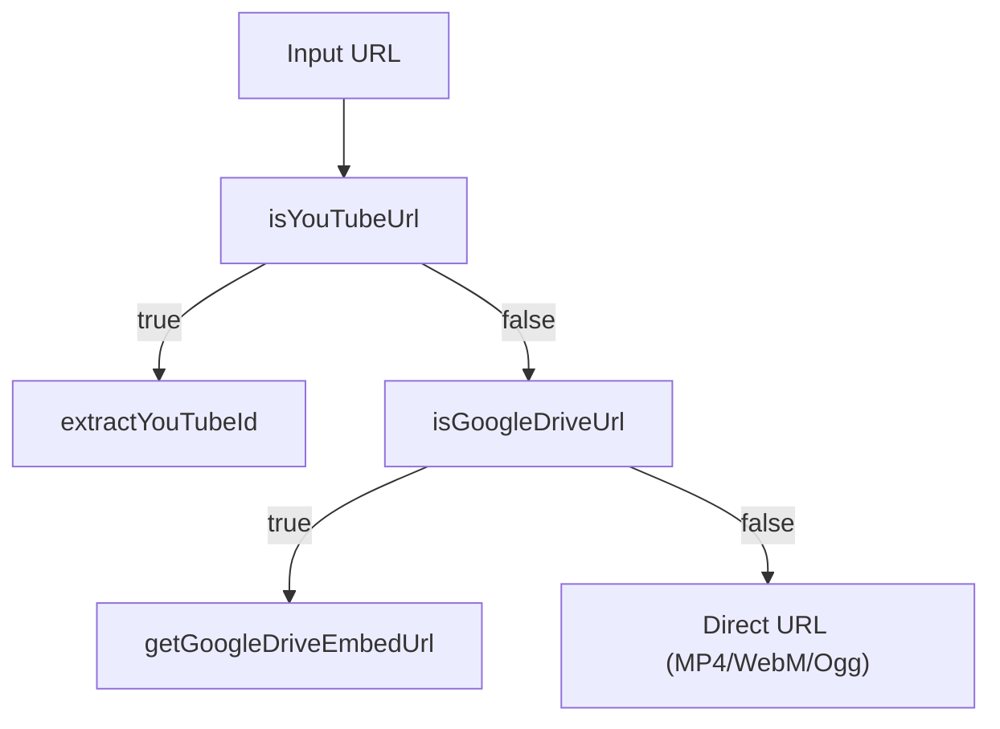
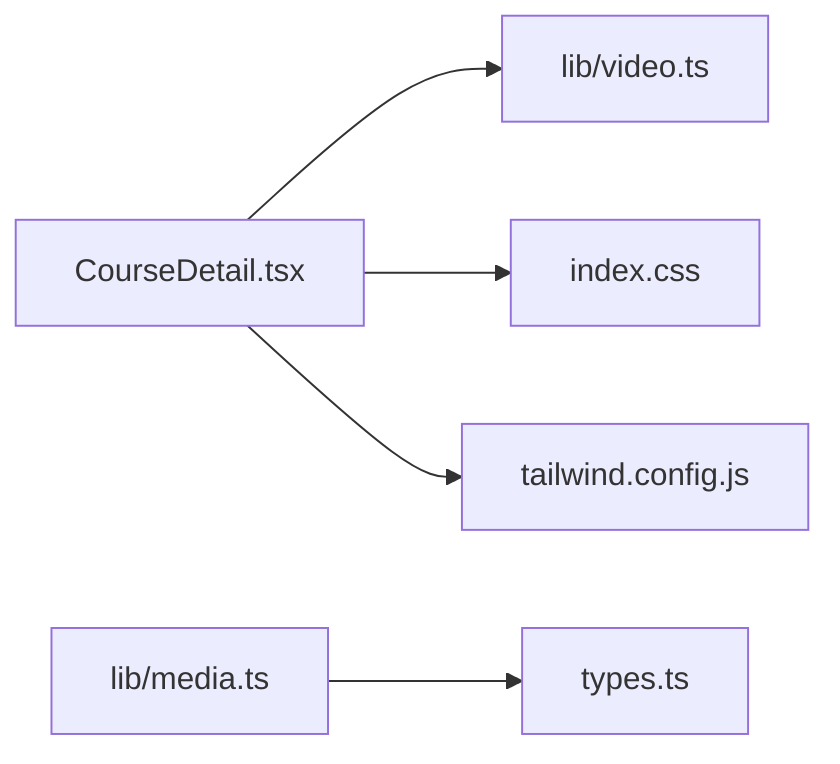

# Video Integration

<cite>
**Referenced Files in This Document**
- [video.ts](file://lib/video.ts)
- [CourseDetail.tsx](file://components/CourseDetail.tsx)
- [types.ts](file://types.ts)
- [index.css](file://index.css)
- [tailwind.config.js](file://tailwind.config.js)
- [CourseForm.tsx](file://components/CourseForm.tsx)
- [media.ts](file://lib/media.ts)
</cite>

## Table of Contents
1. [Introduction](#introduction)
2. [Project Structure](#project-structure)
3. [Core Components](#core-components)
4. [Architecture Overview](#architecture-overview)
5. [Detailed Component Analysis](#detailed-component-analysis)
6. [Dependency Analysis](#dependency-analysis)
7. [Performance Considerations](#performance-considerations)
8. [Troubleshooting Guide](#troubleshooting-guide)
9. [Conclusion](#conclusion)

## Introduction
This document describes the video integration system used in the application. It covers:
- YouTube URL parsing and embed generation
- Google Drive video embedding
- Direct video URL support (MP4, WebM, OGG)
- React-based video player implementation with refs and metadata handling
- Responsive sizing and accessibility configuration
- Fallback mechanisms and error handling strategies
- Examples of URL validation, thumbnail generation, and duration detection

## Project Structure
The video integration spans several modules:
- Utility library for video parsing and embed generation
- UI component that renders either an iframe (YouTube/Drive) or an HTML5 video element
- Supporting utilities for media uploads and metadata
- Tailwind-based responsive layout and aspect ratio handling

**Diagram sources**
- [video.ts](file://lib/video.ts#L1-L148)
- [CourseDetail.tsx](file://components/CourseDetail.tsx#L218-L256)
- [CourseForm.tsx](file://components/CourseForm.tsx#L1026-L1040)
- [index.css](file://index.css#L1-L158)
- [tailwind.config.js](file://tailwind.config.js#L1-L72)
- [media.ts](file://lib/media.ts#L70-L82)
- [types.ts](file://types.ts#L70-L82)

**Section sources**
- [video.ts](file://lib/video.ts#L1-L148)
- [CourseDetail.tsx](file://components/CourseDetail.tsx#L218-L256)
- [CourseForm.tsx](file://components/CourseForm.tsx#L1026-L1040)
- [index.css](file://index.css#L1-L158)
- [tailwind.config.js](file://tailwind.config.js#L1-L72)
- [media.ts](file://lib/media.ts#L70-L82)
- [types.ts](file://types.ts#L70-L82)

## Core Components
- YouTube utilities: ID extraction, embed URL generation, and thumbnail retrieval
- Google Drive utilities: URL normalization and preview embed generation
- Universal embed URL resolver
- HTML5 video duration detection helpers
- UI rendering pipeline: iframe vs HTML5 video vs image fallback

Key responsibilities:
- Parse and normalize external video URLs
- Generate secure, accessible embed URLs
- Detect and format video durations for direct MP4/WebM/Ogg sources
- Render responsive, accessible video players

**Section sources**
- [video.ts](file://lib/video.ts#L12-L107)
- [video.ts](file://lib/video.ts#L113-L148)
- [CourseDetail.tsx](file://components/CourseDetail.tsx#L218-L256)
- [CourseDetail.tsx](file://components/CourseDetail.tsx#L88-L126)

## Architecture Overview
The system routes video URLs through a unified resolver that selects the appropriate playback method:
- YouTube: Extract ID and produce an embed URL with safe parameters
- Google Drive: Normalize file URLs to preview embeds
- Direct URLs: Render via HTML5 video element when supported

**Diagram sources**
- [CourseDetail.tsx](file://components/CourseDetail.tsx#L218-L256)
- [video.ts](file://lib/video.ts#L96-L107)

## Detailed Component Analysis

### YouTube Integration
- ID extraction supports multiple URL forms and bare IDs
- Embed URL generation produces a safe, non-autoplay URL with related videos disabled
- Thumbnail retrieval uses the standard high-quality static image endpoint

**Diagram sources**
- [video.ts](file://lib/video.ts#L40-L43)
- [video.ts](file://lib/video.ts#L12-L28)
- [video.ts](file://lib/video.ts#L33-L35)
- [video.ts](file://lib/video.ts#L48-L54)

**Section sources**
- [video.ts](file://lib/video.ts#L12-L28)
- [video.ts](file://lib/video.ts#L33-L35)
- [video.ts](file://lib/video.ts#L48-L54)

### Google Drive Integration
- Recognizes file and open URLs and extracts the file ID
- Produces a preview embed URL suitable for iframed playback

**Diagram sources**
- [video.ts](file://lib/video.ts#L59-L62)
- [video.ts](file://lib/video.ts#L68-L91)

**Section sources**
- [video.ts](file://lib/video.ts#L59-L62)
- [video.ts](file://lib/video.ts#L68-L91)

### Universal Embed Resolver
- Attempts YouTube resolution first, then Google Drive
- Returns null for unsupported or direct URLs to trigger HTML5 video rendering

**Diagram sources**
- [video.ts](file://lib/video.ts#L96-L107)

**Section sources**
- [video.ts](file://lib/video.ts#L96-L107)

### HTML5 Video Player Implementation
- Uses a React ref to access the native video element
- Applies responsive sizing via aspect ratio utilities
- Configures accessibility attributes and fullscreen capabilities
- Skips duration detection for YouTube/Drive (iframe-based)

**Diagram sources**
- [CourseDetail.tsx](file://components/CourseDetail.tsx#L228-L239)
- [CourseDetail.tsx](file://components/CourseDetail.tsx#L88-L126)
- [video.ts](file://lib/video.ts#L113-L148)

**Section sources**
- [CourseDetail.tsx](file://components/CourseDetail.tsx#L228-L239)
- [CourseDetail.tsx](file://components/CourseDetail.tsx#L88-L126)
- [video.ts](file://lib/video.ts#L113-L148)

### Duration Detection and Metadata Handling
- Detects duration for direct MP4/WebM/Ogg sources by loading metadata
- Formats duration into MM:SS or HH:MM:SS
- Stores durations keyed by lesson ID for display

**Diagram sources**
- [CourseDetail.tsx](file://components/CourseDetail.tsx#L95-L126)
- [video.ts](file://lib/video.ts#L134-L148)

**Section sources**
- [CourseDetail.tsx](file://components/CourseDetail.tsx#L95-L126)
- [video.ts](file://lib/video.ts#L134-L148)

### Responsive Sizing and Accessibility
- Aspect ratio maintained via Tailwind’s aspect-video utility
- Full-width container with rounded corners and subtle borders
- iframe allowsfullscreen and comprehensive feature policy for modern browsers
- HTML5 video uses native controls and poster image fallback

**Diagram sources**
- [CourseDetail.tsx](file://components/CourseDetail.tsx#L218-L256)
- [index.css](file://index.css#L1-L158)
- [tailwind.config.js](file://tailwind.config.js#L1-L72)

**Section sources**
- [CourseDetail.tsx](file://components/CourseDetail.tsx#L218-L256)
- [index.css](file://index.css#L1-L158)
- [tailwind.config.js](file://tailwind.config.js#L1-L72)

### URL Validation and Examples
- YouTube validation checks for known host patterns
- Google Drive validation checks for drive domain
- Example validations:
  - YouTube: watch, youtu.be, embed variants
  - Google Drive: file and open URL forms
  - Direct: MP4/WebM/Ogg extensions

**Diagram sources**
- [video.ts](file://lib/video.ts#L40-L43)
- [video.ts](file://lib/video.ts#L59-L62)
- [video.ts](file://lib/video.ts#L96-L107)

**Section sources**
- [video.ts](file://lib/video.ts#L40-L43)
- [video.ts](file://lib/video.ts#L59-L62)
- [video.ts](file://lib/video.ts#L96-L107)

### Thumbnail Generation
- Generates YouTube thumbnails using the standard static image endpoint derived from the extracted video ID

**Section sources**
- [video.ts](file://lib/video.ts#L48-L54)

### Fallback Mechanisms
- If embed URL is unavailable, the UI falls back to an HTML5 video element
- If neither embed nor direct URL is present, it displays a cover image or a placeholder

**Section sources**
- [CourseDetail.tsx](file://components/CourseDetail.tsx#L218-L256)

### Error Handling Strategies
- HTML5 video creation and metadata loading are wrapped in try/catch and cleanup paths
- On error, the dynamically created video element is removed to avoid memory leaks
- CourseDetail guards against YouTube/Drive URLs when attempting metadata loading

**Section sources**
- [CourseDetail.tsx](file://components/CourseDetail.tsx#L105-L124)

## Dependency Analysis
- CourseDetail depends on video utilities for embed resolution and on local helpers for duration formatting
- Tailwind utilities provide responsive aspect ratios and consistent spacing
- Types define media submission structures used elsewhere in the app

**Diagram sources**
- [CourseDetail.tsx](file://components/CourseDetail.tsx#L218-L256)
- [video.ts](file://lib/video.ts#L96-L107)
- [index.css](file://index.css#L1-L158)
- [tailwind.config.js](file://tailwind.config.js#L1-L72)
- [media.ts](file://lib/media.ts#L70-L82)
- [types.ts](file://types.ts#L70-L82)

**Section sources**
- [CourseDetail.tsx](file://components/CourseDetail.tsx#L218-L256)
- [video.ts](file://lib/video.ts#L96-L107)
- [index.css](file://index.css#L1-L158)
- [tailwind.config.js](file://tailwind.config.js#L1-L72)
- [media.ts](file://lib/media.ts#L70-L82)
- [types.ts](file://types.ts#L70-L82)

## Performance Considerations
- Prefer iframe-based playback for YouTube/Drive to leverage browser and CDN optimizations
- For direct MP4/WebM/Ogg, preload metadata to detect duration without downloading full content
- Use aspect-video utilities to prevent layout shifts during load
- Avoid autoplay in embeds to respect user experience and reduce bandwidth spikes

## Troubleshooting Guide
- If YouTube embeds do not appear:
  - Verify the URL matches supported patterns and the ID is valid
  - Confirm the embed URL is being generated and passed to the iframe
- If Google Drive previews fail:
  - Ensure the file ID is extracted from the URL
  - Confirm the preview URL is reachable in a browser
- If HTML5 video does not play:
  - Check MIME type compatibility (MP4/H.264, WebM VP9, OGG)
  - Verify the poster image URL is valid
- If duration is not detected:
  - Confirm the URL is a direct MP4/WebM/Ogg
  - Ensure the video element fires loadedmetadata and that errors are handled

**Section sources**
- [video.ts](file://lib/video.ts#L12-L28)
- [video.ts](file://lib/video.ts#L68-L91)
- [CourseDetail.tsx](file://components/CourseDetail.tsx#L95-L126)

## Conclusion
The video integration system provides robust support for YouTube, Google Drive, and direct video formats. It offers responsive, accessible playback with careful fallbacks and metadata handling. The modular design keeps URL parsing and embed generation centralized while the UI remains flexible and performant.