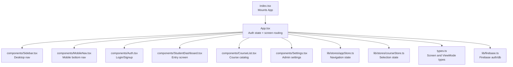
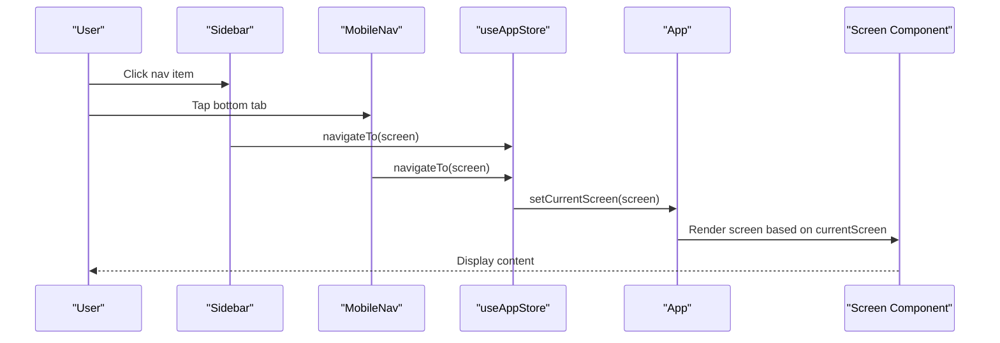
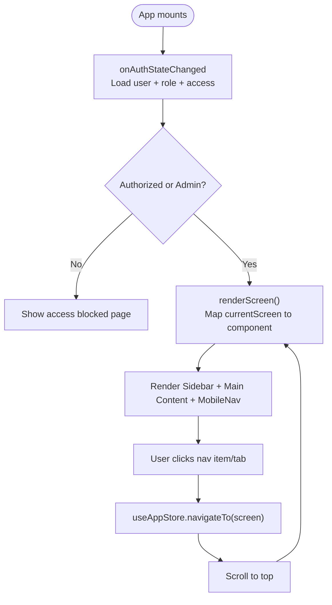
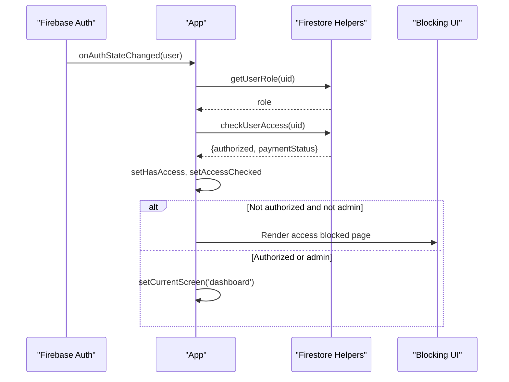
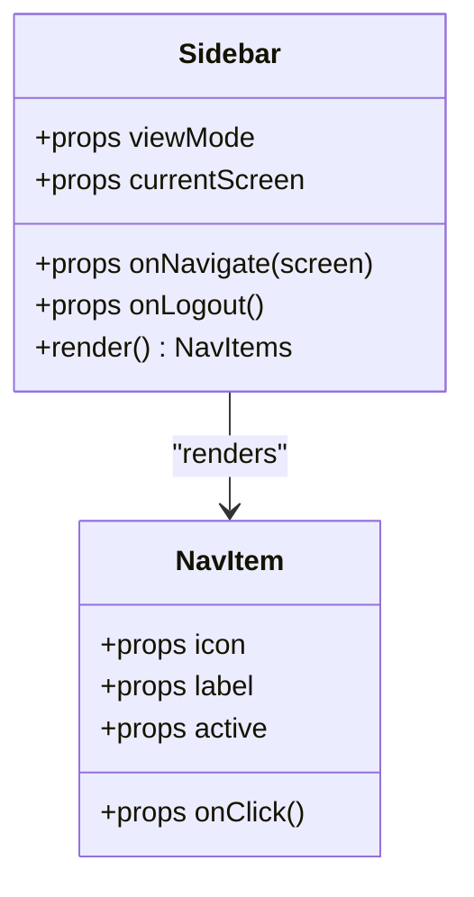
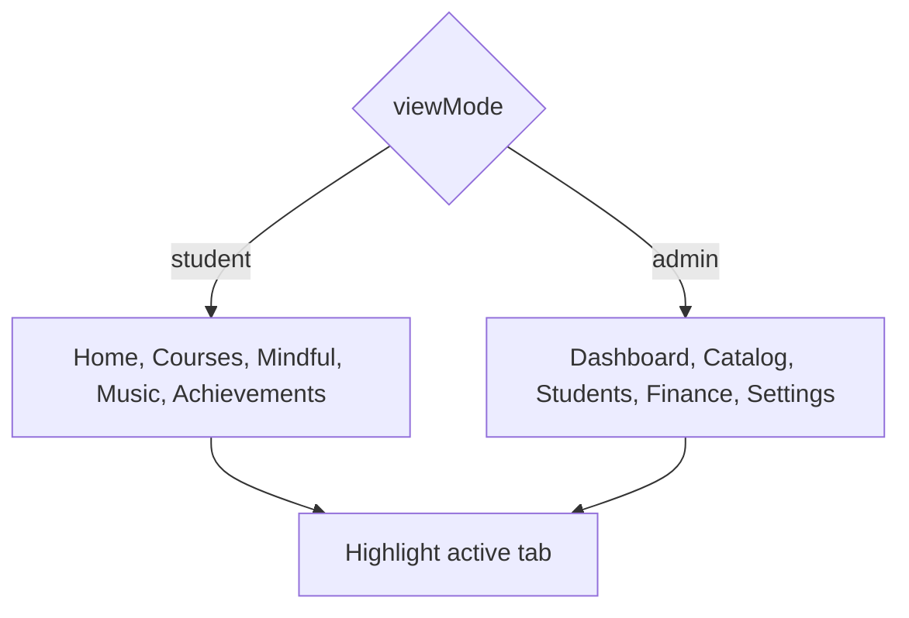
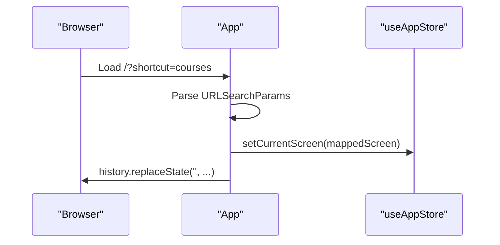
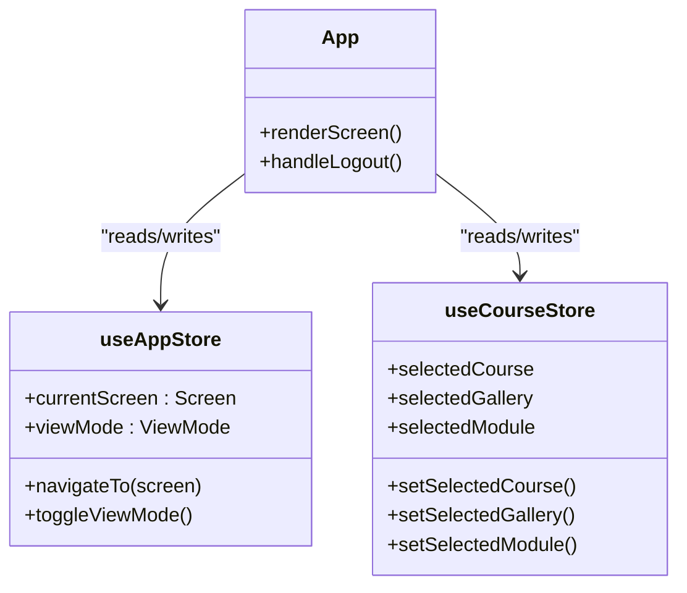
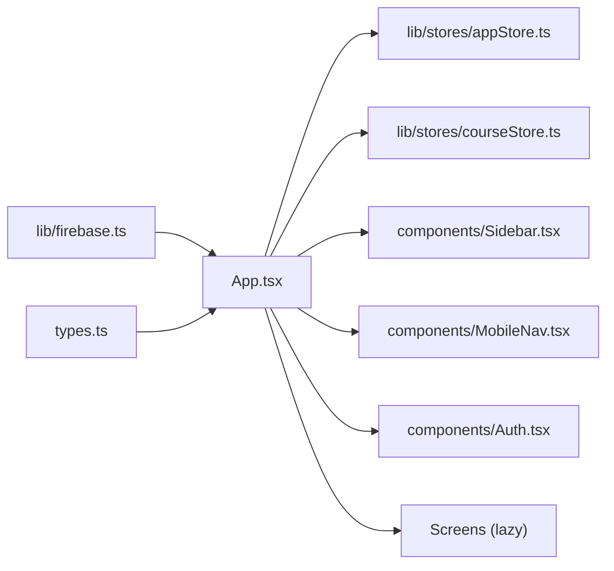

# Navigation & Routing

<cite>
**Referenced Files in This Document**
- [App.tsx](file://App.tsx)
- [index.tsx](file://index.tsx)
- [Sidebar.tsx](file://components/Sidebar.tsx)
- [MobileNav.tsx](file://components/MobileNav.tsx)
- [Auth.tsx](file://components/Auth.tsx)
- [StudentDashboard.tsx](file://components/StudentDashboard.tsx)
- [CourseList.tsx](file://components/CourseList.tsx)
- [Settings.tsx](file://components/Settings.tsx)
- [appStore.ts](file://lib/stores/appStore.ts)
- [courseStore.ts](file://lib/stores/courseStore.ts)
- [types.ts](file://types.ts)
- [firebase.ts](file://lib/firebase.ts)
</cite>

## Table of Contents
1. [Introduction](#introduction)
2. [Project Structure](#project-structure)
3. [Core Components](#core-components)
4. [Architecture Overview](#architecture-overview)
5. [Detailed Component Analysis](#detailed-component-analysis)
6. [Dependency Analysis](#dependency-analysis)
7. [Performance Considerations](#performance-considerations)
8. [Troubleshooting Guide](#troubleshooting-guide)
9. [Conclusion](#conclusion)
10. [Appendices](#appendices)

## Introduction
This document explains the navigation and routing system of the application. It covers how screens are modeled and navigated, how authentication and authorization gates work, how navigation adapts to desktop and mobile, and how state management integrates with navigation. It also documents URL structure, deep linking, navigation persistence, accessibility, and user experience enhancements such as animated transitions and keyboard-friendly controls.

## Project Structure
The navigation system centers around a single-page application built with React and Zustand for state. Navigation is driven by an internal screen state rather than URL routing. Authentication is handled via Firebase Auth, and navigation is guarded by user roles and access checks. The UI is composed of a desktop sidebar and a mobile bottom navigation bar.

**Diagram sources**
- [index.tsx](file://index.tsx#L1-L65)
- [App.tsx](file://App.tsx#L1-L449)
- [Sidebar.tsx](file://components/Sidebar.tsx#L1-L152)
- [MobileNav.tsx](file://components/MobileNav.tsx#L1-L118)
- [Auth.tsx](file://components/Auth.tsx#L1-L265)
- [StudentDashboard.tsx](file://components/StudentDashboard.tsx#L1-L135)
- [CourseList.tsx](file://components/CourseList.tsx#L1-L216)
- [Settings.tsx](file://components/Settings.tsx#L1-L200)
- [appStore.ts](file://lib/stores/appStore.ts#L1-L82)
- [courseStore.ts](file://lib/stores/courseStore.ts#L1-L27)
- [types.ts](file://types.ts#L1-L125)
- [firebase.ts](file://lib/firebase.ts#L1-L25)

**Section sources**
- [index.tsx](file://index.tsx#L1-L65)
- [App.tsx](file://App.tsx#L1-L449)
- [types.ts](file://types.ts#L1-L125)

## Core Components
- Internal routing model: Navigation is represented by a typed Screen union and managed by a Zustand store. There is no external URL router; navigation is programmatic.
- Authentication and authorization: Firebase Auth drives login/logout. Roles and access checks are performed against Firestore-backed helpers. Unauthorized users are shown a blocking page until authorized.
- Navigation UI: Desktop uses a fixed sidebar; mobile uses a bottom tab bar. Both reflect the current screen and adapt to view mode (student/admin).
- State integration: Navigation actions update the current screen and scroll to top. Selection state for courses and galleries is maintained separately.

**Section sources**
- [types.ts](file://types.ts#L3-L25)
- [appStore.ts](file://lib/stores/appStore.ts#L1-L82)
- [courseStore.ts](file://lib/stores/courseStore.ts#L1-L27)
- [App.tsx](file://App.tsx#L40-L324)
- [Sidebar.tsx](file://components/Sidebar.tsx#L27-L124)
- [MobileNav.tsx](file://components/MobileNav.tsx#L11-L94)

## Architecture Overview
The navigation architecture is a hybrid of programmatic routing and UI-driven navigation. The App component orchestrates authentication, access checks, and renders the appropriate screen. Navigation actions call a store’s navigateTo, which updates the current screen and scrolls to the top. The sidebar and mobile nav dispatch the same actions, keeping UI and state synchronized.

**Diagram sources**
- [Sidebar.tsx](file://components/Sidebar.tsx#L44-L90)
- [MobileNav.tsx](file://components/MobileNav.tsx#L53-L91)
- [appStore.ts](file://lib/stores/appStore.ts#L62-L65)
- [App.tsx](file://App.tsx#L240-L324)

## Detailed Component Analysis

### Programmatic Navigation Model
- Screen types: A strongly typed Screen union defines all navigable destinations. ViewMode distinguishes student vs admin views.
- Navigation actions: The store exposes navigateTo and toggleViewMode. These update currentScreen and optionally switch view modes.
- Rendering logic: App.renderScreen maps currentScreen to lazy-loaded components, enabling code splitting and efficient loading.

**Diagram sources**
- [App.tsx](file://App.tsx#L65-L108)
- [App.tsx](file://App.tsx#L175-L238)
- [App.tsx](file://App.tsx#L240-L324)
- [appStore.ts](file://lib/stores/appStore.ts#L62-L65)

**Section sources**
- [types.ts](file://types.ts#L1-L25)
- [appStore.ts](file://lib/stores/appStore.ts#L48-L81)
- [App.tsx](file://App.tsx#L240-L324)

### Authentication and Authorization Guards
- Auth state: onAuthStateChanged initializes user, role, and access flags. It ensures admin emails are forced to admin role and loads access status from Firestore-backed helpers.
- Access gating: If accessChecked is true and hasAccess is false (and user is not admin), a dedicated blocking page is rendered with payment status and guidance.
- Logout: Sign-out clears state and redirects to auth.

**Diagram sources**
- [App.tsx](file://App.tsx#L65-L108)
- [App.tsx](file://App.tsx#L175-L238)

**Section sources**
- [App.tsx](file://App.tsx#L65-L108)
- [App.tsx](file://App.tsx#L175-L238)

### Desktop Navigation (Sidebar)
- Role-based visibility: Student view shows learning pathways; admin view shows management screens.
- Active state: NavItem highlights the current screen with visual cues.
- Footer logout: Always provides logout affordance.

**Diagram sources**
- [Sidebar.tsx](file://components/Sidebar.tsx#L27-L124)
- [Sidebar.tsx](file://components/Sidebar.tsx#L133-L149)

**Section sources**
- [Sidebar.tsx](file://components/Sidebar.tsx#L27-L124)

### Mobile Navigation (Bottom Tabs)
- Role-based tabs: Admin and student views have distinct sets of bottom tabs.
- Active state: Selected tab is emphasized with scaling and color.
- Responsive: Hidden on desktop; visible on mobile devices.

**Diagram sources**
- [MobileNav.tsx](file://components/MobileNav.tsx#L11-L94)

**Section sources**
- [MobileNav.tsx](file://components/MobileNav.tsx#L11-L94)

### URL Structure, Deep Linking, and Navigation Persistence
- URL structure: No URL routing is used. Navigation is purely programmatic via currentScreen.
- Deep linking: The app supports PWA-style deep linking via query parameters. On user presence, it reads a shortcut parameter and navigates to the mapped screen, then cleans the URL.
- Navigation persistence: The current screen is stored in the Zustand store and survives component re-renders. The store also manages view mode and selection state for course-related flows.

**Diagram sources**
- [App.tsx](file://App.tsx#L127-L149)
- [appStore.ts](file://lib/stores/appStore.ts#L58-L65)

**Section sources**
- [App.tsx](file://App.tsx#L127-L149)
- [appStore.ts](file://lib/stores/appStore.ts#L58-L65)

### Navigation Patterns and Breadcrumb Systems
- Navigation patterns: The app uses a hierarchical learning flow (courses → gallery → module → detail) and a separate mindful/music flow. Admin navigation follows a functional grouping (reports, catalog, students, financial, settings).
- Breadcrumb system: There is no explicit breadcrumb UI. Navigation relies on the sidebar and bottom tabs to indicate context and enable quick return to higher-level sections.

**Section sources**
- [App.tsx](file://App.tsx#L258-L324)
- [Sidebar.tsx](file://components/Sidebar.tsx#L42-L100)
- [MobileNav.tsx](file://components/MobileNav.tsx#L50-L93)

### Integration Between Routing and State Management
- Navigation state: useAppStore holds currentScreen, viewMode, and UI flags. navigateTo updates currentScreen and scrolls to top.
- Selection state: useCourseStore maintains selectedCourse, selectedGallery, and selectedModule, enabling coherent navigation across nested steps.
- Auth and access state: App updates user, userRole, hasAccess, accessChecked, and paymentStatus based on Firebase and Firestore.

**Diagram sources**
- [appStore.ts](file://lib/stores/appStore.ts#L48-L81)
- [courseStore.ts](file://lib/stores/courseStore.ts#L14-L26)
- [App.tsx](file://App.tsx#L40-L324)

**Section sources**
- [appStore.ts](file://lib/stores/appStore.ts#L48-L81)
- [courseStore.ts](file://lib/stores/courseStore.ts#L14-L26)
- [App.tsx](file://App.tsx#L40-L324)

### Dynamic Route Generation
- Dynamic rendering: renderScreen dynamically selects the component to display based on currentScreen and viewMode. This enables role-based and context-aware composition without a traditional router.
- Lazy loading: Route components are imported lazily to optimize initial load.

**Section sources**
- [App.tsx](file://App.tsx#L6-L22)
- [App.tsx](file://App.tsx#L240-L324)

### Accessibility and Keyboard Navigation
- Focus management: Buttons and interactive elements use native button semantics and receive hover/focus styles. The profile menu toggles via button click and closes on outside click.
- Keyboard-friendly controls: The app does not implement explicit keyboard shortcuts for navigation; however, native button focus and click semantics support keyboard users.

**Section sources**
- [Sidebar.tsx](file://components/Sidebar.tsx#L133-L149)
- [MobileNav.tsx](file://components/MobileNav.tsx#L103-L115)
- [App.tsx](file://App.tsx#L110-L125)

### Examples and UX Enhancements
- Custom route guards: Access checks are centralized in App.tsx using accessChecked and hasAccess. Unauthorized users are blocked except for admins.
- Navigation animations: The app uses Tailwind-based transitions for hover effects on nav items and subtle entrance animations for pages. Scrolling to top on navigation improves readability.
- User experience: The floating toggle button switches view modes for admins, and the profile menu provides quick access to profile and logout.

**Section sources**
- [App.tsx](file://App.tsx#L175-L238)
- [Sidebar.tsx](file://components/Sidebar.tsx#L133-L149)
- [App.tsx](file://App.tsx#L427-L441)

## Dependency Analysis
The navigation stack depends on:
- Firebase Auth for identity and persistence
- Zustand stores for navigation and selection state
- UI components for navigation presentation
- Types for compile-time safety of navigation targets

**Diagram sources**
- [firebase.ts](file://lib/firebase.ts#L1-L25)
- [types.ts](file://types.ts#L1-L125)
- [App.tsx](file://App.tsx#L1-L449)
- [appStore.ts](file://lib/stores/appStore.ts#L1-L82)
- [courseStore.ts](file://lib/stores/courseStore.ts#L1-L27)
- [Sidebar.tsx](file://components/Sidebar.tsx#L1-L152)
- [MobileNav.tsx](file://components/MobileNav.tsx#L1-L118)
- [Auth.tsx](file://components/Auth.tsx#L1-L265)

**Section sources**
- [App.tsx](file://App.tsx#L1-L449)
- [firebase.ts](file://lib/firebase.ts#L1-L25)
- [types.ts](file://types.ts#L1-L125)

## Performance Considerations
- Code splitting: Route components are lazy-loaded to reduce initial bundle size.
- Minimal re-renders: Navigation updates only change the current screen; other parts of the UI remain stable.
- Scroll-to-top: Ensures smooth transitions and avoids jarring scroll positions after navigation.

**Section sources**
- [App.tsx](file://App.tsx#L6-L22)
- [appStore.ts](file://lib/stores/appStore.ts#L62-L65)

## Troubleshooting Guide
- Stuck on auth screen: Verify Firebase Auth initialization and that onAuthStateChanged resolves user and sets currentScreen appropriately.
- Access blocked unexpectedly: Confirm access checks and payment status are loaded; ensure admin role is correctly forced for admin emails.
- Navigation not updating: Ensure navigateTo is called and currentScreen is updated in the store; confirm renderScreen reflects the new value.
- Mobile tabs missing items: Check viewMode and the conditional rendering logic for admin vs student tabs.

**Section sources**
- [App.tsx](file://App.tsx#L65-L108)
- [App.tsx](file://App.tsx#L175-L238)
- [MobileNav.tsx](file://components/MobileNav.tsx#L11-L94)
- [appStore.ts](file://lib/stores/appStore.ts#L62-L65)

## Conclusion
The application implements a clean, maintainable navigation system centered on a typed screen state and Zustand stores. Authentication and authorization are enforced at runtime, while UI navigation is role-aware and responsive. The absence of URL routing simplifies deployment and enables deep-linking via query parameters. With lazy-loaded screens, minimal re-renders, and thoughtful UX touches, the system balances performance and usability effectively.

## Appendices

### URL and Deep Linking Reference
- Deep link parameter: shortcut with values mapped to screens.
- Behavior: On user presence, the app parses the parameter, navigates to the mapped screen, and removes the parameter from the URL.

**Section sources**
- [App.tsx](file://App.tsx#L127-L149)

### Screen and ViewMode Definitions
- Screen union: Includes auth, dashboard, courses, gallery, module-selection, course-detail, mindful, mindful-detail, music, music-detail, profile, achievements, leaderboard, attendance, plus admin screens.
- ViewMode: student or admin.

**Section sources**
- [types.ts](file://types.ts#L3-L25)