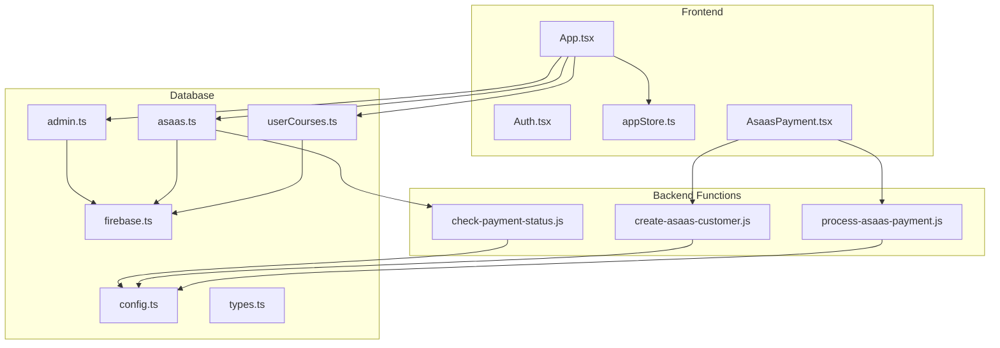
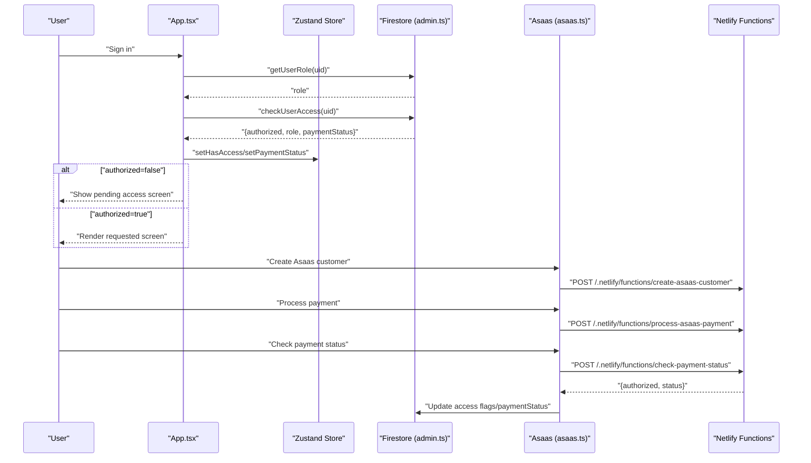
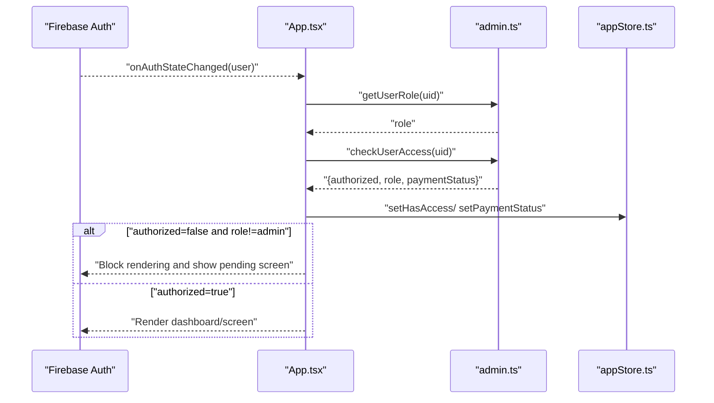
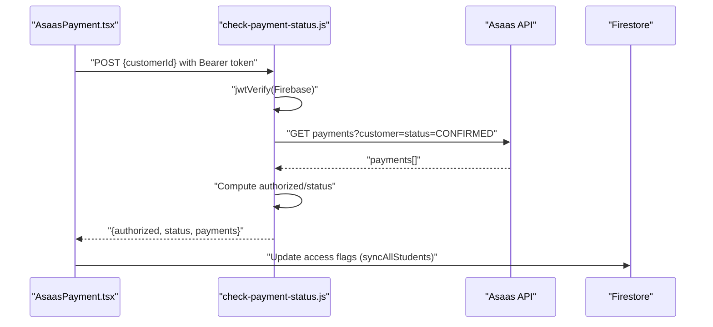
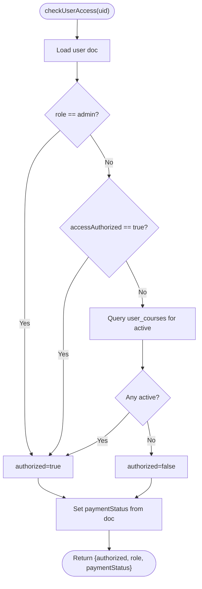
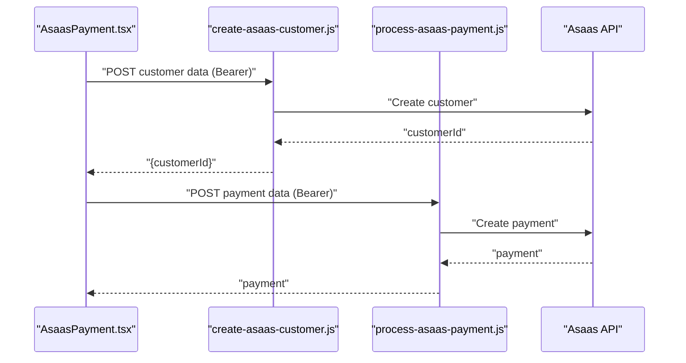
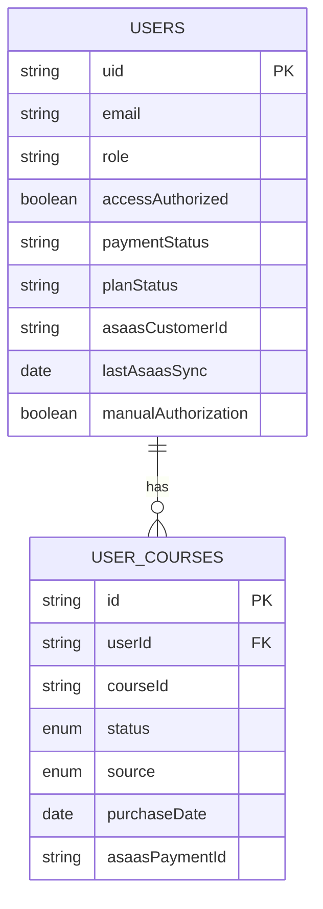
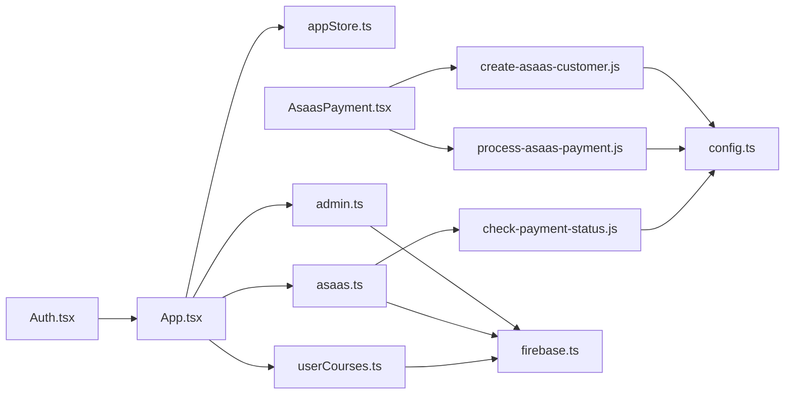

# Access Control & Permissions

<cite>
**Referenced Files in This Document**
- [App.tsx](file://App.tsx)
- [Auth.tsx](file://components/Auth.tsx)
- [AsaasPayment.tsx](file://components/AsaasPayment.tsx)
- [check-payment-status.js](file://netlify/functions/check-payment-status.js)
- [create-asaas-customer.js](file://netlify/functions/create-asaas-customer.js)
- [process-asaas-payment.js](file://netlify/functions/process-asaas-payment.js)
- [admin.ts](file://lib/db/admin.ts)
- [asaas.ts](file://lib/db/asaas.ts)
- [userCourses.ts](file://lib/db/userCourses.ts)
- [appStore.ts](file://lib/stores/appStore.ts)
- [config.ts](file://lib/db/config.ts)
- [types.ts](file://lib/db/types.ts)
- [firebase.ts](file://lib/firebase.ts)
</cite>

## Table of Contents
1. [Introduction](#introduction)
2. [Project Structure](#project-structure)
3. [Core Components](#core-components)
4. [Architecture Overview](#architecture-overview)
5. [Detailed Component Analysis](#detailed-component-analysis)
6. [Dependency Analysis](#dependency-analysis)
7. [Performance Considerations](#performance-considerations)
8. [Troubleshooting Guide](#troubleshooting-guide)
9. [Conclusion](#conclusion)

## Introduction
This document explains the payment-based access control system used to manage user permissions, validate subscriptions, and synchronize feature availability. It covers how payment status influences access, how the frontend enforces restrictions, how backend functions validate payments against the payment provider, and how user roles and course access integrate with payment validation. It also documents security measures, fallback strategies for unpaid users, and audit trails for access control decisions.

## Project Structure
The access control system spans three layers:
- Frontend (React + Zustand store): Authenticates users, checks access, and renders restricted views.
- Backend (Netlify Functions): Validates payment status via the payment provider and enforces token-based authorization.
- Database (Firestore): Stores user roles, access flags, payment statuses, and course access records.

**Diagram sources**
- [App.tsx](file://App.tsx#L65-L108)
- [appStore.ts](file://lib/stores/appStore.ts#L48-L81)
- [AsaasPayment.tsx](file://components/AsaasPayment.tsx#L86-L181)
- [check-payment-status.js](file://netlify/functions/check-payment-status.js#L20-L151)
- [create-asaas-customer.js](file://netlify/functions/create-asaas-customer.js#L20-L145)
- [process-asaas-payment.js](file://netlify/functions/process-asaas-payment.js#L20-L120)
- [admin.ts](file://lib/db/admin.ts#L85-L127)
- [asaas.ts](file://lib/db/asaas.ts#L6-L84)
- [userCourses.ts](file://lib/db/userCourses.ts#L7-L111)
- [firebase.ts](file://lib/firebase.ts#L1-L25)
- [config.ts](file://lib/db/config.ts#L1-L19)
- [types.ts](file://lib/db/types.ts#L53-L89)

**Section sources**
- [App.tsx](file://App.tsx#L65-L108)
- [firebase.ts](file://lib/firebase.ts#L1-L25)

## Core Components
- Authentication and role loading: The application initializes on auth state changes, loads user role, and checks access authorization.
- Access enforcement: Unauthorized users (non-admins) are blocked from most screens until payment status allows access.
- Payment processing: Users can create an Asaas customer, process a payment, and persist the customer ID for future validation.
- Payment validation: A backend function queries the payment provider for confirmed payments and derives access status.
- Course access: Access can be granted/revoked based on payment or admin actions; users with active course records are treated as authorized.
- Store state: Centralized state tracks user, role, access, and payment status for UI rendering and navigation.

**Section sources**
- [App.tsx](file://App.tsx#L65-L108)
- [admin.ts](file://lib/db/admin.ts#L67-L127)
- [asaas.ts](file://lib/db/asaas.ts#L6-L84)
- [userCourses.ts](file://lib/db/userCourses.ts#L25-L99)
- [appStore.ts](file://lib/stores/appStore.ts#L5-L46)

## Architecture Overview
The system integrates Firebase Authentication, Firestore, and Netlify Functions to enforce payment-based access control.

**Diagram sources**
- [App.tsx](file://App.tsx#L65-L108)
- [admin.ts](file://lib/db/admin.ts#L85-L127)
- [asaas.ts](file://lib/db/asaas.ts#L6-L84)
- [check-payment-status.js](file://netlify/functions/check-payment-status.js#L20-L151)
- [create-asaas-customer.js](file://netlify/functions/create-asaas-customer.js#L20-L145)
- [process-asaas-payment.js](file://netlify/functions/process-asaas-payment.js#L20-L120)

## Detailed Component Analysis

### Access Control Flow at Startup
On authentication state change, the app loads role and access, then enforces authorization before rendering protected screens.

**Diagram sources**
- [App.tsx](file://App.tsx#L65-L108)
- [admin.ts](file://lib/db/admin.ts#L67-L127)
- [appStore.ts](file://lib/stores/appStore.ts#L51-L56)

**Section sources**
- [App.tsx](file://App.tsx#L65-L108)
- [admin.ts](file://lib/db/admin.ts#L85-L127)
- [appStore.ts](file://lib/stores/appStore.ts#L51-L56)

### Payment Status Validation via Netlify Functions
Payments are validated by querying the payment provider through a secured function that verifies Firebase ID tokens and returns derived access status.

**Diagram sources**
- [AsaasPayment.tsx](file://components/AsaasPayment.tsx#L130-L181)
- [check-payment-status.js](file://netlify/functions/check-payment-status.js#L20-L151)
- [asaas.ts](file://lib/db/asaas.ts#L6-L37)

**Section sources**
- [check-payment-status.js](file://netlify/functions/check-payment-status.js#L20-L151)
- [asaas.ts](file://lib/db/asaas.ts#L6-L37)

### Role-Based Access and Course-Level Permissions
Access can be granted at two levels:
- Payment-driven: Active payments or active course records authorize access.
- Admin-managed: Explicit flags and course grants override or complement payment status.

**Diagram sources**
- [admin.ts](file://lib/db/admin.ts#L85-L127)
- [userCourses.ts](file://lib/db/userCourses.ts#L89-L99)

**Section sources**
- [admin.ts](file://lib/db/admin.ts#L85-L127)
- [userCourses.ts](file://lib/db/userCourses.ts#L89-L99)

### Payment Provider Integration Details
- Customer creation: Frontend posts to a function that validates the token and calls the provider to create a customer record.
- Payment processing: Frontend posts to a function that proxies the request to the provider.
- Status check: Frontend posts to a function that validates the token and queries the provider for confirmed payments, returning a derived status.

**Diagram sources**
- [AsaasPayment.tsx](file://components/AsaasPayment.tsx#L86-L181)
- [create-asaas-customer.js](file://netlify/functions/create-asaas-customer.js#L20-L145)
- [process-asaas-payment.js](file://netlify/functions/process-asaas-payment.js#L20-L120)

**Section sources**
- [AsaasPayment.tsx](file://components/AsaasPayment.tsx#L86-L181)
- [create-asaas-customer.js](file://netlify/functions/create-asaas-customer.js#L20-L145)
- [process-asaas-payment.js](file://netlify/functions/process-asaas-payment.js#L20-L120)

### Data Model for Access Control
The system relies on Firestore collections and fields to track access and payment status.

**Diagram sources**
- [config.ts](file://lib/db/config.ts#L11-L19)
- [types.ts](file://lib/db/types.ts#L53-L89)

**Section sources**
- [config.ts](file://lib/db/config.ts#L11-L19)
- [types.ts](file://lib/db/types.ts#L53-L89)

## Dependency Analysis
- Frontend depends on Firebase Auth and Firestore for identity and access state.
- Netlify Functions depend on Firebase ID token verification and the payment provider API.
- Firestore collections define the canonical state for access control and course permissions.

**Diagram sources**
- [Auth.tsx](file://components/Auth.tsx#L1-L265)
- [App.tsx](file://App.tsx#L65-L108)
- [appStore.ts](file://lib/stores/appStore.ts#L48-L81)
- [admin.ts](file://lib/db/admin.ts#L24-L64)
- [asaas.ts](file://lib/db/asaas.ts#L39-L84)
- [userCourses.ts](file://lib/db/userCourses.ts#L7-L23)
- [AsaasPayment.tsx](file://components/AsaasPayment.tsx#L86-L181)
- [create-asaas-customer.js](file://netlify/functions/create-asaas-customer.js#L20-L145)
- [process-asaas-payment.js](file://netlify/functions/process-asaas-payment.js#L20-L120)
- [check-payment-status.js](file://netlify/functions/check-payment-status.js#L20-L151)
- [firebase.ts](file://lib/firebase.ts#L1-L25)
- [config.ts](file://lib/db/config.ts#L1-L19)

**Section sources**
- [App.tsx](file://App.tsx#L65-L108)
- [admin.ts](file://lib/db/admin.ts#L24-L64)
- [asaas.ts](file://lib/db/asaas.ts#L39-L84)
- [userCourses.ts](file://lib/db/userCourses.ts#L7-L23)
- [firebase.ts](file://lib/firebase.ts#L1-L25)

## Performance Considerations
- Minimize repeated access checks: The app caches role and access status per session to avoid redundant Firestore reads.
- Debounce payment status refreshes: Avoid frequent polling of the payment provider; rely on scheduled sync for batch updates.
- Efficient course access queries: Use indexed fields (userId, courseId, status) to keep course access checks fast.
- Token verification caching: Reuse verified claims where appropriate to reduce function cold starts.

## Troubleshooting Guide
Common issues and remedies:
- Unauthorized access screen appears after login:
  - Verify the user’s access flags and payment status in Firestore.
  - Trigger a manual sync to update access flags based on payment status.
- Payment processing fails:
  - Confirm the function receives a valid Firebase ID token.
  - Check provider API responses for errors and ensure required fields are present.
- Admin privileges not applied:
  - Ensure the user’s email matches configured admin lists and that the role is set accordingly.
- Course access not granted:
  - Confirm the user-course record exists with active status and correct source.

Operational checks:
- Validate token verification in functions.
- Inspect Firestore documents for access flags and payment status.
- Review function logs for provider API errors.

**Section sources**
- [check-payment-status.js](file://netlify/functions/check-payment-status.js#L43-L62)
- [admin.ts](file://lib/db/admin.ts#L129-L165)
- [asaas.ts](file://lib/db/asaas.ts#L87-L144)

## Conclusion
The payment-based access control system combines Firebase Authentication, Firestore state, and Netlify Functions to securely enforce access based on payment status and course ownership. Administrators can override access flags, while automated sync keeps user states aligned with the payment provider. The frontend enforces runtime access checks, and the store centralizes state for consistent UI behavior. Robust token verification and structured data models underpin security and reliability.