# Asaas Payment Integration

<cite>
**Referenced Files in This Document**
- [AsaasPayment.tsx](file://components/AsaasPayment.tsx)
- [create-asaas-customer.js](file://netlify/functions/create-asaas-customer.js)
- [process-asaas-payment.js](file://netlify/functions/process-asaas-payment.js)
- [check-payment-status.js](file://netlify/functions/check-payment-status.js)
- [updateUserCustomerId.js](file://functions/src/api/updateUserCustomerId.js)
- [firebase.ts](file://lib/firebase.ts)
- [index.js](file://functions/src/index.js)
- [netlify.toml](file://netlify.toml)
- [package.json](file://package.json)
- [test-asass-webhook.js](file://test-asass-webhook.js)
</cite>

## Table of Contents
1. [Introduction](#introduction)
2. [Project Structure](#project-structure)
3. [Core Components](#core-components)
4. [Architecture Overview](#architecture-overview)
5. [Detailed Component Analysis](#detailed-component-analysis)
6. [Dependency Analysis](#dependency-analysis)
7. [Performance Considerations](#performance-considerations)
8. [Security and PCI Compliance](#security-and-pci-compliance)
9. [Troubleshooting Guide](#troubleshooting-guide)
10. [Conclusion](#conclusion)

## Introduction
This document provides comprehensive technical documentation for the Asaas payment integration component. It covers the complete payment processing workflow including customer creation, credit card validation, transaction processing, and webhook-based synchronization with Firebase. The documentation explains the React component implementation with form validation, input formatting, and step-by-step payment flow, along with the integration with Asaas API, authentication, request/response handling, and error management. It also includes security considerations for PCI compliance, data encryption, tokenization, examples of payment scenarios, failure handling, retry mechanisms, component props interface, state management, and Firebase authentication integration.

## Project Structure
The Asaas payment integration spans multiple layers of the application:
- Frontend React component for payment collection and user interaction
- Netlify Functions for secure customer creation and payment processing
- Firebase Cloud Functions for webhook handling and user synchronization
- Firebase Authentication and Firestore for user management
- Environment configuration for Asaas API credentials and security headers

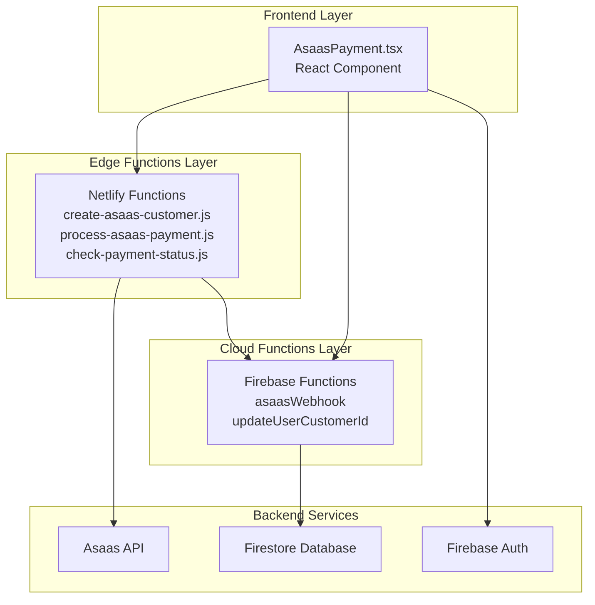

**Diagram sources**
- [AsaasPayment.tsx](file://components/AsaasPayment.tsx#L1-L491)
- [create-asaas-customer.js](file://netlify/functions/create-asaas-customer.js#L1-L146)
- [process-asaas-payment.js](file://netlify/functions/process-asaas-payment.js#L1-L121)
- [check-payment-status.js](file://netlify/functions/check-payment-status.js#L1-L152)
- [index.js](file://functions/src/index.js#L144-L339)

**Section sources**
- [AsaasPayment.tsx](file://components/AsaasPayment.tsx#L1-L491)
- [netlify.toml](file://netlify.toml#L1-L65)

## Core Components
The payment integration consists of several key components working together:

### React Payment Component
The main payment component handles form collection, validation, and user feedback. It manages four distinct UI states: form entry, processing, success confirmation, and error display.

### Netlify Functions
Three specialized functions handle different aspects of the payment workflow:
- Customer creation with Firebase token verification
- Payment processing with Asaas API proxy
- Payment status checking for verification

### Firebase Functions
Two cloud functions manage backend synchronization:
- Webhook handler for Asaas payment events
- User customer ID updater for local database synchronization

**Section sources**
- [AsaasPayment.tsx](file://components/AsaasPayment.tsx#L5-L491)
- [create-asaas-customer.js](file://netlify/functions/create-asaas-customer.js#L20-L145)
- [process-asaas-payment.js](file://netlify/functions/process-asaas-payment.js#L20-L120)
- [check-payment-status.js](file://netlify/functions/check-payment-status.js#L20-L151)
- [index.js](file://functions/src/index.js#L144-L339)

## Architecture Overview
The payment architecture follows a secure, layered approach with strict separation of concerns:

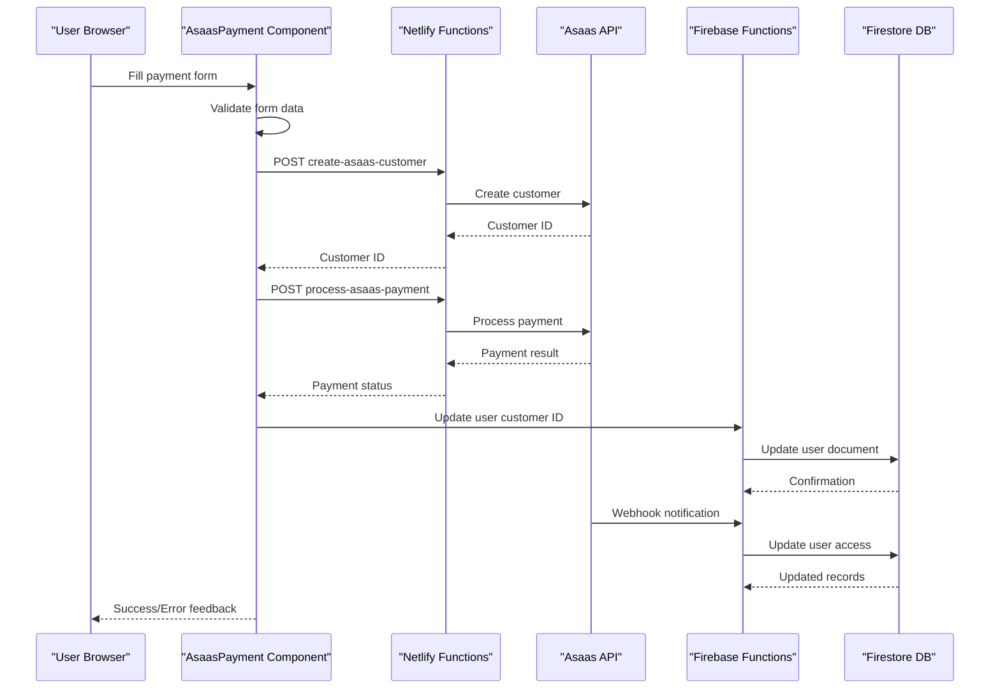

**Diagram sources**
- [AsaasPayment.tsx](file://components/AsaasPayment.tsx#L86-L244)
- [create-asaas-customer.js](file://netlify/functions/create-asaas-customer.js#L88-L132)
- [process-asaas-payment.js](file://netlify/functions/process-asaas-payment.js#L79-L107)
- [index.js](file://functions/src/index.js#L188-L266)

## Detailed Component Analysis

### React Payment Component Implementation
The AsaasPayment component implements a comprehensive payment flow with robust validation and user experience features.

#### Props Interface
The component accepts three essential props:
- `plan`: String identifier for the selected subscription plan
- `price`: Number representing the payment amount in reais
- `onSuccess`: Callback function executed upon successful payment completion
- `onCancel`: Callback function executed when user cancels the payment process

#### State Management
The component maintains four distinct states:
- `formData`: Complete payment information including personal details and card data
- `errors`: Real-time validation error tracking
- `processing`: Loading state during payment processing
- `step`: UI state management (form, processing, success, error)

#### Form Validation System
The validation system ensures data integrity before payment processing:

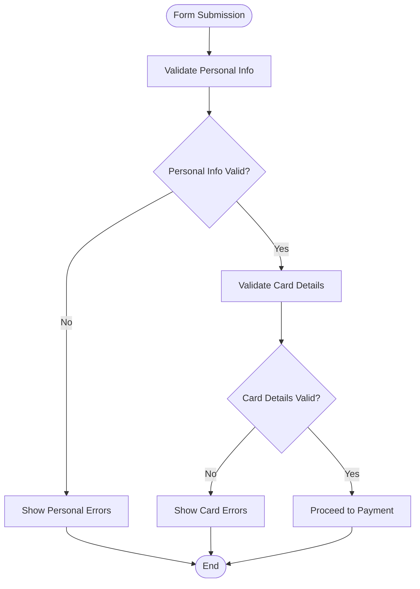

**Diagram sources**
- [AsaasPayment.tsx](file://components/AsaasPayment.tsx#L27-L42)

#### Input Formatting System
The component provides sophisticated input formatting for Brazilian payment data:
- **Card Number**: Automatic grouping with spaces every 4 digits
- **Expiration Date**: Automatic MM/YY formatting
- **CPF**: Brazilian tax ID formatting with dots and hyphen
- **Phone**: Brazilian phone number formatting with parentheses and dash

#### Payment Processing Workflow
The payment flow follows a structured sequence:

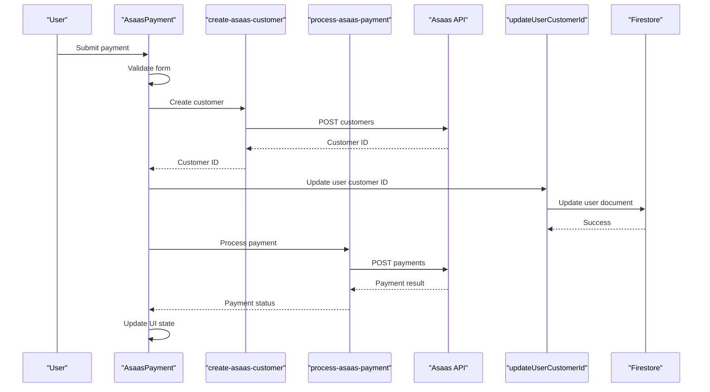

**Diagram sources**
- [AsaasPayment.tsx](file://components/AsaasPayment.tsx#L183-L244)
- [create-asaas-customer.js](file://netlify/functions/create-asaas-customer.js#L88-L132)
- [process-asaas-payment.js](file://netlify/functions/process-asaas-payment.js#L79-L107)
- [updateUserCustomerId.js](file://functions/src/api/updateUserCustomerId.js#L12-L73)

**Section sources**
- [AsaasPayment.tsx](file://components/AsaasPayment.tsx#L5-L491)

### Netlify Functions Implementation

#### Customer Creation Function
The customer creation function provides secure customer registration with comprehensive validation:

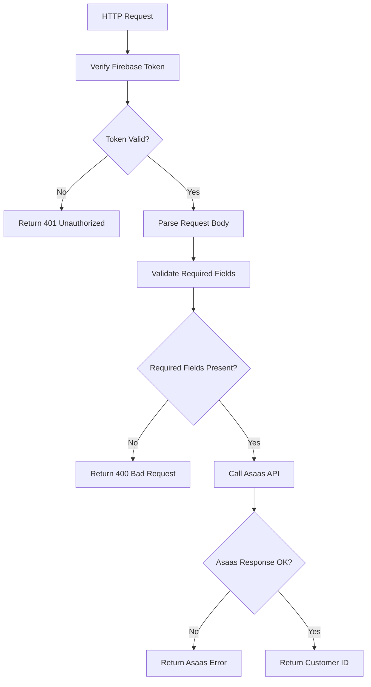

**Diagram sources**
- [create-asaas-customer.js](file://netlify/functions/create-asaas-customer.js#L20-L145)

#### Payment Processing Function
The payment processing function acts as a secure proxy to the Asaas API:

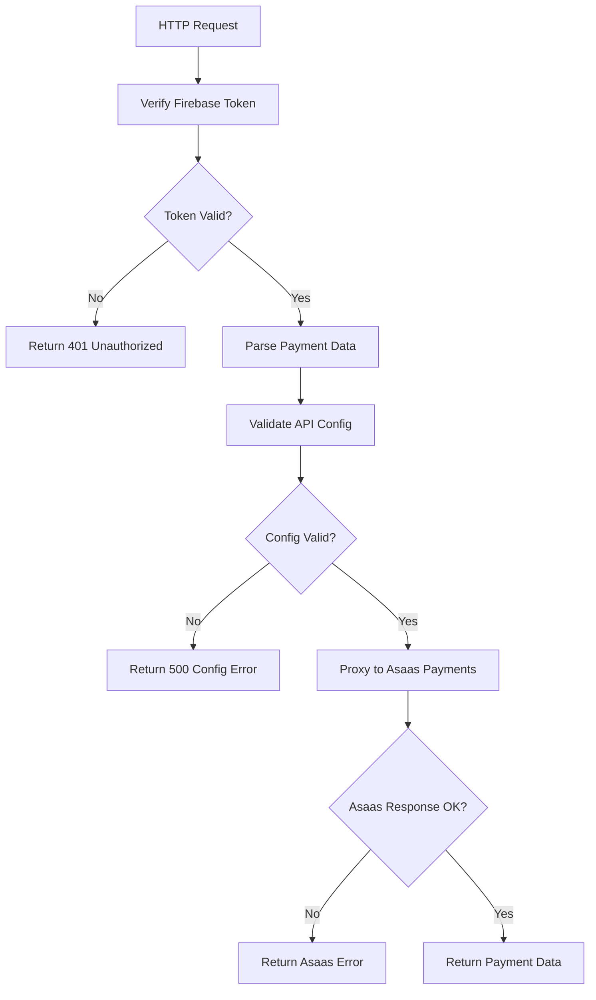

**Diagram sources**
- [process-asaas-payment.js](file://netlify/functions/process-asaas-payment.js#L20-L120)

**Section sources**
- [create-asaas-customer.js](file://netlify/functions/create-asaas-customer.js#L1-L146)
- [process-asaas-payment.js](file://netlify/functions/process-asaas-payment.js#L1-L121)

### Firebase Functions Implementation

#### Webhook Handler
The webhook handler processes Asaas payment events and synchronizes user access:

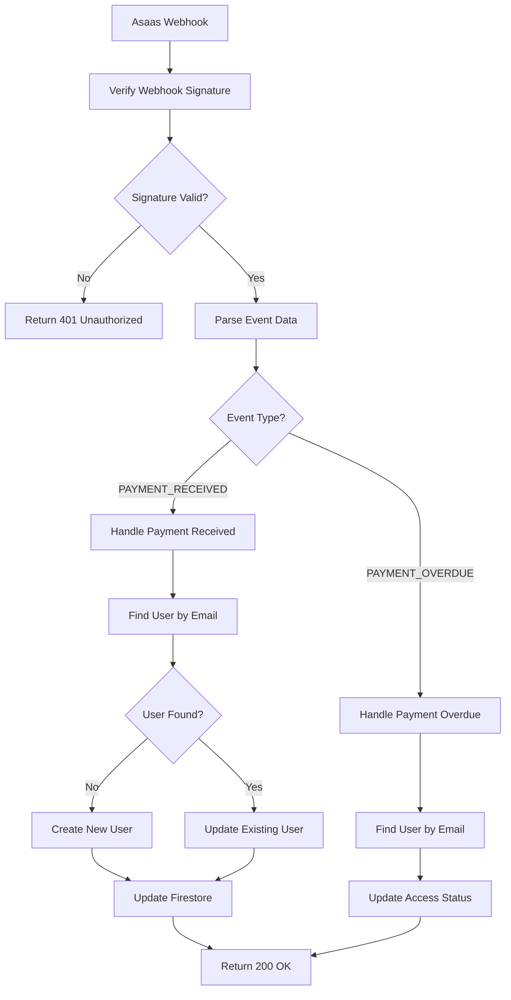

**Diagram sources**
- [index.js](file://functions/src/index.js#L144-L339)

#### User Customer ID Updater
The user customer ID updater synchronizes local user records with Asaas customer IDs:

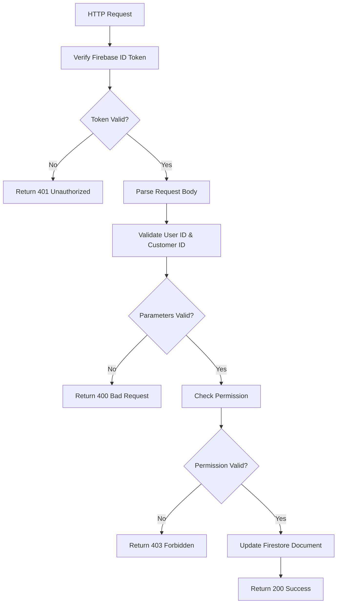

**Diagram sources**
- [updateUserCustomerId.js](file://functions/src/api/updateUserCustomerId.js#L12-L73)

**Section sources**
- [index.js](file://functions/src/index.js#L144-L339)
- [updateUserCustomerId.js](file://functions/src/api/updateUserCustomerId.js#L1-L74)

## Dependency Analysis

### External Dependencies
The payment integration relies on several key external services and libraries:

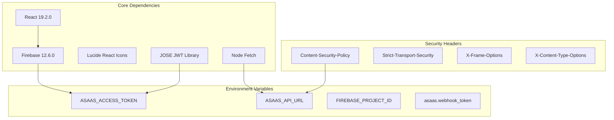

**Diagram sources**
- [package.json](file://package.json#L13-L24)
- [netlify.toml](file://netlify.toml#L39-L47)

### Component Dependencies
The payment components have specific dependency relationships:

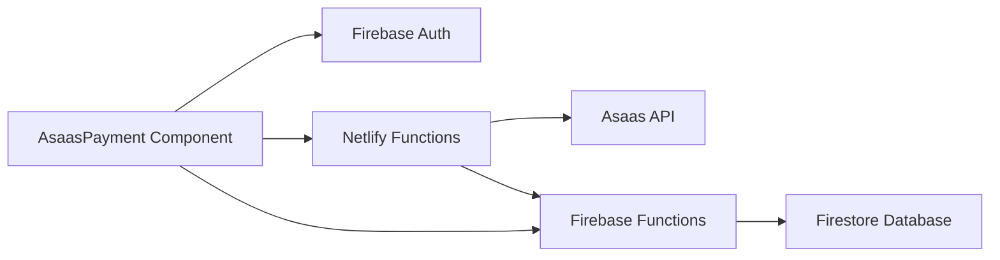

**Diagram sources**
- [AsaasPayment.tsx](file://components/AsaasPayment.tsx#L3-L4)
- [firebase.ts](file://lib/firebase.ts#L1-L25)

**Section sources**
- [package.json](file://package.json#L1-L44)
- [netlify.toml](file://netlify.toml#L39-L47)

## Performance Considerations
The payment integration is designed with several performance optimization strategies:

### Caching Strategy
- **Token Caching**: Firebase ID tokens are cached and refreshed as needed
- **Input Formatting**: Client-side formatting prevents unnecessary re-renders
- **State Management**: Efficient state updates minimize component re-rendering

### Network Optimization
- **Connection Reuse**: Shared fetch instances reduce connection overhead
- **Batch Operations**: Customer creation and payment processing are combined
- **Timeout Handling**: Configured timeouts prevent hanging requests

### Scalability Features
- **Function Isolation**: Separate functions handle different payment stages
- **Rate Limiting**: Built-in rate limiting prevents abuse
- **Error Boundaries**: Comprehensive error handling prevents cascading failures

## Security and PCI Compliance

### Data Protection Measures
The payment integration implements multiple layers of security:

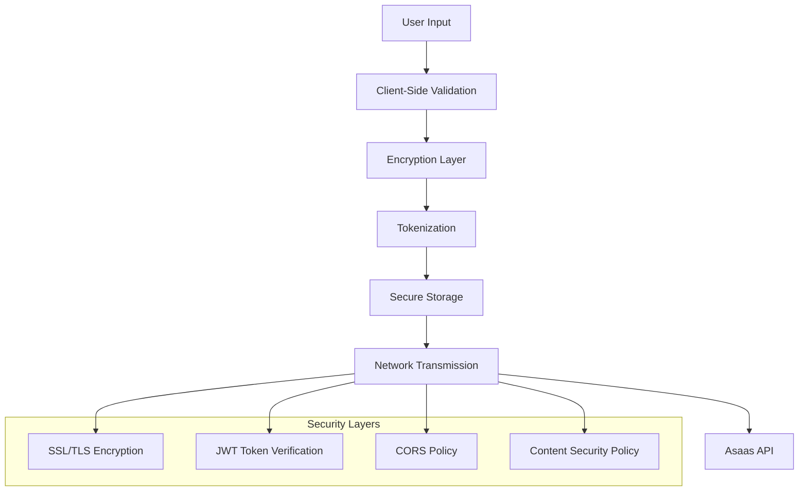

**Diagram sources**
- [AsaasPayment.tsx](file://components/AsaasPayment.tsx#L86-L181)
- [netlify.toml](file://netlify.toml#L39-L47)

### PCI Compliance Considerations
While the integration delegates card processing to Asaas, several PCI compliance principles are implemented:

#### Data Minimization
- Only collect necessary payment information
- Remove sensitive data immediately after processing
- Store minimal customer information locally

#### Tokenization Strategy
- Use Asaas customer IDs instead of storing card data
- Implement token-based customer identification
- Avoid local storage of sensitive payment information

#### Security Headers
The application enforces comprehensive security policies:
- **Content-Security-Policy**: Restricts resource loading to trusted domains
- **Strict-Transport-Security**: Enforces HTTPS connections
- **X-Frame-Options**: Prevents clickjacking attacks
- **X-Content-Type-Options**: Prevents MIME-type sniffing

#### Authentication Security
- **Firebase JWT Verification**: Validates user identity server-side
- **Webhook Signature Verification**: Ensures Asaas webhook authenticity
- **Token-Based Authorization**: Uses short-lived ID tokens for API access

**Section sources**
- [netlify.toml](file://netlify.toml#L39-L47)
- [create-asaas-customer.js](file://netlify/functions/create-asaas-customer.js#L6-L18)
- [process-asaas-payment.js](file://netlify/functions/process-asaas-payment.js#L6-L18)

## Troubleshooting Guide

### Common Error Scenarios

#### Authentication Failures
**Symptoms**: 401 Unauthorized responses from functions
**Causes**: Expired ID tokens, invalid JWT signatures, missing authorization headers
**Solutions**: Refresh user session, verify Firebase configuration, check token validity

#### Payment Processing Errors
**Symptoms**: Payment failures with specific error codes
**Causes**: Invalid card data, insufficient funds, expired cards
**Solutions**: Validate card information, check card limits, retry with corrected data

#### Webhook Integration Issues
**Symptoms**: User access not updating after payment
**Causes**: Incorrect webhook token, network connectivity issues
**Solutions**: Verify webhook configuration, check network logs, test webhook endpoint

#### Testing and Debugging
The project includes comprehensive testing capabilities:

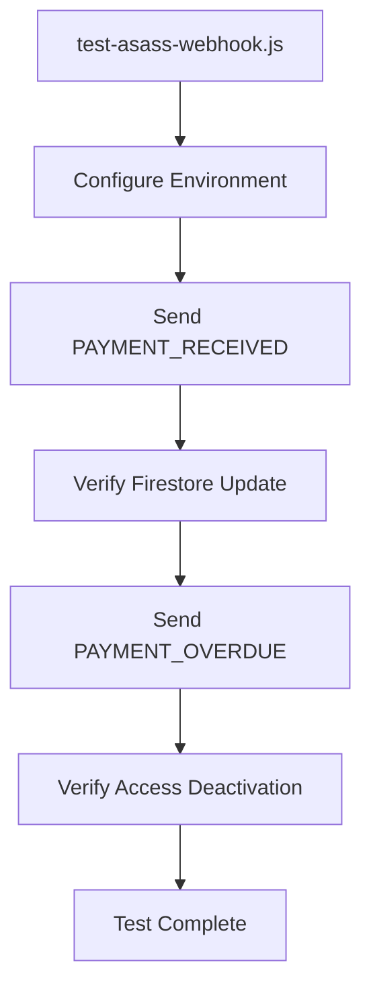

**Diagram sources**
- [test-asass-webhook.js](file://test-asass-webhook.js#L1-L81)

**Section sources**
- [test-asass-webhook.js](file://test-asass-webhook.js#L1-L81)

### Retry Mechanisms
The payment system implements intelligent retry strategies:

#### Automatic Retries
- **Network Failures**: Automatic retry with exponential backoff
- **Temporary Asaas API Issues**: Graceful degradation with user feedback
- **Token Refresh**: Automatic ID token refresh on expiration

#### Manual Retry Options
- **Error Screen**: Provides "Try Again" button for failed payments
- **Form Persistence**: Maintains form data during retry attempts
- **Validation Feedback**: Clear error messages for correction

### Monitoring and Logging
The system provides comprehensive logging for troubleshooting:
- **Client-Side**: Console logging for development and debugging
- **Server-Side**: Structured logging for production monitoring
- **Error Tracking**: Centralized error reporting for quick resolution

## Conclusion
The Asaas payment integration represents a comprehensive, secure, and scalable solution for handling subscription payments. The implementation follows industry best practices for security, performance, and user experience while maintaining strict PCI compliance through third-party payment processing.

Key strengths of the implementation include:
- **Security-First Design**: Multiple layers of authentication and validation
- **Robust Error Handling**: Comprehensive error management and user feedback
- **Scalable Architecture**: Modular design enabling easy maintenance and extension
- **PCI Compliance**: Delegation of sensitive payment processing to Asaas
- **Developer Experience**: Clear APIs, comprehensive documentation, and testing tools

The integration successfully balances security requirements with user experience, providing a reliable foundation for subscription-based services while maintaining compliance with financial industry standards.