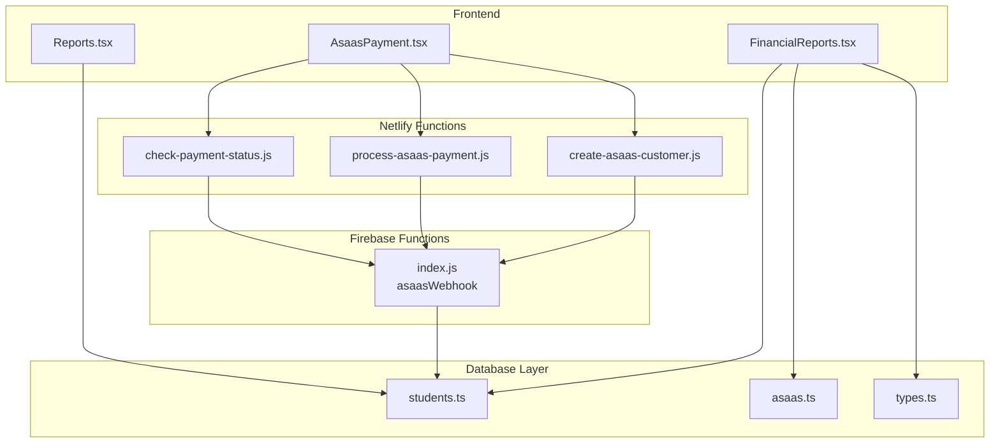
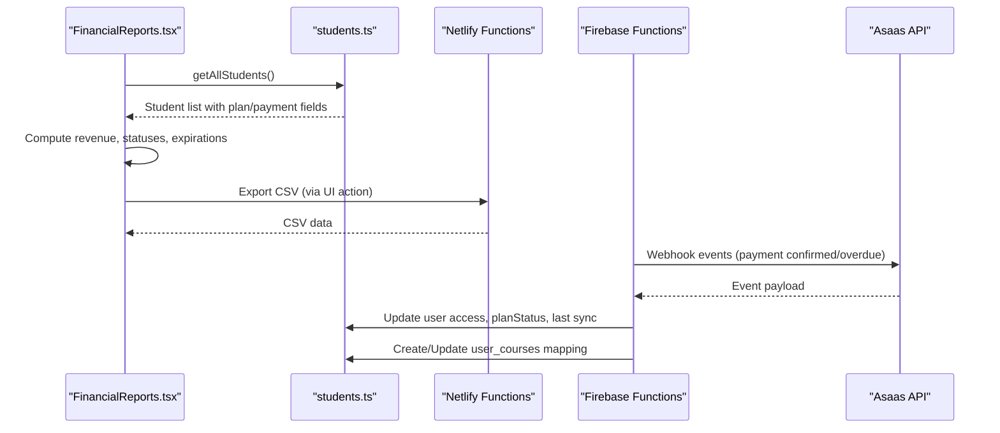
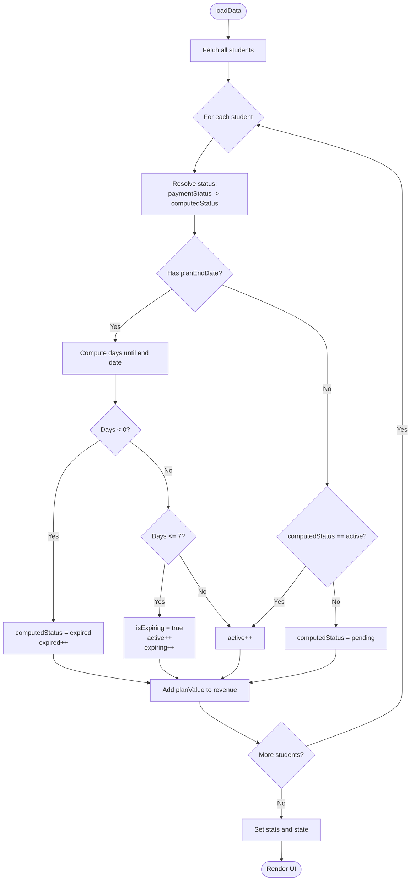
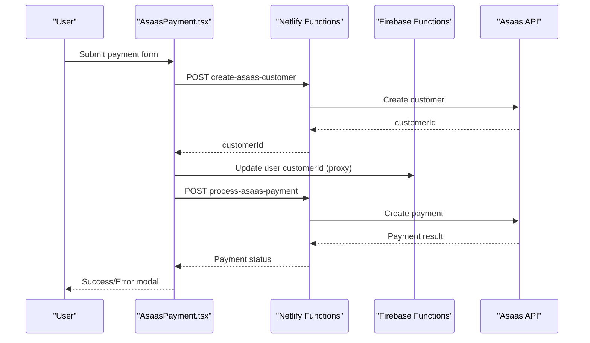
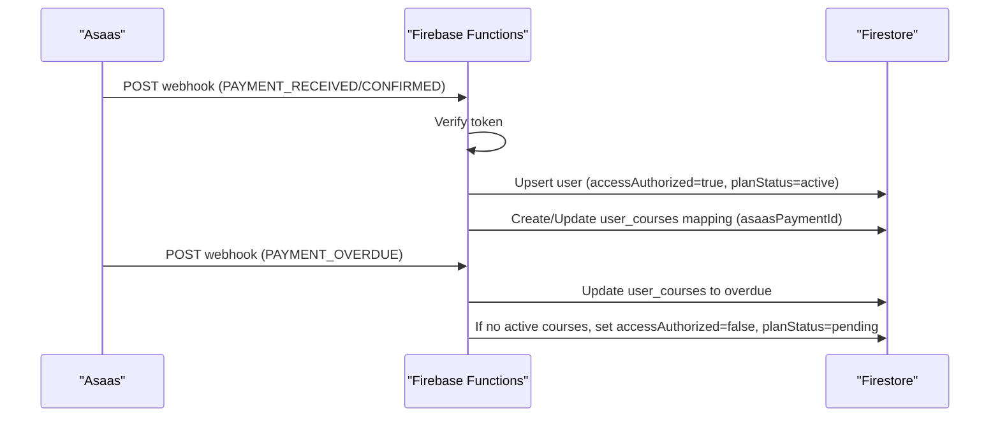
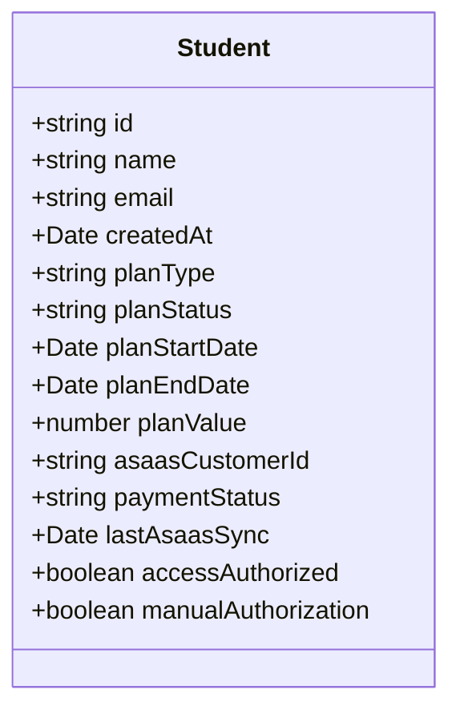
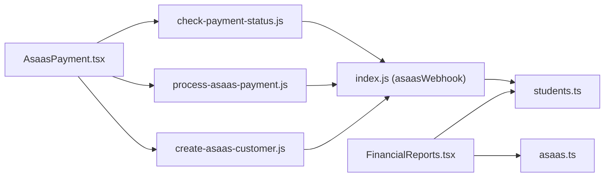

# Financial Reporting & Analytics

<cite>
**Referenced Files in This Document**
- [FinancialReports.tsx](file://components/FinancialReports.tsx)
- [AsaasPayment.tsx](file://components/AsaasPayment.tsx)
- [process-asaas-payment.js](file://netlify/functions/process-asaas-payment.js)
- [check-payment-status.js](file://netlify/functions/check-payment-status.js)
- [create-asaas-customer.js](file://netlify/functions/create-asaas-customer.js)
- [index.js](file://functions/src/index.js)
- [students.ts](file://lib/db/students.ts)
- [asaas.ts](file://lib/db/asaas.ts)
- [types.ts](file://lib/db/types.ts)
- [Reports.tsx](file://components/Reports.tsx)
</cite>

## Table of Contents
1. [Introduction](#introduction)
2. [Project Structure](#project-structure)
3. [Core Components](#core-components)
4. [Architecture Overview](#architecture-overview)
5. [Detailed Component Analysis](#detailed-component-analysis)
6. [Dependency Analysis](#dependency-analysis)
7. [Performance Considerations](#performance-considerations)
8. [Security and Compliance](#security-and-compliance)
9. [Troubleshooting Guide](#troubleshooting-guide)
10. [Conclusion](#conclusion)

## Introduction
This document describes the financial reporting and analytics system for the platform. It covers how payment tracking, revenue analytics, and subscription metrics are collected and processed, how the system integrates with Asaas reporting APIs, and how reports are generated and visualized. It also documents the financial data models, calculation methods for revenue tracking, and subscription analytics, along with security measures, audit trails, and performance considerations for large-scale financial data processing.

## Project Structure
The financial reporting system spans frontend components, backend functions, and database utilities:
- Frontend components render financial reports and manage payment flows
- Backend functions proxy requests to Asaas and enforce authentication
- Database utilities provide data access, synchronization, and export capabilities
- Firebase Cloud Functions handle webhooks and administrative tasks

**Diagram sources**
- [FinancialReports.tsx](file://components/FinancialReports.tsx#L1-L535)
- [AsaasPayment.tsx](file://components/AsaasPayment.tsx#L1-L491)
- [process-asaas-payment.js](file://netlify/functions/process-asaas-payment.js#L1-L121)
- [check-payment-status.js](file://netlify/functions/check-payment-status.js#L1-L152)
- [create-asaas-customer.js](file://netlify/functions/create-asaas-customer.js#L1-L146)
- [index.js](file://functions/src/index.js#L144-L339)
- [students.ts](file://lib/db/students.ts#L1-L285)
- [asaas.ts](file://lib/db/asaas.ts#L1-L145)
- [types.ts](file://lib/db/types.ts#L71-L89)

**Section sources**
- [FinancialReports.tsx](file://components/FinancialReports.tsx#L1-L535)
- [AsaasPayment.tsx](file://components/AsaasPayment.tsx#L1-L491)
- [process-asaas-payment.js](file://netlify/functions/process-asaas-payment.js#L1-L121)
- [check-payment-status.js](file://netlify/functions/check-payment-status.js#L1-L152)
- [create-asaas-customer.js](file://netlify/functions/create-asaas-customer.js#L1-L146)
- [index.js](file://functions/src/index.js#L144-L339)
- [students.ts](file://lib/db/students.ts#L1-L285)
- [asaas.ts](file://lib/db/asaas.ts#L1-L145)
- [types.ts](file://lib/db/types.ts#L71-L89)

## Core Components
- FinancialReports: Aggregates and displays financial metrics (revenue, active plans, expiring/expired counts), supports filtering and manual plan edits
- AsaasPayment: Handles secure payment creation via Asaas, including customer creation and payment processing
- Netlify Functions: Proxy Asaas customer creation, payment processing, and payment status checks with Firebase JWT verification
- Firebase Functions: Processes Asaas webhooks to synchronize user access and course enrollments
- Database Utilities: Provide student data access, Asaas synchronization, and CSV export/import for financial records

**Section sources**
- [FinancialReports.tsx](file://components/FinancialReports.tsx#L17-L123)
- [AsaasPayment.tsx](file://components/AsaasPayment.tsx#L12-L244)
- [process-asaas-payment.js](file://netlify/functions/process-asaas-payment.js#L20-L120)
- [check-payment-status.js](file://netlify/functions/check-payment-status.js#L20-L151)
- [create-asaas-customer.js](file://netlify/functions/create-asaas-customer.js#L20-L145)
- [index.js](file://functions/src/index.js#L144-L339)
- [students.ts](file://lib/db/students.ts#L7-L63)
- [asaas.ts](file://lib/db/asaas.ts#L6-L85)

## Architecture Overview
The system integrates frontend financial reporting with Asaas through secure backend functions and Firebase Cloud Functions for real-time synchronization.

**Diagram sources**
- [FinancialReports.tsx](file://components/FinancialReports.tsx#L47-L123)
- [students.ts](file://lib/db/students.ts#L7-L63)
- [index.js](file://functions/src/index.js#L188-L330)

## Detailed Component Analysis

### FinancialReports Component
Responsibilities:
- Load student data and compute financial metrics
- Render summary cards for total revenue, active plans, expiring soon, and expired
- Provide filtering and manual plan editing with save capability
- Trigger periodic refresh and export to CSV

Key calculations:
- Revenue: Sum of planValue for all students
- Status normalization: paymentStatus drives computedStatus with special handling for admin and overdue
- Expiration logic: compares planEndDate to today; marks expiring if within 7 days and active

**Diagram sources**
- [FinancialReports.tsx](file://components/FinancialReports.tsx#L47-L123)

**Section sources**
- [FinancialReports.tsx](file://components/FinancialReports.tsx#L17-L123)

### Asaas Payment Flow
End-to-end payment processing:
- Validates form inputs and formats
- Creates Asaas customer via Netlify function
- Stores Asaas customer ID in user profile
- Creates payment and handles success/error states
- Updates UI and triggers success callback

**Diagram sources**
- [AsaasPayment.tsx](file://components/AsaasPayment.tsx#L86-L244)
- [create-asaas-customer.js](file://netlify/functions/create-asaas-customer.js#L64-L132)
- [process-asaas-payment.js](file://netlify/functions/process-asaas-payment.js#L64-L107)
- [index.js](file://functions/src/index.js#L211-L222)

**Section sources**
- [AsaasPayment.tsx](file://components/AsaasPayment.tsx#L12-L244)
- [create-asaas-customer.js](file://netlify/functions/create-asaas-customer.js#L20-L145)
- [process-asaas-payment.js](file://netlify/functions/process-asaas-payment.js#L20-L120)
- [index.js](file://functions/src/index.js#L211-L222)

### Asaas Webhook Integration
Real-time synchronization of payment status:
- Verifies webhook token
- On payment confirmed: activate access, set planStatus, link course enrollment via externalReference
- On payment overdue: deactivate course access; if no active courses remain, deactivate global access

**Diagram sources**
- [index.js](file://functions/src/index.js#L144-L339)

**Section sources**
- [index.js](file://functions/src/index.js#L144-L339)

### Data Models and Calculation Methods
Financial data model:
- Student includes planType, planStatus, planStartDate, planEndDate, planValue, asaasCustomerId, paymentStatus, lastAsaasSync, accessAuthorized, manualAuthorization

Revenue tracking:
- Total revenue equals sum of planValue across all students
- Status computation prioritizes paymentStatus, normalizes overdue to expired, and treats admin as active

Subscription analytics:
- Active plans: count of students with computedStatus active
- Expiring soon: active students whose planEndDate is within 7 days
- Expired: students with computedStatus expired

**Diagram sources**
- [types.ts](file://lib/db/types.ts#L71-L89)

**Section sources**
- [types.ts](file://lib/db/types.ts#L71-L89)
- [FinancialReports.tsx](file://components/FinancialReports.tsx#L62-L111)
- [students.ts](file://lib/db/students.ts#L37-L48)

### Report Generation and Visualization
- FinancialReports renders summary cards and a table filtered by status
- Reports dashboard aggregates learning completion trends and computes engagement metrics
- CSV export is supported for student financial data

Example workflows:
- Manual refresh: reloads student data and recalculates metrics
- Export CSV: generates a CSV with selected student attributes for financial reconciliation

**Section sources**
- [FinancialReports.tsx](file://components/FinancialReports.tsx#L181-L531)
- [Reports.tsx](file://components/Reports.tsx#L21-L80)
- [students.ts](file://lib/db/students.ts#L147-L180)

## Dependency Analysis
The system exhibits clear separation of concerns:
- Frontend components depend on database utilities for data access
- Payment flows depend on Netlify functions for Asaas interactions
- Webhooks depend on Firebase Functions for real-time updates
- Database utilities encapsulate Firestore operations and Asaas synchronization

**Diagram sources**
- [FinancialReports.tsx](file://components/FinancialReports.tsx#L15-L15)
- [AsaasPayment.tsx](file://components/AsaasPayment.tsx#L1-L10)
- [create-asaas-customer.js](file://netlify/functions/create-asaas-customer.js#L1-L1)
- [process-asaas-payment.js](file://netlify/functions/process-asaas-payment.js#L1-L2)
- [check-payment-status.js](file://netlify/functions/check-payment-status.js#L1-L2)
- [index.js](file://functions/src/index.js#L144-L144)
- [students.ts](file://lib/db/students.ts#L1-L2)
- [asaas.ts](file://lib/db/asaas.ts#L1-L4)

**Section sources**
- [FinancialReports.tsx](file://components/FinancialReports.tsx#L15-L15)
- [AsaasPayment.tsx](file://components/AsaasPayment.tsx#L1-L10)
- [create-asaas-customer.js](file://netlify/functions/create-asaas-customer.js#L1-L1)
- [process-asaas-payment.js](file://netlify/functions/process-asaas-payment.js#L1-L2)
- [check-payment-status.js](file://netlify/functions/check-payment-status.js#L1-L2)
- [index.js](file://functions/src/index.js#L144-L144)
- [students.ts](file://lib/db/students.ts#L1-L2)
- [asaas.ts](file://lib/db/asaas.ts#L1-L4)

## Performance Considerations
- Real-time updates: FinancialReports auto-refreshes every 30 seconds; adjust intervals based on data volume and backend capacity
- Client-side aggregation: Revenue and status computations occur in memory; for very large datasets, consider server-side aggregation
- Chart rendering: Reports component uses Recharts; ensure responsive containers and limit data points for older browsers
- Database queries: getAllStudents sorts clientside; consider adding server-side sorting or indexing if performance becomes an issue
- Function cold starts: Netlify functions may have latency; cache tokens and minimize repeated verifications where feasible

[No sources needed since this section provides general guidance]

## Security and Compliance
Authentication and authorization:
- All Netlify functions verify Firebase ID tokens via JWKS
- Functions enforce Bearer token presence and validity
- Firebase Functions webhook handler verifies webhook token using timing-safe comparison

Data protection:
- PCI-compliant payment flow: card data is handled by Asaas; local storage avoids sensitive card fields
- Token verification ensures only authenticated requests reach Asaas proxies
- Minimal PII stored; Asaas customer ID and normalized status fields suffice for reporting

Audit and compliance:
- Webhook logs record payment confirmed/overdue events and user/course mappings
- Last sync timestamps enable reconciliation and audit trails
- CSV exports include payment status for external financial reconciliation

**Section sources**
- [process-asaas-payment.js](file://netlify/functions/process-asaas-payment.js#L6-L18)
- [check-payment-status.js](file://netlify/functions/check-payment-status.js#L6-L18)
- [create-asaas-customer.js](file://netlify/functions/create-asaas-customer.js#L6-L18)
- [index.js](file://functions/src/index.js#L161-L179)

## Troubleshooting Guide
Common issues and resolutions:
- Unauthorized or missing token errors from Netlify functions: verify Firebase ID token propagation and function headers
- Asaas API errors: inspect returned error messages and ensure ASAAS_ACCESS_TOKEN and ASAAS_API_URL are configured
- Payment status mismatches: confirm webhook token configuration and that user_courses mappings align with externalReference
- Export failures: validate CSV format and required fields; ensure admin context for export/import operations

Operational checks:
- Confirm webhook endpoint receives events and logs appropriate actions
- Validate customer creation precedes payment creation
- Monitor function response codes and error payloads for debugging

**Section sources**
- [process-asaas-payment.js](file://netlify/functions/process-asaas-payment.js#L43-L62)
- [check-payment-status.js](file://netlify/functions/check-payment-status.js#L43-L62)
- [create-asaas-customer.js](file://netlify/functions/create-asaas-customer.js#L43-L62)
- [index.js](file://functions/src/index.js#L161-L179)

## Conclusion
The financial reporting and analytics system integrates frontend dashboards with secure backend proxies to Asaas, enabling real-time subscription tracking, revenue computation, and automated access control. Robust authentication, webhook-driven synchronization, and export capabilities support accurate financial reporting and compliance. Performance can be tuned through refresh intervals, server-side aggregations, and function optimization.