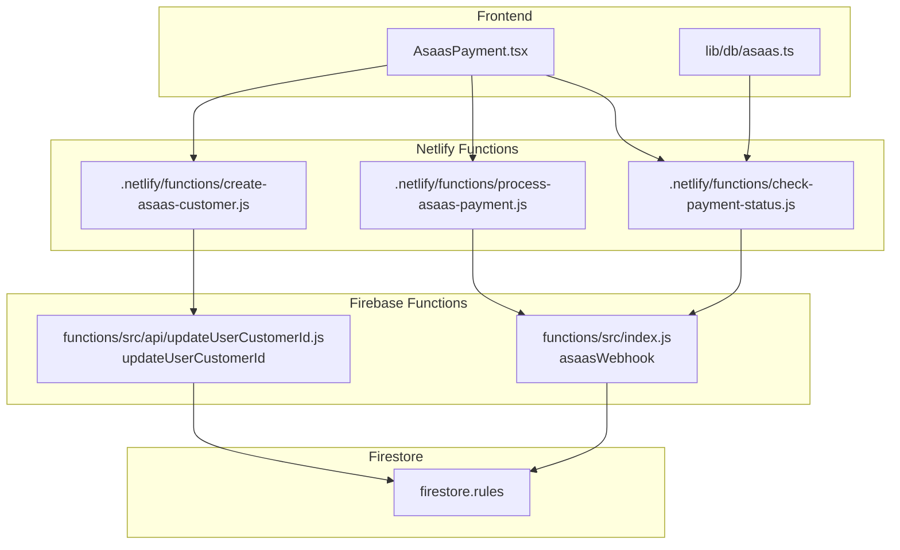
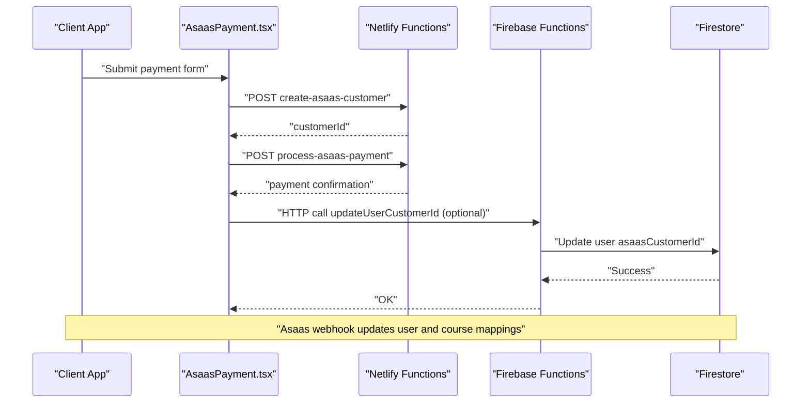
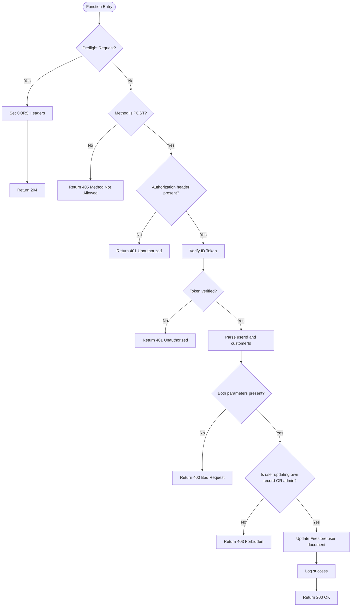
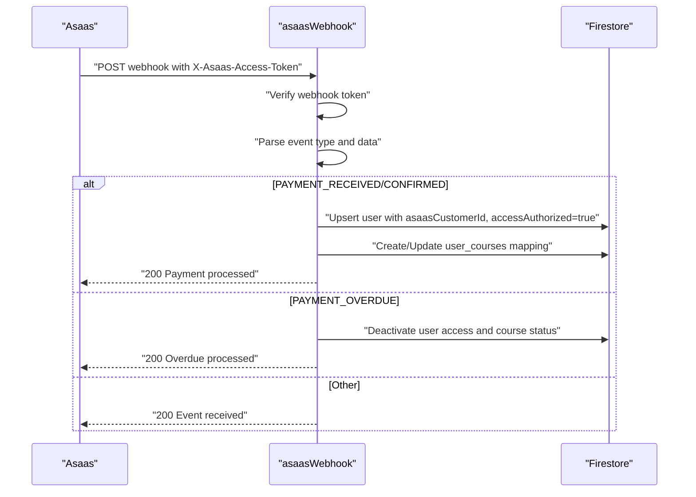
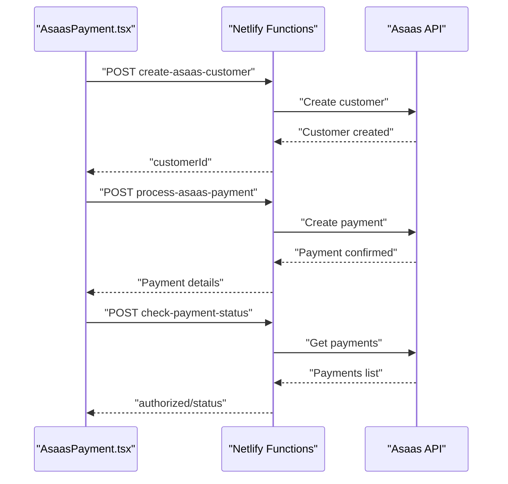
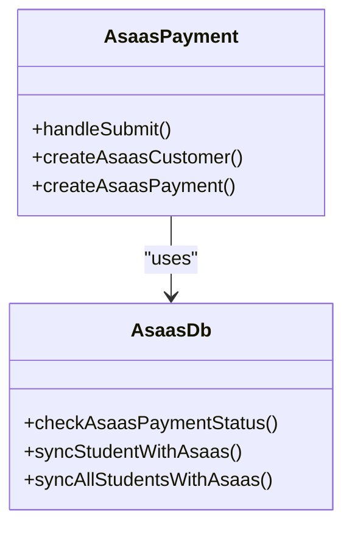
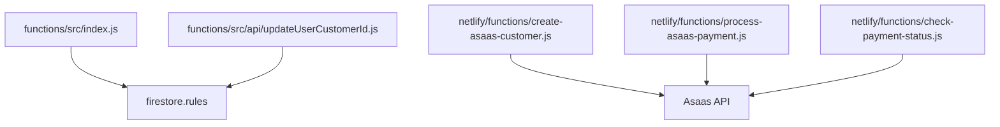

# Firebase Functions

<cite>
**Referenced Files in This Document**
- [updateUserCustomerId.js](file://functions/src/api/updateUserCustomerId.js)
- [index.js](file://functions/src/index.js)
- [package.json](file://functions/package.json)
- [README.md](file://functions/README.md)
- [firebase.json](file://firebase.json)
- [firestore.rules](file://firestore.rules)
- [create-asaas-customer.js](file://netlify/functions/create-asaas-customer.js)
- [process-asaas-payment.js](file://netlify/functions/process-asaas-payment.js)
- [check-payment-status.js](file://netlify/functions/check-payment-status.js)
- [AsaasPayment.tsx](file://components/AsaasPayment.tsx)
- [asaas.ts](file://lib/db/asaas.ts)
</cite>

## Table of Contents
1. [Introduction](#introduction)
2. [Project Structure](#project-structure)
3. [Core Components](#core-components)
4. [Architecture Overview](#architecture-overview)
5. [Detailed Component Analysis](#detailed-component-analysis)
6. [Dependency Analysis](#dependency-analysis)
7. [Performance Considerations](#performance-considerations)
8. [Troubleshooting Guide](#troubleshooting-guide)
9. [Conclusion](#conclusion)
10. [Appendices](#appendices)

## Introduction
This document provides comprehensive documentation for the Firebase Cloud Functions used in the payment system, with a focus on the updateUserCustomerId function that synchronizes customer IDs between Firebase Authentication and Asaas. It explains trigger conditions, data validation, error handling, integration with Firebase Authentication, Firestore database operations, and Asaas customer management. It also covers function invocation examples, parameter validation, response handling, deployment, security considerations, monitoring, and troubleshooting strategies for customer ID synchronization.

## Project Structure
The payment system integrates Firebase Cloud Functions with Netlify Functions and the frontend application:
- Firebase Cloud Functions: asaasWebhook and updateUserCustomerId
- Netlify Functions: create-asaas-customer, process-asaas-payment, check-payment-status
- Frontend components and libraries: AsaasPayment.tsx and lib/db/asaas.ts
- Firestore security rules governing access to user data and course mappings

**Diagram sources**
- [index.js](file://functions/src/index.js#L144-L339)
- [updateUserCustomerId.js](file://functions/src/api/updateUserCustomerId.js#L12-L74)
- [create-asaas-customer.js](file://netlify/functions/create-asaas-customer.js#L20-L146)
- [process-asaas-payment.js](file://netlify/functions/process-asaas-payment.js#L20-L121)
- [check-payment-status.js](file://netlify/functions/check-payment-status.js#L20-L152)
- [firestore.rules](file://firestore.rules#L1-L97)

**Section sources**
- [firebase.json](file://firebase.json#L8-L19)
- [package.json](file://functions/package.json#L1-L25)

## Core Components
- asaasWebhook: Receives Asaas webhook events, validates tokens, updates user access and course mappings, and handles payment confirmation and overdue scenarios.
- updateUserCustomerId: HTTP endpoint to update a user's Asaas customer ID in Firestore, enforcing authentication, authorization, and data validation.
- Netlify Functions: create-asaas-customer, process-asaas-payment, check-payment-status integrate with Asaas APIs and support frontend flows.
- Frontend integration: AsaasPayment.tsx and lib/db/asaas.ts orchestrate customer creation, payment processing, and status checks.

**Section sources**
- [index.js](file://functions/src/index.js#L144-L339)
- [updateUserCustomerId.js](file://functions/src/api/updateUserCustomerId.js#L12-L74)
- [create-asaas-customer.js](file://netlify/functions/create-asaas-customer.js#L20-L146)
- [process-asaas-payment.js](file://netlify/functions/process-asaas-payment.js#L20-L121)
- [check-payment-status.js](file://netlify/functions/check-payment-status.js#L20-L152)
- [AsaasPayment.tsx](file://components/AsaasPayment.tsx#L1-L200)
- [asaas.ts](file://lib/db/asaas.ts#L1-L145)

## Architecture Overview
The system follows a hybrid architecture:
- Frontend triggers Netlify Functions to create customers and process payments.
- Asaas sends webhooks to Firebase Functions, which update Firestore user documents and course mappings.
- Firebase Functions enforce authentication and authorization, and Firestore rules govern access.
- Frontend components and libraries consume Netlify Functions and Firestore to manage payment status and access.

**Diagram sources**
- [AsaasPayment.tsx](file://components/AsaasPayment.tsx#L183-L244)
- [create-asaas-customer.js](file://netlify/functions/create-asaas-customer.js#L88-L132)
- [process-asaas-payment.js](file://netlify/functions/process-asaas-payment.js#L79-L107)
- [updateUserCustomerId.js](file://functions/src/api/updateUserCustomerId.js#L62-L69)
- [index.js](file://functions/src/index.js#L188-L266)

## Detailed Component Analysis

### updateUserCustomerId Function
The updateUserCustomerId function synchronizes a user's Asaas customer ID in Firestore. It enforces strict authentication and authorization, validates input parameters, and updates user documents atomically with a server timestamp.

Key behaviors:
- Preflight handling for CORS
- Method enforcement (POST)
- ID token verification via Firebase Admin SDK
- Parameter validation (userId, customerId)
- Ownership/admin checks
- Firestore update with asaasCustomerId and lastAsaasSync

**Diagram sources**
- [updateUserCustomerId.js](file://functions/src/api/updateUserCustomerId.js#L12-L74)

**Section sources**
- [updateUserCustomerId.js](file://functions/src/api/updateUserCustomerId.js#L12-L74)

### asaasWebhook Function
The asaasWebhook function processes Asaas webhook events:
- Validates webhook token from configuration
- Parses event type and payment/customer data
- Creates or updates user records with access authorization and Asaas customer ID
- Maps user-course relationships based on externalReference
- Handles payment overdue by deactivating access and course status

**Diagram sources**
- [index.js](file://functions/src/index.js#L144-L339)

**Section sources**
- [index.js](file://functions/src/index.js#L144-L339)

### Netlify Functions Integration
Netlify Functions provide complementary capabilities:
- create-asaas-customer: Creates Asaas customer records and returns customerId
- process-asaas-payment: Proxies payment creation to Asaas
- check-payment-status: Queries Asaas for payment status and returns normalized status

**Diagram sources**
- [create-asaas-customer.js](file://netlify/functions/create-asaas-customer.js#L88-L132)
- [process-asaas-payment.js](file://netlify/functions/process-asaas-payment.js#L79-L107)
- [check-payment-status.js](file://netlify/functions/check-payment-status.js#L88-L138)

**Section sources**
- [create-asaas-customer.js](file://netlify/functions/create-asaas-customer.js#L20-L146)
- [process-asaas-payment.js](file://netlify/functions/process-asaas-payment.js#L20-L121)
- [check-payment-status.js](file://netlify/functions/check-payment-status.js#L20-L152)

### Frontend Integration
Frontend components coordinate payment flows:
- AsaasPayment.tsx orchestrates customer creation, payment processing, and success/error handling
- lib/db/asaas.ts encapsulates payment status checks and student synchronization with Asaas

**Diagram sources**
- [AsaasPayment.tsx](file://components/AsaasPayment.tsx#L183-L244)
- [asaas.ts](file://lib/db/asaas.ts#L1-L145)

**Section sources**
- [AsaasPayment.tsx](file://components/AsaasPayment.tsx#L1-L200)
- [asaas.ts](file://lib/db/asaas.ts#L1-L145)

## Dependency Analysis
- Firebase Functions depend on Firebase Admin SDK for authentication verification and Firestore operations.
- Firestore rules enforce access controls for users, adminEmails, courses, mindful_flow, music, student_completions, student_progress, student_activities, achievements, and user_courses collections.
- Netlify Functions depend on Asaas API credentials and handle CORS and authentication verification.

**Diagram sources**
- [index.js](file://functions/src/index.js#L1-L387)
- [updateUserCustomerId.js](file://functions/src/api/updateUserCustomerId.js#L1-L74)
- [firestore.rules](file://firestore.rules#L1-L97)
- [create-asaas-customer.js](file://netlify/functions/create-asaas-customer.js#L76-L86)
- [process-asaas-payment.js](file://netlify/functions/process-asaas-payment.js#L67-L77)
- [check-payment-status.js](file://netlify/functions/check-payment-status.js#L76-L86)

**Section sources**
- [firestore.rules](file://firestore.rules#L1-L97)
- [index.js](file://functions/src/index.js#L1-L387)
- [updateUserCustomerId.js](file://functions/src/api/updateUserCustomerId.js#L1-L74)

## Performance Considerations
- Minimize synchronous network calls; batch Firestore updates when possible.
- Use server timestamps for audit trails to avoid clock drift issues.
- Implement exponential backoff for retries when integrating with external APIs.
- Monitor function execution time and memory usage via Firebase logs.
- Consider caching frequently accessed user data to reduce Firestore reads.

## Troubleshooting Guide
Common issues and resolutions:
- Authentication failures: Ensure ID token is present and valid; verify Firebase Auth configuration.
- Authorization errors: Confirm user role or admin email; check Firestore rules for user ownership.
- Missing parameters: Validate userId and customerId presence in request body.
- Webhook token mismatch: Verify webhook token configuration and header casing.
- Asaas API errors: Check access token and API URL environment variables; inspect error responses from Asaas.
- CORS issues: Ensure preflight handling and allowed headers/methods are configured.
- Monitoring: Use Firebase Functions logs and Firestore rules debugging to trace access and mutations.

**Section sources**
- [updateUserCustomerId.js](file://functions/src/api/updateUserCustomerId.js#L28-L73)
- [index.js](file://functions/src/index.js#L160-L179)
- [create-asaas-customer.js](file://netlify/functions/create-asaas-customer.js#L76-L86)
- [process-asaas-payment.js](file://netlify/functions/process-asaas-payment.js#L67-L77)
- [check-payment-status.js](file://netlify/functions/check-payment-status.js#L76-L86)

## Conclusion
The Firebase Functions payment system provides robust synchronization between Firebase Authentication, Firestore, and Asaas. The updateUserCustomerId function ensures secure and validated updates to user customer IDs, while asaasWebhook maintains consistent access and course mappings based on Asaas events. Netlify Functions complement the backend by handling customer creation, payment processing, and status checks. Together, these components deliver a reliable payment infrastructure with strong security and observability.

## Appendices

### Deployment Process
- Install dependencies and configure environment variables for Asaas access token and webhook token.
- Deploy Firebase Functions using the provided scripts.
- Test locally with Firebase Emulator Suite and expose endpoints via ngrok for webhook testing.

**Section sources**
- [README.md](file://functions/README.md#L10-L27)
- [package.json](file://functions/package.json#L6-L11)

### Security Considerations
- Enforce ID token verification for HTTP endpoints.
- Restrict access to admin-only operations using Firestore rules and admin checks.
- Validate and sanitize all incoming request parameters.
- Use HTTPS and secure headers for cross-origin requests.
- Store sensitive configuration in Firebase Functions config and environment variables.

**Section sources**
- [updateUserCustomerId.js](file://functions/src/api/updateUserCustomerId.js#L29-L60)
- [index.js](file://functions/src/index.js#L10-L41)
- [firestore.rules](file://firestore.rules#L1-L97)

### Monitoring Approaches
- Enable Firebase Functions logging and view execution metrics.
- Add structured logging for critical operations and error scenarios.
- Use Firestore rules to audit access patterns and unauthorized attempts.
- Monitor Asaas webhook delivery and response codes.

**Section sources**
- [README.md](file://functions/README.md#L29-L45)
- [index.js](file://functions/src/index.js#L186-L187)
- [updateUserCustomerId.js](file://functions/src/api/updateUserCustomerId.js#L68-L72)