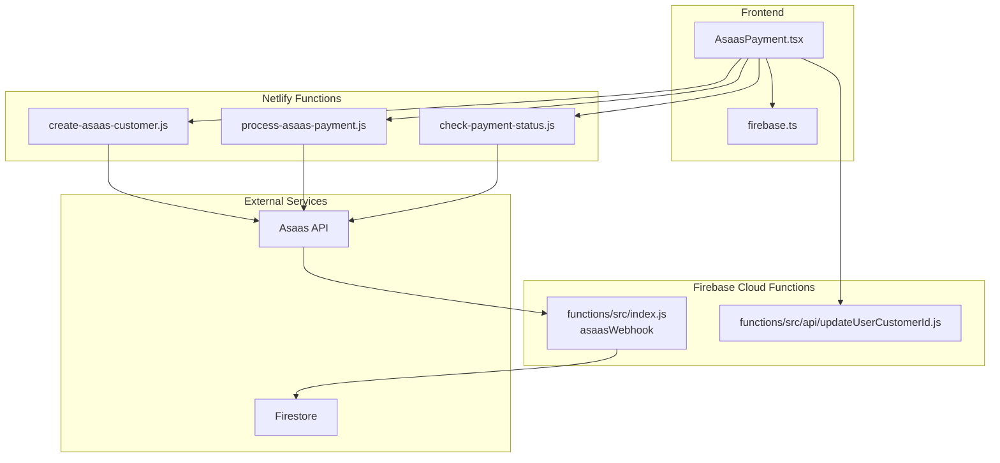
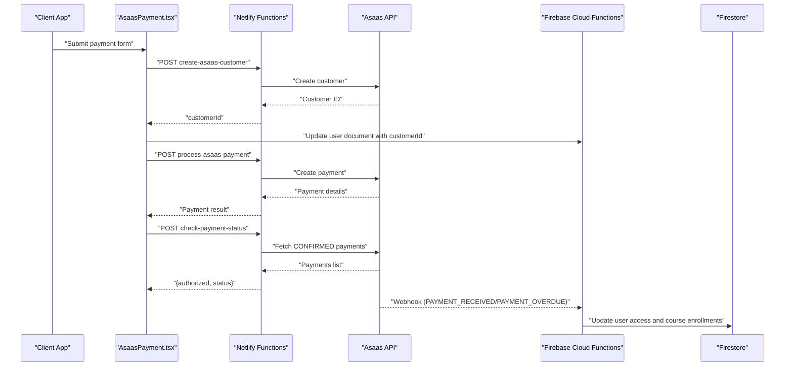
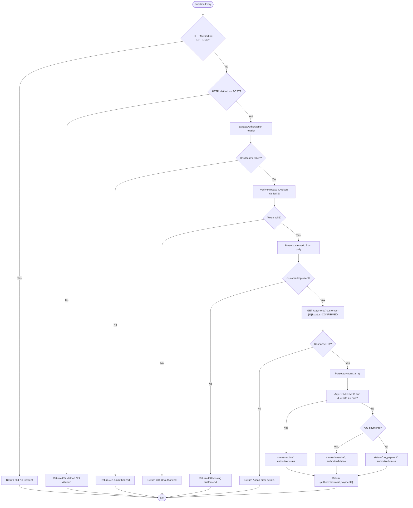
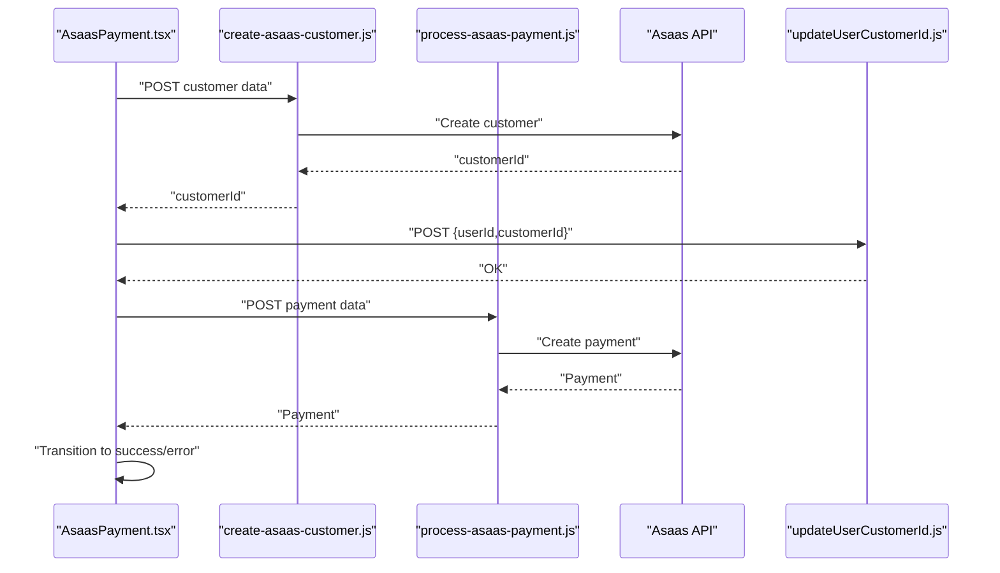
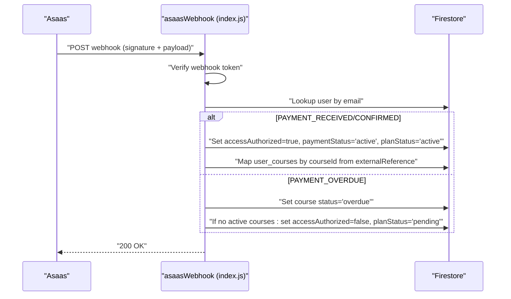
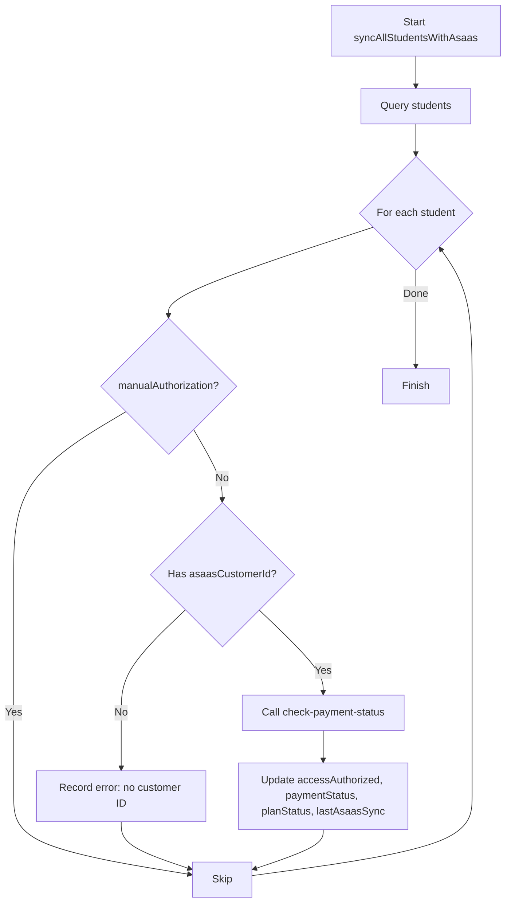
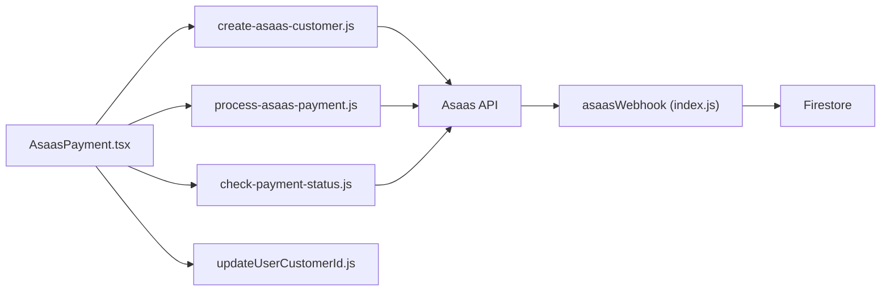

# Check Payment Status Function

<cite>
**Referenced Files in This Document**
- [check-payment-status.js](file://netlify/functions/check-payment-status.js)
- [process-asaas-payment.js](file://netlify/functions/process-asaas-payment.js)
- [create-asaas-customer.js](file://netlify/functions/create-asaas-customer.js)
- [AsaasPayment.tsx](file://components/AsaasPayment.tsx)
- [asaas.ts](file://lib/db/asaas.ts)
- [index.js](file://functions/src/index.js)
- [updateUserCustomerId.js](file://functions/src/api/updateUserCustomerId.js)
- [netlify.toml](file://netlify.toml)
- [firebase.ts](file://lib/firebase.ts)
- [test-asass-webhook.js](file://test-asass-webhook.js)
</cite>

## Table of Contents
1. [Introduction](#introduction)
2. [Project Structure](#project-structure)
3. [Core Components](#core-components)
4. [Architecture Overview](#architecture-overview)
5. [Detailed Component Analysis](#detailed-component-analysis)
6. [Dependency Analysis](#dependency-analysis)
7. [Performance Considerations](#performance-considerations)
8. [Troubleshooting Guide](#troubleshooting-guide)
9. [Conclusion](#conclusion)
10. [Appendices](#appendices)

## Introduction
This document explains the check-payment-status Netlify function and its role in the payment lifecycle. It covers how the function verifies payment status, integrates with Asaas webhooks, updates user access control, synchronizes data, handles errors, and supports retries. It also documents webhook processing, status update scenarios, and frontend integration with the payment component.

## Project Structure
The payment system spans frontend components, Netlify functions, and Firebase Cloud Functions:
- Frontend payment UI triggers creation of Asaas customers and payments.
- Netlify functions handle secure customer creation, payment processing, and payment status checks.
- Firebase Cloud Functions process Asaas webhooks to update user access and course enrollments.
- A shared library synchronizes payment status and updates Firestore records.

**Diagram sources**
- [AsaasPayment.tsx](file://components/AsaasPayment.tsx#L86-L181)
- [create-asaas-customer.js](file://netlify/functions/create-asaas-customer.js#L88-L132)
- [process-asaas-payment.js](file://netlify/functions/process-asaas-payment.js#L79-L107)
- [check-payment-status.js](file://netlify/functions/check-payment-status.js#L88-L138)
- [index.js](file://functions/src/index.js#L144-L339)
- [updateUserCustomerId.js](file://functions/src/api/updateUserCustomerId.js#L12-L73)

**Section sources**
- [AsaasPayment.tsx](file://components/AsaasPayment.tsx#L86-L181)
- [check-payment-status.js](file://netlify/functions/check-payment-status.js#L20-L151)
- [index.js](file://functions/src/index.js#L144-L339)

## Core Components
- check-payment-status function: Validates JWT, authenticates via Google JWKs, queries Asaas for CONFIRMED payments filtered by customer ID, determines active/overdue/no_payment, and returns authorized flag and status.
- AsaasPayment component: Collects customer/payment info, creates Asaas customer via Netlify function, stores customer ID, creates payment via Netlify function, and transitions UI states.
- Asaas webhook handler: Verifies webhook signature, processes payment confirmation and overdue events, updates user access and course enrollment, and sets planStatus accordingly.
- Shared sync library: Calls check-payment-status to synchronize student access and planStatus in Firestore.

**Section sources**
- [check-payment-status.js](file://netlify/functions/check-payment-status.js#L6-L18)
- [AsaasPayment.tsx](file://components/AsaasPayment.tsx#L86-L181)
- [index.js](file://functions/src/index.js#L144-L339)
- [asaas.ts](file://lib/db/asaas.ts#L7-L37)

## Architecture Overview
The system uses a hybrid architecture:
- Frontend interacts with Netlify functions for customer and payment operations.
- Netlify functions call Asaas APIs and return structured responses.
- Asaas sends signed webhooks to Firebase Cloud Functions.
- Firebase Cloud Functions update Firestore and course mappings.

**Diagram sources**
- [AsaasPayment.tsx](file://components/AsaasPayment.tsx#L86-L244)
- [create-asaas-customer.js](file://netlify/functions/create-asaas-customer.js#L88-L132)
- [process-asaas-payment.js](file://netlify/functions/process-asaas-payment.js#L79-L107)
- [check-payment-status.js](file://netlify/functions/check-payment-status.js#L88-L138)
- [index.js](file://functions/src/index.js#L144-L339)

## Detailed Component Analysis

### check-payment-status Function
Responsibilities:
- Authentication: Extracts Authorization header, verifies Firebase ID token against Google JWKS, rejects invalid tokens.
- Input validation: Requires customerId in request body.
- Asaas integration: Queries Asaas payments for a given customer with CONFIRMED status.
- Decision logic: Determines active if any CONFIRMED payment’s due date is today or in the future; overdue otherwise; no_payment if none.
- Response: Returns authorized flag, status, and payments array.

**Diagram sources**
- [check-payment-status.js](file://netlify/functions/check-payment-status.js#L20-L151)

**Section sources**
- [check-payment-status.js](file://netlify/functions/check-payment-status.js#L20-L151)

### AsaasPayment Component Integration
Behavior:
- Validates form inputs and formats card details.
- Creates Asaas customer via Netlify function and stores returned customerId.
- Updates user document with customerId using Firebase Cloud Function endpoint.
- Submits payment creation request to Netlify function.
- On success, transitions to success state; on failure, transitions to error state.

**Diagram sources**
- [AsaasPayment.tsx](file://components/AsaasPayment.tsx#L86-L244)
- [create-asaas-customer.js](file://netlify/functions/create-asaas-customer.js#L88-L132)
- [process-asaas-payment.js](file://netlify/functions/process-asaas-payment.js#L79-L107)
- [updateUserCustomerId.js](file://functions/src/api/updateUserCustomerId.js#L12-L73)

**Section sources**
- [AsaasPayment.tsx](file://components/AsaasPayment.tsx#L86-L244)

### Asaas Webhook Processing
Behavior:
- Validates webhook signature using a shared secret token.
- Handles PAYMENT_RECEIVED/PAYMENT_CONFIRMED: finds user by email, ensures accessAuthorized, sets paymentStatus and planStatus to active, and maps course enrollment via externalReference.
- Handles PAYMENT_OVERDUE: deactivates course enrollment and, if no active courses remain, deactivates global access.

**Diagram sources**
- [index.js](file://functions/src/index.js#L144-L339)

**Section sources**
- [index.js](file://functions/src/index.js#L144-L339)

### Data Synchronization and Access Control Updates
Mechanism:
- The shared library calls the check-payment-status function to determine authorized and status.
- It updates Firestore fields: accessAuthorized, paymentStatus, planStatus, and lastAsaasSync for each student.
- Manual authorizations are respected and skipped during automated sync.

**Diagram sources**
- [asaas.ts](file://lib/db/asaas.ts#L87-L144)
- [check-payment-status.js](file://netlify/functions/check-payment-status.js#L88-L138)

**Section sources**
- [asaas.ts](file://lib/db/asaas.ts#L87-L144)

## Dependency Analysis
Key dependencies and relationships:
- Frontend depends on Netlify functions for customer and payment operations and on Firebase Cloud Functions for updating user customer IDs.
- Netlify functions depend on Asaas APIs and environment variables for credentials.
- Firebase Cloud Functions depend on Firestore and process Asaas webhooks.
- The shared library depends on the check-payment-status function and Firestore.

**Diagram sources**
- [AsaasPayment.tsx](file://components/AsaasPayment.tsx#L86-L244)
- [create-asaas-customer.js](file://netlify/functions/create-asaas-customer.js#L88-L132)
- [process-asaas-payment.js](file://netlify/functions/process-asaas-payment.js#L79-L107)
- [check-payment-status.js](file://netlify/functions/check-payment-status.js#L88-L138)
- [index.js](file://functions/src/index.js#L144-L339)
- [updateUserCustomerId.js](file://functions/src/api/updateUserCustomerId.js#L12-L73)

**Section sources**
- [AsaasPayment.tsx](file://components/AsaasPayment.tsx#L86-L244)
- [check-payment-status.js](file://netlify/functions/check-payment-status.js#L88-L138)
- [index.js](file://functions/src/index.js#L144-L339)

## Performance Considerations
- Minimize external API calls: batch operations where possible and avoid redundant checks.
- Use caching: cache customer IDs and recent payment statuses to reduce repeated network calls.
- Optimize filters: query Asaas with precise filters (e.g., CONFIRMED and dueDate) to limit payload sizes.
- Asynchronous processing: offload heavy tasks to background jobs to keep response times low.
- Monitor latency: track function execution duration and external API response times.

## Troubleshooting Guide
Common issues and resolutions:
- Missing or invalid Authorization header: Ensure the frontend passes a valid Firebase ID token in the Authorization header.
- Asaas API errors: Inspect returned error details and Asaas error arrays; verify ASAAS_ACCESS_TOKEN and ASAAS_API_URL environment variables.
- Webhook signature mismatch: Confirm the webhook token matches the configured secret and is sent in the correct header.
- Customer ID not stored: Verify the update user customer ID endpoint succeeds and that the user document is updated.
- Overdue access not revoked: Check course enrollment mappings and manual authorization flags.

Monitoring and debugging:
- Enable logging in functions for request and error traces.
- Use Netlify and Firebase logs to correlate request IDs and timestamps.
- Validate environment variables in deployment settings.
- Simulate webhook events locally using the provided test script.

**Section sources**
- [check-payment-status.js](file://netlify/functions/check-payment-status.js#L140-L150)
- [index.js](file://functions/src/index.js#L160-L179)
- [test-asass-webhook.js](file://test-asass-webhook.js#L42-L67)

## Conclusion
The check-payment-status function is central to validating payment eligibility and enabling real-time access control updates. Combined with the Asaas webhook handler and frontend integration, it provides a robust payment lifecycle that keeps user access synchronized with Asaas payment states. Proper error handling, logging, and environment configuration are essential for reliable operation.

## Appendices

### Environment Variables and Headers
- Required environment variables:
  - ASAAS_ACCESS_TOKEN: Asaas API access token.
  - ASAAS_API_URL: Asaas API base URL (defaults to sandbox).
  - FIREBASE_PROJECT_ID: Used for JWT verification.
  - functions.config().asaas.webhook_token: Shared secret for webhook signature verification.
- Headers:
  - Authorization: Bearer <Firebase ID Token>.
  - Content-Type: application/json.
  - access_token: Asaas access token for Asaas API calls.
  - X-Asaas-Access-Token: Webhook signature header.

**Section sources**
- [check-payment-status.js](file://netlify/functions/check-payment-status.js#L76-L86)
- [index.js](file://functions/src/index.js#L162-L179)
- [netlify.toml](file://netlify.toml#L39-L47)