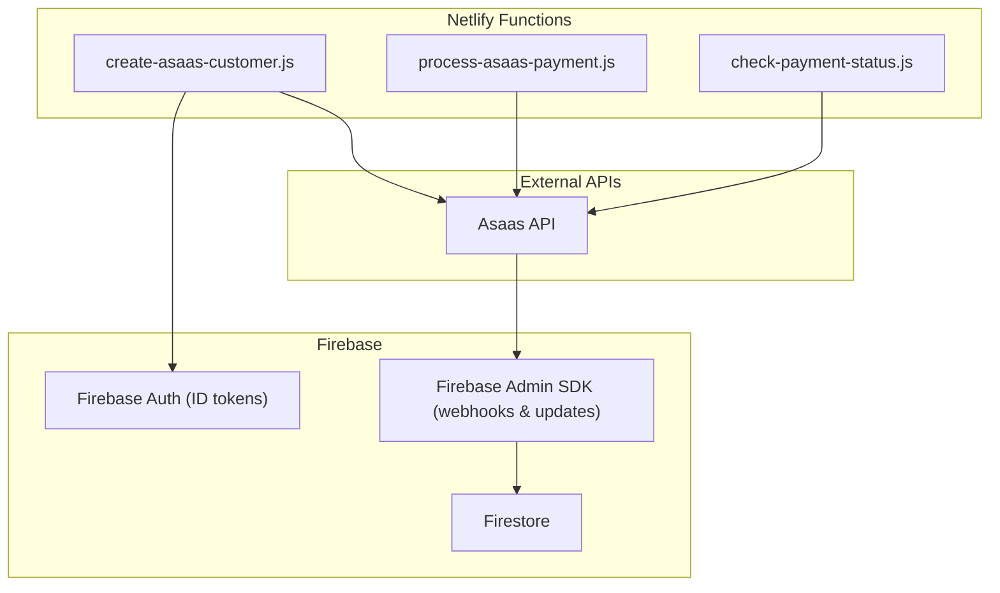
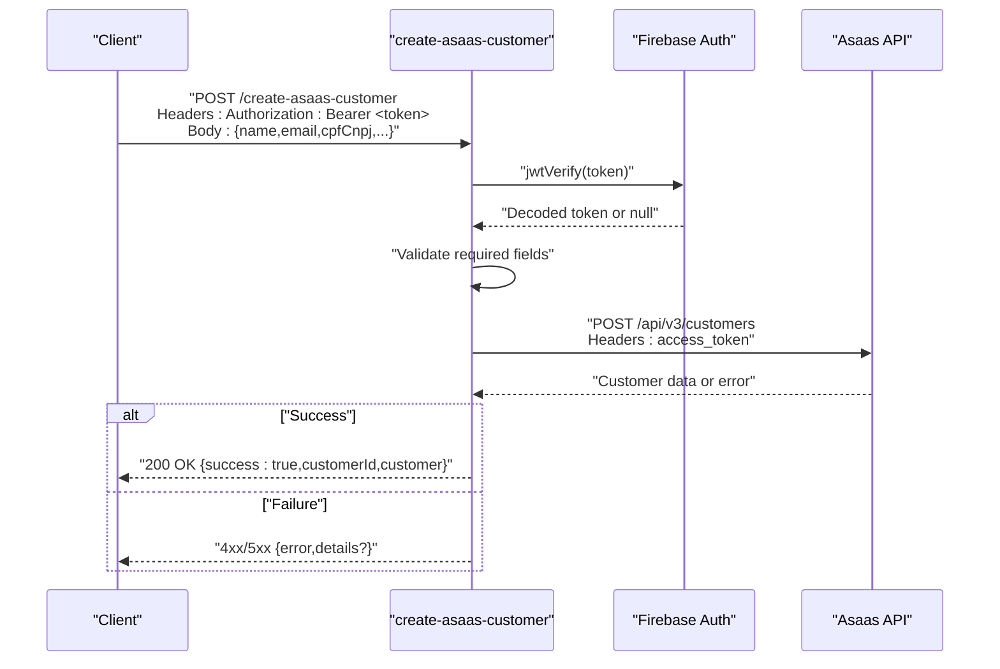
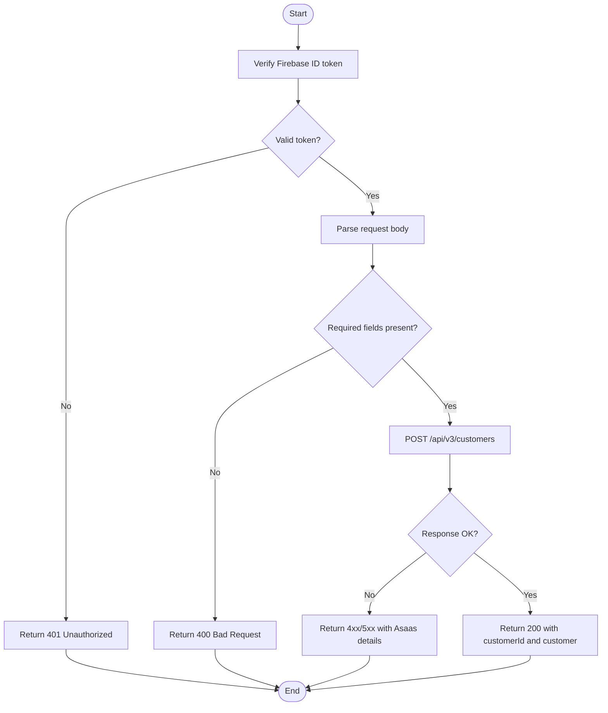
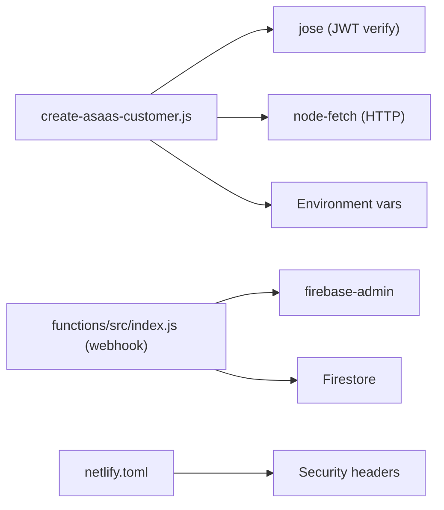

# Create Customer Function

<cite>
**Referenced Files in This Document**
- [create-asaas-customer.js](file://netlify/functions/create-asaas-customer.js)
- [process-asaas-payment.js](file://netlify/functions/process-asaas-payment.js)
- [check-payment-status.js](file://netlify/functions/check-payment-status.js)
- [index.js](file://functions/src/index.js)
- [updateUserCustomerId.js](file://functions/src/api/updateUserCustomerId.js)
- [netlify.toml](file://netlify.toml)
- [package.json](file://package.json)
- [functions/package.json](file://functions/package.json)
- [firestore.rules](file://firestore.rules)
</cite>

## Table of Contents
1. [Introduction](#introduction)
2. [Project Structure](#project-structure)
3. [Core Components](#core-components)
4. [Architecture Overview](#architecture-overview)
5. [Detailed Component Analysis](#detailed-component-analysis)
6. [Dependency Analysis](#dependency-analysis)
7. [Performance Considerations](#performance-considerations)
8. [Troubleshooting Guide](#troubleshooting-guide)
9. [Conclusion](#conclusion)
10. [Appendices](#appendices)

## Introduction
This document describes the create-asaas-customer Netlify function responsible for creating customer profiles in the Asaas payment platform. It covers the request lifecycle, authentication via Firebase JWT verification, data validation, Asaas API integration, response handling, and error management. It also explains how this function fits into the broader system, including Firebase authentication, Firestore data synchronization, and related payment functions.

## Project Structure
The create-asaas-customer function resides under the Netlify functions directory and integrates with:
- Netlify runtime and environment configuration
- Firebase Authentication for JWT verification
- Asaas payment API for customer creation
- Firestore for downstream synchronization (via webhooks and admin functions)

**Diagram sources**
- [create-asaas-customer.js](file://netlify/functions/create-asaas-customer.js#L1-L146)
- [process-asaas-payment.js](file://netlify/functions/process-asaas-payment.js#L1-L121)
- [check-payment-status.js](file://netlify/functions/check-payment-status.js#L1-L152)
- [index.js](file://functions/src/index.js#L144-L339)

**Section sources**
- [create-asaas-customer.js](file://netlify/functions/create-asaas-customer.js#L1-L146)
- [netlify.toml](file://netlify.toml#L1-L65)

## Core Components
- create-asaas-customer: Handles customer creation in Asaas after validating Firebase credentials and request payload.
- process-asaas-payment: Proxies payment creation requests to Asaas (complementary to customer creation).
- check-payment-status: Verifies active payments for a given Asaas customer ID.
- Firebase Admin webhook handler: Synchronizes Asaas events with Firestore (e.g., user access activation).
- updateUserCustomerId: Updates a user’s Asaas customer ID in Firestore with admin-level checks.

Key runtime and environment:
- Netlify bundler and headers configuration
- Node.js runtime and dependencies
- Firebase Admin SDK for server-side operations

**Section sources**
- [create-asaas-customer.js](file://netlify/functions/create-asaas-customer.js#L20-L145)
- [process-asaas-payment.js](file://netlify/functions/process-asaas-payment.js#L20-L120)
- [check-payment-status.js](file://netlify/functions/check-payment-status.js#L20-L151)
- [index.js](file://functions/src/index.js#L144-L339)
- [updateUserCustomerId.js](file://functions/src/api/updateUserCustomerId.js#L11-L74)
- [netlify.toml](file://netlify.toml#L36-L47)
- [package.json](file://package.json#L1-L44)
- [functions/package.json](file://functions/package.json#L1-L25)

## Architecture Overview
The create-asaas-customer function enforces authentication, validates input, and creates a customer in Asaas. On success, it returns the Asaas customer ID and sanitized customer data. Errors propagate structured messages with details from the Asaas API when applicable.

**Diagram sources**
- [create-asaas-customer.js](file://netlify/functions/create-asaas-customer.js#L20-L145)

## Detailed Component Analysis

### Function Parameters and Request Schema
- HTTP Method: POST
- Headers:
  - Authorization: Bearer <Firebase ID token>
  - Content-Type: application/json
- Body (JSON):
  - Required: name, email, cpfCnpj
  - Optional: phone, mobilePhone, address, addressNumber, province, postalCode

Validation behavior:
- Rejects non-POST methods with 405
- Requires Authorization header starting with "Bearer "
- Returns 400 if required fields are missing
- Returns 500 if Asaas access token is not configured

Response schema:
- Success (200): { success: true, customerId: string, customer: object }
- Client errors (400/401/405): { error: string, details?: any[] }
- Server errors (500): { error: string, message?: string }

Security:
- Firebase JWT verification against Google JWKs
- CORS headers configured for preflight and POST

Integration notes:
- Uses process.env.ASAAS_ACCESS_TOKEN and process.env.ASAAS_API_URL
- Sandbox base URL defaults to sandbox endpoint if env var is not set

**Section sources**
- [create-asaas-customer.js](file://netlify/functions/create-asaas-customer.js#L20-L145)

### Authentication and Authorization
- Firebase token verification:
  - Uses jose.jwtVerify with remote JWKS from Google securetoken endpoint
  - Validates issuer and audience against FIREBASE_PROJECT_ID
- Authorization enforcement:
  - Only requests with a valid Firebase ID token are accepted
  - Token decoding failure results in 401 Unauthorized

Related admin flows:
- Webhook handler verifies a secret token and updates Firestore accordingly
- updateUserCustomerId enforces ownership or admin privileges before updating

**Section sources**
- [create-asaas-customer.js](file://netlify/functions/create-asaas-customer.js#L6-L18)
- [index.js](file://functions/src/index.js#L144-L339)
- [updateUserCustomerId.js](file://functions/src/api/updateUserCustomerId.js#L28-L60)

### Asaas API Integration
- Endpoint: POST customers
- Headers: Content-Type: application/json, access_token: <ASAAS_ACCESS_TOKEN>
- Payload: name, email, cpfCnpj, plus optional address fields
- Error handling:
  - Propagates Asaas error description and errors array
  - Logs non-OK responses with console.error

Complementary flows:
- Payment creation proxies to Asaas payments endpoint
- Payment status checks filter CONFIRMED payments for a customer

**Section sources**
- [create-asaas-customer.js](file://netlify/functions/create-asaas-customer.js#L88-L122)
- [process-asaas-payment.js](file://netlify/functions/process-asaas-payment.js#L79-L107)
- [check-payment-status.js](file://netlify/functions/check-payment-status.js#L88-L138)

### Response Handling
- Successful creation returns 200 with success flag, Asaas customer ID, and sanitized customer object
- Validation failures return 400 with a descriptive error
- Authentication failures return 401 with an error message
- Non-OK Asaas responses return 4xx/5xx with structured error details
- Unhandled exceptions return 500 with error and message

**Section sources**
- [create-asaas-customer.js](file://netlify/functions/create-asaas-customer.js#L112-L144)

### Data Model and Firestore Synchronization
While the create-asaas-customer function itself does not write to Firestore, downstream synchronization occurs via:
- Webhook handler: Creates or updates user documents with asaasCustomerId and access flags upon payment confirmation
- updateUserCustomerId: Admin endpoint to set asaasCustomerId for a user with permission checks

Firestore rules:
- Enforce authenticated access and ownership/admin permissions for user-related collections

**Section sources**
- [index.js](file://functions/src/index.js#L188-L266)
- [updateUserCustomerId.js](file://functions/src/api/updateUserCustomerId.js#L47-L70)
- [firestore.rules](file://firestore.rules#L23-L90)

### Related Functions and Workflows
- Payment processing: Proxies payment creation to Asaas
- Payment status checking: Retrieves CONFIRMED payments for a customer and determines access status
- Webhook handling: Processes Asaas events to activate/deactivate user access and course mappings

**Diagram sources**
- [create-asaas-customer.js](file://netlify/functions/create-asaas-customer.js#L43-L145)

**Section sources**
- [process-asaas-payment.js](file://netlify/functions/process-asaas-payment.js#L64-L120)
- [check-payment-status.js](file://netlify/functions/check-payment-status.js#L64-L151)
- [index.js](file://functions/src/index.js#L144-L339)

## Dependency Analysis
Runtime and libraries:
- Node-fetch for HTTP requests to Asaas
- jose for JWT verification against Google JWKs
- Firebase Admin SDK for server-side operations (webhooks and updates)
- Netlify functions runtime with esbuild bundler

Environment variables:
- FIREBASE_PROJECT_ID (issuer/audience)
- ASAAS_ACCESS_TOKEN (required)
- ASAAS_API_URL (optional, defaults to sandbox)

Security headers:
- CSP, HSTS, X-Content-Type-Options, Referrer-Policy configured in netlify.toml

**Diagram sources**
- [create-asaas-customer.js](file://netlify/functions/create-asaas-customer.js#L1-L2)
- [index.js](file://functions/src/index.js#L1-L10)
- [netlify.toml](file://netlify.toml#L39-L47)

**Section sources**
- [create-asaas-customer.js](file://netlify/functions/create-asaas-customer.js#L1-L18)
- [index.js](file://functions/src/index.js#L1-L10)
- [netlify.toml](file://netlify.toml#L39-L47)
- [package.json](file://package.json#L13-L24)
- [functions/package.json](file://functions/package.json#L16-L19)

## Performance Considerations
- Network latency: Asaas API calls are synchronous; consider adding retry/backoff for transient failures if needed.
- Token verification: JWKS retrieval is performed per request; caching decoded claims server-side could reduce overhead if invoked frequently.
- Payload size: Keep request bodies minimal; only send required fields to reduce bandwidth and processing time.
- Concurrency: Limit concurrent invocations at the application level if Asaas rate limits are approached.

[No sources needed since this section provides general guidance]

## Troubleshooting Guide
Common issues and resolutions:
- Missing Authorization header or invalid token:
  - Ensure clients send "Authorization: Bearer <Firebase ID token>"
  - Confirm token matches FIREBASE_PROJECT_ID issuer/audience
- Missing required fields:
  - Provide name, email, and cpfCnpj in the request body
- Asaas configuration errors:
  - Verify ASAAS_ACCESS_TOKEN is set
  - Confirm ASAAS_API_URL points to a valid Asaas endpoint
- Asaas API errors:
  - Inspect returned error and details arrays for validation hints
- CORS issues:
  - Ensure preflight OPTIONS is handled and headers are set correctly

Debugging tips:
- Enable logging for error responses and non-OK Asaas statuses
- Validate environment variables locally and in deployment
- Test token verification independently using jose with the Google JWKs endpoint

**Section sources**
- [create-asaas-customer.js](file://netlify/functions/create-asaas-customer.js#L43-L86)
- [create-asaas-customer.js](file://netlify/functions/create-asaas-customer.js#L112-L144)
- [netlify.toml](file://netlify.toml#L39-L47)

## Conclusion
The create-asaas-customer function provides a focused, secure pathway to create Asaas customers by enforcing Firebase authentication, validating inputs, and integrating with the Asaas API. Its design aligns with complementary payment functions and Firestore synchronization via webhooks, forming a cohesive payment and access control pipeline.

[No sources needed since this section summarizes without analyzing specific files]

## Appendices

### API Definition Summary
- Endpoint: POST /create-asaas-customer
- Headers:
  - Authorization: Bearer <Firebase ID token>
  - Content-Type: application/json
- Request body (JSON):
  - Required: name, email, cpfCnpj
  - Optional: phone, mobilePhone, address, addressNumber, province, postalCode
- Success response (200):
  - { success: true, customerId: string, customer: object }
- Error responses:
  - 400: Missing required fields
  - 401: Unauthorized (invalid or missing token)
  - 405: Method not allowed
  - 500: Internal server error or Asaas configuration error
  - 4xx/5xx: Asaas API error with description and details

**Section sources**
- [create-asaas-customer.js](file://netlify/functions/create-asaas-customer.js#L20-L145)

### Example Scenarios
- Successful customer creation:
  - Client sends valid token and complete payload
  - Function returns 200 with customerId and customer object
- Missing token:
  - Function returns 401 with error message
- Missing required fields:
  - Function returns 400 with error indicating missing fields
- Asaas API failure:
  - Function logs and returns 4xx/5xx with Asaas description and details

**Section sources**
- [create-asaas-customer.js](file://netlify/functions/create-asaas-customer.js#L43-L144)

### Security Measures
- JWT verification against Google JWKs with issuer/audience checks
- CORS headers for safe cross-origin requests
- Environment variable protection for Asaas access token
- CSP and HSTS headers configured in netlify.toml

**Section sources**
- [create-asaas-customer.js](file://netlify/functions/create-asaas-customer.js#L6-L18)
- [netlify.toml](file://netlify.toml#L39-L47)

### Rate Limiting and Monitoring
- Rate limiting:
  - No built-in rate limiter in the function; consider implementing at the application or CDN level if needed
- Monitoring:
  - Log errors and non-OK Asaas responses
  - Track invocation metrics via Netlify and Asaas webhooks
  - Observe Firestore sync via webhook logs

**Section sources**
- [create-asaas-customer.js](file://netlify/functions/create-asaas-customer.js#L112-L144)
- [index.js](file://functions/src/index.js#L160-L180)