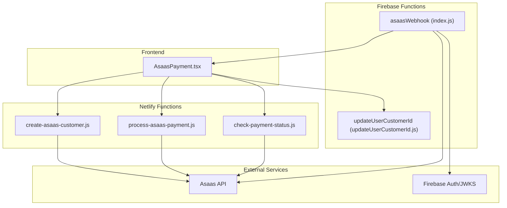
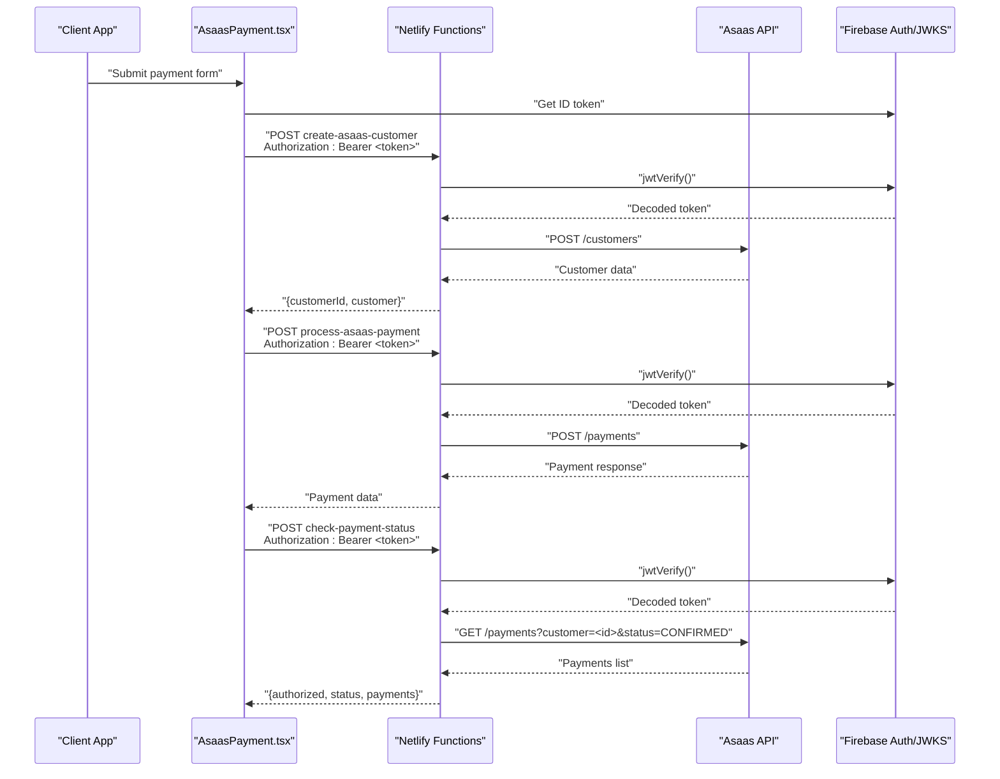
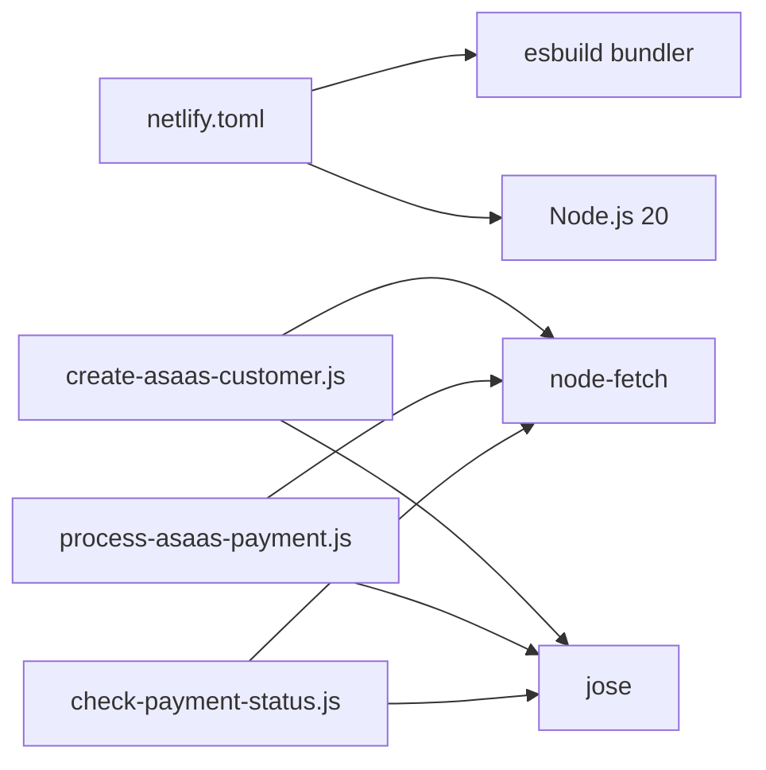

# Netlify Functions

<cite>
**Referenced Files in This Document**
- [create-asaas-customer.js](file://netlify/functions/create-asaas-customer.js)
- [process-asaas-payment.js](file://netlify/functions/process-asaas-payment.js)
- [check-payment-status.js](file://netlify/functions/check-payment-status.js)
- [netlify.toml](file://netlify.toml)
- [AsaasPayment.tsx](file://components/AsaasPayment.tsx)
- [index.js](file://functions/src/index.js)
- [updateUserCustomerId.js](file://functions/src/api/updateUserCustomerId.js)
- [package.json](file://functions/package.json)
- [README.md](file://functions/README.md)
- [test-asass-webhook.js](file://test-asass-webhook.js)
</cite>

## Table of Contents
1. [Introduction](#introduction)
2. [Project Structure](#project-structure)
3. [Core Components](#core-components)
4. [Architecture Overview](#architecture-overview)
5. [Detailed Component Analysis](#detailed-component-analysis)
6. [Dependency Analysis](#dependency-analysis)
7. [Performance Considerations](#performance-considerations)
8. [Troubleshooting Guide](#troubleshooting-guide)
9. [Conclusion](#conclusion)
10. [Appendices](#appendices)

## Introduction
This document explains the Netlify serverless functions that power payment processing in the application. It covers the customer creation, payment processing, and payment status checking functions, detailing their purpose, parameters, request/response schemas, error handling, authentication, and security considerations. It also documents integration with the Asaas API, environment configuration, invocation examples, debugging strategies, deployment, monitoring, and performance optimization.

## Project Structure
The payment processing stack consists of:
- Frontend React component that orchestrates payment flow and invokes Netlify functions
- Netlify functions for customer registration, payment processing, and payment status checks
- Firebase Functions for Asaas webhooks and auxiliary endpoints
- Build and runtime configuration for Netlify and Firebase

**Diagram sources**
- [AsaasPayment.tsx](file://components/AsaasPayment.tsx#L86-L244)
- [create-asaas-customer.js](file://netlify/functions/create-asaas-customer.js#L20-L145)
- [process-asaas-payment.js](file://netlify/functions/process-asaas-payment.js#L20-L120)
- [check-payment-status.js](file://netlify/functions/check-payment-status.js#L20-L151)
- [index.js](file://functions/src/index.js#L144-L339)
- [updateUserCustomerId.js](file://functions/src/api/updateUserCustomerId.js#L12-L73)

**Section sources**
- [AsaasPayment.tsx](file://components/AsaasPayment.tsx#L86-L244)
- [netlify.toml](file://netlify.toml#L1-L65)

## Core Components
- create-asaas-customer: Creates a customer in Asaas using a Firebase ID token for authentication. Returns the Asaas customer ID and customer data.
- process-asaas-payment: Submits a payment request to Asaas using a Firebase ID token for authentication. Returns the payment response from Asaas.
- check-payment-status: Queries Asaas for CONFIRMED payments linked to a given customer ID and determines whether the user has active or overdue payments.

Each function enforces:
- CORS headers
- Preflight handling (OPTIONS)
- HTTP method enforcement (POST)
- Firebase ID token verification via JWKS
- Asaas API access token and base URL from environment variables
- Robust error handling with appropriate HTTP status codes

**Section sources**
- [create-asaas-customer.js](file://netlify/functions/create-asaas-customer.js#L20-L145)
- [process-asaas-payment.js](file://netlify/functions/process-asaas-payment.js#L20-L120)
- [check-payment-status.js](file://netlify/functions/check-payment-status.js#L20-L151)

## Architecture Overview
The frontend triggers Netlify functions after collecting payment details. Each function validates the caller’s identity using Firebase JWT verification and proxies requests to Asaas. The Firebase webhook function listens for Asaas events and updates user access and course enrollments accordingly.

**Diagram sources**
- [AsaasPayment.tsx](file://components/AsaasPayment.tsx#L86-L244)
- [create-asaas-customer.js](file://netlify/functions/create-asaas-customer.js#L20-L145)
- [process-asaas-payment.js](file://netlify/functions/process-asaas-payment.js#L20-L120)
- [check-payment-status.js](file://netlify/functions/check-payment-status.js#L20-L151)

## Detailed Component Analysis

### create-asaas-customer
Purpose:
- Registers a new customer in Asaas using the provided personal and contact details.

Parameters:
- Authorization header: Bearer <Firebase ID token>
- Body: Customer details including name, email, cpfCnpj, phone, mobilePhone, address, addressNumber, province, postalCode

Request schema:
- Headers: Content-Type: application/json, Authorization: Bearer <token>
- Body: {
  name: string,
  email: string,
  cpfCnpj: string,
  phone?: string,
  mobilePhone?: string,
  address?: string,
  addressNumber?: string,
  province?: string,
  postalCode?: string
}

Response schema:
- Success: { success: true, customerId: string, customer: object }
- Errors: { error: string, details?: array }

Error handling:
- 401 Unauthorized if missing/invalid token
- 400 Bad Request if required fields are missing
- 500 Internal Server Error if Asaas token or URL is not configured
- Propagates Asaas errors with description and details

Security:
- Verifies Firebase ID token against Google JWKS
- Uses access_token header for Asaas authentication

Environment variables:
- FIREBASE_PROJECT_ID (fallback default)
- ASAAS_ACCESS_TOKEN (required)
- ASAAS_API_URL (defaults to sandbox)

Example invocation:
- POST /.netlify/functions/create-asaas-customer
- Headers: Authorization: Bearer <ID_TOKEN>, Content-Type: application/json
- Body: { name, email, cpfCnpj, ... }

**Section sources**
- [create-asaas-customer.js](file://netlify/functions/create-asaas-customer.js#L20-L145)

### process-asaas-payment
Purpose:
- Submits a payment request to Asaas for the specified customer.

Parameters:
- Authorization header: Bearer <Firebase ID token>
- Body: Payment payload compatible with Asaas /payments schema

Request schema:
- Headers: Content-Type: application/json, Authorization: Bearer <token>
- Body: Payment object (billingType, value, dueDate, description, externalReference, creditCard, creditCardHolderInfo, installmentCount, customer)

Response schema:
- Success: Asaas payment object
- Errors: { error: string, details?: array }

Error handling:
- 401 Unauthorized if missing/invalid token
- 500 Internal Server Error if Asaas token or URL is not configured
- Propagates Asaas errors with description and details

Security:
- Verifies Firebase ID token via JWKS
- Uses access_token header for Asaas authentication

Environment variables:
- FIREBASE_PROJECT_ID (fallback default)
- ASAAS_ACCESS_TOKEN (required)
- ASAAS_API_URL (defaults to sandbox)

Example invocation:
- POST /.netlify/functions/process-asaas-payment
- Headers: Authorization: Bearer <ID_TOKEN>, Content-Type: application/json
- Body: { customer, billingType, value, dueDate, description, externalReference, creditCard, creditCardHolderInfo, installmentCount }

**Section sources**
- [process-asaas-payment.js](file://netlify/functions/process-asaas-payment.js#L20-L120)

### check-payment-status
Purpose:
- Determines if a customer has an active (not overdue) CONFIRMED payment by querying Asaas.

Parameters:
- Authorization header: Bearer <Firebase ID token>
- Body: { customerId: string }

Request schema:
- Headers: Content-Type: application/json, Authorization: Bearer <token>
- Body: { customerId: string }

Response schema:
- Success: { authorized: boolean, status: "no_payment" | "active" | "overdue", payments: array }
- Errors: { error: string, details?: array }

Error handling:
- 401 Unauthorized if missing/invalid token
- 400 Bad Request if customerId is missing
- 500 Internal Server Error if Asaas token or URL is not configured
- Propagates Asaas errors with description and details

Security:
- Verifies Firebase ID token via JWKS
- Uses access_token header for Asaas authentication

Environment variables:
- FIREBASE_PROJECT_ID (fallback default)
- ASAAS_ACCESS_TOKEN (required)
- ASAAS_API_URL (defaults to sandbox)

Example invocation:
- POST /.netlify/functions/check-payment-status
- Headers: Authorization: Bearer <ID_TOKEN>, Content-Type: application/json
- Body: { customerId }

**Section sources**
- [check-payment-status.js](file://netlify/functions/check-payment-status.js#L20-L151)

### Frontend Orchestration (AsaasPayment.tsx)
The frontend component:
- Collects customer and payment details
- Calls create-asaas-customer to register the user
- Optionally updates the user record with the Asaas customer ID via a Firebase Function endpoint
- Calls process-asaas-payment to submit the charge
- Shows success/error states based on payment outcome

Key flows:
- Customer creation and payment submission are chained and protected by Firebase ID tokens
- On success, the component triggers the provided onSuccess callback

**Section sources**
- [AsaasPayment.tsx](file://components/AsaasPayment.tsx#L86-L244)

### Firebase Webhook Integration (Optional)
While not part of the Netlify functions, the Firebase Functions webhook handles Asaas events:
- Verifies webhook token via header
- Updates user access and course enrollment based on payment events
- Supports PAYMENT_RECEIVED, PAYMENT_CONFIRMED, and PAYMENT_OVERDUE

**Section sources**
- [index.js](file://functions/src/index.js#L144-L339)
- [README.md](file://functions/README.md#L1-L61)

## Dependency Analysis
- Runtime and bundling:
  - Netlify uses esbuild for functions bundling
  - Node.js version is pinned to 20
- External libraries:
  - node-fetch for HTTP requests
  - jose for JWT verification against Google JWKS
- Environment:
  - FIREBASE_PROJECT_ID, ASAAS_ACCESS_TOKEN, ASAAS_API_URL
- Security headers:
  - CSP, HSTS, XFO, XCTO, Referrer-Policy configured at Netlify level

**Diagram sources**
- [netlify.toml](file://netlify.toml#L1-L65)
- [create-asaas-customer.js](file://netlify/functions/create-asaas-customer.js#L1-L2)
- [process-asaas-payment.js](file://netlify/functions/process-asaas-payment.js#L1-L2)
- [check-payment-status.js](file://netlify/functions/check-payment-status.js#L1-L2)

**Section sources**
- [netlify.toml](file://netlify.toml#L1-L65)
- [create-asaas-customer.js](file://netlify/functions/create-asaas-customer.js#L1-L2)
- [process-asaas-payment.js](file://netlify/functions/process-asaas-payment.js#L1-L2)
- [check-payment-status.js](file://netlify/functions/check-payment-status.js#L1-L2)

## Performance Considerations
- Minimize cold starts by keeping function bundles small (esbuild) and avoiding unnecessary dependencies
- Reuse connections and avoid synchronous I/O in hot paths
- Cache JWKS keys locally if invoking frequently (not implemented here)
- Use sandbox URLs during development; switch to production Asaas endpoints in staging/production
- Monitor latency to Asaas and implement retries with exponential backoff for transient failures
- Consider rate limiting and circuit breakers at the gateway level

## Troubleshooting Guide
Common issues and resolutions:
- Missing or invalid Authorization header:
  - Ensure the frontend obtains a valid Firebase ID token and passes it as Bearer
- 401 Unauthorized from functions:
  - Verify token issuer and audience match the configured Firebase project ID
- 400 Bad Request:
  - Confirm required fields are present in the request body
- 500 Internal Server Error:
  - Check ASAAS_ACCESS_TOKEN and ASAAS_API_URL environment variables
- Asaas API errors:
  - Inspect returned error description and details arrays
- Webhook integration:
  - Enable and configure webhook token in Firebase Functions config
  - Use the provided test script to simulate Asaas webhook events

Debugging strategies:
- Review function logs via Netlify CLI or dashboard
- Add structured logging around Asaas responses
- Validate environment variables in the deployment platform
- Use the provided test script to simulate webhook events locally

**Section sources**
- [create-asaas-customer.js](file://netlify/functions/create-asaas-customer.js#L134-L144)
- [process-asaas-payment.js](file://netlify/functions/process-asaas-payment.js#L109-L119)
- [check-payment-status.js](file://netlify/functions/check-payment-status.js#L140-L150)
- [README.md](file://functions/README.md#L1-L61)
- [test-asass-webhook.js](file://test-asass-webhook.js#L1-L81)

## Conclusion
The Netlify functions provide a secure, token-verified bridge between the frontend and Asaas, enabling customer registration, payment processing, and status checks. Combined with Firebase Functions for webhook handling, the system supports automated user access management and course enrollment synchronization. Proper environment configuration, robust error handling, and monitoring are essential for reliable operation.

## Appendices

### Environment Variables Reference
- FIREBASE_PROJECT_ID: Firebase project identifier used for JWT verification
- ASAAS_ACCESS_TOKEN: Asaas API access token
- ASAAS_API_URL: Asaas API base URL (defaults to sandbox)

**Section sources**
- [create-asaas-customer.js](file://netlify/functions/create-asaas-customer.js#L76-L77)
- [process-asaas-payment.js](file://netlify/functions/process-asaas-payment.js#L67-L68)
- [check-payment-status.js](file://netlify/functions/check-payment-status.js#L76-L77)

### Deployment and Monitoring
- Netlify build and functions configuration:
  - Bundler: esbuild
  - Node.js version: 20
  - Functions directory: netlify/functions
- Firebase Functions (webhook and auxiliary endpoints):
  - Use Firebase CLI scripts for local emulation and deployment
  - Configure Asaas webhook token and access token in Firebase Functions config

**Section sources**
- [netlify.toml](file://netlify.toml#L1-L65)
- [package.json](file://functions/package.json#L1-L25)
- [README.md](file://functions/README.md#L1-L61)