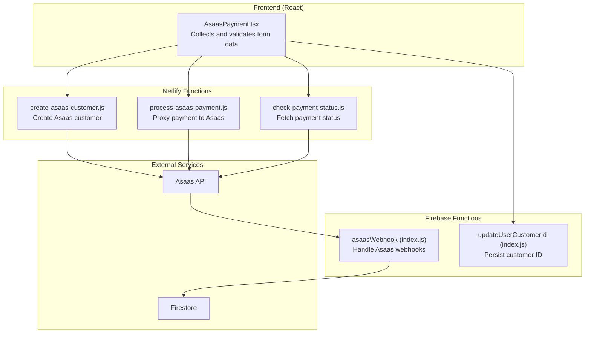
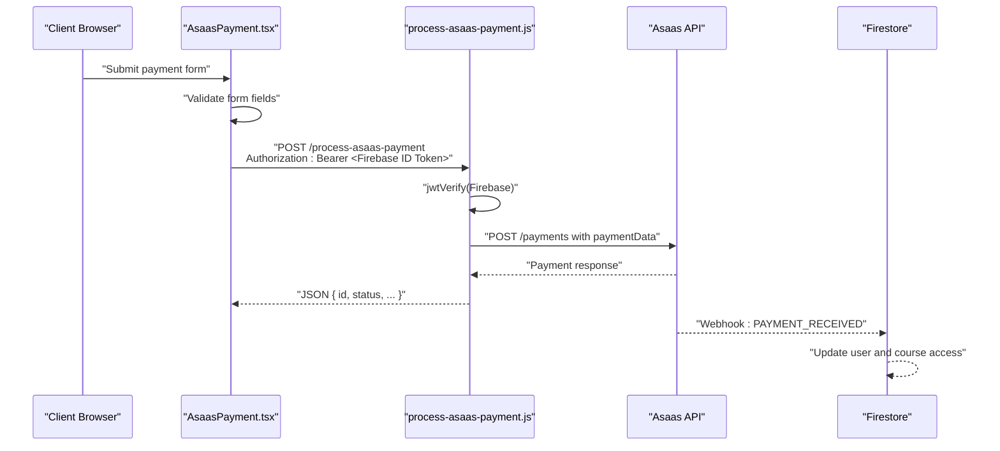
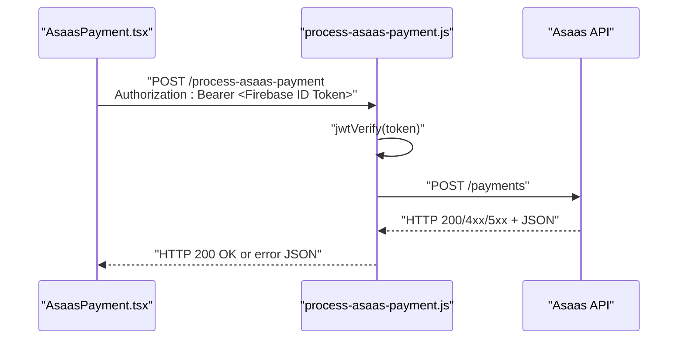
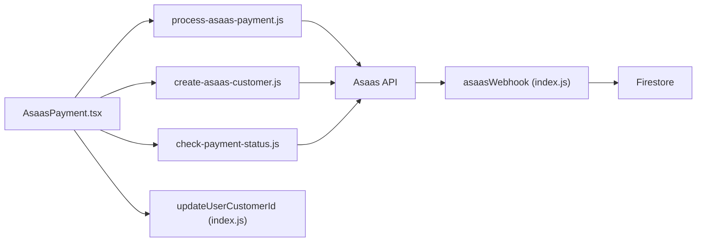

# Process Payment Function

<cite>
**Referenced Files in This Document**
- [process-asaas-payment.js](file://netlify/functions/process-asaas-payment.js)
- [create-asaas-customer.js](file://netlify/functions/create-asaas-customer.js)
- [check-payment-status.js](file://netlify/functions/check-payment-status.js)
- [AsaasPayment.tsx](file://components/AsaasPayment.tsx)
- [index.js](file://functions/src/index.js)
- [updateUserCustomerId.js](file://functions/src/api/updateUserCustomerId.js)
- [netlify.toml](file://netlify.toml)
- [NETLIFY_SETUP.md](file://docs/NETLIFY_SETUP.md)
- [README.md](file://README.md)
- [test-asass-webhook.js](file://test-asass-webhook.js)
</cite>

## Table of Contents
1. [Introduction](#introduction)
2. [Project Structure](#project-structure)
3. [Core Components](#core-components)
4. [Architecture Overview](#architecture-overview)
5. [Detailed Component Analysis](#detailed-component-analysis)
6. [Dependency Analysis](#dependency-analysis)
7. [Performance Considerations](#performance-considerations)
8. [Troubleshooting Guide](#troubleshooting-guide)
9. [Conclusion](#conclusion)
10. [Appendices](#appendices)

## Introduction
This document describes the process-asaas-payment Netlify function and the broader payment processing workflow for the Fluentoria platform. It explains how credit card data is collected and validated in the frontend, how the payment is executed via the Asaas API through a secure Netlify function, and how payment status is managed and synchronized with Firebase. It also covers security measures, PCI compliance considerations, error handling, response formatting, configuration, monitoring, and troubleshooting procedures.

## Project Structure
The payment flow spans both the frontend and backend:
- Frontend: React component collects and validates payment data, then calls Netlify functions.
- Backend (Netlify Functions): Securely proxies payment requests to Asaas and returns standardized responses.
- Backend (Firebase Functions): Handles Asaas webhooks, updates user and course access, and maintains synchronization.

**Diagram sources**
- [AsaasPayment.tsx](file://components/AsaasPayment.tsx#L86-L181)
- [create-asaas-customer.js](file://netlify/functions/create-asaas-customer.js#L88-L132)
- [process-asaas-payment.js](file://netlify/functions/process-asaas-payment.js#L79-L107)
- [check-payment-status.js](file://netlify/functions/check-payment-status.js#L88-L138)
- [index.js](file://functions/src/index.js#L144-L339)
- [updateUserCustomerId.js](file://functions/src/api/updateUserCustomerId.js#L12-L74)

**Section sources**
- [AsaasPayment.tsx](file://components/AsaasPayment.tsx#L1-L491)
- [process-asaas-payment.js](file://netlify/functions/process-asaas-payment.js#L1-L121)
- [create-asaas-customer.js](file://netlify/functions/create-asaas-customer.js#L1-L146)
- [check-payment-status.js](file://netlify/functions/check-payment-status.js#L1-L152)
- [index.js](file://functions/src/index.js#L144-L339)
- [updateUserCustomerId.js](file://functions/src/api/updateUserCustomerId.js#L12-L74)
- [netlify.toml](file://netlify.toml#L1-L65)

## Core Components
- process-asaas-payment.js: Receives payment data, verifies Firebase JWT, proxies to Asaas, and returns structured responses.
- create-asaas-customer.js: Creates a customer record in Asaas after validating required fields and JWT.
- check-payment-status.js: Queries Asaas for confirmed payments and determines active/overdue/no_payment status.
- AsaasPayment.tsx: Frontend form that collects and formats payment data, invokes Netlify functions, and manages UI states.
- asaasWebhook (index.js): Processes Asaas webhook events to activate/deactivate user/course access and synchronize records.
- updateUserCustomerId (index.js): Updates Firestore with Asaas customer ID for a user.

**Section sources**
- [process-asaas-payment.js](file://netlify/functions/process-asaas-payment.js#L20-L120)
- [create-asaas-customer.js](file://netlify/functions/create-asaas-customer.js#L20-L145)
- [check-payment-status.js](file://netlify/functions/check-payment-status.js#L20-L151)
- [AsaasPayment.tsx](file://components/AsaasPayment.tsx#L12-L244)
- [index.js](file://functions/src/index.js#L144-L339)
- [updateUserCustomerId.js](file://functions/src/api/updateUserCustomerId.js#L12-L74)

## Architecture Overview
The payment workflow is designed to keep sensitive card data out of the browser:
- Frontend collects cardholder and card details, formats them, and sends them to the Netlify function.
- The Netlify function authenticates the request via Firebase JWT, then forwards the payment request to Asaas using a server-side access token.
- Asaas responds with payment status; the function returns a standardized JSON response.
- Webhooks from Asaas update Firestore to reflect payment confirmation or overdue status.

**Diagram sources**
- [AsaasPayment.tsx](file://components/AsaasPayment.tsx#L130-L181)
- [process-asaas-payment.js](file://netlify/functions/process-asaas-payment.js#L20-L120)
- [index.js](file://functions/src/index.js#L188-L266)

## Detailed Component Analysis

### process-asaas-payment.js
Responsibilities:
- Enforce CORS and preflight handling.
- Validate HTTP method (POST) and presence of Authorization header.
- Verify Firebase ID token using JWKS.
- Parse payment payload and forward to Asaas with access_token header.
- Return standardized JSON responses for success and errors.

Key behaviors:
- Authentication: Uses Firebase JWT verification against Google JWK set with project-specific issuer and audience.
- Proxy: Sends payment data to Asaas with access_token header and returns Asaas’ JSON response.
- Error handling: Logs Asaas errors and returns structured error payloads with details.

Security considerations:
- Access token is sent only server-side to Asaas.
- Frontend never receives or logs sensitive card data.

Response formatting:
- On success: 200 with Asaas response body.
- On Asaas error: Propagates status and includes description and errors array.
- On internal error: 500 with error and message.

**Section sources**
- [process-asaas-payment.js](file://netlify/functions/process-asaas-payment.js#L20-L120)

#### Sequence: Payment Execution Flow

**Diagram sources**
- [AsaasPayment.tsx](file://components/AsaasPayment.tsx#L130-L181)
- [process-asaas-payment.js](file://netlify/functions/process-asaas-payment.js#L64-L107)

### create-asaas-customer.js
Responsibilities:
- Validate required fields (name, email, cpfCnpj).
- Authenticate via Firebase JWT.
- Create a customer in Asaas and return customer ID and data.

Behavior:
- Validates required fields and returns 400 if missing.
- Proxies to Asaas customers endpoint with access_token header.
- Returns structured success payload with customer ID.

**Section sources**
- [create-asaas-customer.js](file://netlify/functions/create-asaas-customer.js#L20-L145)

### check-payment-status.js
Responsibilities:
- Authenticate via Firebase JWT.
- Fetch payments for a given customer filtered by CONFIRMED status.
- Determine active, overdue, or no_payment status based on dueDate and current date.

Logic:
- GET payments with customer filter and CONFIRMED status.
- Compute hasActivePayment by comparing dueDate with current time.
- Return authorized flag and status string.

**Section sources**
- [check-payment-status.js](file://netlify/functions/check-payment-status.js#L20-L151)

### AsaasPayment.tsx
Responsibilities:
- Collects and validates form fields (personal and card details).
- Formats inputs (card number, expiry, CPF, phone).
- Calls Netlify functions to create customer and process payment.
- Manages UI states: form, processing, success, error.
- Stores Asaas customer ID in user profile via Firebase function.

Flow:
- Validates form; on success, creates Asaas customer, persists customer ID, then creates payment.
- Handles payment status and triggers success or error UI.

**Section sources**
- [AsaasPayment.tsx](file://components/AsaasPayment.tsx#L12-L244)

### asaasWebhook (index.js)
Responsibilities:
- Verify webhook signature using a shared secret token.
- Handle PAYMENT_RECEIVED and PAYMENT_CONFIRMED: activate user access and course mapping.
- Handle PAYMENT_OVERDUE: deactivate access if no other active courses remain.
- Parse course/product from externalReference to map to user_courses.

Security:
- Rejects requests without webhook token or with invalid token.
- Uses timing-safe comparison to prevent timing attacks.

**Section sources**
- [index.js](file://functions/src/index.js#L144-L339)

### updateUserCustomerId (index.js)
Responsibilities:
- Update Firestore user document with Asaas customer ID.
- Enforce token-based authorization and admin bypass.

**Section sources**
- [updateUserCustomerId.js](file://functions/src/api/updateUserCustomerId.js#L12-L74)

## Dependency Analysis
- Frontend depends on Netlify functions for payment operations.
- Netlify functions depend on Asaas API and Firebase JWT verification.
- Firebase functions depend on Firestore for user/course state management.
- Security relies on:
  - Firebase JWT verification for all functions.
  - Shared webhook token for Asaas webhooks.
  - Environment variables for Asaas credentials.

**Diagram sources**
- [AsaasPayment.tsx](file://components/AsaasPayment.tsx#L86-L181)
- [process-asaas-payment.js](file://netlify/functions/process-asaas-payment.js#L79-L107)
- [create-asaas-customer.js](file://netlify/functions/create-asaas-customer.js#L101-L132)
- [check-payment-status.js](file://netlify/functions/check-payment-status.js#L89-L138)
- [index.js](file://functions/src/index.js#L144-L339)
- [updateUserCustomerId.js](file://functions/src/api/updateUserCustomerId.js#L12-L74)

**Section sources**
- [AsaasPayment.tsx](file://components/AsaasPayment.tsx#L86-L181)
- [process-asaas-payment.js](file://netlify/functions/process-asaas-payment.js#L64-L107)
- [create-asaas-customer.js](file://netlify/functions/create-asaas-customer.js#L65-L132)
- [check-payment-status.js](file://netlify/functions/check-payment-status.js#L65-L138)
- [index.js](file://functions/src/index.js#L144-L339)
- [updateUserCustomerId.js](file://functions/src/api/updateUserCustomerId.js#L28-L74)

## Performance Considerations
- Minimize network latency by keeping function code lean and avoiding unnecessary logging.
- Use connection reuse and avoid repeated token verification overhead.
- Cache Asaas customer IDs on the client to reduce repeated customer creation calls.
- Monitor Asaas API response times and implement retries with exponential backoff if needed.

[No sources needed since this section provides general guidance]

## Troubleshooting Guide

Common issues and resolutions:
- Missing or invalid Firebase ID token:
  - Ensure Authorization header is present and starts with Bearer.
  - Verify token issuer and audience match the project ID.
- Asaas access token not configured:
  - Confirm ASAAS_ACCESS_TOKEN and ASAAS_API_URL are set in Netlify environment.
- Payment rejected by Asaas:
  - Inspect returned error details and errors array for validation failures.
- Webhook not activating/deactivating access:
  - Verify webhook token is configured in Firebase Functions config.
  - Check Asaas webhook URL and token alignment.
- Customer creation failing:
  - Ensure required fields (name, email, cpfCnpj) are provided and valid.

Monitoring and logs:
- Enable function logs in Netlify and Firebase Console.
- Use structured error responses to surface actionable messages.
- Test webhooks locally using the provided script.

**Section sources**
- [process-asaas-payment.js](file://netlify/functions/process-asaas-payment.js#L44-L62)
- [create-asaas-customer.js](file://netlify/functions/create-asaas-customer.js#L67-L74)
- [check-payment-status.js](file://netlify/functions/check-payment-status.js#L67-L74)
- [index.js](file://functions/src/index.js#L162-L179)
- [NETLIFY_SETUP.md](file://docs/NETLIFY_SETUP.md#L15-L26)
- [test-asass-webhook.js](file://test-asass-webhook.js#L10-L81)

## Conclusion
The process-asaas-payment function is part of a secure, server-side payment pipeline that keeps sensitive card data away from the browser. By leveraging Firebase JWT verification, environment-controlled Asaas credentials, and webhook-driven synchronization, the system ensures reliable payment processing and accurate access management. Proper configuration, monitoring, and adherence to PCI-friendly practices (avoiding card data storage) help maintain compliance and trust.

[No sources needed since this section summarizes without analyzing specific files]

## Appendices

### Configuration Reference
- Netlify environment variables:
  - ASAAS_ACCESS_TOKEN: Asaas access token for API calls.
  - ASAAS_API_URL: Sandbox or production Asaas API base URL.
- Firebase Functions config:
  - asaas.webhook_token: Shared secret for webhook verification.

**Section sources**
- [NETLIFY_SETUP.md](file://docs/NETLIFY_SETUP.md#L15-L26)
- [index.js](file://functions/src/index.js#L162-L179)

### Security Measures and PCI Compliance
- Never collect, log, or transmit card data in the browser.
- Use Netlify functions to proxy to Asaas with server-side tokens.
- Verify Firebase ID tokens for all function endpoints.
- Enforce strict CORS and preflight handling.
- Use HTTPS-only connections and CSP headers.
- Store only non-sensitive identifiers (customer ID) in Firestore.

**Section sources**
- [process-asaas-payment.js](file://netlify/functions/process-asaas-payment.js#L44-L62)
- [create-asaas-customer.js](file://netlify/functions/create-asaas-customer.js#L67-L86)
- [netlify.toml](file://netlify.toml#L39-L47)

### Example Scenarios

- Successful payment:
  - Frontend submits form, customer created, payment processed, webhook activates access.
  - Outcome: UI shows success screen and triggers success callback.

- Payment declined:
  - Asaas returns error; function returns structured error; UI shows error screen.

- Overdue payment:
  - Webhook sets user access to inactive; UI reflects overdue status.

- Customer ID persistence:
  - After successful customer creation, the Firebase function updates Firestore with Asaas customer ID.

**Section sources**
- [AsaasPayment.tsx](file://components/AsaasPayment.tsx#L193-L244)
- [index.js](file://functions/src/index.js#L188-L330)

### Webhook Integration Details
- Endpoint: asaasWebhook (index.js)
- Events handled: PAYMENT_RECEIVED/PAYMENT_CONFIRMED, PAYMENT_OVERDUE
- Signature verification: Shared token checked via timing-safe comparison
- Course mapping: Parses externalReference to link payments to specific courses

**Section sources**
- [index.js](file://functions/src/index.js#L144-L339)
- [test-asass-webhook.js](file://test-asass-webhook.js#L14-L40)