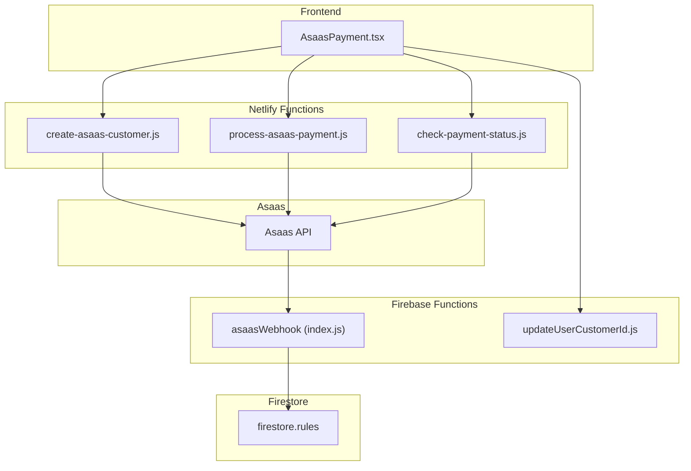
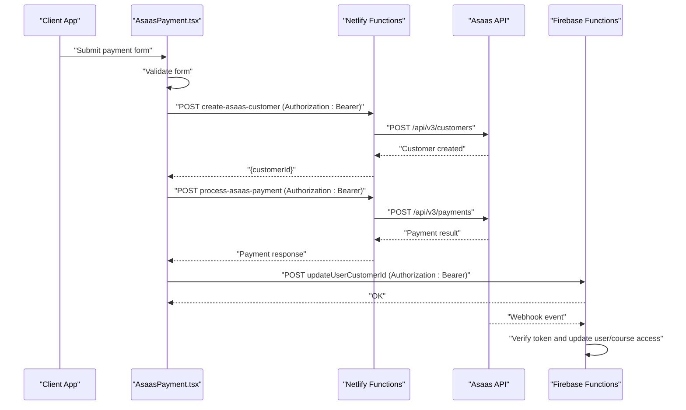
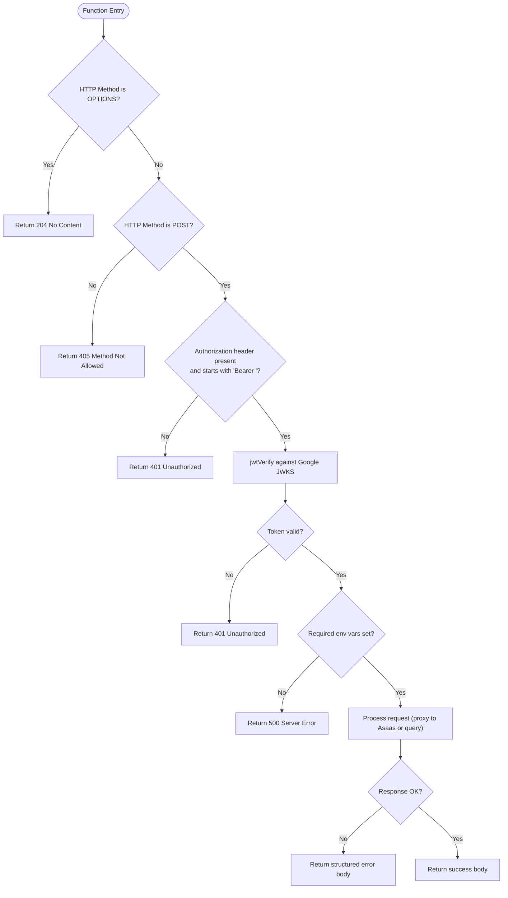
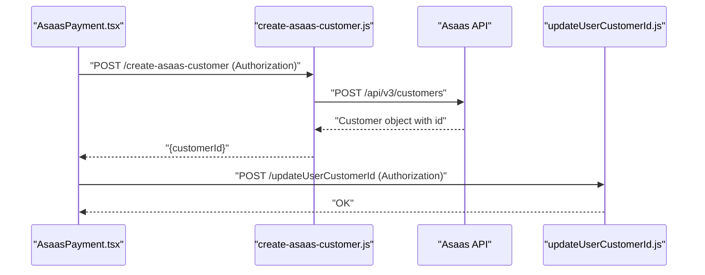
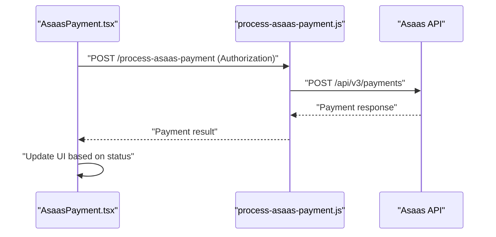
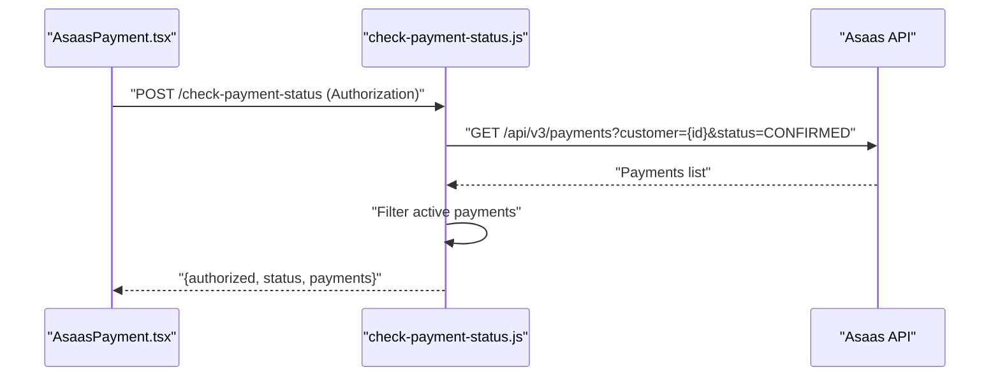
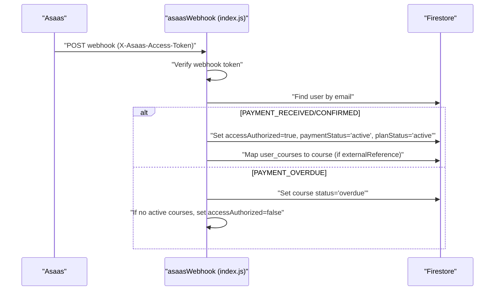
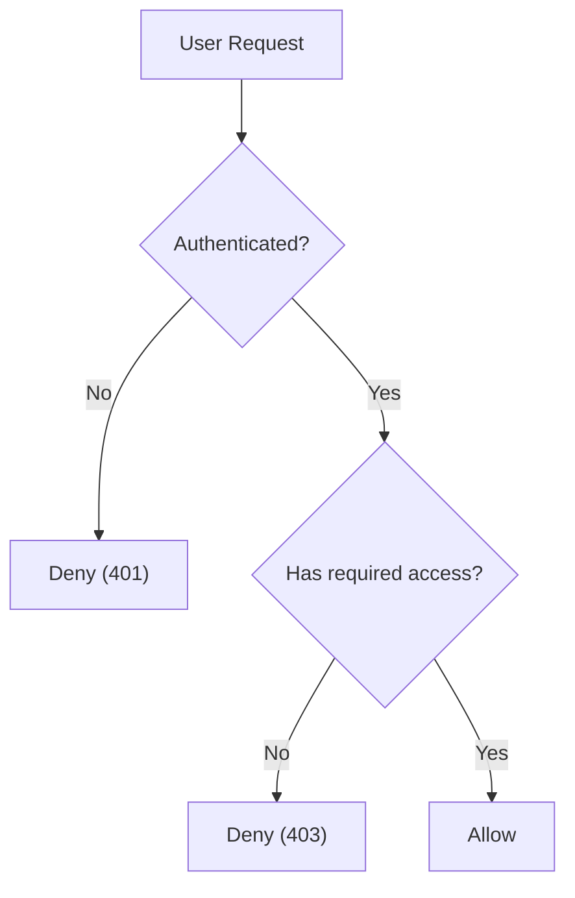
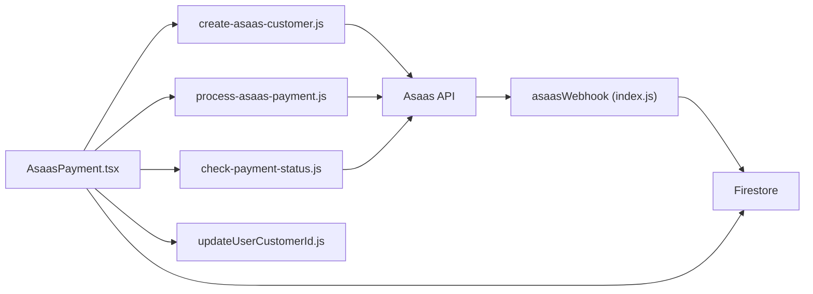

# Payment & Subscription Management

<cite>
**Referenced Files in This Document**
- [create-asaas-customer.js](file://netlify/functions/create-asaas-customer.js)
- [process-asaas-payment.js](file://netlify/functions/process-asaas-payment.js)
- [check-payment-status.js](file://netlify/functions/check-payment-status.js)
- [AsaasPayment.tsx](file://components/AsaasPayment.tsx)
- [index.js](file://functions/src/index.js)
- [updateUserCustomerId.js](file://functions/src/api/updateUserCustomerId.js)
- [netlify.toml](file://netlify.toml)
- [firestore.rules](file://firestore.rules)
- [asaas.ts](file://lib/db/asaas.ts)
- [FinancialReports.tsx](file://components/FinancialReports.tsx)
</cite>

## Table of Contents
1. [Introduction](#introduction)
2. [Project Structure](#project-structure)
3. [Core Components](#core-components)
4. [Architecture Overview](#architecture-overview)
5. [Detailed Component Analysis](#detailed-component-analysis)
6. [Dependency Analysis](#dependency-analysis)
7. [Performance Considerations](#performance-considerations)
8. [Troubleshooting Guide](#troubleshooting-guide)
9. [Conclusion](#conclusion)
10. [Appendices](#appendices)

## Introduction
This document provides comprehensive API documentation for the payment and subscription management system integrating Asaas. It covers customer creation, payment processing, subscription lifecycle, webhook handling, access control, financial reporting, and refund processing. It also documents the Netlify Functions implementation, error handling, retry strategies, and security considerations for handling payment data.

## Project Structure
The payment system spans three layers:
- Frontend React component orchestrating payment UI and initiating serverless calls
- Netlify Functions implementing serverless payment APIs with Firebase JWT verification
- Firebase Cloud Functions handling Asaas webhooks and user/course access synchronization

**Diagram sources**
- [AsaasPayment.tsx](file://components/AsaasPayment.tsx#L86-L244)
- [create-asaas-customer.js](file://netlify/functions/create-asaas-customer.js#L20-L146)
- [process-asaas-payment.js](file://netlify/functions/process-asaas-payment.js#L20-L121)
- [check-payment-status.js](file://netlify/functions/check-payment-status.js#L20-L152)
- [index.js](file://functions/src/index.js#L144-L339)
- [updateUserCustomerId.js](file://functions/src/api/updateUserCustomerId.js#L12-L74)
- [firestore.rules](file://firestore.rules#L1-L90)

**Section sources**
- [AsaasPayment.tsx](file://components/AsaasPayment.tsx#L1-L491)
- [create-asaas-customer.js](file://netlify/functions/create-asaas-customer.js#L1-L146)
- [process-asaas-payment.js](file://netlify/functions/process-asaas-payment.js#L1-L121)
- [check-payment-status.js](file://netlify/functions/check-payment-status.js#L1-L152)
- [index.js](file://functions/src/index.js#L1-L387)
- [updateUserCustomerId.js](file://functions/src/api/updateUserCustomerId.js#L1-L74)
- [netlify.toml](file://netlify.toml#L1-L65)
- [firestore.rules](file://firestore.rules#L1-L90)

## Core Components
- AsaasPayment UI component: Collects customer and card data, creates Asaas customer, stores customer ID, and processes payments.
- Netlify Functions: Secure serverless endpoints for customer creation, payment processing, and payment status checks.
- Firebase Functions webhook: Receives Asaas events, updates user access and course mappings.
- Access control: Firestore security rules enforce authenticated access and ownership.
- Financial reporting: UI component aggregates subscription and revenue insights.

**Section sources**
- [AsaasPayment.tsx](file://components/AsaasPayment.tsx#L12-L244)
- [create-asaas-customer.js](file://netlify/functions/create-asaas-customer.js#L20-L146)
- [process-asaas-payment.js](file://netlify/functions/process-asaas-payment.js#L20-L121)
- [check-payment-status.js](file://netlify/functions/check-payment-status.js#L20-L152)
- [index.js](file://functions/src/index.js#L144-L339)
- [firestore.rules](file://firestore.rules#L1-L90)
- [FinancialReports.tsx](file://components/FinancialReports.tsx#L190-L534)

## Architecture Overview
The system follows a secure, serverless-first architecture:
- Frontend authenticates via Firebase and calls Netlify Functions with Bearer tokens.
- Netlify Functions validate tokens against Google JWKS and proxy requests to Asaas.
- Asaas webhook triggers Firebase Functions to update Firestore user and course access.
- Frontend can query Netlify Functions for payment status to gate access.

**Diagram sources**
- [AsaasPayment.tsx](file://components/AsaasPayment.tsx#L86-L244)
- [create-asaas-customer.js](file://netlify/functions/create-asaas-customer.js#L64-L133)
- [process-asaas-payment.js](file://netlify/functions/process-asaas-payment.js#L64-L107)
- [index.js](file://functions/src/index.js#L144-L339)
- [updateUserCustomerId.js](file://functions/src/api/updateUserCustomerId.js#L28-L70)

## Detailed Component Analysis

### Netlify Functions: Authentication and Validation
All Netlify Functions implement:
- Preflight handling (OPTIONS)
- HTTP method enforcement (POST only)
- Authorization header validation (Bearer token)
- Firebase JWT verification against Google JWKS
- Environment variable checks for Asaas credentials
- Robust error responses with structured bodies

**Diagram sources**
- [create-asaas-customer.js](file://netlify/functions/create-asaas-customer.js#L20-L86)
- [process-asaas-payment.js](file://netlify/functions/process-asaas-payment.js#L20-L77)
- [check-payment-status.js](file://netlify/functions/check-payment-status.js#L20-L86)

**Section sources**
- [create-asaas-customer.js](file://netlify/functions/create-asaas-customer.js#L6-L62)
- [process-asaas-payment.js](file://netlify/functions/process-asaas-payment.js#L6-L62)
- [check-payment-status.js](file://netlify/functions/check-payment-status.js#L6-L62)

### Customer Creation Workflow
- Frontend collects personal and contact details.
- Calls Netlify Function to create Asaas customer.
- Stores returned customer ID in user profile via Firebase Function.

**Diagram sources**
- [AsaasPayment.tsx](file://components/AsaasPayment.tsx#L86-L225)
- [create-asaas-customer.js](file://netlify/functions/create-asaas-customer.js#L64-L133)
- [updateUserCustomerId.js](file://functions/src/api/updateUserCustomerId.js#L28-L70)

**Section sources**
- [AsaasPayment.tsx](file://components/AsaasPayment.tsx#L86-L225)
- [create-asaas-customer.js](file://netlify/functions/create-asaas-customer.js#L64-L133)
- [updateUserCustomerId.js](file://functions/src/api/updateUserCustomerId.js#L28-L70)

### Payment Processing Workflow
- Frontend prepares payment payload (customer, billing type, amount, due date, card details).
- Calls Netlify Function to process payment via Asaas.
- Handles payment confirmation and transitions UI state accordingly.

**Diagram sources**
- [AsaasPayment.tsx](file://components/AsaasPayment.tsx#L130-L181)
- [process-asaas-payment.js](file://netlify/functions/process-asaas-payment.js#L64-L107)

**Section sources**
- [AsaasPayment.tsx](file://components/AsaasPayment.tsx#L130-L181)
- [process-asaas-payment.js](file://netlify/functions/process-asaas-payment.js#L64-L107)

### Payment Status Checking
- Frontend queries Netlify Function to check if a customer has an active, confirmed payment within due date.
- Returns authorization flag and normalized status ("active", "overdue", "no_payment").

**Diagram sources**
- [AsaasPayment.tsx](file://components/AsaasPayment.tsx#L1-L491)
- [check-payment-status.js](file://netlify/functions/check-payment-status.js#L88-L138)
- [asaas.ts](file://lib/db/asaas.ts#L6-L32)

**Section sources**
- [check-payment-status.js](file://netlify/functions/check-payment-status.js#L64-L138)
- [asaas.ts](file://lib/db/asaas.ts#L6-L32)

### Asaas Webhook Handling
- Firebase Function validates webhook token and processes events:
  - PAYMENT_RECEIVED/PAYMENT_CONFIRMED: Activate access, set plan status, map course access
  - PAYMENT_OVERDUE: Deactivate course access; if no active courses remain, deactivate global access
- Supports multi-product mapping via externalReference parsing

**Diagram sources**
- [index.js](file://functions/src/index.js#L144-L339)

**Section sources**
- [index.js](file://functions/src/index.js#L144-L339)

### Access Control Based on Payment Status
- Firestore rules enforce authenticated access and ownership.
- Admins can manage users and course access.
- Payment status and plan status fields drive access decisions in UI and backend.

**Diagram sources**
- [firestore.rules](file://firestore.rules#L1-L90)

**Section sources**
- [firestore.rules](file://firestore.rules#L1-L90)

### Financial Reporting and Subscription Management
- FinancialReports UI displays student subscriptions, computed statuses, and plan details.
- Supports filtering and manual plan updates for administrative oversight.

**Section sources**
- [FinancialReports.tsx](file://components/FinancialReports.tsx#L190-L534)

## Dependency Analysis
- Frontend depends on:
  - Netlify Functions for payment operations
  - Firebase Functions for customer ID updates
  - Firestore for user/course access state
- Netlify Functions depend on:
  - Asaas API for customer/payment operations
  - Firebase Admin SDK for JWT verification (via Google JWKS)
- Firebase Functions depend on:
  - Asaas webhook events
  - Firestore for user/course access updates

**Diagram sources**
- [AsaasPayment.tsx](file://components/AsaasPayment.tsx#L86-L244)
- [create-asaas-customer.js](file://netlify/functions/create-asaas-customer.js#L101-L108)
- [process-asaas-payment.js](file://netlify/functions/process-asaas-payment.js#L80-L87)
- [check-payment-status.js](file://netlify/functions/check-payment-status.js#L89-L98)
- [index.js](file://functions/src/index.js#L144-L339)
- [updateUserCustomerId.js](file://functions/src/api/updateUserCustomerId.js#L12-L74)

**Section sources**
- [AsaasPayment.tsx](file://components/AsaasPayment.tsx#L86-L244)
- [create-asaas-customer.js](file://netlify/functions/create-asaas-customer.js#L101-L108)
- [process-asaas-payment.js](file://netlify/functions/process-asaas-payment.js#L80-L87)
- [check-payment-status.js](file://netlify/functions/check-payment-status.js#L89-L98)
- [index.js](file://functions/src/index.js#L144-L339)
- [updateUserCustomerId.js](file://functions/src/api/updateUserCustomerId.js#L12-L74)

## Performance Considerations
- Minimize synchronous network calls in UI; batch operations where possible.
- Use Netlify Functions to offload heavy processing and avoid browser-side payment tokenization.
- Cache payment status judiciously; rely on Asaas webhook-driven updates for consistency.
- Monitor Asaas API latency and implement exponential backoff for retries if extending the system.

## Troubleshooting Guide
Common issues and resolutions:
- Missing or invalid Bearer token: Ensure frontend obtains and attaches a valid Firebase ID token.
- Asaas configuration errors: Verify environment variables for access token and base URL.
- Webhook token mismatch: Confirm webhook token configuration and header casing.
- Payment status discrepancies: Use the status check endpoint to reconcile state.

**Section sources**
- [create-asaas-customer.js](file://netlify/functions/create-asaas-customer.js#L43-L62)
- [process-asaas-payment.js](file://netlify/functions/process-asaas-payment.js#L43-L62)
- [check-payment-status.js](file://netlify/functions/check-payment-status.js#L43-L62)
- [index.js](file://functions/src/index.js#L160-L179)

## Conclusion
The system provides a secure, serverless payment pipeline integrated with Asaas and Firebase. It enforces strong authentication, automates access control via webhooks, and exposes robust APIs for customer creation, payment processing, and status checking. Administrators benefit from financial reporting and course access controls, while the architecture supports scalability and maintainability.

## Appendices

### API Endpoints Summary

- POST /.netlify/functions/create-asaas-customer
  - Purpose: Create an Asaas customer
  - Headers: Authorization: Bearer <Firebase ID Token>, Content-Type: application/json
  - Body: { name, email, cpfCnpj, phone?, mobilePhone?, address?, addressNumber?, province?, postalCode? }
  - Response: { success: boolean, customerId: string, customer: object }
  - Errors: 400 (validation), 401 (auth), 500 (server/config), Asaas error mapping

- POST /.netlify/functions/process-asaas-payment
  - Purpose: Process a payment via Asaas
  - Headers: Authorization: Bearer <Firebase ID Token>, Content-Type: application/json
  - Body: { customer, billingType, value, dueDate, description, externalReference, creditCard, creditCardHolderInfo, installmentCount }
  - Response: Asaas payment object
  - Errors: 400 (validation), 401 (auth), 500 (server/config), Asaas error mapping

- POST /.netlify/functions/check-payment-status
  - Purpose: Check if a customer has an active, confirmed payment within due date
  - Headers: Authorization: Bearer <Firebase ID Token>, Content-Type: application/json
  - Body: { customerId: string }
  - Response: { authorized: boolean, status: "active"|"overdue"|"no_payment", payments: array }
  - Errors: 400 (validation), 401 (auth), 500 (server/config), Asaas error mapping

- POST /updateUserCustomerId (Firebase Function)
  - Purpose: Persist Asaas customer ID to user document
  - Headers: Authorization: Bearer <Firebase ID Token>, Content-Type: application/json
  - Body: { userId: string, customerId: string }
  - Response: "Customer ID updated successfully"
  - Errors: 400 (missing params), 401 (auth), 403 (forbidden), 500 (server)

- Asaas Webhook (Firebase Function)
  - Purpose: Update user access and course mappings based on payment events
  - Headers: X-Asaas-Access-Token (configured)
  - Events handled: PAYMENT_RECEIVED, PAYMENT_CONFIRMED, PAYMENT_OVERDUE
  - Response: "Payment processed successfully" or "Payment overdue processed"

**Section sources**
- [create-asaas-customer.js](file://netlify/functions/create-asaas-customer.js#L64-L133)
- [process-asaas-payment.js](file://netlify/functions/process-asaas-payment.js#L64-L107)
- [check-payment-status.js](file://netlify/functions/check-payment-status.js#L64-L138)
- [updateUserCustomerId.js](file://functions/src/api/updateUserCustomerId.js#L28-L70)
- [index.js](file://functions/src/index.js#L144-L339)

### Security Considerations
- Authentication: All endpoints require a valid Firebase ID token verified against Google JWKS.
- Transport: HTTPS enforced via Netlify headers and Asaas connections.
- Secrets: Asaas access token and webhook token stored in environment/configuration.
- Least privilege: Firebase Functions restrict admin-only operations; Firestore rules enforce ownership and roles.

**Section sources**
- [netlify.toml](file://netlify.toml#L39-L47)
- [create-asaas-customer.js](file://netlify/functions/create-asaas-customer.js#L6-L18)
- [process-asaas-payment.js](file://netlify/functions/process-asaas-payment.js#L6-L18)
- [check-payment-status.js](file://netlify/functions/check-payment-status.js#L6-L18)
- [index.js](file://functions/src/index.js#L160-L179)
- [firestore.rules](file://firestore.rules#L1-L90)

### Retry Mechanisms
- Idempotency: External references and customer IDs help prevent duplicate operations.
- Webhook resilience: Event-driven updates; re-send failed webhooks from Asaas if needed.
- Client-side: UI can poll status via the status check endpoint after transient failures.

**Section sources**
- [AsaasPayment.tsx](file://components/AsaasPayment.tsx#L183-L244)
- [check-payment-status.js](file://netlify/functions/check-payment-status.js#L88-L138)
- [index.js](file://functions/src/index.js#L144-L339)

### Refund Processing
- Current implementation focuses on payment confirmation and overdue handling.
- To support refunds, extend the webhook handler to process refund-related events and adjust user/course access accordingly.

**Section sources**
- [index.js](file://functions/src/index.js#L188-L267)