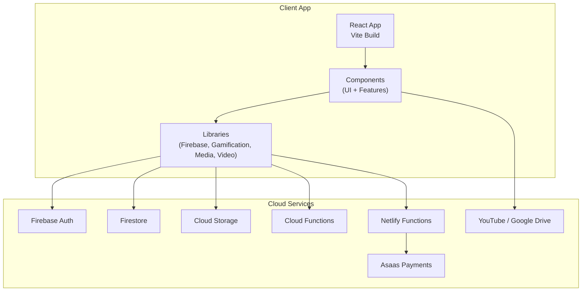
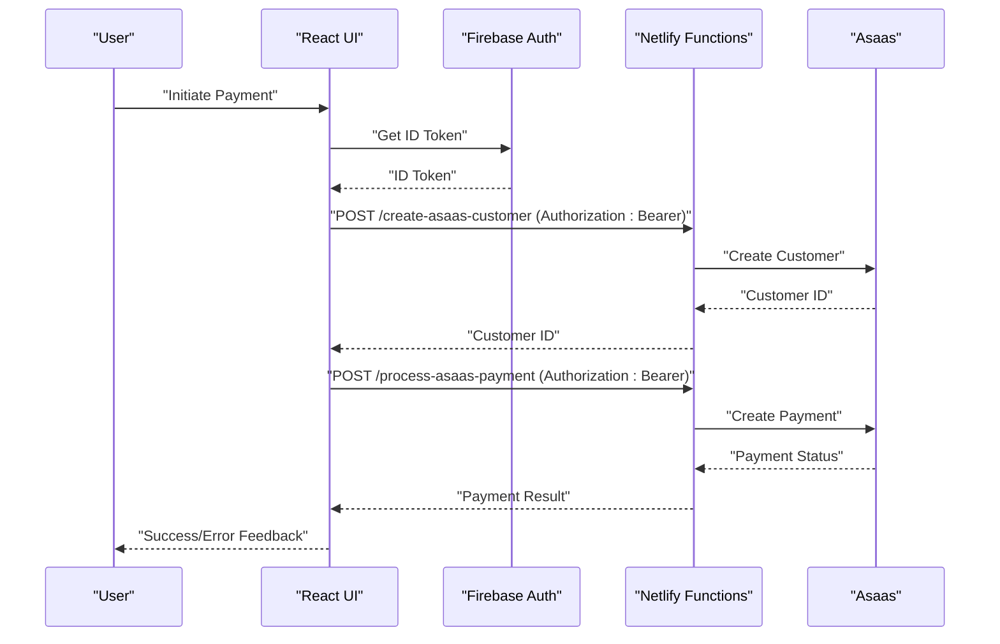
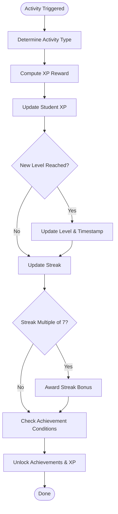
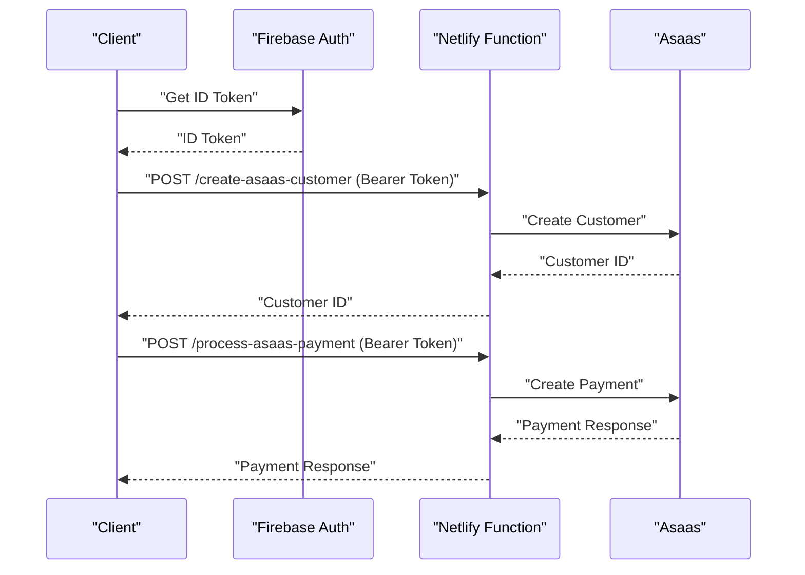
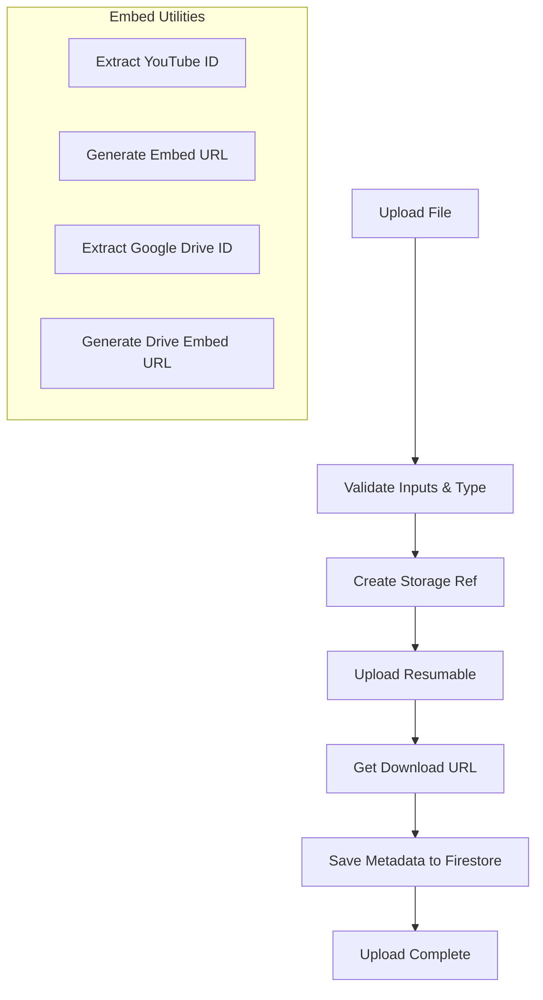
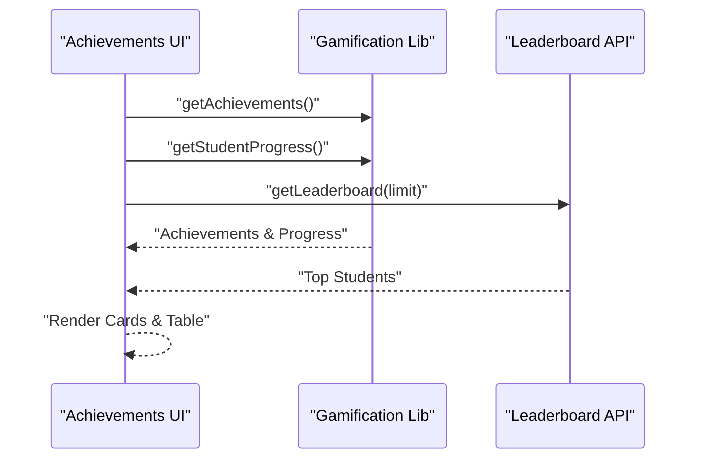
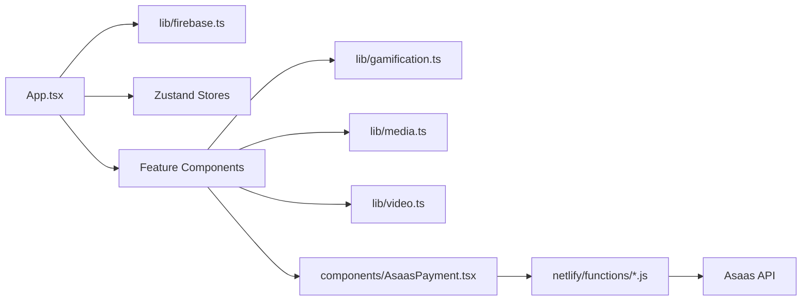

# Project Overview

<cite>
**Referenced Files in This Document**
- [README.md](file://README.md)
- [package.json](file://package.json)
- [App.tsx](file://App.tsx)
- [lib/firebase.ts](file://lib/firebase.ts)
- [lib/gamification.ts](file://lib/gamification.ts)
- [components/StudentDashboard.tsx](file://components/StudentDashboard.tsx)
- [components/CourseList.tsx](file://components/CourseList.tsx)
- [components/Achievements.tsx](file://components/Achievements.tsx)
- [components/Leaderboard.tsx](file://components/Leaderboard.tsx)
- [components/AsaasPayment.tsx](file://components/AsaasPayment.tsx)
- [netlify/functions/create-asaas-customer.js](file://netlify/functions/create-asaas-customer.js)
- [netlify/functions/process-asaas-payment.js](file://netlify/functions/process-asaas-payment.js)
- [lib/media.ts](file://lib/media.ts)
- [lib/video.ts](file://lib/video.ts)
- [types.ts](file://types.ts)
</cite>

## Table of Contents
1. [Introduction](#introduction)
2. [Project Structure](#project-structure)
3. [Core Components](#core-components)
4. [Architecture Overview](#architecture-overview)
5. [Detailed Component Analysis](#detailed-component-analysis)
6. [Dependency Analysis](#dependency-analysis)
7. [Performance Considerations](#performance-considerations)
8. [Troubleshooting Guide](#troubleshooting-guide)
9. [Conclusion](#conclusion)

## Introduction
Fluentoria is an immersive language learning platform designed around a gamified Learning Management System (LMS). Its core value proposition centers on transforming language acquisition into a sustainable habit through XP-based progression, streak-based motivation, and social recognition. The platform targets language learners seeking a modern, engaging experience and educators/administrators who want to monitor progress and manage content efficiently.

Key differentiators from traditional language learning:
- Habit-first pedagogy: Fluency as a habit, not memorization.
- Integrated gamification: XP, levels, streaks, and achievements drive consistent engagement.
- Real-time progress tracking: Learners and admins gain immediate insights.
- Seamless media integration: YouTube and Google Drive content embedding, plus learner media submissions.
- Secure, scalable payments via Asaas with Firebase authentication and serverless functions.

## Project Structure
The project is a React-based single-page application bundled with Vite, styled with Tailwind CSS, and powered by Firebase for identity, real-time persistence, and cloud storage. Serverless functions on Netlify proxy secure payment operations to Asaas. Core folders:
- components/: UI and feature components (dashboard, courses, achievements, leaderboard, payments, etc.)
- lib/: shared libraries for Firebase, gamification, media, video utilities, and stores
- netlify/functions/: serverless functions for Asaas customer and payment processing
- hooks/: reusable hooks for catalog data and filters
- public/: static assets, PWA manifests, and service worker
- test/: unit tests for stores and database configuration

**Diagram sources**
- [App.tsx](file://App.tsx#L1-L449)
- [lib/firebase.ts](file://lib/firebase.ts#L1-L25)
- [lib/gamification.ts](file://lib/gamification.ts#L1-L349)
- [lib/media.ts](file://lib/media.ts#L1-L369)
- [lib/video.ts](file://lib/video.ts#L1-L149)
- [netlify/functions/create-asaas-customer.js](file://netlify/functions/create-asaas-customer.js#L1-L146)
- [netlify/functions/process-asaas-payment.js](file://netlify/functions/process-asaas-payment.js#L1-L121)

**Section sources**
- [README.md](file://README.md#L1-L41)
- [package.json](file://package.json#L1-L44)
- [App.tsx](file://App.tsx#L1-L449)

## Core Components
- Authentication and routing: Centralized auth state management, role-based navigation, and screen transitions.
- Dashboard: Habit-centric overview with XP, level, streak, and quick access to achievements and leaderboard.
- Course Catalog: Curated lessons with progress overlays, YouTube thumbnails, and embedded content.
- Gamification: XP calculation, leveling, streak bonuses, achievement conditions, and global leaderboard.
- Payments: Secure checkout flow integrating Asaas customer creation and payment processing via Netlify functions.
- Media and Embedding: Uploads, storage, and unified embed utilities for YouTube and Google Drive.

Practical user workflows:
- New user onboarding: Authenticate → wait for admin authorization → access dashboard and courses.
- Daily learning: Open courses → watch videos → complete lessons → earn XP and streaks → unlock achievements.
- Social motivation: Check leaderboard → compare progress → strive for podium positions.
- Educator/admin: Manage catalog, review reports, approve enrollments, and monitor financials.

**Section sources**
- [App.tsx](file://App.tsx#L65-L108)
- [components/StudentDashboard.tsx](file://components/StudentDashboard.tsx#L16-L43)
- [components/CourseList.tsx](file://components/CourseList.tsx#L17-L32)
- [lib/gamification.ts](file://lib/gamification.ts#L10-L40)
- [components/Achievements.tsx](file://components/Achievements.tsx#L10-L32)
- [components/Leaderboard.tsx](file://components/Leaderboard.tsx#L11-L24)
- [components/AsaasPayment.tsx](file://components/AsaasPayment.tsx#L12-L244)
- [netlify/functions/create-asaas-customer.js](file://netlify/functions/create-asaas-customer.js#L20-L145)
- [netlify/functions/process-asaas-payment.js](file://netlify/functions/process-asaas-payment.js#L20-L120)
- [lib/media.ts](file://lib/media.ts#L8-L117)
- [lib/video.ts](file://lib/video.ts#L12-L107)

## Architecture Overview
Fluentoria follows a client-cloud hybrid architecture:
- Client-side: React SPA with lazy-loaded routes, Zustand stores, and Lucide icons.
- Identity and data: Firebase Auth for identity, Firestore for structured data, Cloud Storage for media.
- Serverless integrations: Netlify functions validate tokens and proxy requests to Asaas for payments.
- Media ecosystem: Unified embed utilities for YouTube and Google Drive; learner-submitted media stored and indexed.

**Diagram sources**
- [components/AsaasPayment.tsx](file://components/AsaasPayment.tsx#L86-L181)
- [netlify/functions/create-asaas-customer.js](file://netlify/functions/create-asaas-customer.js#L64-L133)
- [netlify/functions/process-asaas-payment.js](file://netlify/functions/process-asaas-payment.js#L64-L107)

## Detailed Component Analysis

### Gamification System
The gamification module defines XP rewards, leveling, streak bonuses, and achievement checks. It exposes APIs to:
- Calculate level and XP progress
- Update streaks and award periodic bonuses
- Unlock achievements based on conditions
- Fetch leaderboard and default achievements

**Diagram sources**
- [lib/gamification.ts](file://lib/gamification.ts#L10-L161)
- [lib/gamification.ts](file://lib/gamification.ts#L232-L275)

**Section sources**
- [lib/gamification.ts](file://lib/gamification.ts#L8-L40)
- [lib/gamification.ts](file://lib/gamification.ts#L100-L161)
- [lib/gamification.ts](file://lib/gamification.ts#L232-L275)
- [types.ts](file://types.ts#L95-L125)

### Payment Flow with Asaas
The payment flow integrates Firebase Auth for token verification and Netlify functions to securely proxy requests to Asaas:
- Create customer: Validates required fields, verifies Firebase ID token, and creates a customer in Asaas.
- Process payment: Receives sanitized payment data, proxies to Asaas, and returns status.

**Diagram sources**
- [components/AsaasPayment.tsx](file://components/AsaasPayment.tsx#L86-L181)
- [netlify/functions/create-asaas-customer.js](file://netlify/functions/create-asaas-customer.js#L6-L18)
- [netlify/functions/create-asaas-customer.js](file://netlify/functions/create-asaas-customer.js#L64-L133)
- [netlify/functions/process-asaas-payment.js](file://netlify/functions/process-asaas-payment.js#L6-L18)
- [netlify/functions/process-asaas-payment.js](file://netlify/functions/process-asaas-payment.js#L64-L107)

**Section sources**
- [components/AsaasPayment.tsx](file://components/AsaasPayment.tsx#L12-L244)
- [netlify/functions/create-asaas-customer.js](file://netlify/functions/create-asaas-customer.js#L20-L145)
- [netlify/functions/process-asaas-payment.js](file://netlify/functions/process-asaas-payment.js#L20-L120)

### Media and Embed Utilities
Media utilities support learner uploads, course covers, and grouped retrieval. Video utilities unify YouTube and Google Drive embedding, extracting IDs and generating embed URLs.

**Diagram sources**
- [lib/media.ts](file://lib/media.ts#L8-L117)
- [lib/media.ts](file://lib/media.ts#L163-L236)
- [lib/video.ts](file://lib/video.ts#L12-L107)

**Section sources**
- [lib/media.ts](file://lib/media.ts#L1-L369)
- [lib/video.ts](file://lib/video.ts#L1-L149)

### Achievement and Leaderboard Views
Achievement and leaderboard components present progress bars, unlockable criteria, and global rankings. They fetch data concurrently and render podiums and tables with rank badges and icons.

**Diagram sources**
- [components/Achievements.tsx](file://components/Achievements.tsx#L20-L32)
- [components/Leaderboard.tsx](file://components/Leaderboard.tsx#L19-L24)
- [lib/gamification.ts](file://lib/gamification.ts#L198-L302)

**Section sources**
- [components/Achievements.tsx](file://components/Achievements.tsx#L10-L346)
- [components/Leaderboard.tsx](file://components/Leaderboard.tsx#L11-L208)
- [lib/gamification.ts](file://lib/gamification.ts#L198-L302)

### Conceptual Overview for Stakeholders
- Purpose: Make language learning feel like building a daily habit rather than cramming facts.
- Value: Higher retention, motivation, and community-driven progress.
- Target audience: Learners (students) and educators/admins (instructors, managers).
- Differentiation: Habit-based learning, integrated gamification, and seamless media/content delivery.

### Technical Highlights for Developers
- Technology stack: React 19, TypeScript, Vite, Tailwind CSS, Firebase (Auth, Firestore, Storage, Functions), Netlify Functions, Asaas.
- Architecture philosophy: Decoupled UI, centralized auth/state, modular libs, and secure serverless integrations.
- Integration points: Firebase for identity/data, Netlify/Asaas for payments, YouTube/Drive for media.

## Dependency Analysis
High-level dependencies:
- React app depends on Firebase SDKs and local libraries.
- Payment components depend on Netlify functions and Asaas.
- Media components depend on Firebase Storage and Firestore.
- Gamification depends on Firestore collections for progress and achievements.

**Diagram sources**
- [App.tsx](file://App.tsx#L1-L449)
- [lib/firebase.ts](file://lib/firebase.ts#L1-L25)
- [lib/gamification.ts](file://lib/gamification.ts#L1-L349)
- [lib/media.ts](file://lib/media.ts#L1-L369)
- [lib/video.ts](file://lib/video.ts#L1-L149)
- [components/AsaasPayment.tsx](file://components/AsaasPayment.tsx#L1-L491)
- [netlify/functions/create-asaas-customer.js](file://netlify/functions/create-asaas-customer.js#L1-L146)
- [netlify/functions/process-asaas-payment.js](file://netlify/functions/process-asaas-payment.js#L1-L121)

**Section sources**
- [package.json](file://package.json#L13-L24)
- [lib/firebase.ts](file://lib/firebase.ts#L1-L25)
- [lib/gamification.ts](file://lib/gamification.ts#L1-L349)
- [lib/media.ts](file://lib/media.ts#L1-L369)
- [lib/video.ts](file://lib/video.ts#L1-L149)
- [components/AsaasPayment.tsx](file://components/AsaasPayment.tsx#L1-L491)
- [netlify/functions/create-asaas-customer.js](file://netlify/functions/create-asaas-customer.js#L1-L146)
- [netlify/functions/process-asaas-payment.js](file://netlify/functions/process-asaas-payment.js#L1-L121)

## Performance Considerations
- Lazy-load routes to reduce initial bundle size.
- Debounce or throttle progress reloads to avoid excessive Firestore reads.
- Use efficient queries with ordering and filtering for leaderboard and media lists.
- Optimize image/thumbnail sizes and leverage CDN-backed storage.
- Minimize re-renders by isolating state and using memoization where appropriate.

## Troubleshooting Guide
Common issues and resolutions:
- Authentication state not persisting: Verify Firebase initialization and auth listeners are active.
- Payment errors: Confirm Asaas access token and API URL environment variables are set; check function logs for token verification failures.
- Media upload failures: Ensure CORS configuration for Firebase Storage and storage rules allow authenticated writes.
- Achievement unlock not triggering: Confirm achievement conditions and thresholds align with student progress.

**Section sources**
- [lib/firebase.ts](file://lib/firebase.ts#L16-L25)
- [netlify/functions/create-asaas-customer.js](file://netlify/functions/create-asaas-customer.js#L76-L86)
- [netlify/functions/process-asaas-payment.js](file://netlify/functions/process-asaas-payment.js#L67-L77)
- [lib/media.ts](file://lib/media.ts#L54-L76)
- [lib/gamification.ts](file://lib/gamification.ts#L232-L275)

## Conclusion
Fluentoria reimagines language education by merging habit formation, gamification, and modern media technologies. Its architecture balances developer productivity (React + Vite) with robust cloud services (Firebase + Netlify + Asaas) to deliver a scalable, motivating, and insightful learning experience. The platform’s emphasis on XP, streaks, achievements, and leaderboards encourages consistent practice, while integrated payments and media tools streamline content delivery and monetization.