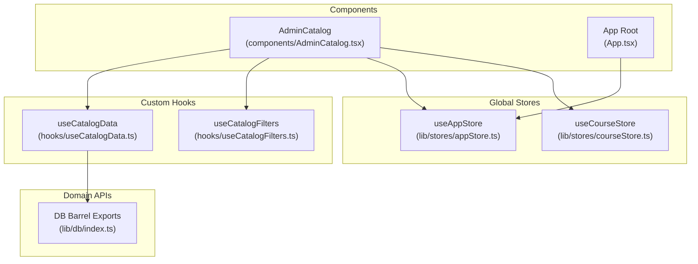
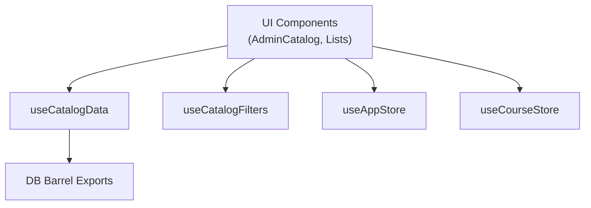
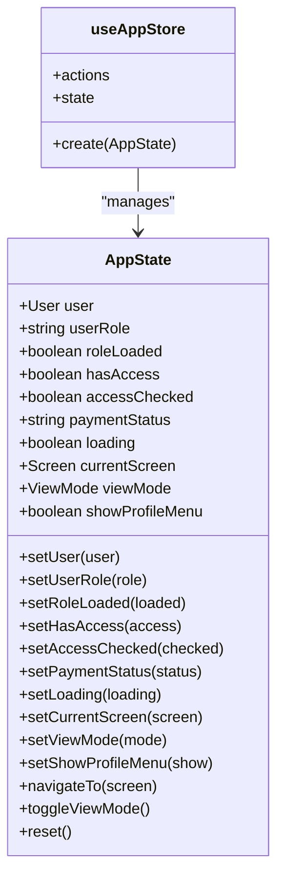
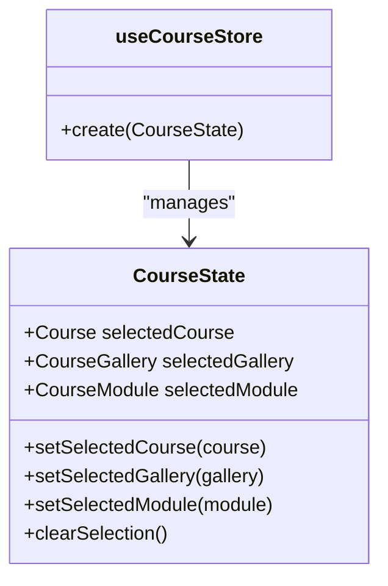
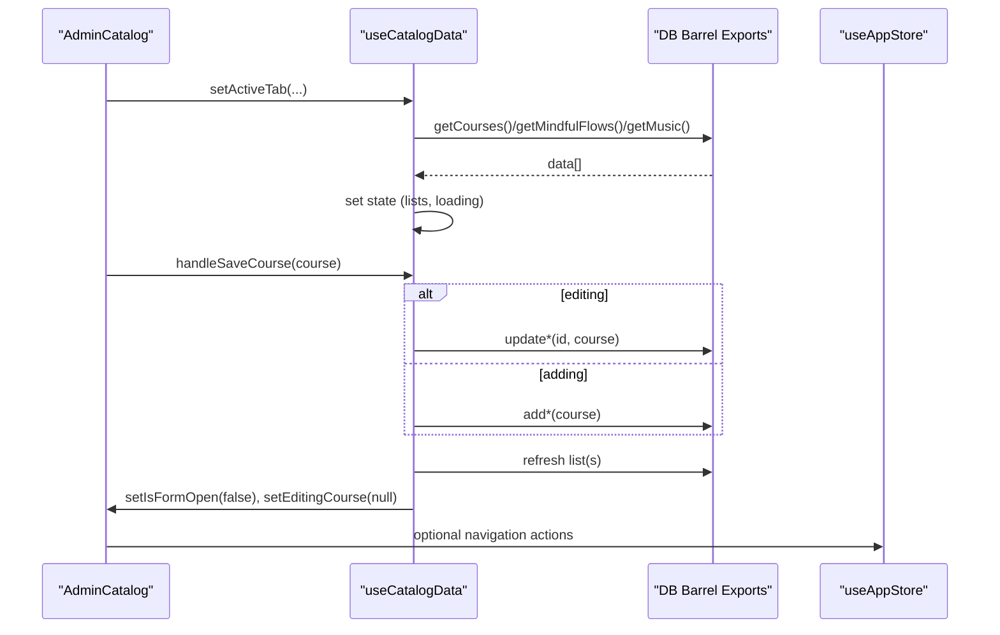
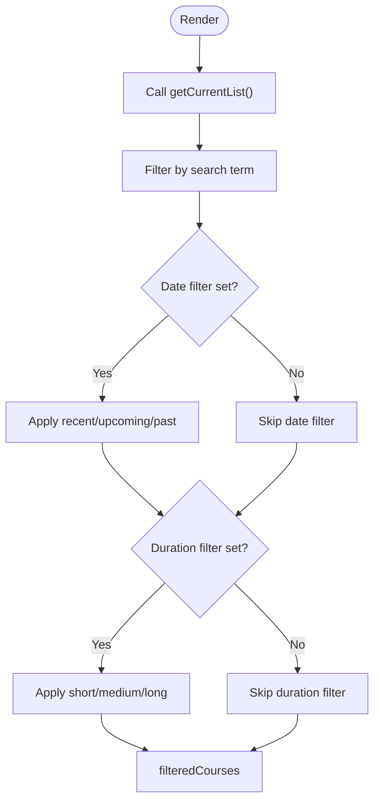
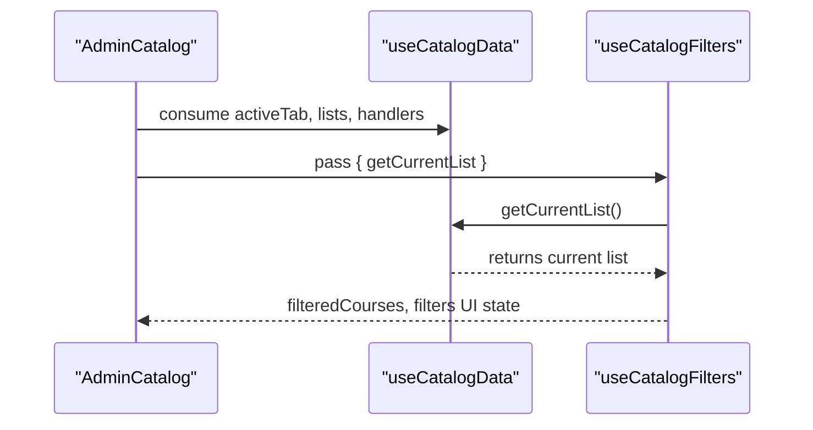
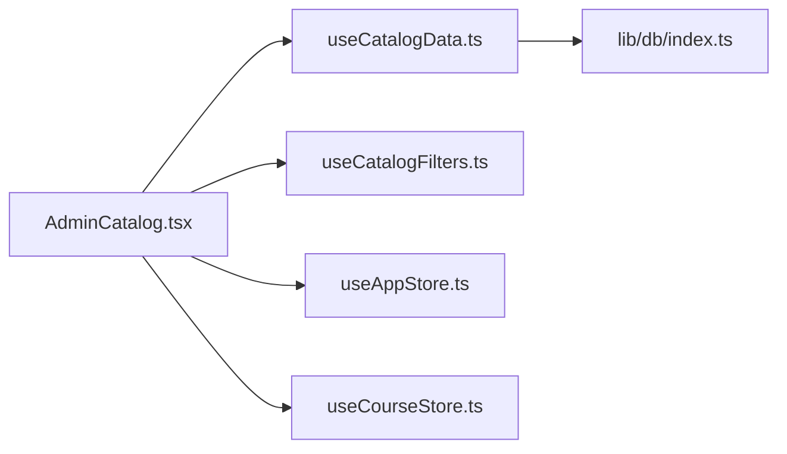

# State Management Architecture

<cite>
**Referenced Files in This Document**
- [useCatalogData.ts](file://hooks/useCatalogData.ts)
- [useCatalogFilters.ts](file://hooks/useCatalogFilters.ts)
- [appStore.ts](file://lib/stores/appStore.ts)
- [courseStore.ts](file://lib/stores/courseStore.ts)
- [index.ts](file://lib/db/index.ts)
- [AdminCatalog.tsx](file://components/AdminCatalog.tsx)
- [App.tsx](file://App.tsx)
- [types.ts](file://types.ts)
- [firebase.ts](file://lib/firebase.ts)
- [appStore.test.ts](file://test/stores/appStore.test.ts)
</cite>

## Table of Contents
1. [Introduction](#introduction)
2. [Project Structure](#project-structure)
3. [Core Components](#core-components)
4. [Architecture Overview](#architecture-overview)
5. [Detailed Component Analysis](#detailed-component-analysis)
6. [Dependency Analysis](#dependency-analysis)
7. [Performance Considerations](#performance-considerations)
8. [Troubleshooting Guide](#troubleshooting-guide)
9. [Conclusion](#conclusion)
10. [Appendices](#appendices)

## Introduction
This document explains the state management architecture built with Zustand in the project. It covers global state stores, custom hooks for data fetching and filtering, component state coordination, update patterns, performance optimizations, memory management, persistence, debugging, and best practices for organizing stores in large-scale applications.

## Project Structure
The state management spans three layers:
- Global stores: Zustand-backed stores for application-wide concerns.
- Custom hooks: Domain-specific hooks coordinating data fetching, editing, and filtering.
- Components: UI components consuming stores and hooks to render and mutate state.

**Diagram sources**
- [appStore.ts](file://lib/stores/appStore.ts#L1-L82)
- [courseStore.ts](file://lib/stores/courseStore.ts#L1-L27)
- [useCatalogData.ts](file://hooks/useCatalogData.ts#L1-L157)
- [useCatalogFilters.ts](file://hooks/useCatalogFilters.ts#L1-L86)
- [index.ts](file://lib/db/index.ts#L1-L38)
- [AdminCatalog.tsx](file://components/AdminCatalog.tsx#L1-L120)
- [App.tsx](file://App.tsx#L1-L120)

**Section sources**
- [appStore.ts](file://lib/stores/appStore.ts#L1-L82)
- [courseStore.ts](file://lib/stores/courseStore.ts#L1-L27)
- [useCatalogData.ts](file://hooks/useCatalogData.ts#L1-L157)
- [useCatalogFilters.ts](file://hooks/useCatalogFilters.ts#L1-L86)
- [index.ts](file://lib/db/index.ts#L1-L38)
- [AdminCatalog.tsx](file://components/AdminCatalog.tsx#L1-L120)
- [App.tsx](file://App.tsx#L1-L120)

## Core Components
- Global application store (useAppStore): Manages authentication state, navigation, UI flags, and view mode toggling.
- Course selection store (useCourseStore): Tracks currently selected course/gallery/module for deep-linking and navigation.
- Catalog data hook (useCatalogData): Centralizes CRUD operations and list management across courses, mindful flows, and music.
- Catalog filters hook (useCatalogFilters): Provides search and filter state with memoized computation.

Key responsibilities:
- useAppStore: Authentication, role checks, navigation, and UI flags.
- useCourseStore: Selection state for course-related views.
- useCatalogData: Data fetching, saving, deletion, and list composition per tab.
- useCatalogFilters: Filtering pipeline with search term, date range, and duration buckets.

**Section sources**
- [appStore.ts](file://lib/stores/appStore.ts#L5-L33)
- [courseStore.ts](file://lib/stores/courseStore.ts#L4-L12)
- [useCatalogData.ts](file://hooks/useCatalogData.ts#L18-L157)
- [useCatalogFilters.ts](file://hooks/useCatalogFilters.ts#L4-L86)

## Architecture Overview
The architecture follows a layered pattern:
- UI components depend on custom hooks for domain logic.
- Custom hooks depend on domain APIs for data access.
- Global stores manage cross-cutting concerns and shared UI state.
- Stores are independent and composable; components can consume multiple stores and hooks.

**Diagram sources**
- [AdminCatalog.tsx](file://components/AdminCatalog.tsx#L37-L71)
- [useCatalogData.ts](file://hooks/useCatalogData.ts#L20-L157)
- [useCatalogFilters.ts](file://hooks/useCatalogFilters.ts#L8-L86)
- [appStore.ts](file://lib/stores/appStore.ts#L48-L82)
- [courseStore.ts](file://lib/stores/courseStore.ts#L14-L27)
- [index.ts](file://lib/db/index.ts#L9-L38)

## Detailed Component Analysis

### Global Application Store (useAppStore)
Responsibilities:
- Authentication and role management.
- Navigation state and view mode switching.
- Loading and access flags.
- Utility actions: navigation, view mode toggle, and reset.

Patterns:
- Action creators update single fields via set.
- navigateTo updates currentScreen and scrolls to top.
- toggleViewMode enforces admin-only access and switches screens accordingly.
- reset restores initial state.

**Diagram sources**
- [appStore.ts](file://lib/stores/appStore.ts#L5-L33)
- [appStore.ts](file://lib/stores/appStore.ts#L35-L82)
- [types.ts](file://types.ts#L1-L26)

**Section sources**
- [appStore.ts](file://lib/stores/appStore.ts#L5-L33)
- [appStore.ts](file://lib/stores/appStore.ts#L35-L82)
- [types.ts](file://types.ts#L1-L26)

### Course Selection Store (useCourseStore)
Responsibilities:
- Track selected course, gallery, and module.
- Provide setters and a clear-selection action.

**Diagram sources**
- [courseStore.ts](file://lib/stores/courseStore.ts#L4-L12)
- [courseStore.ts](file://lib/stores/courseStore.ts#L14-L27)

**Section sources**
- [courseStore.ts](file://lib/stores/courseStore.ts#L4-L12)
- [courseStore.ts](file://lib/stores/courseStore.ts#L14-L27)

### Catalog Data Hook (useCatalogData)
Responsibilities:
- Manage active tab and lists for courses, mindful flows, and music.
- Fetch, save, edit, and delete items via domain APIs.
- Coordinate form open/view state and editing context.
- Provide getCurrentList for downstream filtering.

Patterns:
- useCallback for fetchers and handlers to avoid recreating functions on each render.
- useEffect triggers appropriate fetchers based on activeTab.
- Conditional save logic handles gallery merging for course entries.
- After mutations, lists are refreshed by re-fetching.

**Diagram sources**
- [useCatalogData.ts](file://hooks/useCatalogData.ts#L30-L126)
- [index.ts](file://lib/db/index.ts#L9-L16)
- [AdminCatalog.tsx](file://components/AdminCatalog.tsx#L37-L71)
- [appStore.ts](file://lib/stores/appStore.ts#L62-L65)

**Section sources**
- [useCatalogData.ts](file://hooks/useCatalogData.ts#L20-L157)
- [index.ts](file://lib/db/index.ts#L9-L16)

### Catalog Filters Hook (useCatalogFilters)
Responsibilities:
- Provide search term, date filter, and duration filter state.
- Compute filteredCourses via useMemo over getCurrentList.
- Close dropdowns on outside clicks.
- Clear filters helper.

**Diagram sources**
- [useCatalogFilters.ts](file://hooks/useCatalogFilters.ts#L28-L63)

**Section sources**
- [useCatalogFilters.ts](file://hooks/useCatalogFilters.ts#L8-L86)

### Component Coordination in AdminCatalog
AdminCatalog composes useCatalogData and useCatalogFilters, passing getCurrentList from the data hook to the filters hook. This ensures filtering operates on the current list derived from the active tab.

**Diagram sources**
- [AdminCatalog.tsx](file://components/AdminCatalog.tsx#L37-L71)
- [useCatalogData.ts](file://hooks/useCatalogData.ts#L61-L67)
- [useCatalogFilters.ts](file://hooks/useCatalogFilters.ts#L8-L86)

**Section sources**
- [AdminCatalog.tsx](file://components/AdminCatalog.tsx#L37-L71)
- [useCatalogData.ts](file://hooks/useCatalogData.ts#L61-L67)
- [useCatalogFilters.ts](file://hooks/useCatalogFilters.ts#L8-L86)

## Dependency Analysis
- Components depend on hooks and stores for state and behavior.
- useCatalogData depends on lib/db barrel exports for CRUD operations.
- Global stores are independent and can be consumed by any component.
- No circular dependencies observed among stores and hooks.

**Diagram sources**
- [AdminCatalog.tsx](file://components/AdminCatalog.tsx#L37-L71)
- [useCatalogData.ts](file://hooks/useCatalogData.ts#L1-L16)
- [useCatalogFilters.ts](file://hooks/useCatalogFilters.ts#L1-L2)
- [index.ts](file://lib/db/index.ts#L1-L38)
- [appStore.ts](file://lib/stores/appStore.ts#L1-L4)
- [courseStore.ts](file://lib/stores/courseStore.ts#L1-L2)

**Section sources**
- [AdminCatalog.tsx](file://components/AdminCatalog.tsx#L37-L71)
- [useCatalogData.ts](file://hooks/useCatalogData.ts#L1-L16)
- [useCatalogFilters.ts](file://hooks/useCatalogFilters.ts#L1-L2)
- [index.ts](file://lib/db/index.ts#L1-L38)
- [appStore.ts](file://lib/stores/appStore.ts#L1-L4)
- [courseStore.ts](file://lib/stores/courseStore.ts#L1-L2)

## Performance Considerations
- Memoization and stable callbacks:
  - useCatalogData uses useCallback for fetchers and handlers to prevent unnecessary re-renders.
  - useCatalogFilters uses useMemo to compute filtered results only when inputs change.
- Efficient list composition:
  - getCurrentList selects the right list based on activeTab, avoiding redundant computations.
- Avoiding excessive re-renders:
  - Split state into focused hooks (data vs filters) to minimize re-computation.
- Database caching:
  - Firebase Firestore is configured with local cache persistence to reduce network usage and improve responsiveness.
- Store granularity:
  - Keep stores small and focused (app state, selection state) to limit selector scope and re-renders.

**Section sources**
- [useCatalogData.ts](file://hooks/useCatalogData.ts#L30-L126)
- [useCatalogFilters.ts](file://hooks/useCatalogFilters.ts#L28-L69)
- [firebase.ts](file://lib/firebase.ts#L18-L22)

## Troubleshooting Guide
- Debugging store state:
  - Use Zustand’s devtools middleware to inspect actions and state transitions.
  - Add logging inside action creators for visibility into state changes.
- Testing store behavior:
  - Tests assert initial state, navigation, and view mode toggling for admin/non-admin roles.
- Common pitfalls:
  - Forgetting to reset editing state after save/delete can cause stale UI.
  - Not refreshing lists after mutations leads to stale data display.
  - Outside-click handlers must be cleaned up to avoid memory leaks.

**Section sources**
- [appStore.test.ts](file://test/stores/appStore.test.ts#L1-L40)

## Conclusion
The project employs a clean separation of concerns:
- Global Zustand stores manage cross-cutting state.
- Custom hooks encapsulate domain logic for catalog data and filtering.
- Components coordinate state via hooks and stores, enabling scalable and maintainable UI logic.

## Appendices

### State Update Patterns
- Single-field updates: use set({ field }) in stores.
- Conditional navigation: navigateTo updates currentScreen and scrolls to top.
- View mode toggle: enforce role checks before switching modes.

**Section sources**
- [appStore.ts](file://lib/stores/appStore.ts#L51-L80)

### Persistence Mechanisms
- Local cache persistence is enabled for Firestore to improve offline readiness and reduce repeated fetches.

**Section sources**
- [firebase.ts](file://lib/firebase.ts#L18-L22)

### Memory Management Strategies
- Cleanup event listeners (e.g., outside-click handlers) in useEffect cleanup functions.
- Prefer granular stores to limit selector scope and reduce unnecessary re-renders.
- Use useCallback and useMemo to stabilize references and computed values.

**Section sources**
- [useCatalogFilters.ts](file://hooks/useCatalogFilters.ts#L16-L26)
- [useCatalogData.ts](file://hooks/useCatalogData.ts#L30-L49)

### Best Practices for Store Organization
- Keep stores small and cohesive (e.g., app state, selection state).
- Expose only necessary actions and selectors.
- Use barrel exports for domain APIs to simplify imports.
- Encapsulate async operations in hooks to keep stores pure.

**Section sources**
- [index.ts](file://lib/db/index.ts#L1-L38)
- [appStore.ts](file://lib/stores/appStore.ts#L48-L82)
- [courseStore.ts](file://lib/stores/courseStore.ts#L14-L27)