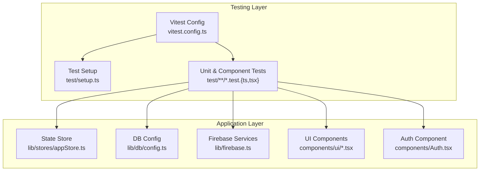
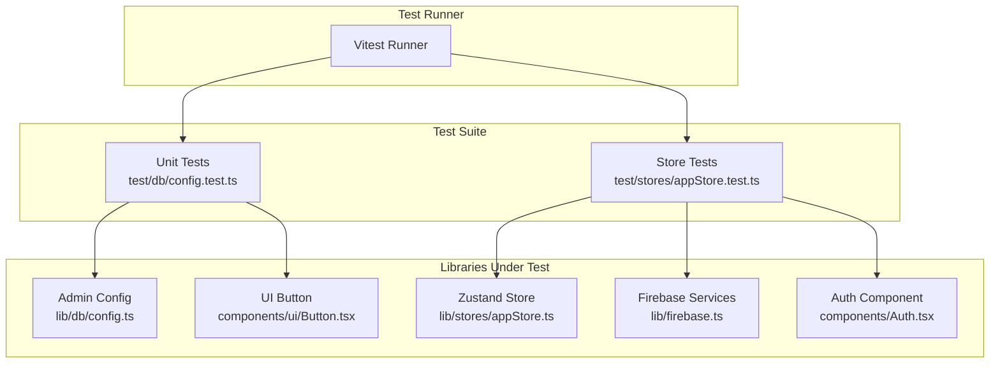
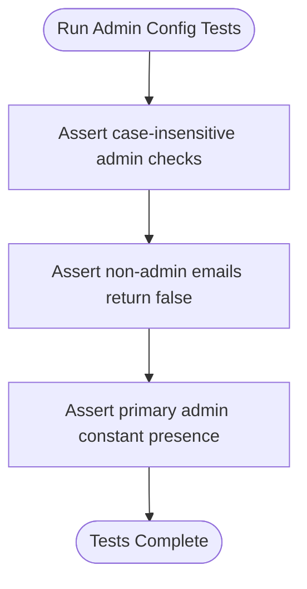
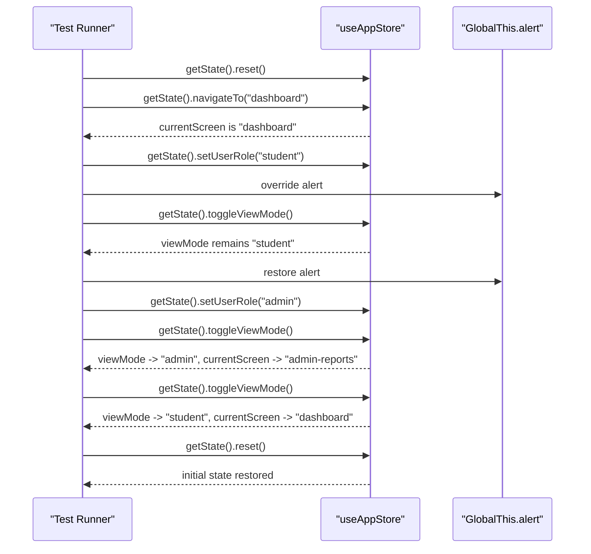
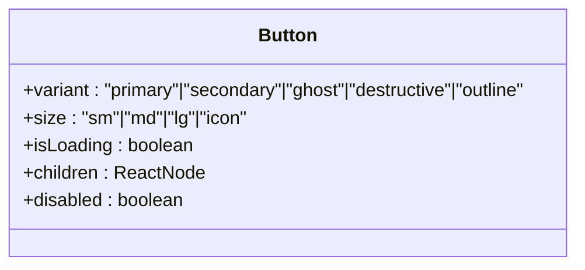
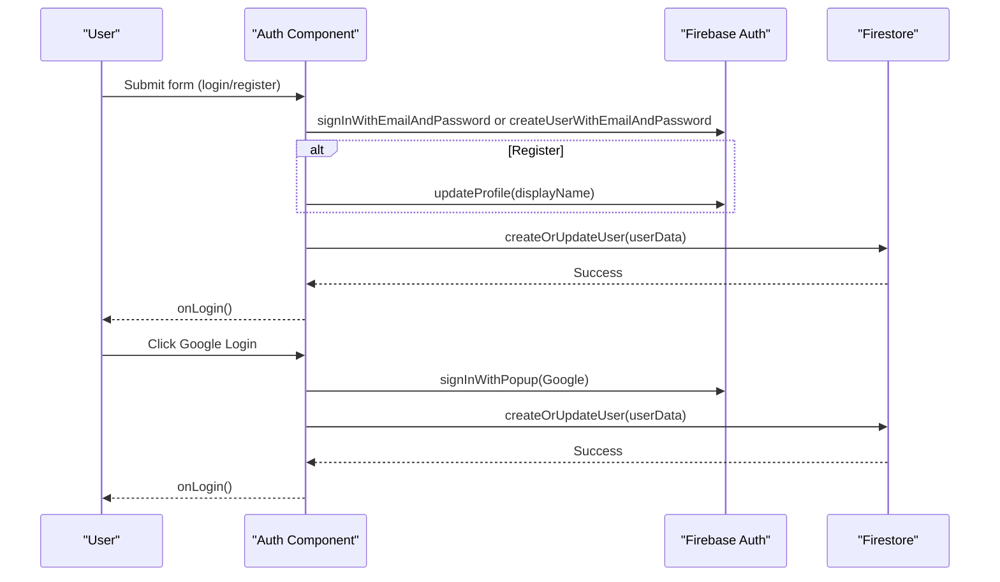
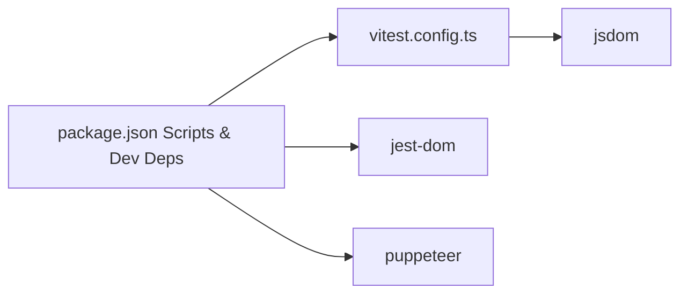

# Testing Strategy

<cite>
**Referenced Files in This Document**
- [vitest.config.ts](file://vitest.config.ts)
- [setup.ts](file://test/setup.ts)
- [package.json](file://package.json)
- [netlify.toml](file://netlify.toml)
- [config.test.ts](file://test/db/config.test.ts)
- [appStore.test.ts](file://test/stores/appStore.test.ts)
- [appStore.ts](file://lib/stores/appStore.ts)
- [config.ts](file://lib/db/config.ts)
- [firebase.ts](file://lib/firebase.ts)
- [Button.tsx](file://components/ui/Button.tsx)
- [Auth.tsx](file://components/Auth.tsx)
</cite>

## Table of Contents
1. [Introduction](#introduction)
2. [Project Structure](#project-structure)
3. [Core Components](#core-components)
4. [Architecture Overview](#architecture-overview)
5. [Detailed Component Analysis](#detailed-component-analysis)
6. [Dependency Analysis](#dependency-analysis)
7. [Performance Considerations](#performance-considerations)
8. [Troubleshooting Guide](#troubleshooting-guide)
9. [Conclusion](#conclusion)
10. [Appendices](#appendices)

## Introduction
This document describes the testing strategy and implementation for the project. It covers Vitest configuration, unit and component testing patterns, mock strategies for Firebase services, database interactions, and external API integrations. It also explains test setup, environment configuration, continuous integration practices, and guidance for testing asynchronous operations, state management, and UI components. Finally, it outlines performance, accessibility, and cross-browser testing considerations, along with best practices for organizing and maintaining test suites.

## Project Structure
The testing setup centers around Vitest configured for jsdom, with a small setup file to extend DOM matchers. Tests are organized under a dedicated test directory with feature-based grouping (e.g., stores, db). The project integrates Firebase for authentication and Firestore for persistence, and Netlify for hosting and function deployment.

**Diagram sources**
- [vitest.config.ts](file://vitest.config.ts#L1-L19)
- [setup.ts](file://test/setup.ts#L1-L2)
- [appStore.ts](file://lib/stores/appStore.ts#L1-L82)
- [config.ts](file://lib/db/config.ts#L1-L19)
- [firebase.ts](file://lib/firebase.ts#L1-L25)
- [Button.tsx](file://components/ui/Button.tsx#L1-L49)
- [Auth.tsx](file://components/Auth.tsx#L1-L265)

**Section sources**
- [vitest.config.ts](file://vitest.config.ts#L1-L19)
- [setup.ts](file://test/setup.ts#L1-L2)
- [package.json](file://package.json#L1-L44)

## Core Components
- Vitest configuration enables global test APIs, jsdom environment, and a setup file for DOM matchers. It includes TypeScript path aliases and targets test files under the test directory.
- Test setup adds jest-dom matchers to the jsdom environment, enabling assertions like toBeInTheDocument.
- Unit tests cover pure logic (e.g., admin configuration) and state store behavior (e.g., navigation, view mode toggling).
- Component tests target UI components and integration points like authentication flows.

Key configuration highlights:
- Environment: jsdom
- Globals: enabled
- Setup file: test/setup.ts
- Include pattern: test/**/*.test.{ts,tsx}

**Section sources**
- [vitest.config.ts](file://vitest.config.ts#L5-L12)
- [setup.ts](file://test/setup.ts#L1-L2)
- [package.json](file://package.json#L6-L12)

## Architecture Overview
The testing architecture aligns with the application’s modular structure. Tests exercise:
- Pure functions and constants for admin configuration
- Zustand store actions and state transitions
- UI components and their rendering behavior
- Authentication flows that integrate with Firebase services

**Diagram sources**
- [config.test.ts](file://test/db/config.test.ts#L1-L26)
- [appStore.test.ts](file://test/stores/appStore.test.ts#L1-L64)
- [config.ts](file://lib/db/config.ts#L1-L19)
- [appStore.ts](file://lib/stores/appStore.ts#L1-L82)
- [firebase.ts](file://lib/firebase.ts#L1-L25)
- [Button.tsx](file://components/ui/Button.tsx#L1-L49)
- [Auth.tsx](file://components/Auth.tsx#L1-L265)

## Detailed Component Analysis

### Admin Configuration Tests
These tests validate email administration helpers and constants. They assert case-insensitive matching and constant correctness.

**Diagram sources**
- [config.test.ts](file://test/db/config.test.ts#L4-L25)
- [config.ts](file://lib/db/config.ts#L1-L19)

**Section sources**
- [config.test.ts](file://test/db/config.test.ts#L1-L26)
- [config.ts](file://lib/db/config.ts#L1-L19)

### Zustand Store Tests
These tests validate the application state store, including initial state, navigation, view mode toggling for admin/non-admin roles, and reset behavior. They demonstrate resetting store state between tests and mocking browser globals for assertions.

**Diagram sources**
- [appStore.test.ts](file://test/stores/appStore.test.ts#L4-L63)
- [appStore.ts](file://lib/stores/appStore.ts#L48-L81)

**Section sources**
- [appStore.test.ts](file://test/stores/appStore.test.ts#L1-L64)
- [appStore.ts](file://lib/stores/appStore.ts#L1-L82)

### UI Component Testing Patterns
UI components are tested for rendering, disabled states, and loading indicators. The Button component demonstrates variant and size rendering and the isLoading prop disabling the button while showing a spinner.

**Diagram sources**
- [Button.tsx](file://components/ui/Button.tsx#L4-L49)

**Section sources**
- [Button.tsx](file://components/ui/Button.tsx#L1-L49)

### Authentication Flow Testing
The Auth component orchestrates Firebase sign-in/sign-up and Google OAuth flows, updates user profiles, and persists user data to Firestore. Tests should validate:
- Form submission paths for login and registration
- Error handling for invalid credentials and blocked popups
- Successful navigation after authentication
- Firestore user creation/update behavior

**Diagram sources**
- [Auth.tsx](file://components/Auth.tsx#L21-L92)
- [firebase.ts](file://lib/firebase.ts#L1-L25)

**Section sources**
- [Auth.tsx](file://components/Auth.tsx#L1-L265)
- [firebase.ts](file://lib/firebase.ts#L1-L25)

## Dependency Analysis
Testing dependencies and their roles:
- Vitest: test runner and assertion library
- jsdom: DOM environment for component and integration tests
- @testing-library/jest-dom: DOM matchers for assertions
- Puppeteer: available for end-to-end or screenshot testing (not currently configured in repo)
- Netlify configuration: defines CSP and headers affecting test environments and external API access

**Diagram sources**
- [package.json](file://package.json#L6-L42)
- [vitest.config.ts](file://vitest.config.ts#L1-L19)

**Section sources**
- [package.json](file://package.json#L1-L44)
- [vitest.config.ts](file://vitest.config.ts#L1-L19)

## Performance Considerations
- Prefer unit tests for pure logic and store actions to minimize overhead.
- Use lightweight DOM mocks for UI components; avoid heavy rendering when not necessary.
- Keep async tests focused and fast; use minimal setup per test.
- For performance-sensitive UI, consider measuring render times in isolated benchmarks outside the main test suite.

[No sources needed since this section provides general guidance]

## Troubleshooting Guide
Common issues and resolutions:
- Missing DOM matchers: ensure the setup file is loaded by Vitest configuration.
- Firebase environment variables: confirm Vite environment variables are present during test runs.
- State leakage between tests: reset store state in beforeEach hooks.
- Global mocks: temporarily override browser globals (e.g., alert) for assertions and restore them afterward.

**Section sources**
- [setup.ts](file://test/setup.ts#L1-L2)
- [appStore.test.ts](file://test/stores/appStore.test.ts#L5-L8)

## Conclusion
The project employs a pragmatic testing strategy using Vitest with jsdom, complemented by targeted unit and component tests. State management is validated through Zustand store tests, and UI components are covered for rendering and behavior. Firebase integration is exercised through controlled flows in the Auth component. The configuration supports scalable growth with clear separation of concerns and maintainable test suites.

[No sources needed since this section summarizes without analyzing specific files]

## Appendices

### Vitest Configuration Reference
- Environment: jsdom
- Globals: enabled
- Setup file: test/setup.ts
- Include pattern: test/**/*.test.{ts,tsx}
- Path alias: @ resolves to repository root

**Section sources**
- [vitest.config.ts](file://vitest.config.ts#L5-L12)

### Continuous Integration Practices
- Build and deploy via Netlify with Node.js 20.
- CSP headers restrict external connections; ensure tests that rely on external APIs are either mocked or executed in controlled environments.
- Redirects and headers influence how assets and service workers are served; verify test environments mirror production constraints.

**Section sources**
- [netlify.toml](file://netlify.toml#L1-L65)

### Mock Strategies for Firebase, Database, and External APIs
- Firebase services: isolate by importing initialized services in tests and replacing them with mocks or stubs. For unit tests, mock Firebase Auth and Firestore functions to simulate success/error conditions without network calls.
- Database interactions: wrap Firestore calls behind thin interfaces or factories to swap real implementations with test doubles.
- External APIs: use fetch or HTTP client mocks to simulate network responses and errors.

[No sources needed since this section provides general guidance]

### Testing Async Operations and State Management
- Use beforeEach to reset state and isolate tests.
- Assert state transitions after async operations complete.
- For async UI interactions, wait for DOM updates and element visibility.

**Section sources**
- [appStore.test.ts](file://test/stores/appStore.test.ts#L5-L8)

### UI Component Testing Guidelines
- Verify rendering of variants and sizes.
- Confirm disabled states and loading indicators.
- Test click handlers and keyboard interactions where applicable.

**Section sources**
- [Button.tsx](file://components/ui/Button.tsx#L1-L49)

### Accessibility and Cross-Browser Compatibility
- Accessibility: add tests for ARIA attributes, focus order, and keyboard navigation.
- Cross-browser: consider headless browser testing with Puppeteer for end-to-end coverage if needed.

[No sources needed since this section provides general guidance]

### Writing Effective Tests and Maintaining Suites
- Keep tests focused and readable; group related assertions.
- Use descriptive test names and organize files by feature.
- Maintain a clean setup and teardown routine to prevent flaky tests.

[No sources needed since this section provides general guidance]