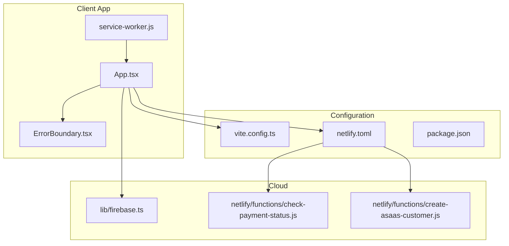
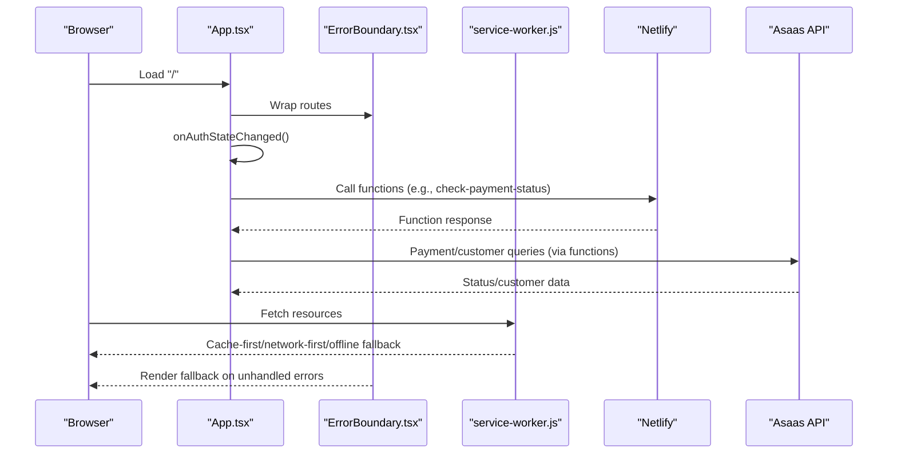
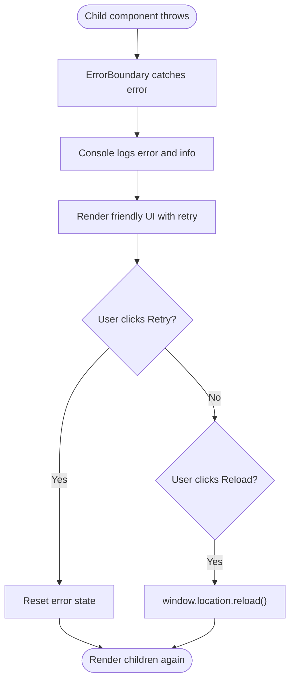
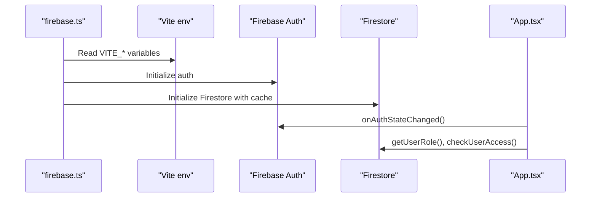
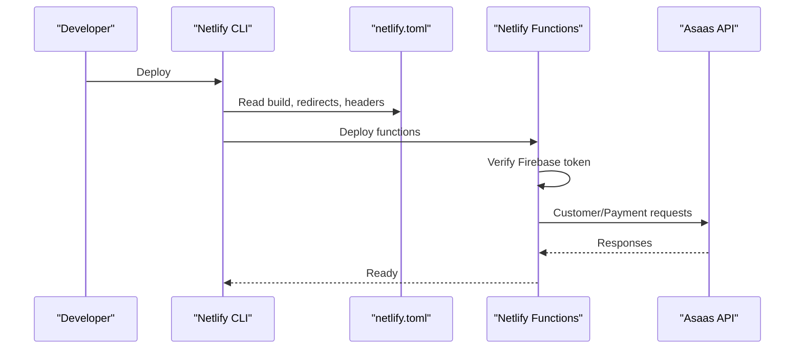
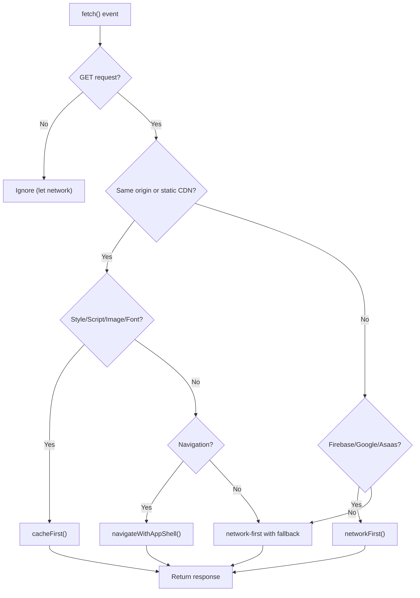
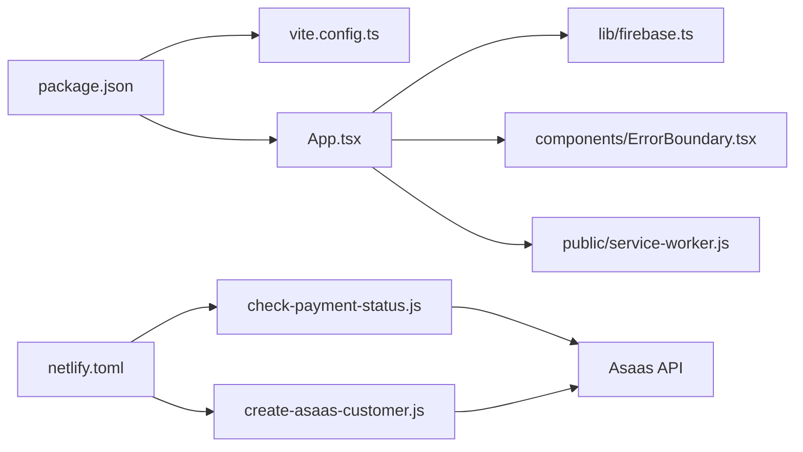

# Troubleshooting & FAQ

<cite>
**Referenced Files in This Document**
- [README.md](file://README.md)
- [App.tsx](file://App.tsx)
- [ErrorBoundary.tsx](file://components/ErrorBoundary.tsx)
- [firebase.ts](file://lib/firebase.ts)
- [vite.config.ts](file://vite.config.ts)
- [netlify.toml](file://netlify.toml)
- [package.json](file://package.json)
- [service-worker.js](file://public/service-worker.js)
- [offline.html](file://public/offline.html)
- [check-payment-status.js](file://netlify/functions/check-payment-status.js)
- [create-asaas-customer.js](file://netlify/functions/create-asaas-customer.js)
</cite>

## Table of Contents
1. [Introduction](#introduction)
2. [Project Structure](#project-structure)
3. [Core Components](#core-components)
4. [Architecture Overview](#architecture-overview)
5. [Detailed Component Analysis](#detailed-component-analysis)
6. [Dependency Analysis](#dependency-analysis)
7. [Performance Considerations](#performance-considerations)
8. [Troubleshooting Guide](#troubleshooting-guide)
9. [FAQ](#faq)
10. [Conclusion](#conclusion)

## Introduction
This document provides comprehensive troubleshooting guidance and FAQs for Fluentoria. It covers build issues, Firebase configuration pitfalls, authentication failures, deployment problems, performance tuning, debugging techniques, error handling, error boundaries, error reporting, user-friendly error messaging, browser and mobile compatibility, network connectivity, diagnostics, log analysis, and recovery strategies. It also includes practical FAQ answers for common user questions and development setup concerns.

## Project Structure
Fluentoria is a React application with Vite tooling, integrated with Firebase for authentication, Firestore, Storage, and Cloud Functions, and deployed via Netlify. The PWA service worker provides offline support and caching strategies. Key areas for troubleshooting include:
- Build and dev server configuration
- Firebase environment variables and initialization
- Authentication state handling and access checks
- Netlify redirects, headers, and function deployments
- Service worker caching and offline behavior
- Asaas integration via Netlify functions

**Diagram sources**
- [App.tsx](file://App.tsx#L1-L449)
- [ErrorBoundary.tsx](file://components/ErrorBoundary.tsx#L1-L86)
- [service-worker.js](file://public/service-worker.js#L1-L261)
- [vite.config.ts](file://vite.config.ts#L1-L33)
- [netlify.toml](file://netlify.toml#L1-L65)
- [package.json](file://package.json#L1-L44)
- [firebase.ts](file://lib/firebase.ts#L1-L25)
- [check-payment-status.js](file://netlify/functions/check-payment-status.js#L1-L152)
- [create-asaas-customer.js](file://netlify/functions/create-asaas-customer.js#L1-L146)

**Section sources**
- [README.md](file://README.md#L1-L41)
- [package.json](file://package.json#L1-L44)

## Core Components
- Error Boundary: Provides graceful degradation with user-friendly messaging and retry controls.
- Firebase Initialization: Centralized initialization and environment variable usage for auth, Firestore, Storage, and Functions.
- App Routing and Access Control: Uses Firebase Auth state, role checks, and access control to gate content.
- Netlify Configuration: Build commands, redirects, headers, and function bundler settings.
- Service Worker: Implements caching strategies, offline fallback, and navigation handling.
- Asaas Functions: Customer creation and payment status checks behind JWT verification and environment guards.

**Section sources**
- [ErrorBoundary.tsx](file://components/ErrorBoundary.tsx#L1-L86)
- [firebase.ts](file://lib/firebase.ts#L1-L25)
- [App.tsx](file://App.tsx#L65-L108)
- [netlify.toml](file://netlify.toml#L1-L65)
- [service-worker.js](file://public/service-worker.js#L77-L161)
- [check-payment-status.js](file://netlify/functions/check-payment-status.js#L20-L151)
- [create-asaas-customer.js](file://netlify/functions/create-asaas-customer.js#L20-L145)

## Architecture Overview
The runtime architecture ties together the client-side React app, Firebase services, Netlify-hosted functions, and the PWA service worker.

**Diagram sources**
- [App.tsx](file://App.tsx#L65-L108)
- [ErrorBoundary.tsx](file://components/ErrorBoundary.tsx#L31-L81)
- [service-worker.js](file://public/service-worker.js#L77-L161)
- [check-payment-status.js](file://netlify/functions/check-payment-status.js#L20-L151)
- [create-asaas-customer.js](file://netlify/functions/create-asaas-customer.js#L20-L145)

## Detailed Component Analysis

### Error Boundary
- Purpose: Catches JavaScript errors inside child components, logs them, and renders a friendly UI with retry options.
- Behavior: Displays error message, shows raw error details in a collapsible section, and supports reload or retry actions.
- Integration: Wrapped around lazy-loaded screens and Suspense fallbacks.

**Diagram sources**
- [ErrorBoundary.tsx](file://components/ErrorBoundary.tsx#L19-L81)

**Section sources**
- [ErrorBoundary.tsx](file://components/ErrorBoundary.tsx#L1-L86)
- [App.tsx](file://App.tsx#L420-L425)

### Firebase Configuration and Initialization
- Environment variables are loaded via Vite and consumed by Firebase initialization.
- Firestore uses persistent local cache and multi-tab manager.
- Auth state subscription drives user role and access checks.

**Diagram sources**
- [firebase.ts](file://lib/firebase.ts#L7-L24)
- [vite.config.ts](file://vite.config.ts#L6-L25)
- [App.tsx](file://App.tsx#L65-L108)

**Section sources**
- [firebase.ts](file://lib/firebase.ts#L1-L25)
- [vite.config.ts](file://vite.config.ts#L1-L33)
- [App.tsx](file://App.tsx#L65-L108)

### Netlify Deployment and Functions
- Build command and publish directory are defined.
- Redirects ensure SPA routing and static asset exposure.
- Headers enforce CSP, security policies, and function bundler selection.
- Functions verify Firebase ID tokens and enforce required fields.

**Diagram sources**
- [netlify.toml](file://netlify.toml#L1-L65)
- [check-payment-status.js](file://netlify/functions/check-payment-status.js#L6-L18)
- [create-asaas-customer.js](file://netlify/functions/create-asaas-customer.js#L6-L18)

**Section sources**
- [netlify.toml](file://netlify.toml#L1-L65)
- [check-payment-status.js](file://netlify/functions/check-payment-status.js#L20-L151)
- [create-asaas-customer.js](file://netlify/functions/create-asaas-customer.js#L20-L145)

### Service Worker and Offline Behavior
- Static assets and app shell are cached during install.
- Navigation requests prefer network-first, then cached app shell, then offline page.
- Other requests use cache-first or default to network with fallback to cache or offline error.

**Diagram sources**
- [service-worker.js](file://public/service-worker.js#L77-L161)
- [service-worker.js](file://public/service-worker.js#L163-L208)
- [service-worker.js](file://public/service-worker.js#L231-L254)

**Section sources**
- [service-worker.js](file://public/service-worker.js#L1-L261)
- [offline.html](file://public/offline.html#L1-L124)

## Dependency Analysis
- Client depends on Vite for dev/build, React for UI, and Firebase SDKs.
- Netlify configuration governs build, redirects, headers, and function bundler.
- Functions depend on environment variables and Google JWKS for token verification.

**Diagram sources**
- [package.json](file://package.json#L1-L44)
- [vite.config.ts](file://vite.config.ts#L1-L33)
- [App.tsx](file://App.tsx#L1-L449)
- [firebase.ts](file://lib/firebase.ts#L1-L25)
- [ErrorBoundary.tsx](file://components/ErrorBoundary.tsx#L1-L86)
- [service-worker.js](file://public/service-worker.js#L1-L261)
- [netlify.toml](file://netlify.toml#L1-L65)
- [check-payment-status.js](file://netlify/functions/check-payment-status.js#L1-L152)
- [create-asaas-customer.js](file://netlify/functions/create-asaas-customer.js#L1-L146)

**Section sources**
- [package.json](file://package.json#L1-L44)
- [netlify.toml](file://netlify.toml#L1-L65)

## Performance Considerations
- Use lazy-loaded routes to reduce initial bundle size.
- Enable persistent Firestore cache to minimize network usage.
- Optimize images and leverage CDN caching for static assets.
- Minimize heavy computations on the main thread; defer non-critical work.
- Monitor function cold starts by keeping warm-up patterns for critical endpoints.
- Use appropriate caching strategies in the service worker to balance freshness and performance.

[No sources needed since this section provides general guidance]

## Troubleshooting Guide

### Build Errors
Symptoms
- Build fails locally or in CI.
- Missing environment variables reported during build.
- Vite HMR or port conflicts.

Diagnostics
- Confirm environment variables are present and correctly named.
- Check Vite server host/port and HMR settings.
- Review build scripts and dependencies.

Remediation
- Set required VITE_* variables for Firebase.
- Adjust Vite server.host/port or disable strictPort if conflicting.
- Reinstall dependencies and clear caches.

**Section sources**
- [vite.config.ts](file://vite.config.ts#L5-L31)
- [package.json](file://package.json#L6-L12)

### Firebase Configuration Problems
Symptoms
- App initializes but auth state does not update.
- Firestore queries fail or cache not applied.
- Functions cannot verify tokens or reach external APIs.

Diagnostics
- Verify VITE_FIREBASE_* environment variables are defined.
- Confirm Firebase SDK initialization order and environment loading.
- Check function environment variables (ASAAS_ACCESS_TOKEN, ASAAS_API_URL).

Remediation
- Add missing VITE_* variables to the environment.
- Ensure environment variables are prefixed for Vite.
- Set function secrets in Netlify and redeploy.

**Section sources**
- [firebase.ts](file://lib/firebase.ts#L7-L14)
- [vite.config.ts](file://vite.config.ts#L22-L25)
- [check-payment-status.js](file://netlify/functions/check-payment-status.js#L76-L86)
- [create-asaas-customer.js](file://netlify/functions/create-asaas-customer.js#L76-L86)

### Authentication Failures
Symptoms
- Users cannot sign in or are redirected to auth screen.
- Role or access checks fail unexpectedly.
- Logout does not reset state properly.

Diagnostics
- Inspect onAuthStateChanged flow and user role retrieval.
- Verify admin email overrides and access checks.
- Check sign-out error handling.

Remediation
- Ensure admin emails are whitelisted and force-update roles when needed.
- Confirm access checks return expected statuses and payment status propagation.
- Improve sign-out error logging and UI feedback.

**Section sources**
- [App.tsx](file://App.tsx#L65-L108)
- [App.tsx](file://App.tsx#L155-L161)

### Deployment Issues
Symptoms
- Build succeeds locally but fails on Netlify.
- SPA routing returns 404 for deep links.
- Functions return unauthorized or internal server errors.

Diagnostics
- Confirm build command and publish directory match configuration.
- Verify redirects and headers are applied.
- Check function preflight handling and token verification.

Remediation
- Align build.command and publish with configuration.
- Add SPA catch-all redirect to index.html.
- Configure function environment variables and CORS headers.

**Section sources**
- [netlify.toml](file://netlify.toml#L1-L35)
- [netlify.toml](file://netlify.toml#L39-L47)
- [check-payment-status.js](file://netlify/functions/check-payment-status.js#L29-L41)
- [create-asaas-customer.js](file://netlify/functions/create-asaas-customer.js#L29-L41)

### Performance Optimization Strategies
- Lazy-load routes and components to reduce initial payload.
- Persist Firestore cache and enable multi-tab manager.
- Tune service worker caching strategies for static vs dynamic content.
- Minimize heavy computations; offload work to Web Workers if needed.
- Monitor function performance and keep warm-up patterns.

**Section sources**
- [App.tsx](file://App.tsx#L6-L23)
- [firebase.ts](file://lib/firebase.ts#L18-L22)
- [service-worker.js](file://public/service-worker.js#L163-L208)

### Debugging Techniques
- Use browser devtools to inspect network requests, service worker logs, and console errors.
- Enable React DevTools and Redux DevTools if applicable.
- Add targeted console logs around auth state transitions and function calls.
- Capture and review function logs in Netlify dashboard.

**Section sources**
- [service-worker.js](file://public/service-worker.js#L33-L54)
- [check-payment-status.js](file://netlify/functions/check-payment-status.js#L14-L18)
- [create-asaas-customer.js](file://netlify/functions/create-asaas-customer.js#L14-L18)

### Error Handling Patterns and User-Friendly Messaging
- Centralize error rendering in the Error Boundary with retry and reload actions.
- Provide collapsible details for developers while keeping messages accessible.
- Ensure fallback UI remains usable and actionable.

**Section sources**
- [ErrorBoundary.tsx](file://components/ErrorBoundary.tsx#L31-L81)

### Error Reporting Mechanisms
- Console logging captures errors and stack traces for diagnostics.
- Functions return structured error bodies with status codes for client handling.
- Consider integrating a lightweight error reporting library if needed.

**Section sources**
- [ErrorBoundary.tsx](file://components/ErrorBoundary.tsx#L23-L25)
- [check-payment-status.js](file://netlify/functions/check-payment-status.js#L140-L150)
- [create-asaas-customer.js](file://netlify/functions/create-asaas-customer.js#L134-L144)

### Browser Compatibility and Mobile Device Troubleshooting
- Ensure modern browsers support ES modules and service workers.
- Test on mobile devices with varying network conditions.
- Validate PWA installation and offline behavior on mobile browsers.

**Section sources**
- [netlify.toml](file://netlify.toml#L39-L47)
- [service-worker.js](file://public/service-worker.js#L1-L261)

### Network Connectivity Problems
- Service worker handles offline fallback and network errors gracefully.
- Use offline.html to inform users and trigger reload on reconnect.
- Validate CSP headers allow necessary domains for Firebase and Asaas.

**Section sources**
- [service-worker.js](file://public/service-worker.js#L144-L159)
- [offline.html](file://public/offline.html#L108-L121)
- [netlify.toml](file://netlify.toml#L42-L46)

### Step-by-Step Diagnostic Procedures
- Verify environment variables and Firebase initialization.
- Reproduce the issue in dev mode and capture console logs.
- Check Netlify build logs and function logs for errors.
- Validate redirects and headers for SPA routing.
- Test service worker caching and offline fallback.

**Section sources**
- [firebase.ts](file://lib/firebase.ts#L7-L14)
- [netlify.toml](file://netlify.toml#L1-L35)
- [service-worker.js](file://public/service-worker.js#L77-L161)

### Log Analysis Techniques
- Filter console logs by ErrorBoundary and function prefixes.
- Correlate function request IDs with backend logs.
- Monitor service worker lifecycle events during updates.

**Section sources**
- [ErrorBoundary.tsx](file://components/ErrorBoundary.tsx#L23-L25)
- [check-payment-status.js](file://netlify/functions/check-payment-status.js#L140-L150)
- [service-worker.js](file://public/service-worker.js#L33-L54)

### Recovery Strategies
- Clear browser cache and reload to bypass stale service worker caches.
- Force skip waiting in service worker if needed.
- Re-deploy functions after fixing environment variables.
- Rollback to a known good commit if regressions appear.

**Section sources**
- [service-worker.js](file://public/service-worker.js#L256-L261)
- [netlify.toml](file://netlify.toml#L1-L35)

## FAQ

Q1: Why does the app fail to build locally?
- Check that VITE_FIREBASE_* variables are defined and prefixed for Vite.
- Ensure Node.js and pnpm versions meet project requirements.
- Clear node_modules and reinstall dependencies if necessary.

Q2: How do I fix Firebase initialization errors?
- Confirm all VITE_FIREBASE_* variables are present.
- Verify the app initializes Firebase only once and in the correct order.
- Check for typos in environment variable names.

Q3: Users cannot sign in. What should I check?
- Verify Firebase Auth is initialized and working.
- Confirm onAuthStateChanged is firing and user state updates.
- Check for admin email overrides and access control logic.

Q4: My SPA deep links return 404 after deployment.
- Ensure Netlify redirects send all routes to index.html.
- Confirm build.publish matches the dist folder.
- Validate base path if deploying to a subpath.

Q5: Functions return unauthorized or invalid token errors.
- Verify Authorization header includes a valid Firebase ID token.
- Confirm function environment variables are set in Netlify.
- Check function CORS headers and preflight handling.

Q6: How do I troubleshoot offline behavior?
- Open devtools and check the Application tab for service worker and cache storage.
- Simulate offline and verify offline.html loads.
- Check network errors and response codes in the Network panel.

Q7: The error boundary keeps appearing. How can I debug?
- Click “Details” to reveal the error message and stack.
- Look for recurring errors in console logs.
- Check recent changes to lazy-loaded routes or data fetching.

Q8: How do I optimize performance?
- Use lazy-loaded routes and split chunks.
- Enable Firestore persistence and multi-tab cache.
- Tune service worker caching strategies for your assets.

Q9: What should I do if Asaas integration fails?
- Confirm ASAAS_ACCESS_TOKEN and ASAAS_API_URL are set.
- Validate customer creation and payment status requests.
- Check function logs for detailed error messages.

Q10: How do I handle browser compatibility issues?
- Test on supported browsers and ensure ES module support.
- Validate service worker availability and PWA features.
- Use polyfills if targeting older environments.

**Section sources**
- [vite.config.ts](file://vite.config.ts#L5-L31)
- [firebase.ts](file://lib/firebase.ts#L7-L14)
- [netlify.toml](file://netlify.toml#L1-L35)
- [check-payment-status.js](file://netlify/functions/check-payment-status.js#L76-L86)
- [create-asaas-customer.js](file://netlify/functions/create-asaas-customer.js#L76-L86)
- [service-worker.js](file://public/service-worker.js#L77-L161)
- [ErrorBoundary.tsx](file://components/ErrorBoundary.tsx#L31-L81)

## Conclusion
This guide consolidates troubleshooting workflows, error handling patterns, and optimization strategies for Fluentoria. By validating environment configuration, understanding the integration points with Firebase and Netlify, and leveraging the built-in error boundary and service worker capabilities, most issues can be diagnosed and resolved efficiently. Use the provided diagnostics and recovery steps to maintain a smooth user experience across browsers and devices.