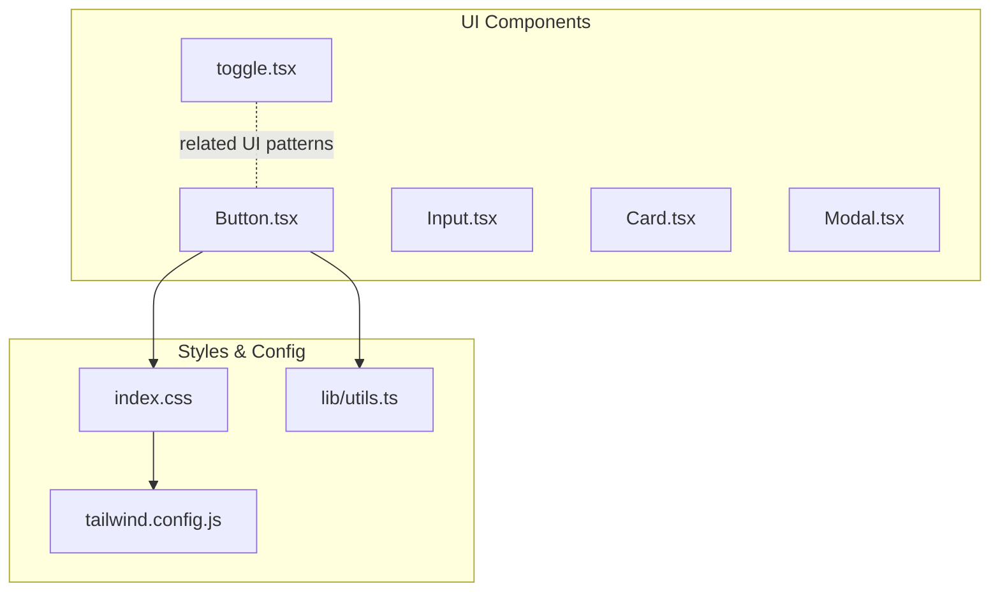
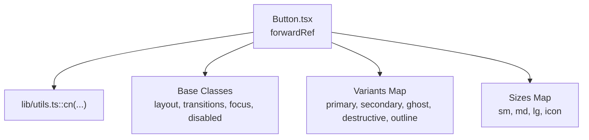
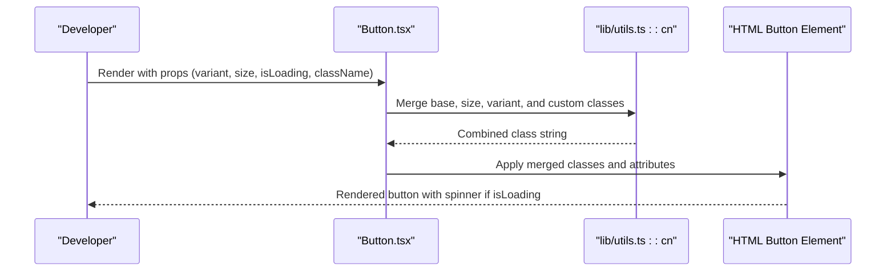
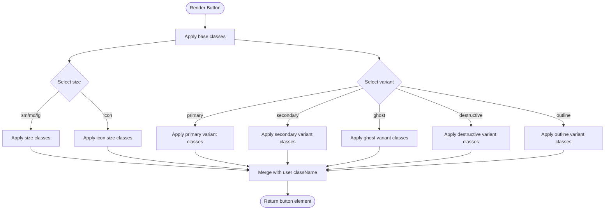
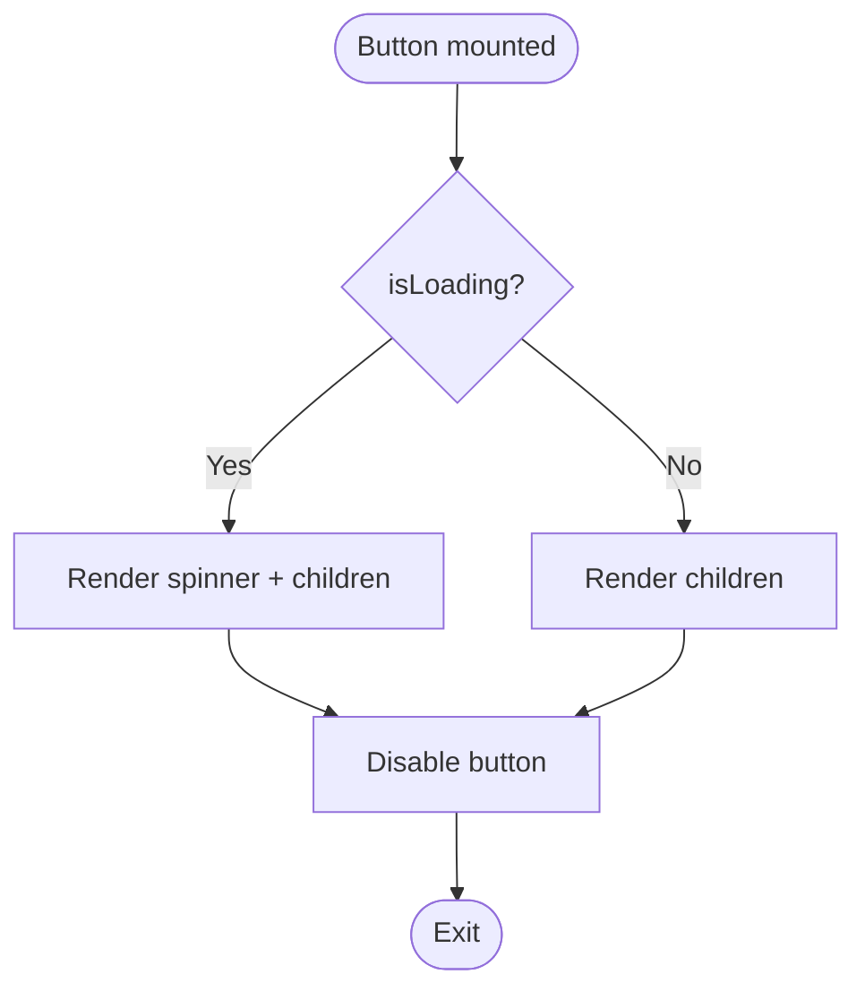
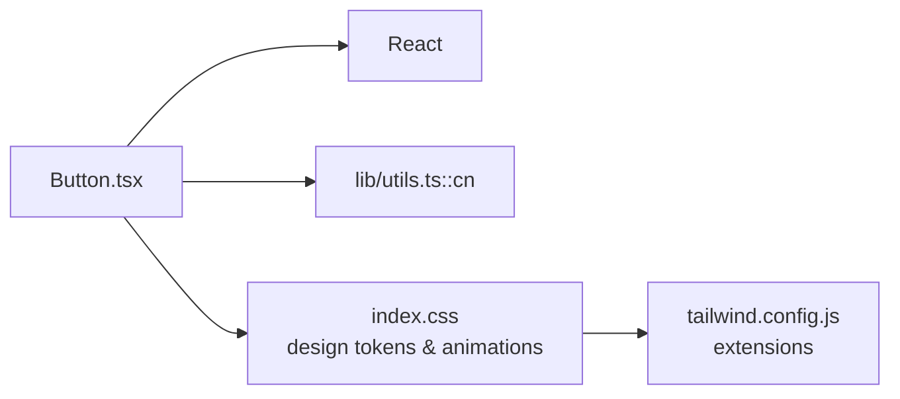

# Button Components

<cite>
**Referenced Files in This Document**
- [Button.tsx](file://components/ui/Button.tsx)
- [index.css](file://index.css)
- [tailwind.config.js](file://tailwind.config.js)
- [utils.ts](file://lib/utils.ts)
- [Help.tsx](file://components/Help.tsx)
- [AdminCatalog.tsx](file://components/AdminCatalog.tsx)
- [toggle.tsx](file://components/ui/toggle.tsx)
</cite>

## Table of Contents
1. [Introduction](#introduction)
2. [Project Structure](#project-structure)
3. [Core Components](#core-components)
4. [Architecture Overview](#architecture-overview)
5. [Detailed Component Analysis](#detailed-component-analysis)
6. [Dependency Analysis](#dependency-analysis)
7. [Performance Considerations](#performance-considerations)
8. [Troubleshooting Guide](#troubleshooting-guide)
9. [Conclusion](#conclusion)
10. [Appendices](#appendices)

## Introduction
This document provides comprehensive documentation for the Button component system used across the Fluentoria application. It covers all button variants, sizes, states, props interface, forwardRef implementation, Tailwind CSS class combinations, design tokens, animation effects, responsive behavior, and practical usage patterns. The goal is to enable consistent, accessible, and visually coherent button usage throughout the application.

## Project Structure
The Button component resides in the UI components module alongside other foundational elements such as Input, Card, Modal, and Toggle. It integrates with global design tokens defined in the stylesheet and Tailwind configuration to maintain a unified design system.

**Diagram sources**
- [Button.tsx](file://components/ui/Button.tsx#L1-L49)
- [index.css](file://index.css#L74-L80)
- [tailwind.config.js](file://tailwind.config.js#L1-L72)
- [utils.ts](file://lib/utils.ts#L1-L7)
- [toggle.tsx](file://components/ui/toggle.tsx#L1-L62)

**Section sources**
- [Button.tsx](file://components/ui/Button.tsx#L1-L49)
- [index.css](file://index.css#L1-L158)
- [tailwind.config.js](file://tailwind.config.js#L1-L72)
- [utils.ts](file://lib/utils.ts#L1-L7)

## Core Components
The Button component is a headless, forwardRef-enabled wrapper around the native HTML button element. It exposes a concise props interface and applies Tailwind-based styling through a combination of shared base classes and variant-specific tokens.

Key characteristics:
- Props interface: variant, size, isLoading, plus all standard button attributes
- ForwardRef support: exposes internal ref for imperative access
- State handling: disables the button when disabled or isLoading is true
- Loading indicator: renders a spinner when isLoading is true
- Composition-friendly: accepts additional className and spreads remaining props

**Section sources**
- [Button.tsx](file://components/ui/Button.tsx#L4-L8)
- [Button.tsx](file://components/ui/Button.tsx#L10-L46)

## Architecture Overview
The Button component architecture centers on a small set of design tokens and Tailwind utilities. Variants and sizes are mapped to specific class sets, while a shared base class set ensures consistent layout, transitions, focus behavior, and disabled states.

**Diagram sources**
- [Button.tsx](file://components/ui/Button.tsx#L10-L46)
- [utils.ts](file://lib/utils.ts#L4-L6)

**Section sources**
- [Button.tsx](file://components/ui/Button.tsx#L10-L46)
- [utils.ts](file://lib/utils.ts#L4-L6)

## Detailed Component Analysis

### Props Interface and ForwardRef Implementation
- Props:
  - variant: one of primary, secondary, ghost, destructive, outline
  - size: one of sm, md, lg, icon
  - isLoading: boolean toggles loading state and disables the button
  - Inherits all standard button HTML attributes
- Ref: Uses React.forwardRef to expose the underlying button element
- Behavior:
  - disabled combines external disabled prop and isLoading
  - isLoading conditionally renders a spinner before children
  - className merges with computed base, size, and variant classes

**Section sources**
- [Button.tsx](file://components/ui/Button.tsx#L4-L8)
- [Button.tsx](file://components/ui/Button.tsx#L10-L46)

### Variant Definitions and Tailwind Combinations
Each variant maps to a specific set of Tailwind classes. Some variants rely on design tokens defined in the stylesheet, while others use direct Tailwind utilities.

- primary: uses btn-primary-pluma design token
- secondary: direct Tailwind utilities for background, border, text, and hover states
- ghost: uses btn-ghost-pluma design token
- destructive: direct Tailwind utilities for red-themed background, border, text, and hover states
- outline: direct Tailwind utilities for transparent background, orange border, text, and hover states

Design tokens:
- btn-primary-pluma: orange background, white text, rounded-xl, px/py spacing, font-medium, shadow-sm, hover elevation and ring focus
- btn-ghost-pluma: transparent background, subtle border, light text, rounded-xl, hover background and text change

**Section sources**
- [Button.tsx](file://components/ui/Button.tsx#L12-L18)
- [index.css](file://index.css#L74-L80)

### Size Definitions and Responsive Behavior
Sizes define padding, text sizing, and dimensions. The icon size uses fixed width and height classes for square buttons.

- sm: compact padding and smaller text
- md: default padding and text
- lg: larger padding and text
- icon: fixed square dimensions suitable for icon-only actions

Responsive behavior:
- The component does not hardcode responsive breakpoints; responsiveness is achieved by applying appropriate size classes and leveraging global Tailwind utilities and the design system’s spacing scale.

**Section sources**
- [Button.tsx](file://components/ui/Button.tsx#L20-L25)

### State Handling: Loading and Disabled
- disabled: passed through to the native button; combined with isLoading to prevent interaction
- isLoading: when true, disables the button and renders a spinner before children
- Spinner: animated circle with border utilities and a highlighted top segment

**Section sources**
- [Button.tsx](file://components/ui/Button.tsx#L30-L42)

### Accessibility Considerations
- Focus management: base classes include focus outline handling and ring focus for keyboard navigation
- Disabled state: disabled classes apply reduced opacity and pointer-events adjustments
- Semantic roles: uses native button semantics; avoid rendering buttons as other elements
- Text contrast: design tokens ensure sufficient contrast against backgrounds

**Section sources**
- [Button.tsx](file://components/ui/Button.tsx#L32-L36)
- [index.css](file://index.css#L74-L80)

### Animation Effects During Transitions
- Transition timing: base classes specify transition-all with a 200ms duration
- Hover elevation: btn-primary-pluma includes a subtle lift effect and dynamic shadow enhancement on hover
- Loading spinner: uses a spin animation with a bordered circle and a highlighted top segment

**Section sources**
- [Button.tsx](file://components/ui/Button.tsx#L32-L36)
- [index.css](file://index.css#L74-L76)
- [index.css](file://index.css#L108-L124)

### Practical Usage Examples and Integration Patterns
Common integration patterns observed across the codebase:

- Primary call-to-action with icon and text:
  - Example pattern: combine variant primary with an icon component and text content
  - Reference: direct usage of design token classes in page components

- Ghost-style secondary actions:
  - Example pattern: variant ghost for less prominent actions, often paired with icons
  - Reference: direct usage of design token classes in page components

- Ghost-style filters and controls:
  - Example pattern: variant ghost with size sm for filter dropdown triggers and toggles
  - Reference: usage within catalog filtering UI

Integration tips:
- Prefer the Button component for interactive elements to ensure consistent behavior and styling
- Combine variant and size props to match the visual hierarchy and available space
- Use isLoading to prevent duplicate submissions during async operations

**Section sources**
- [Help.tsx](file://components/Help.tsx#L227-L235)
- [AdminCatalog.tsx](file://components/AdminCatalog.tsx#L119-L131)
- [AdminCatalog.tsx](file://components/AdminCatalog.tsx#L154-L165)
- [AdminCatalog.tsx](file://components/AdminCatalog.tsx#L187-L196)

### Class Combination Strategy
The component composes classes using a shared base set and variant-specific classes. The utility function merges multiple class inputs and resolves conflicts using Tailwind merge semantics.

- Base classes: layout, alignment, rounded corners, font weight, transitions, focus behavior, disabled states
- Size classes: padding, text size, and dimensions
- Variant classes: color, borders, shadows, and hover effects
- Additional className: appended last to allow user overrides

**Section sources**
- [Button.tsx](file://components/ui/Button.tsx#L31-L36)
- [utils.ts](file://lib/utils.ts#L4-L6)

### Design Tokens and Theming
Design tokens are defined in the stylesheet and extended by Tailwind configuration. They provide consistent colors, spacing, radii, and transitions across components.

- Design tokens:
  - btn-primary-pluma: orange background, white text, rounded-xl, px/py spacing, font-medium, shadow-sm, hover elevation and ring focus
  - btn-ghost-pluma: transparent background, subtle border, light text, rounded-xl, hover background and text change
- Tailwind extensions:
  - Colors: CSS variables mapped to RGB values
  - Border radius: custom values for lg, md, sm
  - Spacing: custom spacing scale
  - Transitions: durations and easing tailored for the design system
  - Max widths: container constraints

**Section sources**
- [index.css](file://index.css#L74-L80)
- [tailwind.config.js](file://tailwind.config.js#L12-L67)

### Best Practices for Consistent Button Usage
- Choose variant based on prominence and context:
  - primary for main actions
  - secondary or ghost for auxiliary actions
  - destructive for irreversible or cautionary actions
  - outline for low-priority or alternative actions
- Select size based on available space and visual density:
  - sm for tight spaces or dense toolbars
  - md for default usage
  - lg for emphasis or hero actions
  - icon for compact, icon-only actions
- Use isLoading to prevent concurrent operations and communicate pending state
- Combine with icons thoughtfully to improve recognition and reduce cognitive load
- Maintain consistent spacing and alignment using parent layouts and grid utilities

**Section sources**
- [Button.tsx](file://components/ui/Button.tsx#L12-L18)
- [Button.tsx](file://components/ui/Button.tsx#L20-L25)
- [AdminCatalog.tsx](file://components/AdminCatalog.tsx#L119-L131)

## Architecture Overview

**Diagram sources**
- [Button.tsx](file://components/ui/Button.tsx#L10-L46)
- [utils.ts](file://lib/utils.ts#L4-L6)

## Detailed Component Analysis

### Class Combinations and Tailwind Utilities
The Button component’s class composition follows a predictable pattern:
- Shared base classes: layout, alignment, rounded corners, font weight, transitions, focus behavior, disabled states
- Size-specific classes: padding, text size, and dimensions
- Variant-specific classes: color, borders, shadows, and hover effects
- User-provided className: appended last to allow overrides

**Diagram sources**
- [Button.tsx](file://components/ui/Button.tsx#L31-L36)

**Section sources**
- [Button.tsx](file://components/ui/Button.tsx#L31-L36)

### Variant-Specific Styling Details
- primary: relies on btn-primary-pluma design token for consistent orange branding and hover elevation
- secondary: uses direct Tailwind utilities for a subtle, glass-like appearance with hover feedback
- ghost: uses btn-ghost-pluma design token for transparent, minimal interactions
- destructive: uses red-themed utilities for cautionary actions with hover feedback
- outline: uses orange border utilities for low-priority actions with hover fill

**Section sources**
- [Button.tsx](file://components/ui/Button.tsx#L12-L18)
- [index.css](file://index.css#L74-L80)

### Loading State Flow

**Diagram sources**
- [Button.tsx](file://components/ui/Button.tsx#L30-L42)

**Section sources**
- [Button.tsx](file://components/ui/Button.tsx#L30-L42)

### Integration Patterns Across Components
- Help page demonstrates direct usage of design token classes for primary and ghost buttons
- AdminCatalog showcases Button usage within filter dropdowns and control bars, emphasizing ghost variant and small size for secondary actions

**Section sources**
- [Help.tsx](file://components/Help.tsx#L227-L235)
- [AdminCatalog.tsx](file://components/AdminCatalog.tsx#L119-L131)
- [AdminCatalog.tsx](file://components/AdminCatalog.tsx#L154-L165)
- [AdminCatalog.tsx](file://components/AdminCatalog.tsx#L187-L196)

## Dependency Analysis
The Button component depends on:
- React for component rendering and forwardRef
- A utility function for merging class names
- Global stylesheet for design tokens and animations
- Tailwind configuration for color, spacing, and transition extensions

**Diagram sources**
- [Button.tsx](file://components/ui/Button.tsx#L1-L2)
- [utils.ts](file://lib/utils.ts#L1-L7)
- [index.css](file://index.css#L74-L80)
- [tailwind.config.js](file://tailwind.config.js#L12-L67)

**Section sources**
- [Button.tsx](file://components/ui/Button.tsx#L1-L2)
- [utils.ts](file://lib/utils.ts#L1-L7)
- [index.css](file://index.css#L74-L80)
- [tailwind.config.js](file://tailwind.config.js#L12-L67)

## Performance Considerations
- Class merging: Using a single utility to merge classes reduces DOM churn and avoids cascade conflicts
- Conditional rendering: The spinner is rendered only when isLoading is true, minimizing unnecessary DOM nodes
- Transition durations: Short transition durations ensure snappy interactions without perceptible lag
- CSS variables: Design tokens leverage CSS variables for efficient theme updates

[No sources needed since this section provides general guidance]

## Troubleshooting Guide
Common issues and resolutions:
- Button not responding to clicks:
  - Verify disabled prop is not set externally or via isLoading
  - Confirm isLoading is not true during click handlers
- Incorrect variant or size:
  - Ensure variant and size props match supported values
  - Check that custom className does not override intended styles unintentionally
- Visual inconsistencies:
  - Confirm design token classes are present in the stylesheet
  - Verify Tailwind configuration includes required color and spacing extensions
- Accessibility concerns:
  - Ensure focus-visible styles are visible and consistent
  - Avoid removing focus outlines; use proper focus management

**Section sources**
- [Button.tsx](file://components/ui/Button.tsx#L30-L36)
- [index.css](file://index.css#L74-L80)
- [tailwind.config.js](file://tailwind.config.js#L12-L67)

## Conclusion
The Button component system provides a cohesive, extensible foundation for interactive elements across the application. By leveraging design tokens, Tailwind utilities, and a consistent props interface, it ensures visual coherence, accessibility, and maintainability. Following the recommended patterns and best practices outlined here will help preserve consistency and enhance the user experience.

[No sources needed since this section summarizes without analyzing specific files]

## Appendices

### Props Reference
- variant: primary | secondary | ghost | destructive | outline
- size: sm | md | lg | icon
- isLoading: boolean
- Inherits all standard button HTML attributes

**Section sources**
- [Button.tsx](file://components/ui/Button.tsx#L4-L8)

### Design Token Reference
- btn-primary-pluma: orange background, white text, rounded-xl, px/py spacing, font-medium, shadow-sm, hover elevation and ring focus
- btn-ghost-pluma: transparent background, subtle border, light text, rounded-xl, hover background and text change

**Section sources**
- [index.css](file://index.css#L74-L80)

### Tailwind Extensions Reference
- Colors: CSS variables mapped to RGB values
- Border radius: lg=20px, md=12px, sm=8px
- Spacing: custom scale from 4px to 48px
- Transitions: durations 120ms and 200ms
- Max widths: container constrained to 1200px

**Section sources**
- [tailwind.config.js](file://tailwind.config.js#L12-L67)