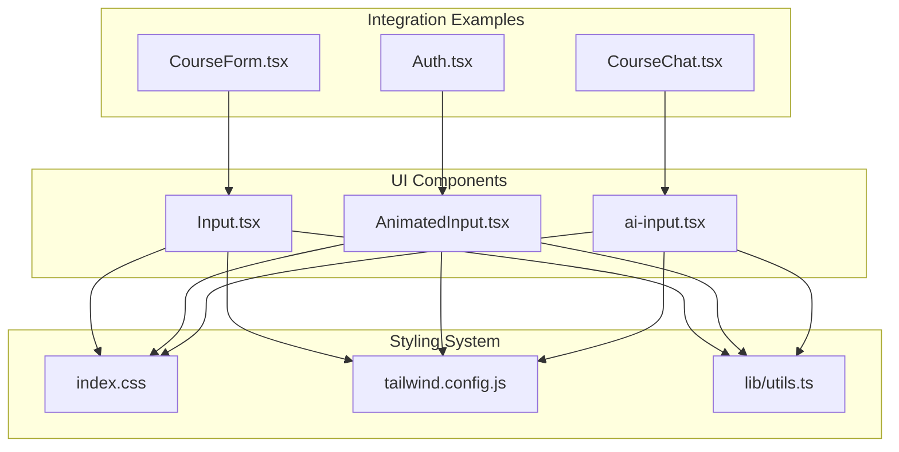
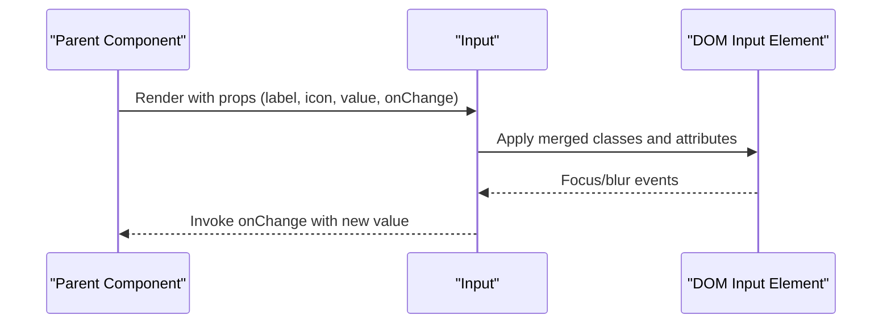
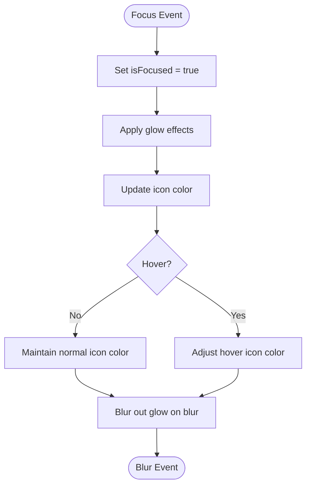
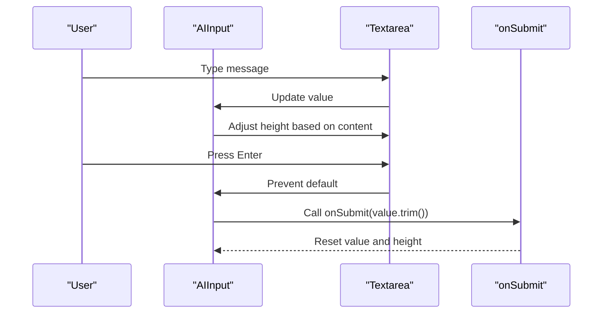
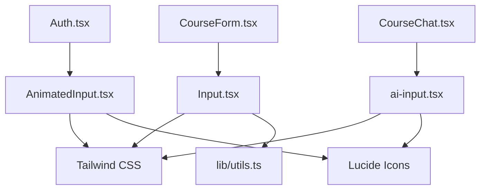

# Form Input Components

<cite>
**Referenced Files in This Document**
- [Input.tsx](file://components/ui/Input.tsx)
- [AnimatedInput.tsx](file://components/ui/AnimatedInput.tsx)
- [ai-input.tsx](file://components/ui/ai-input.tsx)
- [Auth.tsx](file://components/Auth.tsx)
- [CourseChat.tsx](file://components/CourseChat.tsx)
- [CourseForm.tsx](file://components/CourseForm.tsx)
- [utils.ts](file://lib/utils.ts)
- [index.css](file://index.css)
- [tailwind.config.js](file://tailwind.config.js)
</cite>

## Table of Contents
1. [Introduction](#introduction)
2. [Project Structure](#project-structure)
3. [Core Components](#core-components)
4. [Architecture Overview](#architecture-overview)
5. [Detailed Component Analysis](#detailed-component-analysis)
6. [Dependency Analysis](#dependency-analysis)
7. [Performance Considerations](#performance-considerations)
8. [Troubleshooting Guide](#troubleshooting-guide)
9. [Conclusion](#conclusion)
10. [Appendices](#appendices)

## Introduction
This document provides comprehensive documentation for the form input components in the Fluentoria project, focusing on three primary input types:
- Standard Input: A labeled, icon-enabled input with consistent styling.
- AnimatedInput: A modern, animated input with interactive glow effects, password visibility toggle, and icon support.
- AI-powered AIInput: A dynamic, auto-resizing textarea with submit controls and keyboard-driven interactions.

The documentation covers prop interfaces, validation patterns, state management, styling variants, accessibility considerations, integration with form libraries, error handling, real-time validation approaches, customization guidelines, and responsive design patterns.

## Project Structure
The input components are located under the UI components directory and integrate with the broader design system defined by Tailwind CSS and custom CSS utilities.



**Diagram sources**
- [Input.tsx](file://components/ui/Input.tsx#L1-L40)
- [AnimatedInput.tsx](file://components/ui/AnimatedInput.tsx#L1-L112)
- [ai-input.tsx](file://components/ui/ai-input.tsx#L1-L91)
- [Auth.tsx](file://components/Auth.tsx#L150-L208)
- [CourseChat.tsx](file://components/CourseChat.tsx#L219-L225)
- [CourseForm.tsx](file://components/CourseForm.tsx#L622-L631)
- [index.css](file://index.css#L1-L158)
- [tailwind.config.js](file://tailwind.config.js#L1-L72)
- [utils.ts](file://lib/utils.ts#L1-L7)

**Section sources**
- [Input.tsx](file://components/ui/Input.tsx#L1-L40)
- [AnimatedInput.tsx](file://components/ui/AnimatedInput.tsx#L1-L112)
- [ai-input.tsx](file://components/ui/ai-input.tsx#L1-L91)
- [index.css](file://index.css#L1-L158)
- [tailwind.config.js](file://tailwind.config.js#L1-L72)
- [utils.ts](file://lib/utils.ts#L1-L7)

## Core Components
This section outlines the three input components, their props, styling, and usage patterns.

- Standard Input (Input.tsx)
  - Purpose: Provides a labeled input with optional icon and consistent styling.
  - Props: Extends HTML input attributes plus icon and label.
  - Styling: Uses a dedicated input class and utility functions for class merging.
  - Accessibility: Supports labels and standard input semantics.

- AnimatedInput (AnimatedInput.tsx)
  - Purpose: Modern animated input with glow effects, icon support, and password visibility toggle.
  - Props: Type, placeholder, value, onChange, icon, className, autoFocus.
  - State: Tracks focus state and password visibility.
  - Effects: Gradient glow on focus and hover, smooth transitions.

- AI-powered AIInput (ai-input.tsx)
  - Purpose: Auto-resizing textarea with submit button and keyboard-driven submission.
  - Props: onSubmit, placeholder, disabled.
  - State: Tracks value, focus state, and dynamic textarea height.
  - Behavior: Handles Enter/Send interactions and character hints.

**Section sources**
- [Input.tsx](file://components/ui/Input.tsx#L4-L37)
- [AnimatedInput.tsx](file://components/ui/AnimatedInput.tsx#L4-L111)
- [ai-input.tsx](file://components/ui/ai-input.tsx#L4-L90)

## Architecture Overview
The input components follow a consistent design system leveraging:
- Tailwind CSS for utility-first styling and theme tokens.
- A centralized color palette and typography system.
- Utility functions for class merging to ensure predictable styling composition.

```mermaid
classDiagram
class Input {
+React.forwardRef
+props : InputProps
+label? : string
+icon? : React.ReactNode
+render()
}
class AnimatedInput {
+React.FC
+props : AnimatedInputProps
+type : "text"|"email"|"password"|"search"
+placeholder? : string
+value : string
+onChange : (value : string) => void
+icon? : "search"|"email"|"password"|"user"|"none"
+className? : string
+autoFocus? : boolean
+state : isFocused, showPassword
+render()
}
class AIInput {
+React.FC
+props : AIInputProps
+onSubmit : (value : string) => void
+placeholder? : string
+disabled? : boolean
+state : value, isFocused
+render()
}
Input --> "uses" Utils["cn"]
AnimatedInput --> "uses" Icons["Lucide icons"]
AIInput --> "uses" Icons["Lucide icons"]
```

**Diagram sources**
- [Input.tsx](file://components/ui/Input.tsx#L1-L39)
- [AnimatedInput.tsx](file://components/ui/AnimatedInput.tsx#L1-L111)
- [ai-input.tsx](file://components/ui/ai-input.tsx#L1-L90)
- [utils.ts](file://lib/utils.ts#L4-L6)

## Detailed Component Analysis

### Standard Input (Input.tsx)
- Prop interface
  - Extends HTML input attributes.
  - Additional props: icon (ReactNode), label (string).
- State management
  - No internal state; relies on parent-controlled value and onChange.
- Styling variants
  - Uses a dedicated input class and utility class merging.
  - Conditional padding based on icon presence.
- Accessibility
  - Optional label rendering for improved semantics.
- Usage examples
  - Integrated in course forms with labels and icons.



**Diagram sources**
- [Input.tsx](file://components/ui/Input.tsx#L9-L36)
- [CourseForm.tsx](file://components/CourseForm.tsx#L622-L631)

**Section sources**
- [Input.tsx](file://components/ui/Input.tsx#L4-L37)
- [CourseForm.tsx](file://components/CourseForm.tsx#L622-L631)

### AnimatedInput (AnimatedInput.tsx)
- Prop interface
  - type: "text" | "email" | "password" | "search"
  - placeholder: string
  - value: string
  - onChange: (value: string) => void
  - icon: "search" | "email" | "password" | "user" | "none"
  - className: string
  - autoFocus: boolean
- State management
  - isFocused: toggles glow effects and icon color.
  - showPassword: toggles password visibility for password inputs.
- Transition effects
  - Gradient glow around the input container on focus.
  - Bottom glow line indicating focus state.
  - Smooth transitions for borders, colors, and heights.
- Validation patterns
  - Intended for use with external validation libraries or controlled form state.
- Accessibility
  - Uses semantic input types and maintains focus states for assistive technologies.



**Diagram sources**
- [AnimatedInput.tsx](file://components/ui/AnimatedInput.tsx#L23-L51)

**Section sources**
- [AnimatedInput.tsx](file://components/ui/AnimatedInput.tsx#L4-L111)
- [Auth.tsx](file://components/Auth.tsx#L161-L192)

### AI-powered AIInput (ai-input.tsx)
- Prop interface
  - onSubmit: (value: string) => void
  - placeholder: string
  - disabled: boolean
- State management
  - value: tracks textarea content.
  - isFocused: manages visual focus state and character hint display.
  - textareaRef: manages dynamic height based on content.
- Autocomplete functionality
  - Not implemented in this component; designed for message submission.
- Real-time behavior
  - Auto-resizes textarea based on scroll height.
  - Keyboard handling: Enter submits, Shift+Enter adds new line.
- Accessibility
  - Disabled state prevents interaction.
  - Placeholder text provides guidance.



**Diagram sources**
- [ai-input.tsx](file://components/ui/ai-input.tsx#L15-L42)
- [CourseChat.tsx](file://components/CourseChat.tsx#L219-L225)

**Section sources**
- [ai-input.tsx](file://components/ui/ai-input.tsx#L4-L90)
- [CourseChat.tsx](file://components/CourseChat.tsx#L219-L225)

## Dependency Analysis
The components depend on:
- Tailwind CSS for styling and theme tokens.
- Lucide icons for visual cues.
- Utility functions for class merging.
- Parent components for state management and validation.



**Diagram sources**
- [Input.tsx](file://components/ui/Input.tsx#L1-L2)
- [AnimatedInput.tsx](file://components/ui/AnimatedInput.tsx#L1-L2)
- [ai-input.tsx](file://components/ui/ai-input.tsx#L1-L2)
- [utils.ts](file://lib/utils.ts#L1-L2)
- [Auth.tsx](file://components/Auth.tsx#L1-L10)
- [CourseChat.tsx](file://components/CourseChat.tsx#L1-L10)
- [CourseForm.tsx](file://components/CourseForm.tsx#L1-L10)

**Section sources**
- [Input.tsx](file://components/ui/Input.tsx#L1-L2)
- [AnimatedInput.tsx](file://components/ui/AnimatedInput.tsx#L1-L2)
- [ai-input.tsx](file://components/ui/ai-input.tsx#L1-L2)
- [utils.ts](file://lib/utils.ts#L1-L2)
- [Auth.tsx](file://components/Auth.tsx#L1-L10)
- [CourseChat.tsx](file://components/CourseChat.tsx#L1-L10)
- [CourseForm.tsx](file://components/CourseForm.tsx#L1-L10)

## Performance Considerations
- Class merging: Using a utility function ensures minimal reflows and predictable class composition.
- Animation: Transitions and glow effects are lightweight; ensure they are not overused on low-end devices.
- Auto-resize: Dynamic textarea height updates are triggered by value changes; debounce if needed for heavy content.
- Controlled components: Keep value and onChange synchronized to prevent unnecessary renders.

## Troubleshooting Guide
- Styling inconsistencies
  - Verify Tailwind configuration and custom CSS are loaded.
  - Ensure theme tokens match the design system.
- Focus states
  - Confirm focus handlers are present and not overridden by parent styles.
- Accessibility
  - Provide labels for screen readers.
  - Ensure disabled states are visually apparent and non-interactive.
- Validation
  - Integrate with form libraries or controlled state for robust validation.
  - Clear error states when user corrects input.

## Conclusion
The Fluentoria input components provide a cohesive, accessible, and visually consistent input experience across the application. By leveraging Tailwind CSS, Lucide icons, and controlled state management, the components support various input types, animations, and dynamic behaviors while maintaining performance and usability.

## Appendices

### Usage Examples by Input Type
- Standard Input (text, email, number)
  - Example usage in course forms with labels and icons.
  - Reference: [CourseForm.tsx](file://components/CourseForm.tsx#L622-L631)

- AnimatedInput (text, password, email, search)
  - Example usage in authentication forms with icons and focus effects.
  - Reference: [Auth.tsx](file://components/Auth.tsx#L161-L192)

- AIInput (message submission)
  - Example usage in chat interfaces with auto-resize and keyboard handling.
  - Reference: [CourseChat.tsx](file://components/CourseChat.tsx#L219-L225)

### Styling Consistency Guidelines
- Use the design system tokens for colors, shadows, and spacing.
- Maintain consistent padding and typography scales.
- Apply transitions and animations sparingly for optimal performance.

### Responsive Design Patterns
- Utilize Tailwind’s responsive utilities for adaptive layouts.
- Ensure inputs remain usable on small screens with appropriate touch targets.
- Test focus states and animations across device sizes.