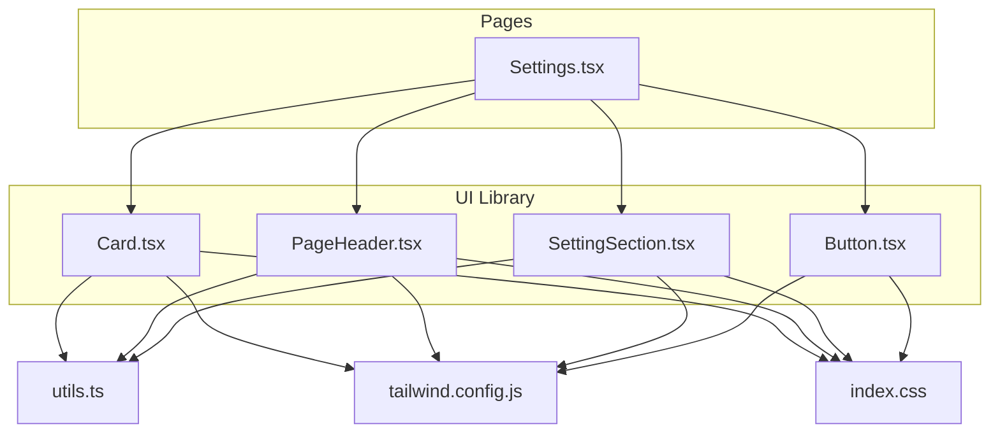
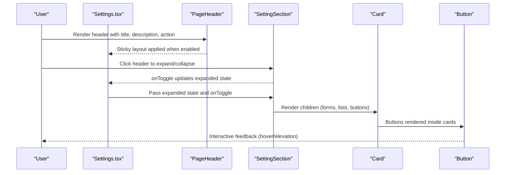
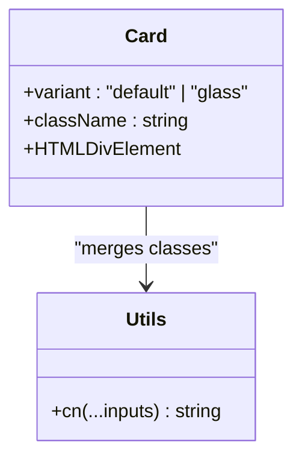
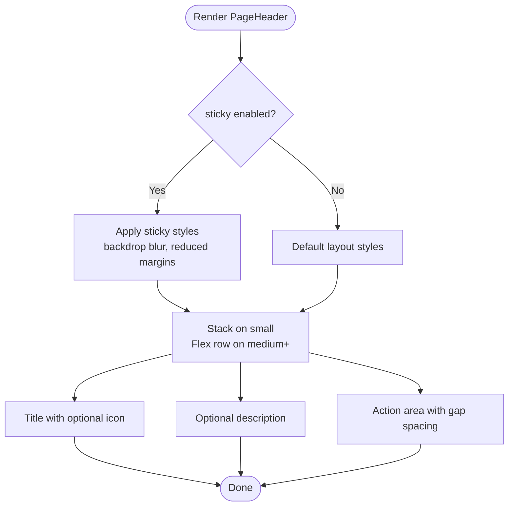
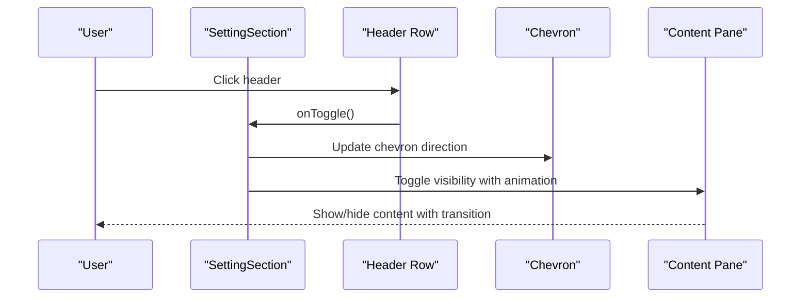
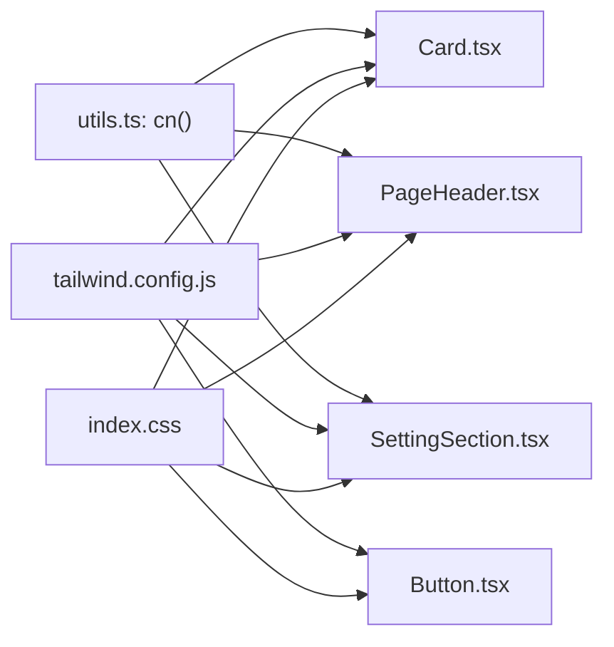

# Layout & Container Components

<cite>
**Referenced Files in This Document**
- [Card.tsx](file://components/ui/Card.tsx)
- [PageHeader.tsx](file://components/ui/PageHeader.tsx)
- [SettingSection.tsx](file://components/ui/SettingSection.tsx)
- [Settings.tsx](file://components/Settings.tsx)
- [Button.tsx](file://components/ui/Button.tsx)
- [utils.ts](file://lib/utils.ts)
- [tailwind.config.js](file://tailwind.config.js)
- [index.css](file://index.css)
</cite>

## Table of Contents
1. [Introduction](#introduction)
2. [Project Structure](#project-structure)
3. [Core Components](#core-components)
4. [Architecture Overview](#architecture-overview)
5. [Detailed Component Analysis](#detailed-component-analysis)
6. [Dependency Analysis](#dependency-analysis)
7. [Performance Considerations](#performance-considerations)
8. [Troubleshooting Guide](#troubleshooting-guide)
9. [Conclusion](#conclusion)
10. [Appendices](#appendices)

## Introduction
This document provides comprehensive documentation for three layout and container components: Card, PageHeader, and SettingSection. It explains structural patterns, spacing systems, responsive behavior, elevation and padding conventions, typography hierarchy, accordion mechanics, and form integration patterns. It also includes usage examples across layout scenarios, responsive breakpoints, accessibility considerations, and guidelines for component composition and design system integration.

## Project Structure
These components are part of the UI library and are used extensively within the Settings page to organize administrative controls and forms.

**Diagram sources**
- [Card.tsx](file://components/ui/Card.tsx#L1-L24)
- [PageHeader.tsx](file://components/ui/PageHeader.tsx#L1-L38)
- [SettingSection.tsx](file://components/ui/SettingSection.tsx#L1-L54)
- [Settings.tsx](file://components/Settings.tsx#L1-L915)
- [Button.tsx](file://components/ui/Button.tsx#L1-L49)
- [utils.ts](file://lib/utils.ts#L1-L7)
- [tailwind.config.js](file://tailwind.config.js#L1-L72)
- [index.css](file://index.css#L1-L158)

**Section sources**
- [Card.tsx](file://components/ui/Card.tsx#L1-L24)
- [PageHeader.tsx](file://components/ui/PageHeader.tsx#L1-L38)
- [SettingSection.tsx](file://components/ui/SettingSection.tsx#L1-L54)
- [Settings.tsx](file://components/Settings.tsx#L1-L915)
- [Button.tsx](file://components/ui/Button.tsx#L1-L49)
- [utils.ts](file://lib/utils.ts#L1-L7)
- [tailwind.config.js](file://tailwind.config.js#L1-L72)
- [index.css](file://index.css#L1-L158)

## Core Components
This section documents the three components’ props, rendering behavior, and design system integration.

- Card
  - Purpose: A flexible container with two variants: default and glass.
  - Props: className, variant (default | glass), plus standard HTML attributes.
  - Rendering: Applies either a default pluma card style or a glass effect via Tailwind classes.
  - Spacing: Uses design system spacing tokens and rounded corners.
  - Elevation: Inherits card-level shadow from the design system.
  - Accessibility: Inherits focus styles from the Button component when placed inside interactive contexts.

- PageHeader
  - Purpose: A sticky-friendly page header with title, optional description, optional icon, and action area.
  - Props: title (required), description (optional), action (optional node), sticky (boolean), icon (optional node).
  - Rendering: Responsive layout stacks vertically on small screens and aligns items horizontally on larger screens. Supports sticky positioning with backdrop blur and reduced margins/padding.
  - Typography: Title uses a large heading size; description uses muted text.
  - Action placement: Right-aligned action area with horizontal spacing.

- SettingSection
  - Purpose: An accordion-style section with a header row and collapsible content area.
  - Props: title, description, icon (React element type), expanded (boolean), onToggle (callback), children, className.
  - Rendering: Header row with icon, title, description, and chevron indicator. Collapsible content pane with animation when expanded.
  - Accordion behavior: Clicking the header toggles expanded state; chevron rotates accordingly.
  - Form integration: Often wraps form controls and cards for grouped settings.

**Section sources**
- [Card.tsx](file://components/ui/Card.tsx#L4-L21)
- [PageHeader.tsx](file://components/ui/PageHeader.tsx#L4-L37)
- [SettingSection.tsx](file://components/ui/SettingSection.tsx#L5-L53)

## Architecture Overview
The Settings page composes these components to create a structured, accessible, and responsive settings interface. Cards are used for item rows and grouped content; PageHeader establishes context and actions; SettingSection organizes related controls into collapsible sections.

**Diagram sources**
- [Settings.tsx](file://components/Settings.tsx#L412-L421)
- [PageHeader.tsx](file://components/ui/PageHeader.tsx#L12-L37)
- [SettingSection.tsx](file://components/ui/SettingSection.tsx#L15-L53)
- [Card.tsx](file://components/ui/Card.tsx#L8-L21)
- [Button.tsx](file://components/ui/Button.tsx#L10-L49)

## Detailed Component Analysis

### Card Component
- Structural pattern
  - ForwardRef wrapper allows external refs for focus management and imperative actions.
  - Variant-driven styling via a single prop with two modes: default pluma card and glass.
  - Uses a utility class merging function to combine incoming className with base styles.
- Spacing system
  - Padding and border radius are defined in the design system; Card applies consistent spacing and rounded corners.
- Elevation and content organization
  - Elevation is handled by the design system’s card shadow; padding is standardized for content readability.
  - Commonly used to wrap form controls, lists, and action rows.
- Accessibility
  - When used inside interactive containers, ensure focus order and keyboard navigation are considered.

**Diagram sources**
- [Card.tsx](file://components/ui/Card.tsx#L8-L21)
- [utils.ts](file://lib/utils.ts#L4-L6)

**Section sources**
- [Card.tsx](file://components/ui/Card.tsx#L1-L24)
- [utils.ts](file://lib/utils.ts#L1-L7)

### PageHeader Component
- Typography hierarchy
  - Title uses a large heading size; description uses muted text for secondary information.
  - Optional icon is rendered inline with the title.
- Breadcrumb integration
  - Not directly implemented here; breadcrumbs can be added above the PageHeader by placing a breadcrumb component in the parent layout.
- Action button placement
  - Action area is right-aligned and horizontally spaced; ideal for primary actions like “Save”.
- Responsive behavior
  - Stacks vertically on small screens; aligns items horizontally and distributes space on medium screens and above.
  - Sticky mode applies backdrop blur and adjusted margins/padding for consistent visual rhythm.

**Diagram sources**
- [PageHeader.tsx](file://components/ui/PageHeader.tsx#L12-L37)

**Section sources**
- [PageHeader.tsx](file://components/ui/PageHeader.tsx#L1-L38)

### SettingSection Component
- Accordion behavior
  - Header row triggers onToggle; chevrons indicate expanded/collapsed states.
  - Collapsible content area animates in when expanded.
- Content organization
  - Header contains an icon, title, and description; content area typically contains forms, lists, or grouped controls.
- Form integration patterns
  - Frequently wraps form controls and buttons; often paired with Card for individual rows.
- Animation and transitions
  - Smooth transitions for chevron rotation and content fade-in.

**Diagram sources**
- [SettingSection.tsx](file://components/ui/SettingSection.tsx#L15-L53)

**Section sources**
- [SettingSection.tsx](file://components/ui/SettingSection.tsx#L1-L54)

## Dependency Analysis
- Internal dependencies
  - All components depend on a shared class merging utility to compose Tailwind classes safely.
- Design system dependencies
  - Tailwind configuration defines brand colors, spacing scale, border radius, shadows, and max widths.
  - Global CSS layers define dark theme variables and component-specific styles (e.g., glass, card-pluma).
- External dependencies
  - Icons are rendered via Lucide React icons passed as props to SettingSection and PageHeader action areas.

**Diagram sources**
- [utils.ts](file://lib/utils.ts#L1-L7)
- [tailwind.config.js](file://tailwind.config.js#L1-L72)
- [index.css](file://index.css#L1-L158)
- [Card.tsx](file://components/ui/Card.tsx#L1-L24)
- [PageHeader.tsx](file://components/ui/PageHeader.tsx#L1-L38)
- [SettingSection.tsx](file://components/ui/SettingSection.tsx#L1-L54)
- [Button.tsx](file://components/ui/Button.tsx#L1-L49)

**Section sources**
- [utils.ts](file://lib/utils.ts#L1-L7)
- [tailwind.config.js](file://tailwind.config.js#L1-L72)
- [index.css](file://index.css#L1-L158)
- [Card.tsx](file://components/ui/Card.tsx#L1-L24)
- [PageHeader.tsx](file://components/ui/PageHeader.tsx#L1-L38)
- [SettingSection.tsx](file://components/ui/SettingSection.tsx#L1-L54)
- [Button.tsx](file://components/ui/Button.tsx#L1-L49)

## Performance Considerations
- Class merging
  - Using the shared cn() utility ensures minimal class duplication and avoids Tailwind purge conflicts.
- Elevation and backdrop blur
  - Glass and elevated shadows are defined in the design system; avoid excessive nesting of blur/backdrop layers to maintain smooth scrolling.
- Animations
  - Accordion animations are lightweight; keep content inside collapsible sections concise to prevent layout thrashing.
- Responsive layouts
  - Prefer CSS Flexbox and Grid for responsive stacking; avoid heavy JavaScript-driven layout shifts.

[No sources needed since this section provides general guidance]

## Troubleshooting Guide
- Class conflicts
  - If unexpected styles appear, verify that className overrides are not unintentionally disabling base styles; use the shared cn() utility to merge classes.
- Sticky header overlap
  - When sticky is enabled, ensure surrounding content has adequate top spacing to prevent overlap with fixed headers.
- Accordion not toggling
  - Confirm that onToggle is wired to a state variable and that expanded reflects the current state.
- Icon sizing
  - Icons passed to SettingSection and PageHeader should match the intended size; adjust className if needed.

**Section sources**
- [utils.ts](file://lib/utils.ts#L1-L7)
- [PageHeader.tsx](file://components/ui/PageHeader.tsx#L12-L37)
- [SettingSection.tsx](file://components/ui/SettingSection.tsx#L15-L53)

## Conclusion
Card, PageHeader, and SettingSection form a cohesive layout system that emphasizes consistent spacing, responsive behavior, and accessible interactions. Together with the design system’s spacing, colors, and typography, they enable rapid construction of complex settings pages while maintaining visual coherence and usability.

[No sources needed since this section summarizes without analyzing specific files]

## Appendices

### Usage Examples and Scenarios
- Basic Card
  - Wrap a single control or a small group of controls with a Card to visually group them.
  - Reference: [Card usage in Settings](file://components/Settings.tsx#L480-L512)
- PageHeader with action
  - Place PageHeader at the top of a settings view; attach a primary action (e.g., Save) to the action slot.
  - Reference: [PageHeader in Settings](file://components/Settings.tsx#L412-L421)
- SettingSection with forms
  - Use SettingSection to group related form controls; render inputs and buttons inside the content area.
  - Reference: [SettingSection usage in Settings](file://components/Settings.tsx#L447-L514), [SettingSection usage in Settings](file://components/Settings.tsx#L517-L577), [SettingSection usage in Settings](file://components/Settings.tsx#L766-L806)

### Responsive Breakpoints and Behavior
- Small screens
  - PageHeader stacks vertically; SettingSection header remains a single row with chevron alignment.
- Medium and up
  - PageHeader aligns items horizontally; SettingSection maintains compact header with chevron.
- Sticky header
  - On scroll, PageHeader becomes sticky with backdrop blur and adjusted spacing.
  - References: [PageHeader sticky behavior](file://components/ui/PageHeader.tsx#L20-L23), [PageHeader usage](file://components/Settings.tsx#L412-L421)

### Accessibility Considerations
- Focus management
  - Ensure interactive elements inside Card and SettingSection receive visible focus states.
  - Reference: [Button focus styles](file://components/ui/Button.tsx#L32-L38)
- Keyboard navigation
  - Accordions should be navigable via keyboard; ensure onToggle responds to Enter/Space.
  - Reference: [SettingSection header click handler](file://components/Settings.tsx#L336-L338)
- Semantic structure
  - Use headings appropriately; PageHeader title acts as a top-level heading for the page region.

### Design System Integration Guidelines
- Spacing consistency
  - Use the design system spacing scale for gaps and paddings; avoid ad-hoc pixel values.
  - Reference: [Tailwind spacing scale](file://tailwind.config.js#L50-L57)
- Elevation and borders
  - Rely on predefined shadows and border opacities from the design system.
  - References: [Card shadow](file://index.css#L70-L72), [Glass effect](file://index.css#L62-L68)
- Typography
  - Use the established heading sizes and weights; avoid overriding base typography.
  - References: [Base typography](file://index.css#L48-L58)
- Color tokens
  - Use brand and neutral tokens consistently; avoid hardcoding hex values.
  - References: [Brand colors](file://tailwind.config.js#L32-L40), [Theme variables](file://index.css#L5-L32)