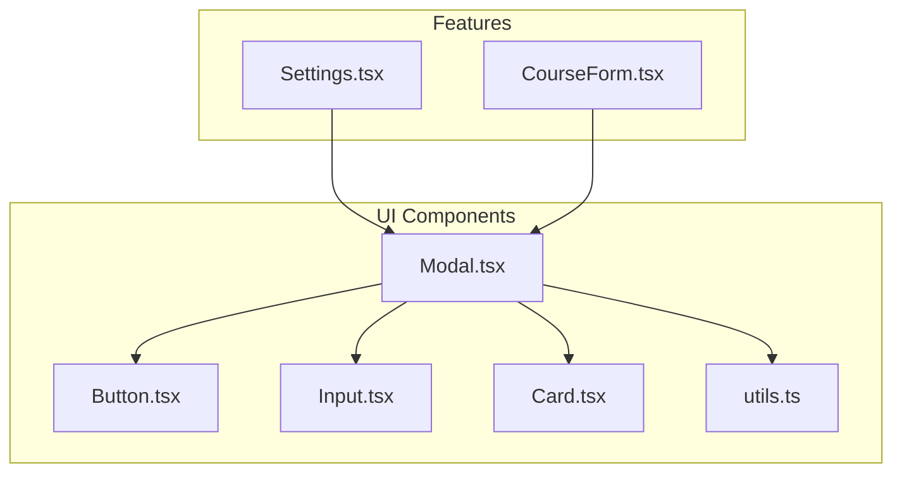
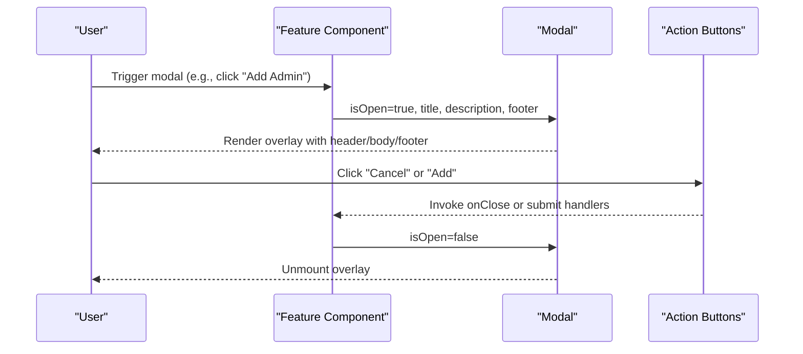
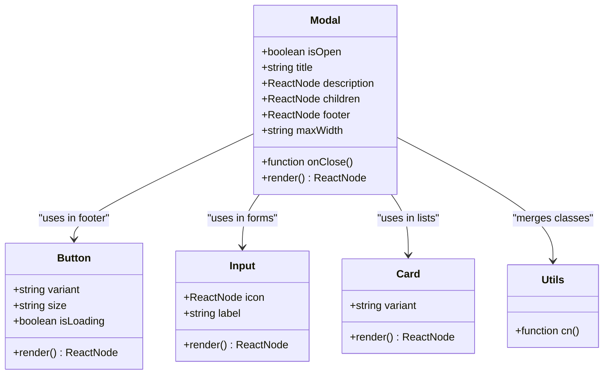
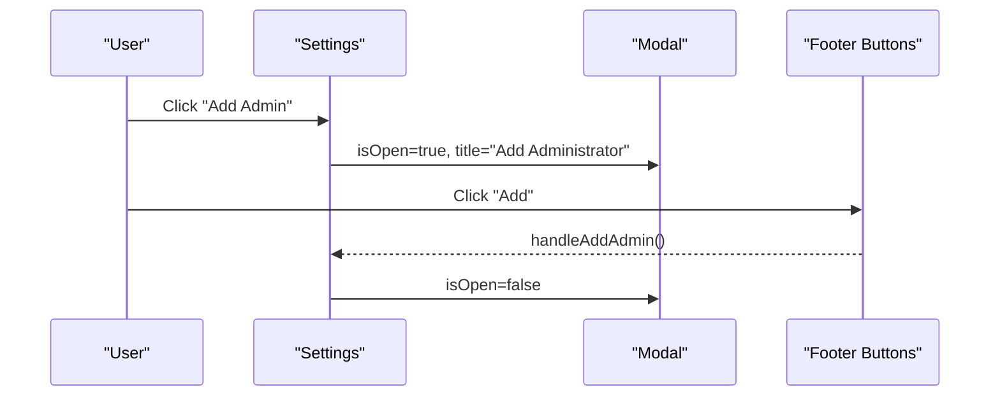
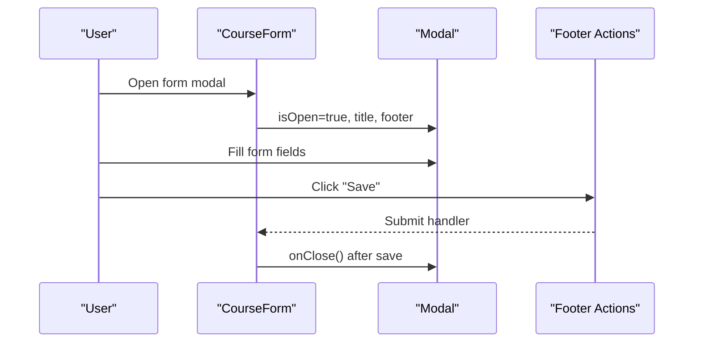
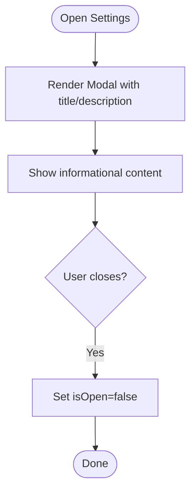
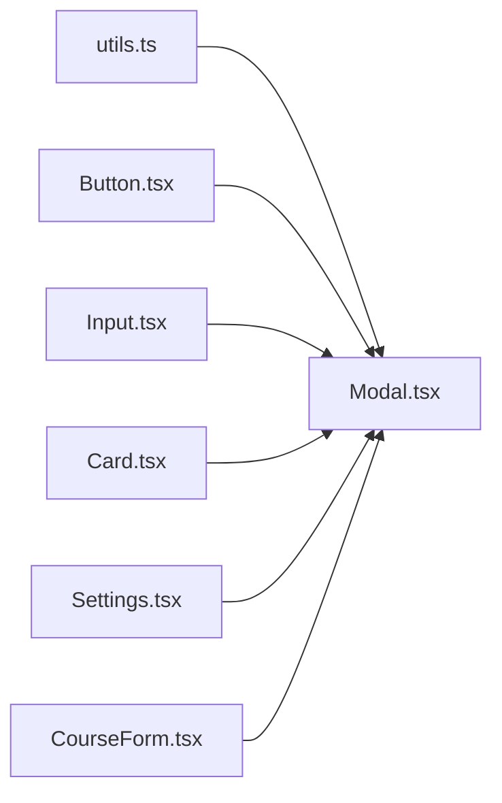

# Modal & Dialog Components

<cite>
**Referenced Files in This Document**
- [Modal.tsx](file://components/ui/Modal.tsx)
- [Button.tsx](file://components/ui/Button.tsx)
- [Input.tsx](file://components/ui/Input.tsx)
- [Card.tsx](file://components/ui/Card.tsx)
- [utils.ts](file://lib/utils.ts)
- [Settings.tsx](file://components/Settings.tsx)
- [CourseForm.tsx](file://components/CourseForm.tsx)
</cite>

## Table of Contents
1. [Introduction](#introduction)
2. [Project Structure](#project-structure)
3. [Core Components](#core-components)
4. [Architecture Overview](#architecture-overview)
5. [Detailed Component Analysis](#detailed-component-analysis)
6. [Dependency Analysis](#dependency-analysis)
7. [Performance Considerations](#performance-considerations)
8. [Troubleshooting Guide](#troubleshooting-guide)
9. [Conclusion](#conclusion)
10. [Appendices](#appendices)

## Introduction
This document describes the Modal component system used across the project, focusing on overlay behavior, backdrop interaction, keyboard navigation support, props for visibility and animations, content structure, accessibility, and practical usage patterns. It also covers composition guidelines, responsive behavior, z-index management, and integration with forms.

## Project Structure
The Modal component resides in the UI components library and is consumed by higher-level features such as settings and course management.

**Diagram sources**
- [Modal.tsx](file://components/ui/Modal.tsx#L1-L57)
- [Button.tsx](file://components/ui/Button.tsx#L1-L49)
- [Input.tsx](file://components/ui/Input.tsx#L1-L40)
- [Card.tsx](file://components/ui/Card.tsx#L1-L24)
- [utils.ts](file://lib/utils.ts#L1-L7)
- [Settings.tsx](file://components/Settings.tsx#L357-L409)
- [CourseForm.tsx](file://components/CourseForm.tsx#L555-L609)

**Section sources**
- [Modal.tsx](file://components/ui/Modal.tsx#L1-L57)
- [Settings.tsx](file://components/Settings.tsx#L357-L409)
- [CourseForm.tsx](file://components/CourseForm.tsx#L555-L609)

## Core Components
- Modal: A flexible overlay dialog with optional header, body, footer, and responsive layout. It supports controlled visibility via props and integrates with shared UI primitives for buttons and inputs.

Key props:
- isOpen: Controls visibility of the modal.
- onClose: Callback invoked when the user attempts to dismiss the modal (e.g., clicking the close button).
- title: Primary heading text.
- description: Optional descriptive text below the title.
- children: Modal body content.
- footer: Optional footer area (commonly used for actions).
- maxWidth: Controls the maximum width of the modal content.

Behavior highlights:
- Overlay: Fullscreen backdrop with blur effect and z-index suitable for overlays.
- Responsive layout: Stacked on small screens, centered on larger screens.
- Animations: Fade-in and slide-in/zoom-in transitions when opening.
- Scrollable content: Body area supports vertical scrolling.
- Close trigger: Top-right close button invokes the provided onClose handler.

Accessibility and keyboard navigation:
- The component does not implement explicit focus trapping or ARIA attributes in code. To meet WCAG requirements, consumers should manage focus trapping and ARIA roles/attributes externally when using this component.

**Section sources**
- [Modal.tsx](file://components/ui/Modal.tsx#L5-L23)
- [Modal.tsx](file://components/ui/Modal.tsx#L28-L56)

## Architecture Overview
The Modal composes shared UI primitives and utility helpers to render a structured overlay dialog. Consumers pass content and actions via props, enabling consistent behavior across features.

**Diagram sources**
- [Settings.tsx](file://components/Settings.tsx#L359-L409)
- [Modal.tsx](file://components/ui/Modal.tsx#L15-L23)
- [Button.tsx](file://components/ui/Button.tsx#L10-L46)

## Detailed Component Analysis

### Modal Component
The Modal renders a backdrop overlay and a content panel with header, body, and optional footer. It uses a utility function for class merging and Tailwind-based responsive styles.

**Diagram sources**
- [Modal.tsx](file://components/ui/Modal.tsx#L15-L23)
- [Button.tsx](file://components/ui/Button.tsx#L10-L46)
- [Input.tsx](file://components/ui/Input.tsx#L9-L36)
- [Card.tsx](file://components/ui/Card.tsx#L8-L21)
- [utils.ts](file://lib/utils.ts#L4-L6)

Implementation notes:
- Visibility: Returns null when isOpen is false.
- Width: Accepts either a "max-w-*" class or a size token; normalizes to a max-width class.
- Layout: Uses responsive padding and centering; mobile-first stacking with bottom positioning, switching to centered desktop layout.
- Animations: Fade-in and slide-in/zoom-in transitions for smooth entrance.
- Scroll: Body area is scrollable; footer is sticky.

Accessibility and keyboard navigation:
- No built-in focus trapping or ARIA attributes. Consumers should ensure focus moves into the modal on open and returns to the trigger on close. Consider adding aria-modal, role="dialog", and aria-labelledby/aria-describedby for assistive technologies.

**Section sources**
- [Modal.tsx](file://components/ui/Modal.tsx#L15-L23)
- [Modal.tsx](file://components/ui/Modal.tsx#L28-L56)

### Usage Patterns

#### Confirmation Dialogs
- Pattern: Use a modal with a concise title and description, and a footer with two actions (e.g., cancel and confirm). The consumer controls isOpen and onClose to reflect user intent.
- Example reference: Settings component opens an add-admin modal with a footer containing cancel and add actions.

**Diagram sources**
- [Settings.tsx](file://components/Settings.tsx#L359-L409)
- [Button.tsx](file://components/ui/Button.tsx#L10-L46)

**Section sources**
- [Settings.tsx](file://components/Settings.tsx#L359-L409)

#### Form Modals
- Pattern: Wrap a form inside the modal body. Use the footer to place submit and cancel actions. The modal’s maxWidth prop can be tuned to accommodate wider forms.
- Example reference: CourseForm renders a complex form inside a modal with a footer containing save and cancel actions.

**Diagram sources**
- [CourseForm.tsx](file://components/CourseForm.tsx#L555-L609)
- [Button.tsx](file://components/ui/Button.tsx#L10-L46)

**Section sources**
- [CourseForm.tsx](file://components/CourseForm.tsx#L555-L609)

#### Informational Overlays
- Pattern: Use a modal with a descriptive title and optional description, and minimal or no footer. The body presents informational content, often using cards or lists.
- Example reference: Settings uses a modal to display administrative information and controls.

**Section sources**
- [Settings.tsx](file://components/Settings.tsx#L357-L409)

### Keyboard Navigation and Accessibility
Current implementation:
- No explicit focus trapping or ARIA attributes are applied in the Modal component itself.
- Consumers should implement focus management and ARIA roles when integrating the Modal.

Recommended enhancements (consumer responsibility):
- On open: move focus into the modal (e.g., to the first interactive element).
- On close: return focus to the triggering element.
- Add aria-modal="true", role="dialog", and aria-labelledby/aria-describedby for screen readers.
- Optionally trap focus within the modal while it is open.

[No sources needed since this section provides general guidance]

### Animation Transitions and Z-Index
- Animations: Fade-in and slide-in/zoom-in effects provide smooth entrance.
- Z-index: The overlay uses a high z-index suitable for overlays.
- Responsive behavior: Mobile-first stacked layout with bottom positioning, switching to centered desktop layout.

**Section sources**
- [Modal.tsx](file://components/ui/Modal.tsx#L29-L30)
- [Modal.tsx](file://components/ui/Modal.tsx#L29-L30)

### Composition Guidelines and Content Organization
- Header: Keep title concise; use description sparingly for context.
- Body: Use Input, Card, and other UI primitives for consistent spacing and styling.
- Footer: Place actions here; ensure primary actions are clearly distinguishable.
- maxWidth: Adjust based on content density; use predefined tokens or "max-w-*" classes.

**Section sources**
- [Modal.tsx](file://components/ui/Modal.tsx#L15-L23)
- [Input.tsx](file://components/ui/Input.tsx#L9-L36)
- [Card.tsx](file://components/ui/Card.tsx#L8-L21)
- [Button.tsx](file://components/ui/Button.tsx#L10-L46)

## Dependency Analysis
The Modal component depends on shared UI primitives and a utility for class merging. Consumers import and configure the Modal with their own state and handlers.

**Diagram sources**
- [utils.ts](file://lib/utils.ts#L4-L6)
- [Modal.tsx](file://components/ui/Modal.tsx#L3-L3)
- [Button.tsx](file://components/ui/Button.tsx#L1-L2)
- [Input.tsx](file://components/ui/Input.tsx#L1-L2)
- [Card.tsx](file://components/ui/Card.tsx#L1-L2)
- [Settings.tsx](file://components/Settings.tsx#L42)
- [CourseForm.tsx](file://components/CourseForm.tsx#L28)

**Section sources**
- [utils.ts](file://lib/utils.ts#L4-L6)
- [Modal.tsx](file://components/ui/Modal.tsx#L3-L3)
- [Button.tsx](file://components/ui/Button.tsx#L1-L2)
- [Input.tsx](file://components/ui/Input.tsx#L1-L2)
- [Card.tsx](file://components/ui/Card.tsx#L1-L2)
- [Settings.tsx](file://components/Settings.tsx#L42)
- [CourseForm.tsx](file://components/CourseForm.tsx#L28)

## Performance Considerations
- Rendering cost: Modal unmounts when closed, minimizing DOM overhead.
- Animations: CSS-based transitions are lightweight; avoid heavy content in the modal body to maintain smoothness.
- Scroll areas: Long content should remain scrollable to prevent layout thrashing.

[No sources needed since this section provides general guidance]

## Troubleshooting Guide
Common issues and resolutions:
- Modal not closing: Ensure the consumer sets isOpen to false in the onClose callback.
- Content not scrollable: Verify the body area has overflow-y-auto and sufficient height.
- Focus not managed: Implement focus trapping and ARIA attributes externally as needed.
- Styling conflicts: Use the maxWidth prop and utility classes to align with the design system.

**Section sources**
- [Modal.tsx](file://components/ui/Modal.tsx#L24-L26)
- [Modal.tsx](file://components/ui/Modal.tsx#L44-L46)

## Conclusion
The Modal component provides a robust, responsive overlay foundation with clear separation of concerns. While it does not include built-in accessibility features, it is easily composed with shared UI primitives and can be extended to meet accessibility requirements through consumer-side focus management and ARIA attributes.

## Appendices

### Props Reference
- isOpen: Controls visibility.
- onClose: Called when the user attempts to dismiss the modal.
- title: Modal heading text.
- description: Optional descriptive text.
- children: Modal body content.
- footer: Optional footer area.
- maxWidth: Controls maximum width; accepts "max-w-*" or size tokens.

**Section sources**
- [Modal.tsx](file://components/ui/Modal.tsx#L5-L13)