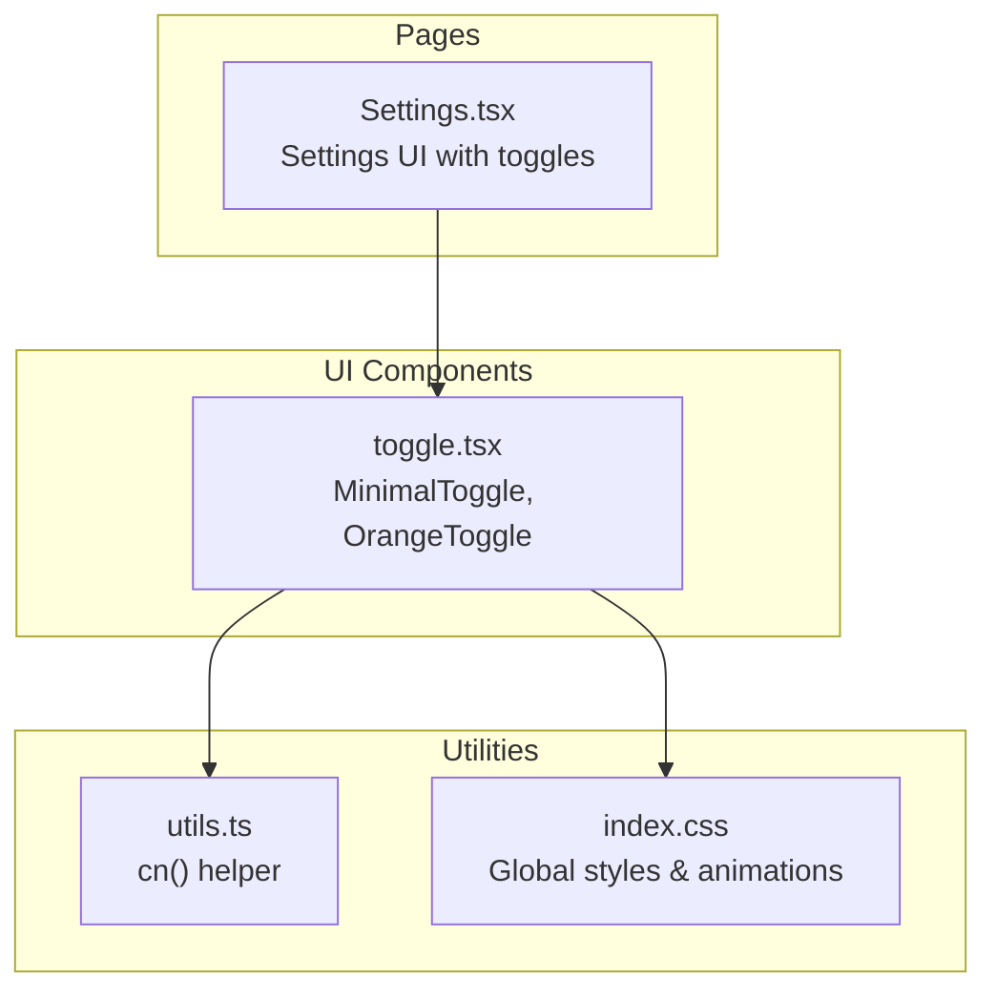
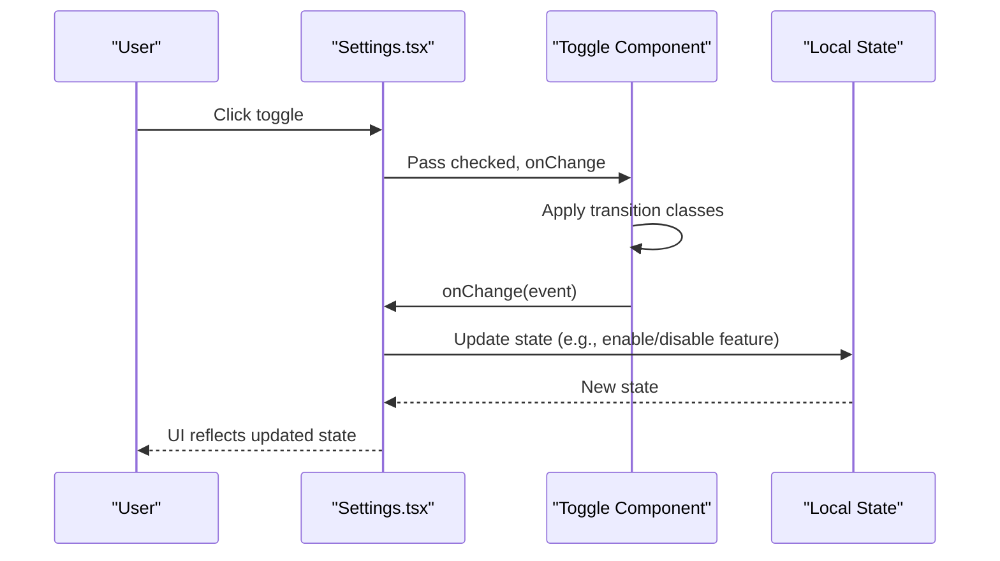
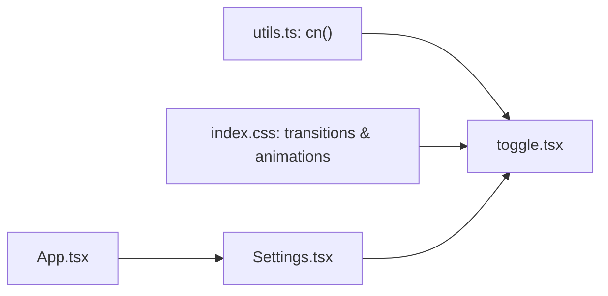

# Toggle & Switch Components

<cite>
**Referenced Files in This Document**
- [toggle.tsx](file://components/ui/toggle.tsx)
- [Settings.tsx](file://components/Settings.tsx)
- [utils.ts](file://lib/utils.ts)
- [index.css](file://index.css)
- [App.tsx](file://App.tsx)
</cite>

## Table of Contents
1. [Introduction](#introduction)
2. [Project Structure](#project-structure)
3. [Core Components](#core-components)
4. [Architecture Overview](#architecture-overview)
5. [Detailed Component Analysis](#detailed-component-analysis)
6. [Dependency Analysis](#dependency-analysis)
7. [Performance Considerations](#performance-considerations)
8. [Troubleshooting Guide](#troubleshooting-guide)
9. [Conclusion](#conclusion)
10. [Appendices](#appendices)

## Introduction
This document provides comprehensive documentation for the Toggle and Switch component system used throughout the Fluentoria application. It explains the switch behavior, state management, visual feedback patterns, props for controlling initial state and disabled states, and custom styling. It also covers usage examples in forms and settings, accessibility considerations, animation effects, focus management, keyboard interaction support, integration with form libraries and validation patterns, real-time state updates, customization guidelines, styling consistency, and responsive design approaches.

## Project Structure
The Toggle component system is implemented as reusable UI primitives located under the UI components folder. It integrates with the Settings page to demonstrate practical usage in configuration scenarios. Utility helpers and global styles support consistent styling and animations.

**Diagram sources**
- [toggle.tsx](file://components/ui/toggle.tsx#L1-L61)
- [Settings.tsx](file://components/Settings.tsx#L1-L915)
- [utils.ts](file://lib/utils.ts#L1-L7)
- [index.css](file://index.css#L1-L158)

**Section sources**
- [toggle.tsx](file://components/ui/toggle.tsx#L1-L61)
- [Settings.tsx](file://components/Settings.tsx#L1-L915)
- [utils.ts](file://lib/utils.ts#L1-L7)
- [index.css](file://index.css#L1-L158)

## Core Components
The Toggle system consists of two primary variants:
- MinimalToggle: A label-wrapped checkbox with a minimalist track and thumb, featuring smooth transitions and dark mode-aware colors.
- OrangeToggle: A standalone checkbox styled with orange accents and hover/shadow effects, optimized for prominent controls.

Both components:
- Accept standard HTML input attributes via forwardRef.
- Support className extension for custom styling.
- Rely on Tailwind utility classes and a merge helper for consistent styling.
- Use CSS transitions and pseudo-elements to achieve animated state changes.

Key props and behaviors:
- checked: Boolean state reflecting on/off.
- onChange: Event handler receiving the native change event.
- disabled: Standard input disabled state.
- className: Extends base styles without overriding core layout.
- Ref forwarding: Exposes the underlying input element for imperative actions.

Visual feedback:
- Smooth transitions for background and thumb position.
- Dark mode-aware colors for both track and thumb.
- Hover and active shadow effects for the orange variant.

Accessibility:
- Native checkbox semantics ensure screen reader compatibility.
- Focus styles are inherited from global theme and input focus states.

**Section sources**
- [toggle.tsx](file://components/ui/toggle.tsx#L6-L34)
- [toggle.tsx](file://components/ui/toggle.tsx#L36-L61)

## Architecture Overview
The Toggle components are consumed within the Settings page to manage configuration flags. The Settings page maintains local state for various features and passes controlled props to the toggles. Global styles and utility functions ensure consistent animations and class merging.

**Diagram sources**
- [Settings.tsx](file://components/Settings.tsx#L525-L545)
- [Settings.tsx](file://components/Settings.tsx#L892-L896)
- [toggle.tsx](file://components/ui/toggle.tsx#L6-L34)

**Section sources**
- [Settings.tsx](file://components/Settings.tsx#L525-L545)
- [Settings.tsx](file://components/Settings.tsx#L892-L896)
- [toggle.tsx](file://components/ui/toggle.tsx#L6-L34)

## Detailed Component Analysis

### MinimalToggle
The MinimalToggle component renders a label-wrapped checkbox with a thin track and circular thumb. Checked state is reflected via pseudo-elements and transitions.

Implementation highlights:
- Uses a hidden native checkbox with group selectors to drive visual state.
- Applies transitions for background and thumb translation.
- Supports dark mode with theme-aware colors.
- Accepts className to extend styles while preserving layout.

Usage patterns:
- Ideal for subtle switches in dense forms.
- Works well with labels and help text.

Accessibility and keyboard interaction:
- Native checkbox ensures keyboard navigation and screen reader support.
- Focus ring follows global input focus styles.

Animation and feedback:
- Smooth background and thumb movement on state change.
- Transition durations defined for predictable motion.

**Section sources**
- [toggle.tsx](file://components/ui/toggle.tsx#L6-L34)

### OrangeToggle
The OrangeToggle component provides a bold, interactive switch with hover and active shadow effects. It uses before pseudo-elements to create the thumb and applies transitions for smooth motion.

Implementation highlights:
- Standalone input element with custom appearance.
- Uses transition and transform for thumb movement.
- Hover and checked hover states add dynamic shadows.
- Dark mode-aware color adjustments.

Usage patterns:
- Suitable for prominent feature toggles in settings.
- Integrates well with cards and sectioned layouts.

Accessibility and keyboard interaction:
- Inherits native checkbox behavior for accessibility.
- Focus styles align with global input focus styling.

Animation and feedback:
- Duration-based transitions for thumb and background.
- Shadow effects enhance perceived interactivity.

**Section sources**
- [toggle.tsx](file://components/ui/toggle.tsx#L36-L61)

### Integration in Settings
The Settings page demonstrates practical usage of toggles for managing system features:
- Auto-delete inactive student accounts: Controlled via MinimalToggle with conditional subfields.
- Achievement enablement: Controlled via OrangeToggle within a card layout.
- Access control: Toggles used alongside buttons and lists for granular permissions.

State management:
- Local state tracks feature flags and dependent values.
- onChange handlers update state and trigger UI updates.
- Conditional rendering displays dependent inputs when toggled on.

Validation and real-time updates:
- While toggles themselves do not enforce validation, they integrate with form libraries and validation patterns by exposing controlled props and callbacks.
- Real-time updates occur immediately upon user interaction.

**Section sources**
- [Settings.tsx](file://components/Settings.tsx#L525-L545)
- [Settings.tsx](file://components/Settings.tsx#L892-L896)

### Animation Effects During State Changes
Animations are implemented using Tailwind transition utilities and pseudo-element transforms:
- Background color transitions for both track and thumb.
- Transform translate for thumb position change.
- Duration-based transitions for smooth motion.
- Optional hover and active shadow effects for emphasis.

Global animations:
- The project defines reusable animation utilities for consistent motion across components.

**Section sources**
- [toggle.tsx](file://components/ui/toggle.tsx#L13-L29)
- [toggle.tsx](file://components/ui/toggle.tsx#L43-L55)
- [index.css](file://index.css#L107-L140)

### Focus Management and Keyboard Interaction
Focus behavior:
- Toggles inherit focus styles from global input focus utilities.
- Keyboard users can activate toggles using Space or Enter keys.
- Screen readers announce the current state and label context.

Best practices:
- Pair toggles with descriptive labels for improved accessibility.
- Ensure sufficient color contrast for both enabled and disabled states.

**Section sources**
- [toggle.tsx](file://components/ui/toggle.tsx#L10-L23)
- [toggle.tsx](file://components/ui/toggle.tsx#L39-L55)

### Form Integration Patterns
Integration with form libraries:
- Toggles can be wrapped in form library components to participate in validation and submission.
- Controlled props (checked, onChange) align with typical form patterns.
- Validation errors can be surfaced alongside toggle groups.

Real-time state updates:
- Immediate UI feedback upon toggle changes.
- Debounced or batched updates can be implemented at the form level if needed.

**Section sources**
- [Settings.tsx](file://components/Settings.tsx#L525-L545)
- [Settings.tsx](file://components/Settings.tsx#L892-L896)

### Responsive Design Approaches
Responsive behavior:
- Toggle sizes are fixed to maintain readability and touch targets.
- Layout containers adapt using responsive spacing and grid utilities.
- Focus and hover states remain consistent across breakpoints.

Guidelines:
- Maintain minimum touch target sizes for mobile usability.
- Preserve visual hierarchy when stacking multiple toggles.

**Section sources**
- [toggle.tsx](file://components/ui/toggle.tsx#L9-L30)
- [App.tsx](file://App.tsx#L427-L441)

## Dependency Analysis
The Toggle components depend on:
- Utility helper for class merging.
- Global styles for transitions, animations, and focus states.
- Consuming pages for state management and rendering.

**Diagram sources**
- [utils.ts](file://lib/utils.ts#L4-L6)
- [index.css](file://index.css#L82-L84)
- [toggle.tsx](file://components/ui/toggle.tsx#L1-L61)
- [Settings.tsx](file://components/Settings.tsx#L1-L915)
- [App.tsx](file://App.tsx#L1-L449)

**Section sources**
- [utils.ts](file://lib/utils.ts#L1-L7)
- [index.css](file://index.css#L1-L158)
- [toggle.tsx](file://components/ui/toggle.tsx#L1-L61)
- [Settings.tsx](file://components/Settings.tsx#L1-L915)
- [App.tsx](file://App.tsx#L1-L449)

## Performance Considerations
- Transitions are lightweight and rely on CSS transforms and opacity changes.
- Avoid excessive nesting of toggle components within heavy containers.
- Prefer minimal re-renders by lifting state to parent components when managing many toggles.

## Troubleshooting Guide
Common issues and resolutions:
- Toggle not responding to clicks: Verify the input is not disabled and that the wrapper label click area is not blocked.
- Incorrect styling overrides: Ensure className extensions do not conflict with core layout classes.
- Accessibility concerns: Confirm labels are associated with toggles and focus outlines are visible.
- Animation stutter: Reduce unnecessary reflows and avoid animating expensive properties.

**Section sources**
- [toggle.tsx](file://components/ui/toggle.tsx#L6-L34)
- [toggle.tsx](file://components/ui/toggle.tsx#L36-L61)

## Conclusion
The Toggle and Switch component system provides flexible, accessible, and visually consistent controls for managing feature flags and user preferences. By leveraging controlled props, global animations, and responsive design utilities, the system supports both subtle and prominent toggles across diverse UI contexts.

## Appendices

### Props Reference
- checked: Boolean state indicating on/off.
- onChange: Event handler receiving the native change event.
- disabled: Disables interaction with the toggle.
- className: Extends base styles without overriding core layout.
- ref: Forwarded to the underlying input element.

**Section sources**
- [toggle.tsx](file://components/ui/toggle.tsx#L6-L34)
- [toggle.tsx](file://components/ui/toggle.tsx#L36-L61)