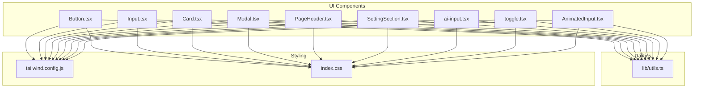
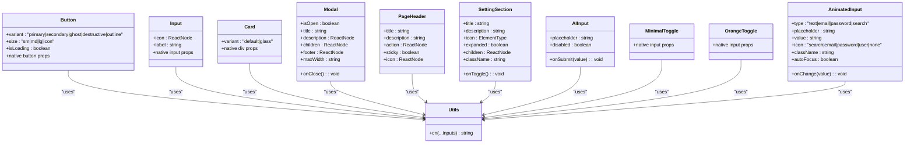
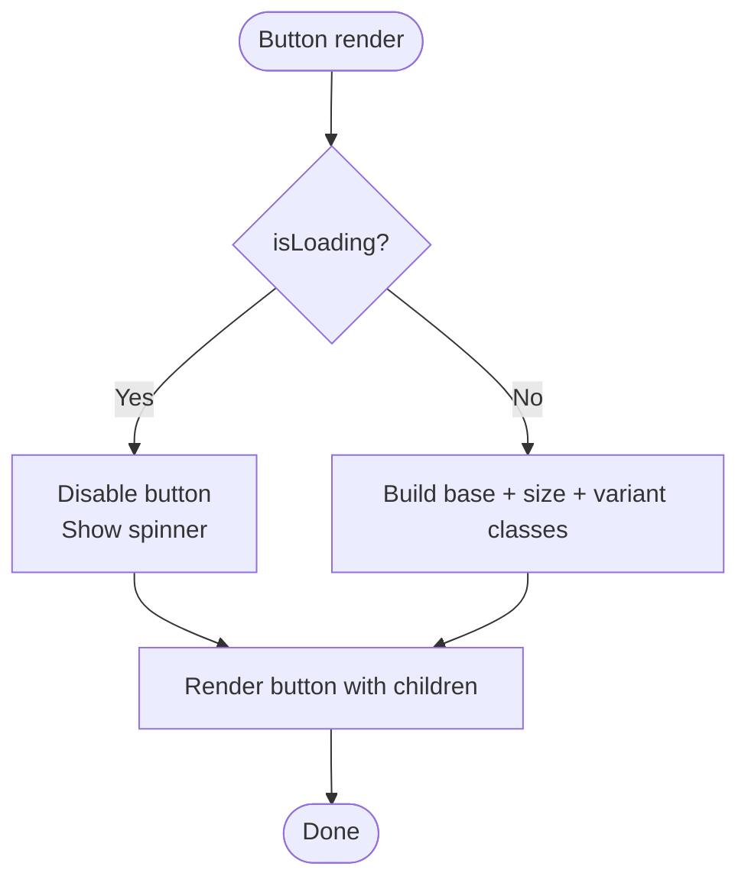
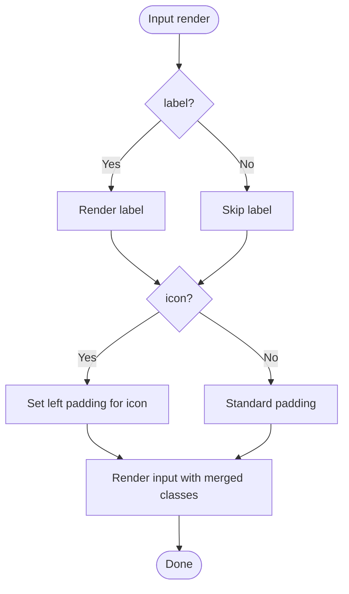
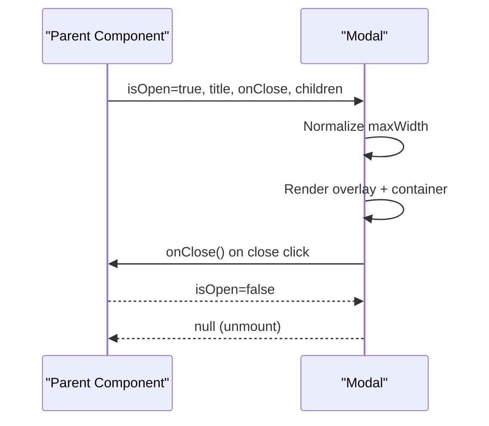
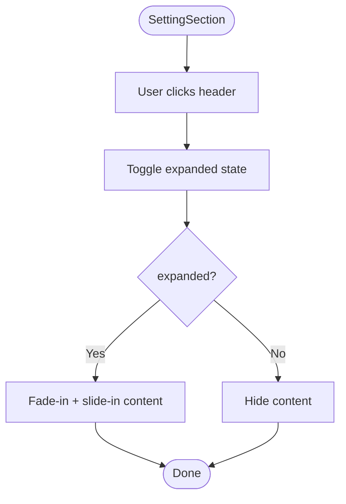
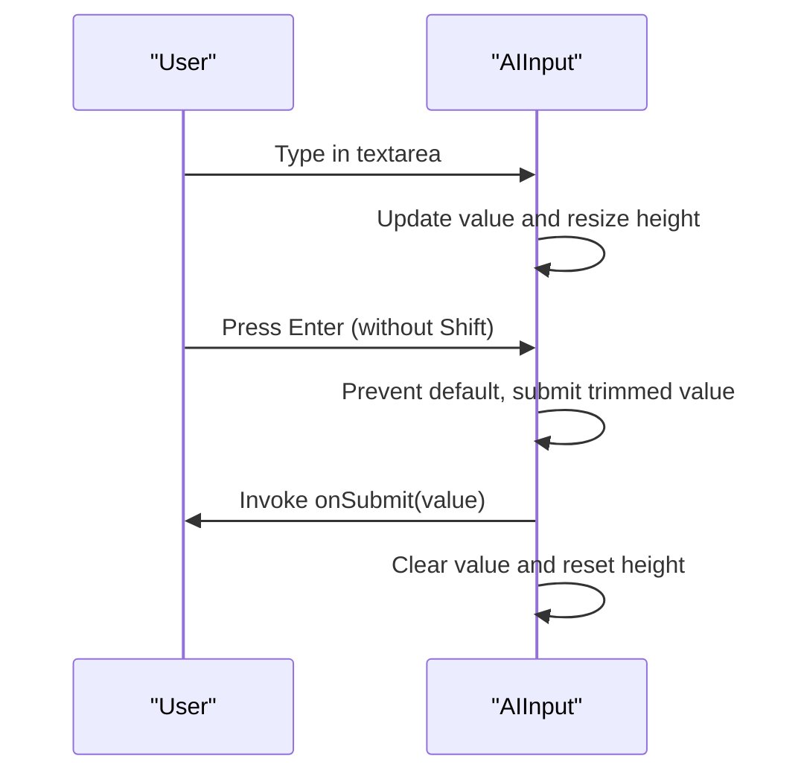
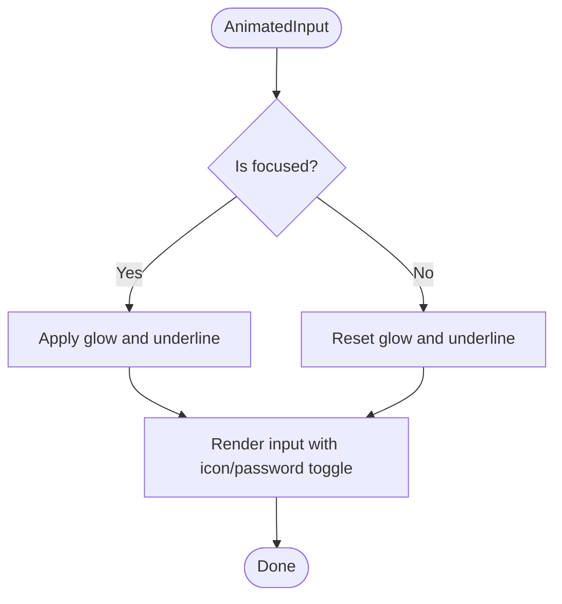
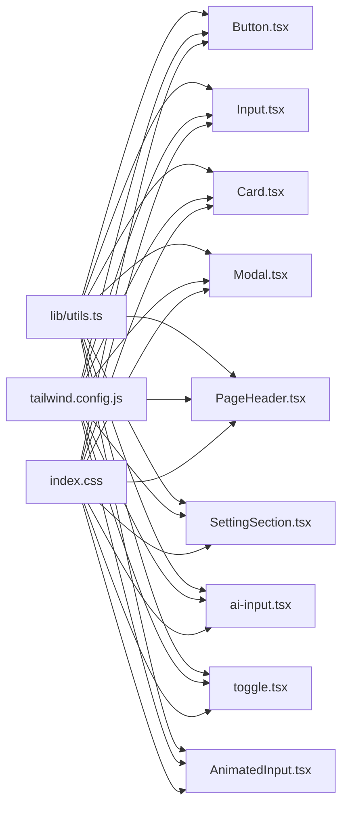

# UI Component Library

<cite>
**Referenced Files in This Document**
- [Button.tsx](file://components/ui/Button.tsx)
- [Input.tsx](file://components/ui/Input.tsx)
- [Card.tsx](file://components/ui/Card.tsx)
- [Modal.tsx](file://components/ui/Modal.tsx)
- [PageHeader.tsx](file://components/ui/PageHeader.tsx)
- [SettingSection.tsx](file://components/ui/SettingSection.tsx)
- [ai-input.tsx](file://components/ui/ai-input.tsx)
- [toggle.tsx](file://components/ui/toggle.tsx)
- [AnimatedInput.tsx](file://components/ui/AnimatedInput.tsx)
- [utils.ts](file://lib/utils.ts)
- [tailwind.config.js](file://tailwind.config.js)
- [index.css](file://index.css)
- [App.tsx](file://App.tsx)
</cite>

## Table of Contents
1. [Introduction](#introduction)
2. [Project Structure](#project-structure)
3. [Core Components](#core-components)
4. [Architecture Overview](#architecture-overview)
5. [Detailed Component Analysis](#detailed-component-analysis)
6. [Dependency Analysis](#dependency-analysis)
7. [Performance Considerations](#performance-considerations)
8. [Responsive Design and Accessibility](#responsive-design-and-accessibility)
9. [Animation and Transition Systems](#animation-and-transition-systems)
10. [Styling Strategy and Theme Customization](#styling-strategy-and-theme-customization)
11. [Component Composition Patterns](#component-composition-patterns)
12. [State Management Within Components](#state-management-within-components)
13. [Integration With the Design System](#integration-with-the-design-system)
14. [Development Guidelines](#development-guidelines)
15. [Testing Approaches](#testing-approaches)
16. [Maintenance Procedures](#maintenance-procedures)
17. [Troubleshooting Guide](#troubleshooting-guide)
18. [Conclusion](#conclusion)

## Introduction
This document describes the reusable UI component library used across the application. It explains the component architecture, design patterns, and consistency standards. It documents each component’s props, attributes, events, and customization options with practical usage examples. It also covers responsive design, accessibility compliance, cross-browser compatibility, styling strategy using Tailwind CSS, theme customization, component composition patterns, animation and transitions, state management, integration with the design system, and guidelines for development, testing, and maintenance.

## Project Structure
The UI components live under components/ui and are built with React and TypeScript. They integrate with a shared styling system powered by Tailwind CSS and a custom design token system defined in CSS variables and Tailwind configuration. Utility helpers unify Tailwind class merging.

**Diagram sources**
- [Button.tsx](file://components/ui/Button.tsx#L1-L49)
- [Input.tsx](file://components/ui/Input.tsx#L1-L40)
- [Card.tsx](file://components/ui/Card.tsx#L1-L24)
- [Modal.tsx](file://components/ui/Modal.tsx#L1-L57)
- [PageHeader.tsx](file://components/ui/PageHeader.tsx#L1-L38)
- [SettingSection.tsx](file://components/ui/SettingSection.tsx#L1-L54)
- [ai-input.tsx](file://components/ui/ai-input.tsx#L1-L91)
- [toggle.tsx](file://components/ui/toggle.tsx#L1-L62)
- [AnimatedInput.tsx](file://components/ui/AnimatedInput.tsx#L1-L112)
- [utils.ts](file://lib/utils.ts#L1-L7)
- [tailwind.config.js](file://tailwind.config.js#L1-L72)
- [index.css](file://index.css#L1-L158)

**Section sources**
- [Button.tsx](file://components/ui/Button.tsx#L1-L49)
- [Input.tsx](file://components/ui/Input.tsx#L1-L40)
- [Card.tsx](file://components/ui/Card.tsx#L1-L24)
- [Modal.tsx](file://components/ui/Modal.tsx#L1-L57)
- [PageHeader.tsx](file://components/ui/PageHeader.tsx#L1-L38)
- [SettingSection.tsx](file://components/ui/SettingSection.tsx#L1-L54)
- [ai-input.tsx](file://components/ui/ai-input.tsx#L1-L91)
- [toggle.tsx](file://components/ui/toggle.tsx#L1-L62)
- [AnimatedInput.tsx](file://components/ui/AnimatedInput.tsx#L1-L112)
- [utils.ts](file://lib/utils.ts#L1-L7)
- [tailwind.config.js](file://tailwind.config.js#L1-L72)
- [index.css](file://index.css#L1-L158)

## Core Components
This section documents the primary UI components and their capabilities.

- Button
  - Purpose: Standard interactive button with variants, sizes, and loading state.
  - Props:
    - variant: primary | secondary | ghost | destructive | outline
    - size: sm | md | lg | icon
    - isLoading: boolean
    - Additional native button attributes are forwarded.
  - Events: Native click and disabled state behavior.
  - Customization: Accepts className to extend base styles; integrates with design tokens.
  - Example usage: See [Button.tsx](file://components/ui/Button.tsx#L10-L46).

- Input
  - Purpose: Styled input with optional label and icon.
  - Props:
    - icon: ReactNode (optional)
    - label: string (optional)
    - Additional native input attributes are forwarded.
  - Customization: Adjust padding and layout via className; icon placement handled automatically.
  - Example usage: See [Input.tsx](file://components/ui/Input.tsx#L9-L37).

- Card
  - Purpose: Container with default and glass variants.
  - Props:
    - variant: default | glass
    - Additional HTML div attributes are forwarded.
  - Customization: Extend with className for spacing and overrides.
  - Example usage: See [Card.tsx](file://components/ui/Card.tsx#L8-L21).

- Modal
  - Purpose: Fullscreen overlay with header, content area, optional footer, and close control.
  - Props:
    - isOpen: boolean
    - onClose: () => void
    - title: string
    - description?: ReactNode
    - children: ReactNode
    - footer?: ReactNode
    - maxWidth?: string (supports raw max-width or token-based values)
  - Events: Clicking close triggers onClose.
  - Customization: maxWidth accepts either a token (e.g., "md") or raw value; animations included.
  - Example usage: See [Modal.tsx](file://components/ui/Modal.tsx#L15-L56).

- PageHeader
  - Purpose: Page-level header with title, description, action, optional sticky behavior, and icon.
  - Props:
    - title: string
    - description?: string
    - action?: ReactNode
    - sticky?: boolean
    - icon?: ReactNode
  - Customization: Sticky mode adds backdrop blur and z-index; action area aligns with responsive layout.
  - Example usage: See [PageHeader.tsx](file://components/ui/PageHeader.tsx#L12-L37).

- SettingSection
  - Purpose: Collapsible section for settings with icon, title, description, and expand/collapse behavior.
  - Props:
    - title: string
    - description: string
    - icon: ElementType
    - expanded: boolean
    - onToggle: () => void
    - children: ReactNode
    - className?: string
  - Events: Clicking header toggles expansion; animation applied when expanding.
  - Example usage: See [SettingSection.tsx](file://components/ui/SettingSection.tsx#L15-L53).

- AIInput
  - Purpose: Auto-resizing textarea with submit button and keyboard hints.
  - Props:
    - onSubmit: (value: string) => void
    - placeholder?: string
    - disabled?: boolean
  - State: Tracks value, focus state, and auto-resizes height based on content.
  - Events: Handles form submission and Enter/Shift+Enter key behavior.
  - Example usage: See [ai-input.tsx](file://components/ui/ai-input.tsx#L10-L90).

- Toggle (two variants)
  - MinimalToggle
    - Purpose: Lightweight checkbox toggle with minimal styling.
    - Props: Inherits native input attributes; styled via className.
    - Example usage: See [toggle.tsx](file://components/ui/toggle.tsx#L6-L34).
  - OrangeToggle
    - Purpose: Richly styled orange toggle with hover and checked states.
    - Props: Inherits native input attributes; styled via className.
    - Example usage: See [toggle.tsx](file://components/ui/toggle.tsx#L36-L59).

- AnimatedInput
  - Purpose: Enhanced input with animated focus effects, optional icons, and password visibility toggle.
  - Props:
    - type: text | email | password | search
    - placeholder?: string
    - value: string
    - onChange: (value: string) => void
    - icon: 'search' | 'email' | 'password' | 'user' | 'none'
    - className?: string
    - autoFocus?: boolean
  - State: Tracks focus and password visibility.
  - Example usage: See [AnimatedInput.tsx](file://components/ui/AnimatedInput.tsx#L14-L111).

**Section sources**
- [Button.tsx](file://components/ui/Button.tsx#L4-L46)
- [Input.tsx](file://components/ui/Input.tsx#L4-L37)
- [Card.tsx](file://components/ui/Card.tsx#L4-L21)
- [Modal.tsx](file://components/ui/Modal.tsx#L5-L56)
- [PageHeader.tsx](file://components/ui/PageHeader.tsx#L4-L37)
- [SettingSection.tsx](file://components/ui/SettingSection.tsx#L5-L53)
- [ai-input.tsx](file://components/ui/ai-input.tsx#L4-L90)
- [toggle.tsx](file://components/ui/toggle.tsx#L6-L59)
- [AnimatedInput.tsx](file://components/ui/AnimatedInput.tsx#L4-L111)

## Architecture Overview
The UI components follow a consistent pattern:
- Forward refs for DOM access.
- Extensible className merging via a utility that combines and merges Tailwind classes.
- Consistent design tokens via CSS variables and Tailwind theme extensions.
- Optional animations and transitions integrated directly in components and styles.

**Diagram sources**
- [Button.tsx](file://components/ui/Button.tsx#L10-L46)
- [Input.tsx](file://components/ui/Input.tsx#L9-L37)
- [Card.tsx](file://components/ui/Card.tsx#L8-L21)
- [Modal.tsx](file://components/ui/Modal.tsx#L15-L56)
- [PageHeader.tsx](file://components/ui/PageHeader.tsx#L12-L37)
- [SettingSection.tsx](file://components/ui/SettingSection.tsx#L15-L53)
- [ai-input.tsx](file://components/ui/ai-input.tsx#L10-L90)
- [toggle.tsx](file://components/ui/toggle.tsx#L6-L59)
- [AnimatedInput.tsx](file://components/ui/AnimatedInput.tsx#L14-L111)
- [utils.ts](file://lib/utils.ts#L4-L6)

## Detailed Component Analysis

### Button
- Implementation highlights:
  - Variant and size maps define consistent styles.
  - isLoading disables the button and renders a spinner.
  - Uses cn for safe class merging.
- Usage example path: [Button.tsx](file://components/ui/Button.tsx#L10-L46)

**Diagram sources**
- [Button.tsx](file://components/ui/Button.tsx#L10-L46)

**Section sources**
- [Button.tsx](file://components/ui/Button.tsx#L10-L46)

### Input
- Implementation highlights:
  - Optional label and icon with absolute positioning.
  - Dynamic inner padding based on icon presence.
- Usage example path: [Input.tsx](file://components/ui/Input.tsx#L9-L37)

**Diagram sources**
- [Input.tsx](file://components/ui/Input.tsx#L9-L37)

**Section sources**
- [Input.tsx](file://components/ui/Input.tsx#L9-L37)

### Card
- Implementation highlights:
  - Variant selection between default and glass.
  - Uses cn for extensibility.
- Usage example path: [Card.tsx](file://components/ui/Card.tsx#L8-L21)

**Section sources**
- [Card.tsx](file://components/ui/Card.tsx#L8-L21)

### Modal
- Implementation highlights:
  - Conditional rendering when isOpen is true.
  - Responsive layout with mobile-first and centered desktop behavior.
  - Optional footer and dynamic max-width normalization.
- Usage example path: [Modal.tsx](file://components/ui/Modal.tsx#L15-L56)

**Diagram sources**
- [Modal.tsx](file://components/ui/Modal.tsx#L15-L56)

**Section sources**
- [Modal.tsx](file://components/ui/Modal.tsx#L15-L56)

### PageHeader
- Implementation highlights:
  - Sticky mode adds backdrop blur and z-index.
  - Responsive layout with flex-direction change on medium screens.
- Usage example path: [PageHeader.tsx](file://components/ui/PageHeader.tsx#L12-L37)

**Section sources**
- [PageHeader.tsx](file://components/ui/PageHeader.tsx#L12-L37)

### SettingSection
- Implementation highlights:
  - Collapsible content with chevron indicator.
  - Smooth fade-in and slide-in when expanded.
- Usage example path: [SettingSection.tsx](file://components/ui/SettingSection.tsx#L15-L53)

**Diagram sources**
- [SettingSection.tsx](file://components/ui/SettingSection.tsx#L15-L53)

**Section sources**
- [SettingSection.tsx](file://components/ui/SettingSection.tsx#L15-L53)

### AIInput
- Implementation highlights:
  - Auto-resizing textarea using ref and scrollHeight.
  - Submit handling with Enter and Shift+Enter semantics.
  - Disabled and focused states influence styling and interactivity.
- Usage example path: [ai-input.tsx](file://components/ui/ai-input.tsx#L10-L90)

**Diagram sources**
- [ai-input.tsx](file://components/ui/ai-input.tsx#L26-L42)

**Section sources**
- [ai-input.tsx](file://components/ui/ai-input.tsx#L10-L90)

### Toggle Variants
- MinimalToggle
  - Uses pseudo-elements and checked selectors for smooth transitions.
- OrangeToggle
  - Provides a rich toggle with checked and hover states.
- Usage example paths:
  - [MinimalToggle](file://components/ui/toggle.tsx#L6-L34)
  - [OrangeToggle](file://components/ui/toggle.tsx#L36-L59)

**Section sources**
- [toggle.tsx](file://components/ui/toggle.tsx#L6-L59)

### AnimatedInput
- Implementation highlights:
  - Focus-based glow and underline effects.
  - Optional icon and password visibility toggle.
  - Controlled via props for value and onChange.
- Usage example path: [AnimatedInput.tsx](file://components/ui/AnimatedInput.tsx#L14-L111)

**Diagram sources**
- [AnimatedInput.tsx](file://components/ui/AnimatedInput.tsx#L23-L109)

**Section sources**
- [AnimatedInput.tsx](file://components/ui/AnimatedInput.tsx#L14-L111)

## Dependency Analysis
Components depend on:
- Shared utility for class merging.
- Tailwind theme and CSS variables for consistent design tokens.
- Optional icons from lucide-react.

**Diagram sources**
- [utils.ts](file://lib/utils.ts#L4-L6)
- [tailwind.config.js](file://tailwind.config.js#L1-L72)
- [index.css](file://index.css#L1-L158)
- [Button.tsx](file://components/ui/Button.tsx#L1-L49)
- [Input.tsx](file://components/ui/Input.tsx#L1-L40)
- [Card.tsx](file://components/ui/Card.tsx#L1-L24)
- [Modal.tsx](file://components/ui/Modal.tsx#L1-L57)
- [PageHeader.tsx](file://components/ui/PageHeader.tsx#L1-L38)
- [SettingSection.tsx](file://components/ui/SettingSection.tsx#L1-L54)
- [ai-input.tsx](file://components/ui/ai-input.tsx#L1-L91)
- [toggle.tsx](file://components/ui/toggle.tsx#L1-L62)
- [AnimatedInput.tsx](file://components/ui/AnimatedInput.tsx#L1-L112)

**Section sources**
- [utils.ts](file://lib/utils.ts#L4-L6)
- [tailwind.config.js](file://tailwind.config.js#L1-L72)
- [index.css](file://index.css#L1-L158)
- [Button.tsx](file://components/ui/Button.tsx#L1-L49)
- [Input.tsx](file://components/ui/Input.tsx#L1-L40)
- [Card.tsx](file://components/ui/Card.tsx#L1-L24)
- [Modal.tsx](file://components/ui/Modal.tsx#L1-L57)
- [PageHeader.tsx](file://components/ui/PageHeader.tsx#L1-L38)
- [SettingSection.tsx](file://components/ui/SettingSection.tsx#L1-L54)
- [ai-input.tsx](file://components/ui/ai-input.tsx#L1-L91)
- [toggle.tsx](file://components/ui/toggle.tsx#L1-L62)
- [AnimatedInput.tsx](file://components/ui/AnimatedInput.tsx#L1-L112)

## Performance Considerations
- Prefer forwardRef to avoid unnecessary re-renders and enable imperative access where needed.
- Use className merging via cn to minimize redundant classes and keep the DOM lightweight.
- Keep animations scoped and avoid heavy transforms on many elements simultaneously.
- Defer heavy computations inside event handlers; memoize derived values when appropriate.
- Use lazy loading and Suspense boundaries in the app shell to improve initial load performance.

## Responsive Design and Accessibility
- Responsive behavior:
  - Components adapt to small and medium breakpoints using Tailwind utilities (e.g., md: prefixes).
  - Modal stacks responsive padding and centering for desktop.
- Accessibility:
  - Buttons and inputs forward native attributes; ensure labels are associated with inputs.
  - Keyboard navigation supported via native controls (Enter to submit, focus states).
  - Avoid relying solely on color to convey meaning; pair with text or icons.
  - Provide sufficient contrast against dark backgrounds using the design tokens.

## Animation and Transition Systems
- Built-in animations:
  - Fade-in and slide-in transitions for modals and setting sections.
  - Floating background elements and custom scrollbar styling.
- Timing and easing:
  - Transition durations and timing functions are standardized in Tailwind configuration.
- Usage examples:
  - Modal animations: [Modal.tsx](file://components/ui/Modal.tsx#L29-L54)
  - SettingSection animation: [SettingSection.tsx](file://components/ui/SettingSection.tsx#L47-L50)
  - Global animations: [index.css](file://index.css#L108-L140)

**Section sources**
- [Modal.tsx](file://components/ui/Modal.tsx#L29-L54)
- [SettingSection.tsx](file://components/ui/SettingSection.tsx#L47-L50)
- [index.css](file://index.css#L108-L140)
- [tailwind.config.js](file://tailwind.config.js#L58-L64)

## Styling Strategy and Theme Customization
- Design tokens:
  - CSS variables define semantic colors and spacings.
  - Tailwind theme extends colors, radii, shadows, spacing, and transitions.
- Component styles:
  - Base component classes (.btn-primary-pluma, .input-pluma, .card-pluma) encapsulate consistent styles.
  - Utilities like .hover-elevate and .active-elevate-2 provide consistent motion.
- Theming:
  - To customize, adjust CSS variables in :root and Tailwind theme extensions.
  - Maintain consistency by referencing tokens rather than hardcoding values.

**Section sources**
- [index.css](file://index.css#L5-L32)
- [index.css](file://index.css#L74-L96)
- [index.css](file://index.css#L99-L105)
- [tailwind.config.js](file://tailwind.config.js#L8-L68)

## Component Composition Patterns
- Orchestration:
  - App orchestrates screens and passes navigation callbacks to page-level headers and lists.
  - Example: [App.tsx](file://App.tsx#L240-L324)
- Composition:
  - PageHeader composes actions and icons; SettingSection composes collapsible content.
  - Inputs compose icons and labels; AnimatedInput composes focus effects and toggles.
- Reusability:
  - All components accept className to extend styles without breaking base behavior.

**Section sources**
- [App.tsx](file://App.tsx#L240-L324)
- [PageHeader.tsx](file://components/ui/PageHeader.tsx#L12-L37)
- [SettingSection.tsx](file://components/ui/SettingSection.tsx#L15-L53)
- [Input.tsx](file://components/ui/Input.tsx#L9-L37)
- [AnimatedInput.tsx](file://components/ui/AnimatedInput.tsx#L14-L111)

## State Management Within Components
- Local component state:
  - AIInput manages value and focus state; AnimatedInput tracks focus and password visibility.
- Controlled props:
  - AnimatedInput expects value and onChange to be controlled externally.
- Event-driven updates:
  - Modal exposes onClose; SettingSection expects onToggle; Button supports disabled state.

**Section sources**
- [ai-input.tsx](file://components/ui/ai-input.tsx#L15-L42)
- [AnimatedInput.tsx](file://components/ui/AnimatedInput.tsx#L23-L42)

## Integration With the Design System
- Tokens and utilities:
  - All components rely on cn for class merging and Tailwind tokens for consistent styling.
- Visual consistency:
  - Buttons, inputs, cards, and modals share color, radius, and shadow tokens.
- Cross-component patterns:
  - Sticky headers, collapsible sections, and animated inputs reinforce cohesive UX.

**Section sources**
- [utils.ts](file://lib/utils.ts#L4-L6)
- [tailwind.config.js](file://tailwind.config.js#L12-L49)
- [index.css](file://index.css#L74-L96)

## Development Guidelines
- Naming and structure:
  - Use concise, descriptive filenames and export names matching component names.
- Props interface:
  - Extend native HTML attributes where applicable (e.g., ButtonProps extends ButtonHTMLAttributes).
- Ref forwarding:
  - Use React.forwardRef for components that expose DOM nodes.
- Styling:
  - Prefer tokens and base classes; avoid ad-hoc inline styles.
- Accessibility:
  - Ensure labels, roles, and keyboard interactions are correct.
- Testing:
  - Write unit tests for component behavior and snapshots for structure.

## Testing Approaches
- Unit tests:
  - Test component rendering with different props and variants.
  - Verify event handlers trigger callbacks (e.g., onSubmit, onClose).
- Snapshot tests:
  - Capture rendered structure to prevent unintended style regressions.
- Integration tests:
  - Validate component composition and interactions within parent components.

## Maintenance Procedures
- Review and update tokens:
  - When changing design tokens, update CSS variables and Tailwind extensions consistently.
- Audit class usage:
  - Replace deprecated classes with tokens; remove unused styles.
- Refactor patterns:
  - Extract shared logic into utilities or wrappers to reduce duplication.
- Documentation:
  - Keep prop tables and usage examples synchronized with implementation.

## Troubleshooting Guide
- Class conflicts:
  - Use cn to merge classes; avoid duplicating base styles.
- Animation glitches:
  - Ensure transitions and durations match Tailwind configuration.
- Focus and keyboard issues:
  - Confirm inputs receive focus and respond to Enter/Shift+Enter keys.
- Modal not closing:
  - Verify isOpen prop and onClose callback are correctly wired.

**Section sources**
- [utils.ts](file://lib/utils.ts#L4-L6)
- [tailwind.config.js](file://tailwind.config.js#L58-L64)
- [ai-input.tsx](file://components/ui/ai-input.tsx#L26-L42)
- [Modal.tsx](file://components/ui/Modal.tsx#L15-L56)

## Conclusion
The UI component library follows a consistent, theme-driven architecture using React, TypeScript, and Tailwind CSS. Components are designed for extensibility, accessibility, and performance while maintaining visual coherence across the application. By adhering to the documented patterns and guidelines, teams can reliably build and maintain a scalable, accessible, and visually consistent UI system.