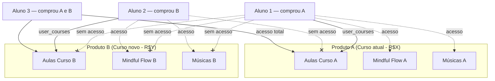

# Gestão Multi-Produto — Fluentoria

## Contexto

Hoje o acesso é binário: `accessAuthorized: boolean`. **Tudo ou nada.**

**Objetivo**: Cada curso é um **produto independente e completo** — com suas próprias aulas, galerias, mindful flow e músicas. O aluno acessa somente o conteúdo do(s) curso(s) que comprou.

## Entendimento do Modelo



**Cada produto é uma "instância" completa** da Fluentoria — exatamente como funciona hoje, mas isolado por curso comprado.

---

## Arquitetura Atual vs. Proposta

| Aspecto | Hoje | Proposta |
|---------|------|----------|
| Acesso | `accessAuthorized` (boolean) | `user_courses` (lista de cursos) |
| Cursos | Todos visíveis | Somente os comprados |
| Mindful/Music | Coleções globais, sem filtro | Cada item tem `productId` → filtrado por curso comprado |
| Admin de aluno | Toggle sim/não | Gerenciar cursos do aluno |
| Webhook Asaas | Seta boolean | Cria registro em `user_courses` |

---

## User Review Required

> [!IMPORTANT]
> **Mindful/Music por produto**: Vou adicionar um campo `productId` nos itens das coleções `mindful_flow` e `music`. Ao criar conteúdo mindful/music no admin, ele será associado a um curso específico. O aluno só vê o mindful/music do curso que comprou. Tá certo?

> [!IMPORTANT]
> **Cobranças Asaas**: Você cria as cobranças manualmente no painel ou por API? Preciso saber como o `courseId` será passado no campo `externalReference`.

> [!WARNING]
> **Migração**: Todos os itens de mindful/music existentes e alunos atuais serão migrados como pertencentes ao produto atual (curso principal). Correto?

---

## Proposed Changes

### 1. Modelo de Dados (Firestore)

#### [NEW] Coleção `user_courses`
```typescript
interface UserCourse {
  id: string;
  userId: string;
  courseId: string;
  status: 'active' | 'expired' | 'pending';
  purchaseDate: Date;
  source: 'asaas' | 'manual';
  asaasPaymentId?: string;
}
```

#### [MODIFY] Interface [Course](file:///d:/VS%20Code/Fluentoria/lib/db/types.ts#36-51) — adicionar campo `productId`
Itens de `mindful_flow` e `music` ganham `productId` apontando para qual curso pertencem.

```diff
 export interface Course {
     id?: string;
     title: string;
+    productId?: string;  // ID do curso ao qual pertence (para mindful/music)
     // ...
 }
```

---

### 2. Camada de Dados

#### [MODIFY] [config.ts](file:///d:/VS%20Code/Fluentoria/lib/db/config.ts)
- Adicionar `USER_COURSES_COLLECTION = 'user_courses'`

#### [NEW] `lib/db/userCourses.ts`
- `getUserCourses(userId)` → buscar cursos do aluno
- `grantCourseAccess(userId, courseId, source)` → conceder acesso
- `revokeCourseAccess(userId, courseId)` → revogar acesso
- `hasAnyCourseAccess(userId)` → checar se tem ≥1 curso

#### [MODIFY] [admin.ts](file:///d:/VS%20Code/Fluentoria/lib/db/admin.ts)
- [checkUserAccess()](file:///d:/VS%20Code/Fluentoria/lib/db/admin.ts#80-108) → consultar `user_courses` ao invés do boolean
- Retrocompat: se `accessAuthorized === true` sem `user_courses` → acesso a tudo (migração gradual)

#### [MODIFY] [courses.ts](file:///d:/VS%20Code/Fluentoria/lib/db/courses.ts)
- `getCoursesForUser(userId)` — filtra por `user_courses`

#### [MODIFY] [mindful.ts](file:///d:/VS%20Code/Fluentoria/lib/db/mindful.ts)
- `getMindfulFlowsForUser(userId)` — filtra por `productId` ∈ cursos do aluno

#### [MODIFY] [music.ts](file:///d:/VS%20Code/Fluentoria/lib/db/music.ts)
- `getMusicForUser(userId)` — filtra por `productId` ∈ cursos do aluno

---

### 3. Webhook (Backend)

#### [MODIFY] [index.js](file:///d:/VS%20Code/Fluentoria/functions/src/index.js)
- Extrair `courseId` do `externalReference` do Asaas
- Criar doc em `user_courses` com `status: 'active'`
- Fallback sem `externalReference` → comportamento atual

---

### 4. Frontend

#### [MODIFY] [CourseList.tsx](file:///d:/VS%20Code/Fluentoria/components/CourseList.tsx)
- Aluno: `getCoursesForUser(userId)` → somente cursos comprados

#### [MODIFY] [MindfulFlowList.tsx](file:///d:/VS%20Code/Fluentoria/components/MindfulFlowList.tsx)
- Aluno: `getMindfulFlowsForUser(userId)` → somente mindful dos cursos comprados

#### [MODIFY] [MusicList.tsx](file:///d:/VS%20Code/Fluentoria/components/MusicList.tsx)
- Aluno: `getMusicForUser(userId)` → somente músicas dos cursos comprados

#### [MODIFY] [AdminCatalog.tsx](file:///d:/VS%20Code/Fluentoria/components/AdminCatalog.tsx) + [useCatalogData.ts](file:///d:/VS%20Code/Fluentoria/hooks/useCatalogData.ts)
- Ao criar/editar mindful ou music, campo obrigatório: **"A qual curso pertence?"** (select com cursos)

#### [MODIFY] [Students.tsx](file:///d:/VS%20Code/Fluentoria/components/Students.tsx)
- Toggle sim/não → lista de cursos com checkbox por aluno

#### [MODIFY] [App.tsx](file:///d:/VS%20Code/Fluentoria/App.tsx)
- [checkUserAccess()](file:///d:/VS%20Code/Fluentoria/lib/db/admin.ts#80-108) atualizado

---

### 5. Segurança

#### [MODIFY] [firestore.rules](file:///d:/VS%20Code/Fluentoria/firestore.rules)
```
match /user_courses/{docId} {
  allow read: if isAuthenticated() && 
    (resource.data.userId == request.auth.uid || isAdmin());
  allow write: if isAdmin();
}
```

---

### 6. Migração

Script one-shot:
- Todos os `users` com `accessAuthorized: true` → `user_courses` para cada curso existente
- Todos os itens em `mindful_flow` e `music` sem `productId` → recebem o ID do curso principal

---

## Verification Plan

### Build
```bash
npx tsc --noEmit
```

### Testes manuais
1. Admin → vê todos os cursos/mindful/music ✓
2. Aluno com curso A → vê somente aulas, mindful e music do curso A ✓
3. Aluno com cursos A e B → vê conteúdo de ambos ✓
4. Aluno sem cursos → tela "Acesso Pendente" ✓
5. Admin concede curso B → aluno passa a ver conteúdo de B ✓
6. Criar mindful/music no admin → exige seleção de curso ✓
