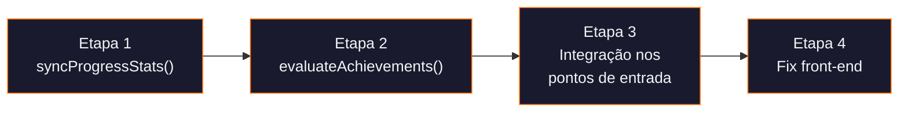

# 🛠️ Plano de Correção — Sistema de Gamificação Fluentoria

## Visão Geral

O plano está organizado em **4 etapas sequenciais**. Cada etapa resolve um grupo lógico de problemas e pode ser validada independentemente antes de avançar.

| Etapa | Escopo | Arquivos Afetados | Risco |
|-------|--------|-------------------|-------|
| 1 | Motor de sincronização de stats | `lib/gamification.ts` | Baixo |
| 2 | Motor de avaliação de conquistas | `lib/gamification.ts` | Baixo |
| 3 | Integração nos pontos de entrada | `lib/gamification.ts`, `components/CourseDetail.tsx` | Médio |
| 4 | Correções no front-end | `components/StudentDashboard.tsx`, `components/Achievements.tsx` | Baixo |

---

## Etapa 1 — Motor de Sincronização de Stats

**Objetivo:** Criar a função `syncProgressStats()` que calcula os contadores reais e os persiste no documento `student_progress`.

### O que será criado

Nova função exportada em [gamification.ts](file:///e:/VS%20Code/Fluentoria/lib/gamification.ts):

```typescript
export const syncProgressStats = async (studentId: string): Promise<void>
```

### Lógica interna

```
1. Buscar todos os registros de lesson_progress do aluno
   → getAllLessonProgress(studentId)
   → Somar todos os completedLessonIds.length = totalCoursesCompleted

2. Buscar todas as atividades do aluno
   → getStudentActivities(studentId)
   → Calcular currentStreak e longestStreak usando lógica similar
     à já existente em calculateAttendanceStats()

3. Escrever os valores calculados no Firestore:
   → updateDoc(student_progress/{studentId}, {
       totalCoursesCompleted,
       currentStreak,
       longestStreak,
       updatedAt: Timestamp.now()
     })
```

### Design Decisions

- **Streak** é recalculada a partir de `student_activities` a cada chamada (fonte da verdade são as atividades, não um contador estático).
- **`totalCoursesCompleted`** conta o **total de aulas individuais concluídas** (não cursos inteiros), pois é assim que as conquistas usam esse campo (`first_course` threshold 1, `course_count` threshold 10/50).
- **`longestStreak`** usa `Math.max(longestStreak atual no Firestore, streak calculada)` para nunca regredir.
- **`totalHoursStudied`** permanece `0` por ora — não há tracking de tempo de estudo real. Pode ser adicionado no futuro com tracking de duração de sessão.

### Arquivos modificados

| Arquivo | Mudança |
|---------|---------|
| [gamification.ts](file:///e:/VS%20Code/Fluentoria/lib/gamification.ts) | Adicionar função `syncProgressStats()` (~40 linhas) |

### Validação

- [ ] Chamar `syncProgressStats(userId)` manualmente no console e verificar que o documento `student_progress` é atualizado com valores corretos.

---

## Etapa 2 — Motor de Avaliação de Conquistas

**Objetivo:** Criar a função `evaluateAchievements()` que verifica todas as conquistas e desbloqueia as que o aluno já atingiu.

### O que será criado

Nova função exportada em [gamification.ts](file:///e:/VS%20Code/Fluentoria/lib/gamification.ts):

```typescript
export const evaluateAchievements = async (studentId: string): Promise<string[]>
// Retorna array de IDs de conquistas recém-desbloqueadas
```

### Lógica interna

```
1. Buscar o progresso atual do aluno (já atualizado pela Etapa 1)
   → getStudentProgress(studentId)

2. Buscar todas as conquistas disponíveis
   → getAchievements()

3. Para cada conquista NÃO desbloqueada:
   → Avaliar condition.type contra os stats do aluno:
     - 'first_course'  → totalCoursesCompleted >= threshold
     - 'course_count'   → totalCoursesCompleted >= threshold
     - 'streak_days'    → currentStreak >= threshold
     - 'hours_studied'  → totalHoursStudied >= threshold

4. Para cada conquista que atinja o critério:
   → Chamar unlockAchievement(studentId, achievementId)
     (já existente — adiciona à lista e dá XP)

5. Retornar lista de conquistas recém-desbloqueadas
```

### Design Decisions

- Reutiliza `unlockAchievement()` existente, que já é **idempotente** (verifica se já foi desbloqueada antes).
- O retorno de IDs desbloqueados permite, no futuro, exibir notificações toast de conquista.
- A avaliação é **fire-and-forget** — não bloqueia a UI.

### Arquivos modificados

| Arquivo | Mudança |
|---------|---------|
| [gamification.ts](file:///e:/VS%20Code/Fluentoria/lib/gamification.ts) | Adicionar função `evaluateAchievements()` (~30 linhas) |

### Validação

- [ ] Criar manualmente um aluno com 1 aula concluída e verificar que "Primeiros Passos" é desbloqueada.
- [ ] Verificar que chamar duas vezes não duplica conquistas.

---

## Etapa 3 — Integração nos Pontos de Entrada

**Objetivo:** Chamar `syncProgressStats()` + `evaluateAchievements()` nos momentos certos do ciclo de vida do app.

### 3A — Após conclusão de aula (ponto principal)

Em [gamification.ts](file:///e:/VS%20Code/Fluentoria/lib/gamification.ts), na função `markLessonCompleteWithXP()`:

```diff
 // gamification.ts - markLessonCompleteWithXP (linhas 277-293)
 export const markLessonCompleteWithXP = async (...) => {
   const progress = await getLessonProgress(studentId, courseId);
   const alreadyCompleted = !!progress?.completedLessonIds?.includes(lessonId);

   if (completed && !alreadyCompleted) {
     await addXP(studentId, XP_REWARDS.lesson_completed, `Lesson completed: ${lessonId}`);
     await logActivity(studentId, 'lesson_completed', courseId, undefined, { lessonId });
+    // Recalcular stats e avaliar conquistas em background
+    syncProgressStats(studentId).then(() => evaluateAchievements(studentId));
   }

   return toggleLessonComplete(studentId, courseId, lessonId, completed);
 };
```

> [!IMPORTANT]  
> A sync + avaliação roda em background (`then`) para não atrasar a UI de marcar aula como concluída.

### 3B — Reconciliação no carregamento do Dashboard

Em [StudentDashboard.tsx](file:///e:/VS%20Code/Fluentoria/components/StudentDashboard.tsx), na função `loadProgress()`:

```diff
 // StudentDashboard.tsx - loadProgress (linhas 35-43)
+import { getStudentProgress, createStudentProgress, syncProgressStats, evaluateAchievements } from '../lib/gamification';

 const loadProgress = async () => {
   if (!user) return;
   let progress = await getStudentProgress(user.uid);
   if (!progress) {
     await createStudentProgress(user.uid, ...);
     progress = await getStudentProgress(user.uid);
   }
+  // Reconciliar stats a cada load (lightweight, apenas reads + 1 write)
+  await syncProgressStats(user.uid);
+  await evaluateAchievements(user.uid);
+  progress = await getStudentProgress(user.uid);
   setStudentProgress(progress);
 };
```

> [!NOTE]
> Isso garante que mesmo dados históricos (aulas concluídas antes dessa correção) sejam reconciliados na próxima vez que o aluno abrir o dashboard.

### 3C — Reconciliação no carregamento de Conquistas

Em [Achievements.tsx](file:///e:/VS%20Code/Fluentoria/components/Achievements.tsx), na função `loadAchievements()`:

```diff
 // Achievements.tsx - loadAchievements (linhas 20-32)
+import { getAchievements, getStudentProgress, getLeaderboard, syncProgressStats, evaluateAchievements } from '../lib/gamification';

 const loadAchievements = async () => {
   setLoading(true);
+  // Garantir stats atualizados antes de exibir
+  await syncProgressStats(studentId);
+  await evaluateAchievements(studentId);
+
   const [allAchievements, studentProgress, leaderboardData] = await Promise.all([...]);
   ...
 };
```

### Arquivos modificados

| Arquivo | Mudança |
|---------|---------|
| [gamification.ts](file:///e:/VS%20Code/Fluentoria/lib/gamification.ts) | Adicionar chamada sync+evaluate em `markLessonCompleteWithXP` |
| [StudentDashboard.tsx](file:///e:/VS%20Code/Fluentoria/components/StudentDashboard.tsx) | Importar e chamar sync+evaluate em `loadProgress` |
| [Achievements.tsx](file:///e:/VS%20Code/Fluentoria/components/Achievements.tsx) | Importar e chamar sync+evaluate em `loadAchievements` |

### Validação

- [ ] Concluir uma aula → verificar no Firestore que `totalCoursesCompleted` incrementou.
- [ ] Concluir a 1ª aula → verificar que "Primeiros Passos" aparece como desbloqueada.
- [ ] Abrir Dashboard → verificar que stats refletem dados reais.

---

## Etapa 4 — Correções no Front-end

**Objetivo:** Corrigir bugs visuais nos componentes que leem dados incorretos.

### 4A — Corrigir `totalXP` → `currentXP` no Dashboard

Em [StudentDashboard.tsx:183](file:///e:/VS%20Code/Fluentoria/components/StudentDashboard.tsx#L183):

```diff
-<div className="text-3xl font-bold text-foreground mb-1">{studentProgress.totalXP}</div>
+<div className="text-3xl font-bold text-foreground mb-1">{studentProgress.currentXP}</div>
```

### 4B — Melhorar `getProgressTowards()` no Achievements

Agora que `totalCoursesCompleted` e `currentStreak` são atualizados pela Etapa 1, a função `getProgressTowards()` em [Achievements.tsx:38-53](file:///e:/VS%20Code/Fluentoria/components/Achievements.tsx#L38-L53) vai funcionar automaticamente — **sem mudanças de código necessárias**.

### Arquivos modificados

| Arquivo | Mudança |
|---------|---------|
| [StudentDashboard.tsx](file:///e:/VS%20Code/Fluentoria/components/StudentDashboard.tsx) | Linha 183: `totalXP` → `currentXP` |

### Validação

- [ ] Card "Total XP" no Dashboard mostra o valor correto.
- [ ] Barras de progresso das conquistas mostram percentuais reais.
- [ ] Perfil mostra stats reais (Aulas, Sequência).
- [ ] Ranking mostra valores corretos na coluna "Aulas" e "Sequência".

---

## Resumo de Alterações por Arquivo

| Arquivo | Tipo | Descrição |
|---------|------|-----------|
| [gamification.ts](file:///e:/VS%20Code/Fluentoria/lib/gamification.ts) | Editar | +`syncProgressStats()`, +`evaluateAchievements()`, mod `markLessonCompleteWithXP()` |
| [StudentDashboard.tsx](file:///e:/VS%20Code/Fluentoria/components/StudentDashboard.tsx) | Editar | Chamar sync+evaluate no `loadProgress`, fix `totalXP`→`currentXP` |
| [Achievements.tsx](file:///e:/VS%20Code/Fluentoria/components/Achievements.tsx) | Editar | Chamar sync+evaluate no `loadAchievements` |

**Total estimado: ~80 linhas de código adicionadas/modificadas em 3 arquivos.**

---

## Ordem de Execução



> [!TIP]
> As etapas 1+2 são puramente backend (funções utilitárias) e não impactam nada até serem conectadas na Etapa 3. Isso permite testar cada peça isoladamente.
